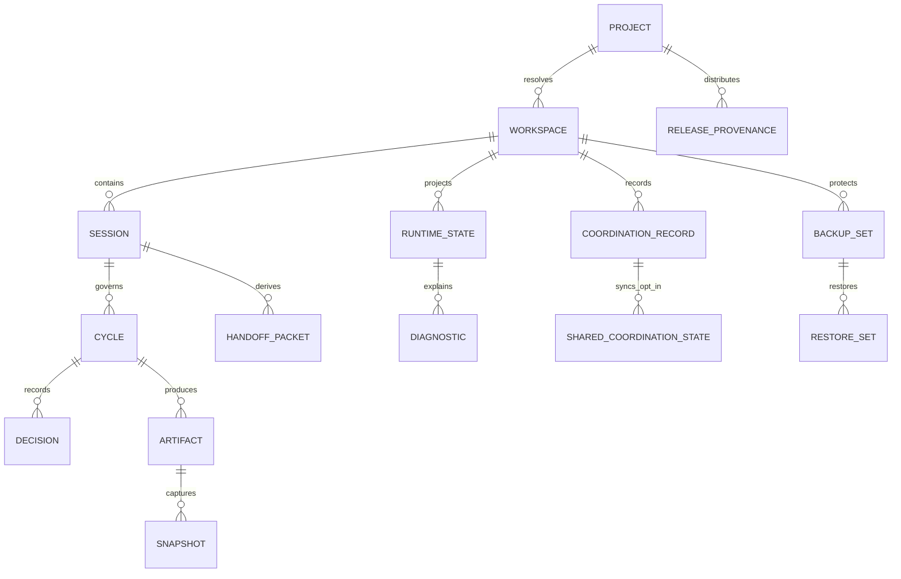
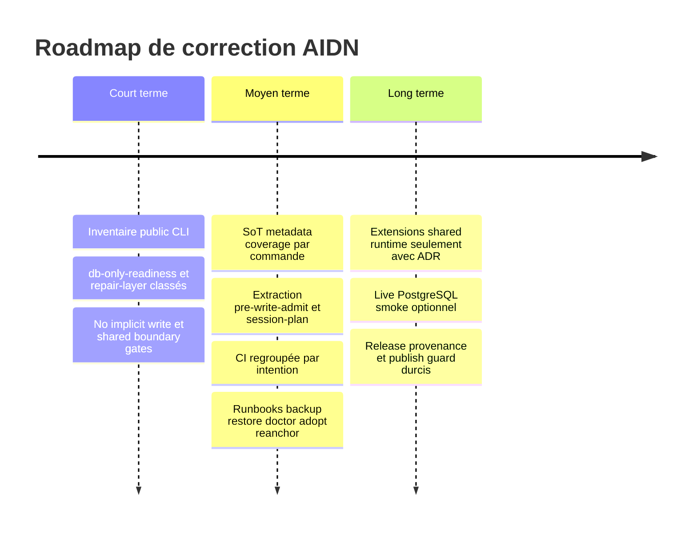

# Plan de correction architectural et informationnel AIDN

## Résumé exécutif

AIDN n'est plus un simple kit de templates. Le dépôt `dev` décrit et implémente déjà une plateforme runtime local-first pour gouverner des cycles, sessions, handoffs, admissions, projections, états runtime, coordination multi-agent, persistance SQLite/PostgreSQL optionnelle et distribution installable. Cette direction est explicite dans `README.md`, `docs/ADR/ADR-0002-runtime-platform-architecture.md`, `docs/RUNTIME_SURFACE_SCOPE_MATRIX.md`, `docs/PRODUCT_SELFHOST_BOUNDARIES.md`, `src/application/runtime/` et les commandes `tools/runtime/*`.

La base actuelle est solide. Les modes `files | dual | db-only` sont documentés, les classes d'effet CLI existent dans `src/core/cli/effect-policy.mjs`, les contrats JSON publics v1 sont sous `src/core/contracts/cli-output/`, les politiques source-of-truth et metadata sont centralisées dans `src/core/source-of-truth/source-of-truth-policy.mjs` et `src/core/metadata/metadata-policy.mjs`, et les gates `perf:verify-cli-effect-policy`, `perf:verify-cli-output-contracts`, `perf:verify-source-of-truth-policy`, `perf:verify-metadata-policy`, `perf:verify-governance-completeness` et `perf:verify-release-version` ont été vérifiées comme PASS pendant l'exploration.

Le problème central n'est donc pas l'absence d'architecture. Le problème est l'alignement durable entre stratégie produit, capacités métier, modèle d'information, couches applicatives, gouvernance, exploitation locale et CI. Plusieurs décisions existent déjà dans les ADR et plans de mars/mai 2026, mais elles restent dispersées. Une petite équipe open source a besoin d'un backlog clair qui transforme ces décisions en lots verticaux testables, pas d'un grand redesign.

Le risque principal est que des projections lisibles deviennent implicitement canoniques, que des commandes `--json` soient prises pour des lectures alors qu'elles projettent ou mutent, que des scripts runtime trop épais continuent à mélanger parsing CLI, logique métier, accès FS/DB, projection Markdown et écriture, et que les surfaces PostgreSQL/shared runtime s'étendent plus vite que leurs frontières de sécurité, backup/restore et source-of-truth.

La correction doit rester incrémentale. Les politiques déjà présentes doivent être consommées plus systématiquement par les use cases et commandes runtime. Les contrats publics doivent précéder les refactors profonds. Les scripts CLI doivent devenir progressivement des wrappers minces autour de `src/application` et `src/core`. Les gates CI doivent être regroupés par intention afin de rendre le signal lisible: contrats, effets, no implicit write, gouvernance, parité de modes, exploitation runtime et release/provenance.

La trajectoire recommandée est une stabilisation progressive en trois horizons. Court terme: inventaire public CLI exhaustif, classification des surfaces non encore promues comme `db-only-readiness` et repair-layer, renforcement des contrats/no-write gates et alignement documentaire. Moyen terme: extraction incrémentale des scripts runtime épais, application réelle des politiques SoT/metadata, productisation backup/restore/doctor/adopt/reanchor et structuration CI. Long terme: fédération local-first bornée, extensions shared runtime seulement après ADR, tests multi-projet et runbooks de récupération.

Les frontières produit vs installé vs self-host doivent rester non négociables. Le checkout courant est le dépôt source package, pas un dépôt client installé. `scaffold/*` reste du matériau installable, `tests/fixtures/*` reste un corpus de test, `tests/workspaces/selfhost-product/` est le modèle self-host explicite, et `docs/audit/*`, `AGENTS.md`, `.codex/*` ne doivent pas être déplacés dans un shared runtime sans migration explicite, compatible, documentée et testée.

## Diagnostic synthétique

| Problème | Symptôme observable | Cause probable | Impact métier / information / technique | Risque si laissé en l’état | Priorité | Fichiers / surfaces concernés | Évidence repo |
|---|---|---|---|---|---|---|---|
| Source de vérité encore difficile à lire en exécution | Un même concept apparaît dans Markdown, SQLite/PostgreSQL, runtime heads, projections et JSON CLI | Transition progressive `files -> dual -> db-only` et coexistence volontaire canon/projections | Les agents peuvent agir sur une projection au lieu du canon | Drift silencieux et diagnostic contradictoire | P0 | `docs/RUNTIME_SURFACE_SCOPE_MATRIX.md`, `src/core/source-of-truth/source-of-truth-policy.mjs`, `src/application/runtime/governance-diagnostics-use-case.mjs` | La matrice sépare les sources par mode; la policy couvre 12 concepts et valide PASS |
| Confusion lecture / projection / mutation | `--json` existe sur des commandes read-only, preview, projector, mutating et executor | Historique CLI riche, puis formalisation récente des classes d'effet | Automatisations locales et agents peuvent supposer à tort qu'un JSON ne modifie rien | Mutation surprise du checkout ou du backend | P0 | `README.md`, `src/core/cli/effect-policy.mjs`, `tools/perf/verify-cli-no-implicit-write-fixtures.mjs` | `README.md` précise que `--json` n'est pas permission d'écriture; 50 policies d'effet valident PASS |
| Scripts runtime encore trop épais | `pre-write-admit.mjs` ~1129 lignes, `session-plan.mjs` ~952, plusieurs coordinateurs >500 lignes | Refactor par extraction déjà engagé mais incomplet | Coût de review élevé, duplication de logique et risque de divergence | Refactors futurs fragiles | P1 | `tools/runtime/pre-write-admit.mjs`, `tools/runtime/session-plan.mjs`, `tools/runtime/coordinator-*.mjs`, `src/application/runtime/*` | Inventaire lignes de scripts runtime; des use cases existent déjà pour plusieurs fonctions |
| Contrats JSON publics solides mais à inventorier contre toute surface candidate | 49 schémas CLI existent, mais `db-only-readiness` est scripté/testé hors registre public; repair-layer est utilisé en CI sans promotion claire | Distinction pas encore formalisée entre CLI publique `aidn runtime`, scripts npm, outils internes et fixtures | Les utilisateurs ne savent pas quelle sortie est stable | Breaking changes invisibles sur surfaces consommées localement | P0 | `src/core/contracts/cli-output/`, `src/core/contracts/cli-output/README.md`, `tools/runtime/db-only-readiness.mjs`, `tools/runtime/repair-layer*.mjs`, `package.json`, `bin/aidn.mjs` | `db-only-readiness` est dans `package.json` et testé; absent de `bin/aidn.mjs` et `effect-policy` |
| Politiques SoT / metadata plus déclarées qu'enforce sur certains flux | Les policies valident, mais la consommation réelle doit être suivie par use case et concept | La gouvernance a été ajoutée après une partie des scripts runtime | Qualité des artefacts variable selon chemin d'entrée | Dette metadata et confiance limitée dans les diagnostics | P1 | `src/core/source-of-truth/source-of-truth-policy.mjs`, `src/core/metadata/metadata-policy.mjs`, `src/application/runtime/governance-diagnostics-use-case.mjs`, `tools/runtime/governance-diagnostics.mjs` | `governance-diagnostics` consomme les policies; il faut étendre l'usage dans les flows critiques |
| CI riche mais difficile à lire | `perf-kpi.yml` mélange beaucoup de vérifications de structure, runtime, index, KPI, repair-layer et summaries | Croissance organique des gates autour des fixtures | Signal de PR moins actionnable pour une petite équipe | Régressions noyées dans un job monolithique | P1 | `.github/workflows/perf-kpi.yml`, `.github/workflows/cli-contracts.yml`, `.github/workflows/runtime-ops.yml`, `package.json` | Trois workflows existent; `perf-kpi.yml` reste volumineux et multi-intention |
| Frontière shared runtime à stabiliser avant extension | Shared coordination PostgreSQL/sqlite-file est disponible, mais ne doit pas absorber `docs/audit/*` | Besoin futur de coordination multi-worktree/multi-repo | Risque de perte local-first et de fuite de données | Centralisation implicite, audit affaibli | P0/P1 | `docs/ADR/ADR-0007-local-first-federation-boundary.md`, `docs/RUNTIME_SURFACE_SCOPE_MATRIX.md`, `docs/MIGRATION_SHARED_RUNTIME_POSTGRESQL.md`, `src/application/runtime/shared-*`, `src/adapters/runtime/postgres-shared-coordination-store.mjs` | ADR-0007 et la matrice listent strictement les surfaces partageables |
| Versioning/release/provenance à garder sous gate explicite | `VERSION`, `package.json`, `build-release`, `release/manifest.json`, checksums et README doivent rester synchrones | Release locale sans registry centralisée | Support utilisateur et audit release fragiles | Artefacts publiés incohérents | P2 | `VERSION`, `package.json`, `tools/build-release.mjs`, `release/manifest.json`, `release/checksums.txt`, `docs/GIT_WORKFLOW.md` | `perf:verify-release-version` PASS; `docs/GIT_WORKFLOW.md` définit `VERSION` comme source |
| Frontière produit / installé / self-host sensible | Le dépôt source contient aussi scaffold, fixtures et workspace self-host | AIDN dogfood son propre workflow | Agents peuvent appliquer des hypothèses installé au dépôt source | Pollution de la source package ou migrations au mauvais endroit | P0 | `AGENTS.md`, `README.md`, `docs/PRODUCT_SELFHOST_BOUNDARIES.md`, `scaffold/*`, `tests/fixtures/*`, `tests/workspaces/selfhost-product/` | Les règles root distinguent package source, installed repo, fixtures et self-host |
| Plans existants partiellement réalisés mais pas consolidés | Mars 2026 et mai 2026 contiennent encore des items utiles et d'autres déjà livrés | Les lots ont avancé par PR successives | Risque de relancer des travaux déjà faits ou d'oublier les gaps restants | Backlog GitHub bruité | P1 | `docs/PLAN_ARCHITECTURE_REMEDIATION_2026-03-07.md`, `docs/BACKLOG_ARCHITECTURE_REMEDIATION_2026-03-07.md`, `docs/PLAN_AIDN_ENTERPRISE_INFORMATION_ARCHITECTURE_2026-05-18.md`, `docs/BACKLOG_AIDN_ENTERPRISE_INFORMATION_ARCHITECTURE_2026-05-18.md` | ADR-0003 à ADR-0007 et plusieurs gates EIA existent déjà |

## Principes de correction

| Nom | Définition | Motivation | Implication concrète dans le code et la gouvernance |
|---|---|---|---|
| Local-first par défaut | Un projet AIDN doit rester compréhensible et exploitable depuis son checkout local, sans service central obligatoire | C'est la valeur produit principale et la condition d'adoption OSS | SQLite/local files restent suffisants; PostgreSQL et shared coordination restent opt-in; les runbooks commencent par `db-status`, backup local et gates d'admission |
| Une source de vérité explicite par concept | Chaque concept gouverné doit déclarer sa source canonique par mode `files`, `dual`, `db-only` | Réduire les conflits entre Markdown, DB, projections et CLI | Étendre `source-of-truth-policy.mjs`; exposer la SoT dans `governance-diagnostics`, `project-runtime-state`, `handoff`, `db-status` et docs |
| Les projections ne sont pas le canon | Markdown généré, digest runtime, summary, backup, export JSON/SQL et vue CLI sont dérivés sauf décision contraire | Les projections sont lisibles et donc faciles à survaloriser | Ajouter `source_mode`, `source_of_truth`, `projection_status`, `freshness`; tester la reconstruction depuis canon |
| Pas d'écriture implicite | Une commande `read-only` ou `preview` ne modifie ni checkout-bound artifacts ni backend partagé | Protéger fixtures, agents et automatisations | `perf:verify-cli-no-implicit-write` doit couvrir toute commande stable read/preview/projector avec `--dry-run`; les mutations exigent `--write`, `--apply` ou `--execute` quand l'impact est élevé |
| Contrats publics avant refactoring profond | Tout comportement public doit avoir un contrat avant déplacement de logique | Les refactors deviennent reviewables et non régressifs | Ajouter/étendre schémas v1 et golden fixtures avant extraction de scripts; maintenir compatibilité additive |
| CLI mince, logique dans `application`/`core` | Les scripts CLI doivent parser, appeler un use case, rendre et sortir; les décisions métier vivent en couches | Réduire la dette des gros scripts runtime | Extraire `pre-write-admit`, `session-plan`, coordinateurs et repair-layer par tranches verticales; tests directs de use case |
| Shared runtime borné et opt-in | Aucune surface partagée nouvelle sans locator, identité workspace/worktree, ADR, backup/restore et tests | Éviter cloudification implicite et fuite d'artefacts locaux | Mettre à jour ADR-0007, la matrice runtime, les contrats CLI et fixtures avant toute extension de table/surface |
| Qualité et auditabilité avant extension fonctionnelle | Les nouveaux comportements doivent améliorer ou préserver traçabilité, contrat, rollback et testabilité | Petite équipe OSS: réduire le coût de maintenance | Chaque issue inclut critère d'acceptation, test ciblé, risque et rollback; les exceptions sont documentées |

## Alignement d’architecture d’entreprise

AIDN vise implicitement un produit de gouvernance locale pour développement assisté par agents: structurer le travail en sessions/cycles, garder des artefacts audités, produire des projections utiles aux agents, vérifier les gates avant mutation, coordonner plusieurs agents et permettre une persistance runtime plus robuste. `README.md` décrit cette orientation runtime; ADR-0002 la formalise comme architecture de plateforme runtime; `docs/PRODUCT_SELFHOST_BOUNDARIES.md` préserve le découpage entre source package, dépôt installé et workspace self-host.

Les capacités métier réelles servies par le dépôt sont: installer/bootstrapper un workflow dans un dépôt client, configurer le projet, gouverner sessions/cycles/baselines/snapshots, projeter l'état courant, admettre ou bloquer les écritures, produire des handoff packets, coordonner agents et arbitrages, persister ou migrer l'état runtime, exploiter backup/restore/doctor, et distribuer une release traçable.

L'architecture de l'information est déjà visible mais encore à consolider. Les concepts critiques sont répartis entre Markdown audit, `.aidn/config.json`, `.aidn/project/*`, SQLite/PostgreSQL, JSON CLI, runtime heads, summaries et release manifests. La matrice `docs/RUNTIME_SURFACE_SCOPE_MATRIX.md` et les policies `source-of-truth`/`metadata` fournissent le socle, mais les commandes doivent prouver qu'elles consomment ces règles au lieu de les dupliquer.

L'architecture applicative a progressé: `src/core` porte policies, ports, contrats et invariants; `src/application` porte des use cases runtime/install/codex/observability; `src/adapters` porte SQLite/PostgreSQL/Git/Codex/process. La tension restante est que certains scripts `tools/runtime/*.mjs` restent suffisamment gros pour contenir encore de la logique métier, d'orchestration ou de rendu.

L'architecture technique est pragmatique pour une petite équipe OSS: Node.js, fichiers Markdown, SQLite local, PostgreSQL optionnel, schémas JSON, fixtures et GitHub Actions. La correction ne doit pas chercher une plateforme lourde; elle doit renforcer les contrats, clarifier les frontières et isoler progressivement les responsabilités.

La gouvernance est présente mais doit devenir opérable. Les rôles owner/steward/reviewer/architect/maintainer/agent doivent être reliés aux concepts et gates. Les policies actuelles doivent produire des métriques suivables: couverture SoT, couverture metadata, couverture contrats JSON, classes d'effet, no-write compliance, parité de modes, et état backup/restore.

L'exploitation locale doit rester la référence. Les flows `backup`, `restore`, `doctor`, `migrate`, `adopt`, `reanchor` doivent indiquer clairement quelle surface est protégée: runtime local, persistence backend, shared coordination, checkout-bound docs ou release artifact. Les guides PostgreSQL déjà présents doivent être nettoyés des détails sensibles de pilotes externes et convertis en runbooks génériques.

La tension majeure est donc: AIDN a déjà beaucoup de capacités avancées, mais leur gouvernance doit rester compréhensible par un mainteneur OSS. La réponse n'est pas d'ajouter une couche de théorie; c'est de convertir les décisions existantes en backlog vertical: contrat, gate, extraction, runbook, ADR.

## Carte des capacités métier

| Domaine L1 | Capacité L2 | Description | Valeur métier / produit | Concepts d’information touchés | Systèmes / couches impliqués | Maturité actuelle | Maturité cible | Owner / Steward recommandé |
|---|---|---|---|---|---|---|---|---|
| Installation et bootstrap | Installer un pack workflow | Copier scaffold, générer docs, configurer un dépôt client | Premier usage fiable | Project, workflow adapter, runtime defaults, installed artifacts | `tools/install.mjs`, `src/application/install/*`, `packs/*`, `scaffold/*` | Élevée | Stable avec smoke clean-client | Maintainer install / Steward docs |
| Installation et bootstrap | Initialiser config projet | Créer ou lire `.aidn/project/workflow.adapter.json` | Adapter AIDN au projet sans supposer le dépôt source | Project policy, source branch, adapters | `tools/project/config.mjs`, `src/application/project/*` | Élevée | Stable avec contrat JSON | Product maintainer / Steward project config |
| Configuration projet | Résoudre workspace/worktree | Identifier projet, workspace, worktree, shared locator | Empêcher collisions multi-worktree | Workspace, project, locator | `workspace-resolution-service.mjs`, `shared-runtime-validation-service.mjs` | Élevée | Stable et auditée | Runtime maintainer / Steward ops |
| Gouvernance documentaire/runtime | Gérer sessions et cycles | Créer, continuer, fermer, promouvoir cycles/sessions | Discipline de livraison | Session, cycle, baseline, decision, gap | `src/application/runtime/*admit-use-case.mjs`, `docs/audit/*`, fixtures | Élevée | Policy-driven | Workflow architect / Steward audit |
| Gouvernance documentaire/runtime | Évaluer pré-écriture | Bloquer mutation si contexte incohérent | Sécurité opératoire | Workspace, session, cycle, repair findings, shared runtime | `tools/runtime/pre-write-admit.mjs`, `pre-write-admit-use-case.mjs` | Élevée mais script épais | Use case mince + diagnostics SoT/metadata | Runtime maintainer / Reviewer |
| Projection et digestion de l’état | Produire runtime state | Générer état machine/humain pour agents | Reprise fiable et automatisation | RuntimeState, CurrentState, source diagnostics | `project-runtime-state.mjs`, `runtime-state-projector-use-case.mjs` | Élevée | Projector contract stable et no-write | Runtime maintainer / Steward contracts |
| Projection et digestion de l’état | Produire handoff packet | Synthétiser continuité, next action, agent handoff | Handoff multi-agent fiable | HandoffPacket, Session, Cycle, AgentTransition | `project-handoff-packet.mjs`, `handoff-packet-projector-use-case.mjs` | Élevée | Projector contract stable et relay opt-in | Workflow architect / Steward agents |
| Admission/handoff/coordinator | Sélectionner et router agent | Choisir agent, proposer arbitrage, planifier dispatch | Coordination multi-agent locale | Agent adapter, roster, coordination record | `coordinator-*.mjs`, `agent-*policy.mjs`, `shared-coordination-store-service.mjs` | Moyenne/élevée | Use cases séparés et contracts complets | Agent steward / Maintainer runtime |
| Admission/handoff/coordinator | Enregistrer arbitrage/exécution | Journaliser décisions et dispatchs | Traçabilité | Decision, user arbitration, coordination log | `coordinator-record-arbitration.mjs`, `coordinator-dispatch-execute.mjs` | Moyenne | Port d'écriture explicite et audit | Reviewer / Steward governance |
| Persistance runtime | Gérer SQLite local | Index, runtime heads, projections locales | Performance et db-only local | Artifact inventory, runtime heads, repair findings | SQLite adapters, `runtime-persistence-service.mjs`, `db-status` | Élevée | Source policy systématique | Runtime maintainer |
| Persistance runtime | Adopter PostgreSQL | Backend relationnel opt-in | Installations avancées et recovery | Runtime persistence, backup, scope key | `persistence-adopt`, `db-migrate`, PostgreSQL adapters | Moyenne/élevée | Runbook productisé sans détails pilotes | Ops maintainer / Security reviewer |
| Coordination partagée | Shared coordination opt-in | Partager workspace registry, planning states, relays, records | Multi-worktree/multi-repo borné | Workspace registry, planning state, handoff relay, coordination record | `shared-coordination-*`, ADR-0007, PostgreSQL store | Moyenne/élevée | Expansion gated by ADR | Architect / Ops steward |
| Exploitation locale | Backup/restore/doctor/migrate | Protéger et réparer runtime/shared coordination | Récupération et confiance | Backup set, restore set, diagnostics, incidents | `db-backup`, `shared-coordination-backup/restore/doctor/migrate` | Moyenne | Smoke local + docs par surface | Ops maintainer |
| Release/distribution | Construire release | Vérifier version, zip, manifest, checksums | Distribution auditée | Release, provenance, manifest | `VERSION`, `package.json`, `tools/build-release.mjs`, `release/*` | Élevée | Gate publication complet | Release maintainer |
| Vérification/gating | Vérifier contrats et modes | CI et scripts perf par intention | Qualité reviewable | CLI contract, effect policy, metadata, SoT, parity | `tools/perf/verify-*`, `.github/workflows/*` | Élevée mais dispersée | Jobs lisibles par famille | QA steward / Maintainer CI |

## Modèle d’information conceptuel

AIDN manipule des concepts de gouvernance locale qui ont plusieurs supports: Markdown auditable, configuration locale, runtime SQLite, PostgreSQL optionnel, sorties JSON, snapshots et artefacts de release. Le modèle cible ne doit pas effacer cette pluralité; il doit nommer ce qui est canonique, ce qui est projection, ce qui est cache, ce qui est diagnostic, et ce qui est support de distribution. La règle centrale est: le mode runtime détermine la source de vérité opérationnelle, mais les artefacts checkout-bound restent locaux et auditables.

| Concept | Définition | Catégorie (master/reference/operational/content/analytical/projection/cache) | Source de vérité | Réplicas / projections | Supports (Markdown / JSON / SQLite / PostgreSQL / config / generated docs / etc.) | Métadonnées obligatoires | Owner | Steward | Lifecycle status | Qualité attendue | Gates associés |
|---|---|---|---|---|---|---|---|---|---|---|---|
| Product source repository | Dépôt package AIDN source | master | Git source checkout | npm package, release zip | Git, `package.json`, `VERSION`, `release/*` | version, commit, provenance | Maintainer | Release steward | active/released | Version cohérente | `perf:verify-release-version`, build release |
| Installed project | Dépôt client où AIDN est installé | operational | Dépôt client cible | Fixtures, self-host workspace | `docs/audit/*`, `.aidn/*`, `.codex/*` | project_id, source_branch, state_mode | Project owner | Workflow steward | active/archived | Pas confondu avec source package | Install smoke, workspace resolution |
| Self-host workspace | Workspace client-like pour dogfooding AIDN sur AIDN | operational | `tests/workspaces/selfhost-product/` | Copies temporaires | Markdown/config/runtime local | owner, workspace_id, lifecycle | Product maintainer | Runtime steward | seed/active | Borné au workspace | `perf:verify-selfhost-workspace` |
| Project policy | Configuration durable du workflow projet | reference | `.aidn/project/workflow.adapter.json` | Generated docs | config JSON, Markdown generated docs | project_id, source_of_truth, updated_at | Project owner | Config steward | draft/active | Stable et explicite | project config fixtures |
| Runtime defaults | Préférences locales de runtime/persistence | reference | `.aidn/config.json` | CLI status | config JSON | backend, stateMode, updated_at | Runtime maintainer | Ops steward | active | Pas partagé implicitement | db-status, install adoption |
| Workspace | Identité workspace/worktree et locator | master/operational | Résolution locale + locator explicite | shared registry si opt-in | config, JSON CLI, PostgreSQL registry | workspace_id, worktree_id, source | Runtime maintainer | Ops steward | discovered/active/archived | Collision évitée | workspace resolution, shared runtime path |
| Session | Unité de travail gouvernée | operational | `files`: `docs/audit/sessions/S*.md`; `dual/db-only`: runtime DB canonique selon policy | CURRENT-STATE, runtime heads | Markdown, SQLite, PostgreSQL, JSON | session_id, state, owner, updated_at, SoT | Workflow owner | Audit steward | draft/active/closing/closed | Traçable | start/close admission, metadata |
| Cycle | Lot de livraison gouverné | operational | `files`: `docs/audit/cycles/*/status.md`; DB en `dual/db-only` | CURRENT-STATE, runtime heads | Markdown, SQLite, PostgreSQL, JSON | cycle_id, branch_name, state, dor_state, SoT | Workflow owner | Audit steward | open/implementing/verifying/done | Cohérent branch-cycle | branch-cycle audit |
| Baseline | État promu de référence | content/master | `docs/audit/baseline/current.md` | history, runtime digest | Markdown, runtime index | contract_version, updated_at | Architect | Audit steward | current/superseded | Reproductible | promote-baseline |
| Snapshot | Capture d'un contexte à un instant | content/projection | Source runtime ou Markdown selon mode | runtime store, materialized docs | Markdown, SQLite/PostgreSQL artifact store | sha256, source, timestamp | Runtime maintainer | Audit steward | created/archived | Immuable ou re-générable | artifact-store, db-first artifact |
| Current state | Digest de l'état courant | projection | Dérivé de session/cycle/source runtime | Markdown, runtime heads | `CURRENT-STATE.md`, DB heads, JSON | contract_version, runtime_state_mode, SoT | Workflow owner | Runtime steward | refreshed/stale | Fraîcheur visible | runtime-state projector |
| Runtime state | Projection complète pour agents/outils | projection/analytical | Dérivé des sources runtime | Markdown, JSON CLI | `RUNTIME-STATE.md`, JSON, runtime store | contract_version, updated_at, source_mode | Runtime maintainer | Contracts steward | refreshed/stale | No-write en dry-run | CLI output contracts |
| Handoff packet | Paquet de continuité agent/humain | projection/content | Dérivé du current state, sessions, cycles, coordination | Markdown, relay metadata opt-in | `HANDOFF-PACKET.md`, JSON, shared handoff relay | handoff_status, active_session, SoT | Workflow architect | Agent steward | draft/ready/consumed | Next action clair | handoff projector/admit |
| Agent adapter | Capacité d'un agent exécutable | reference | Agent roster/config | health/selection summary | Markdown, JSON CLI | adapter_id, role, status | Agent maintainer | Agent steward | active/deprecated | Sélection déterministe | verify-agent-roster |
| Workflow adapter | Adaptation du workflow à un projet | reference | `.aidn/project/workflow.adapter.json` | generated docs | config, Markdown | source_branch, adapter metadata | Project owner | Config steward | active | Pas écrasé sans policy | install/config tests |
| Decision | Décision gouvernée | operational/content | Docs de cycle ou runtime records selon flow | summaries | Markdown, JSON/runtime DB | decision_id, owner, decided_at, SoT | Architect/reviewer | Audit steward | proposed/accepted/superseded | Reliée au cycle | metadata governance |
| Incident | Incident opérationnel | operational | docs audit/incidents ou runtime diagnostics | reports | Markdown, JSON | incident_id, severity, status | Maintainer | Ops steward | opened/closed | Action corrective | future incident gate |
| Repair finding | Finding de repair-layer | analytical/operational | repair-layer runtime tables ou report local | triage summaries | SQLite, JSON, Markdown report | finding_id, severity, status, SoT | Runtime maintainer | QA steward | open/resolved/waived | Rejouable | repair-layer fixtures |
| Coordination state | État de coordination agent/multi-agent | operational | local context ou shared coordination opt-in | logs/summaries | `.aidn/runtime/context/*`, PostgreSQL tables, Markdown summaries | record_id, agent_id, action, status | Agent maintainer | Coordination steward | created/processed | Audit complet | coordinator contracts |
| Shared planning state | Planification partagée opt-in | operational | Shared coordination backend explicite | local planning/session plan | PostgreSQL/sqlite-file shared backend | workspace_id, scope, updated_at | Runtime maintainer | Ops steward | active/stale | Pas canon docs audit | shared coordination tests |
| Backup set | Capture de restauration par surface | content/support | Commande backup concernée | restore preview | local JSON/sqlite/PostgreSQL export | schema_version, backend, scope, sha256 | Ops maintainer | Security reviewer | created/expired | Secrets absents | backup/restore smoke |
| Restore set | Payload de restauration validé | operational/support | Backup set sélectionné | restore report | JSON, DB writes opt-in | schema_version, scope, restore_applied | Ops maintainer | Reviewer | preview/applied | `--write` explicite | restore fixtures |
| Diagnostic | Résultat d'inspection non canonique | analytical | Commande de diagnostic | summaries | JSON CLI, Markdown reports | status, issues, checked_at | Maintainer | QA steward | fresh/stale | Actionnable | governance/db/shared doctor |
| CLI output contract | Contrat public de sortie JSON | reference/public API | `src/core/contracts/cli-output/*.schema.json` | fixtures/golden outputs | JSON Schema, README | x-aidn-command, version | Contracts maintainer | API steward | active/deprecated | Additive en v1 | `perf:verify-cli-output-contracts` |
| Metadata policy | Règles de champs gouvernés | reference | `src/core/metadata/metadata-policy.mjs` | governance diagnostics | JS policy, JSON output | policy_version, required_fields | Architect | Data steward | active | Couverture complète | metadata policy gate |
| Source-of-truth policy | Règles SoT par concept/mode | reference | `src/core/source-of-truth/source-of-truth-policy.mjs` | governance diagnostics | JS policy, docs | concept, mode, shared_runtime | Architect | Data steward | active | Zéro concept critique absent | SoT policy gate |
| Release/provenance | Identité de version et artefacts distribués | master/content | `VERSION` | package version, zip, manifest, checksums | `VERSION`, `package.json`, `release/*` | version, commit, sha256 | Release maintainer | Security reviewer | candidate/released | Reproductible | release version/artifacts |



## Règles de gouvernance et de qualité

Rôles minimaux:

- `Owner`: responsable produit ou fonctionnel du concept.
- `Steward`: responsable qualité, metadata, lisibilité et lifecycle.
- `Maintainer`: responsable code et intégration.
- `Reviewer`: valide impact, tests et compatibilité.
- `Architect`: arbitre les frontières, ADR et source-of-truth.
- `Agent/automate`: producteur ou consommateur automatisé, jamais owner final.

| Règle | Pourquoi | Mesure de qualité | Gate / test / commande concerné | Owner | Fréquence de contrôle | Action corrective |
|---|---|---|---|---|---|---|
| Chaque concept critique a une SoT par mode | Éviter canon implicite | 100% concepts critiques couverts | `perf:verify-source-of-truth-policy`, `governance-diagnostics` | Architect | Chaque PR architecture/runtime | Ajouter policy + doc + test |
| Chaque concept critique a metadata minimale | Auditabilité | 100% concepts avec required fields ou legacy waiver | `perf:verify-metadata-policy`, `perf:verify-governance-completeness` | Data steward | Chaque PR docs/runtime | Ajouter champs ou waiver explicite |
| Chaque commande publique a une classe d'effet | Sécurité locale | 100% public CLI classé | `perf:verify-cli-effect-policy` | CLI maintainer | Chaque ajout CLI | Ajouter policy ou marquer internal |
| Read/preview ne modifie pas le checkout | No implicit write | 0 changement sur paths gardés | `perf:verify-cli-no-implicit-write` | Runtime maintainer | Chaque PR CLI/runtime | Corriger flags ou reclassement |
| Chaque sortie JSON publique critique a un schéma | API locale stable | 100% surfaces publiques stables couvertes | `perf:verify-cli-output-contracts` | Contracts maintainer | Chaque ajout public | Ajouter schema + fixture |
| Les projections déclarent leur source | Ne pas confondre vue et canon | `source_of_truth`, `source_mode`, freshness présents | runtime-state/handoff contracts | Runtime steward | Chaque changement projection | Ajouter champs ou diagnostic |
| Shared runtime ne partage que les surfaces listées | Préserver local-first | Aucune surface hors matrice | shared runtime fixtures | Architect/Ops | Chaque extension shared | ADR + matrice + tests |
| PostgreSQL secrets restent indirects | Sécurité | Aucun raw URL en docs tracked/support | review + docs scan | Security reviewer | Chaque PR PostgreSQL | Remplacer par `env:*`, nettoyer historique si nécessaire |
| Backup couvre la surface mutée | Récupération | Backup command/documentation liée à mutation | runtime ops smoke | Ops maintainer | Chaque mutation ops | Ajouter runbook + restore preview |
| CI est lisible par intention | Review efficace | Jobs regroupés, échecs actionnables | GitHub Actions | QA steward | Chaque refonte CI | Scinder ou renommer jobs |

Exceptions acceptables:

- Les champs metadata legacy tolérés peuvent rester warning si la policy le déclare et si un ticket de réduction existe.
- Les live PostgreSQL smokes peuvent rester locaux tant qu'aucun service CI éphémère n'est introduit.
- Les scripts internes non exposés via `aidn` peuvent rester sans contrat public s'ils sont explicitement marqués `internal` et testés comme fixtures.

Backlog de mise sous contrôle:

- Inventaire public CLI vs scripts internes.
- Rapport coverage SoT/metadata par concept et par surface runtime.
- Gate no implicit write étendu aux surfaces promues.
- Runbooks backup/restore par famille.
- Matrice shared runtime tenue comme source d'expansion contrôlée.

## Architecture cible progressive

| Couche | Responsabilité | Ce qui semble déjà présent | Problèmes actuels | Corrections recommandées | Exemples de fichiers concernés |
|---|---|---|---|---|---|
| `core` | Policies, ports, contrats, invariants métier et informationnels | Effect policy, SoT policy, metadata policy, ports runtime/adapters, state-mode policy, contrats CLI | Certains concepts/surfaces candidates ne sont pas encore classés; schémas v1 restent volontairement peu profonds | Ajouter registre public/internal; étendre policies par concepts manquants; resserrer schemas après golden fixtures | `src/core/cli/effect-policy.mjs`, `src/core/contracts/cli-output/*`, `src/core/ports/*` |
| `application` | Use cases, orchestration métier, validation, projection, adoption/migration, diagnostics | Runtime projectors, handoff, workspace resolution, shared runtime validation, persistence, governance diagnostics | Une partie de la logique reste dans scripts CLI épais | Extraire par tranches: parser reste CLI, décisions et payloads vers `application`, invariants vers `core` | `src/application/runtime/*`, `src/application/install/*`, `src/application/project/*` |
| `adapters` | Implémentations FS/Git/SQLite/PostgreSQL/Codex/process | Adapters runtime SQLite/PostgreSQL, Git local, Codex, process, manifest | Certains scripts peuvent contourner les ports par accès direct FS/DB | Faire passer les nouveaux flows par ports existants ou en créer un petit port justifié | `src/adapters/runtime/*`, `src/adapters/codex/*`, `src/adapters/local/*` |
| `cli` | Entrée utilisateur, parsing, rendu, exit code, compat | `bin/aidn.mjs` mappe les groupes; `tools/runtime/*` fournit les commandes | Scripts trop épais; `db-only-readiness`/repair-layer pas clairement public vs internal | Centraliser inventaire; marquer status public/experimental/internal; garder wrappers minces | `bin/aidn.mjs`, `tools/runtime/*.mjs`, `tools/codex/*.mjs` |
| `distribution` | Packs, scaffold, install, release, docs publiées | `packs/*`, `scaffold/*`, `tools/install.mjs`, `tools/build-release.mjs`, whitelist npm | Release/provenance doit rester sous gate; docs internes ne doivent pas fuiter | Vérifier publish surface, release manifest, checksum, VERSION/package alignment | `package.json`, `VERSION`, `release/*`, `package/manifests/*`, `scaffold/*` |

Produit vs installé vs self-host:

Le dépôt courant est le produit source. `scaffold/*` et `packs/*` sont des assets de distribution, pas le runtime vivant du dépôt source. `tests/fixtures/*` sont des corpora de test. Le self-host doit passer par `tests/workspaces/selfhost-product/` ou des copies explicites. Toute recommandation qui touche `docs/audit/*`, `AGENTS.md`, `.codex/*` doit préciser si elle concerne un dépôt installé, une fixture, un scaffold ou un pilot local-only.

Local runtime vs shared coordination:

Le runtime local inclut `.aidn/config.json`, `.aidn/runtime/index/*`, `.aidn/runtime/context/*` et projections locales. Shared coordination est opt-in et limité à workspace registry, worktree registry, planning states, handoff relays et coordination records. PostgreSQL peut servir runtime persistence ou shared coordination, mais ne devient pas une dépendance obligatoire.

Projections Markdown vs état runtime canonique:

`CURRENT-STATE.md`, `RUNTIME-STATE.md`, `HANDOFF-PACKET.md`, summaries et logs sont des projections auditables. En `files`, les fichiers audit sont source. En `dual`/`db-only`, le runtime DB peut être canonique pour l'état opérationnel, mais les projections doivent déclarer leur source et rester reconstructibles ou matérialisables.

Release/version/provenance:

`VERSION` est la source de version; `package.json` doit correspondre; `tools/build-release.mjs` produit le zip, le manifest et les checksums. Le gate de release doit continuer à vérifier version, artefact, checksum et provenance sans publier des docs internes ou des traces de pilotes locaux.

## Analyse sécurité, conformité et exploitation

| Risque | Surface | Gravité | Probabilité | Contrôle existant | Gap | Recommandation | Priorité |
|---|---|---|---|---|---|---|---|
| Secret PostgreSQL commité | Docs, configs, backup manifests | Haute | Moyenne | Guides demandent `env:*`; schemas évitent constantes de chemins/secrets | Scans spécifiques à renforcer | Ajouter gate lightweight sur raw `postgres://` hors exemples masqués et documenter scrub support | P1 |
| Mutation implicite par commande de lecture | CLI runtime/codex | Haute | Moyenne | Effect policy + no implicit write | Surfaces candidates non classées | Inventaire public/internal et extension no-write | P0 |
| Restore sur mauvais workspace | shared coordination restore, persistence restore | Haute | Moyenne | Workspace resolution, restore preview, locator validation | Runbook post-restore à consolider | Exiger preview + workspace id + pre-write-admit post-restore | P1 |
| Backup incomplet pour surface mutée | SQLite/PostgreSQL/shared coordination/docs audit | Haute | Moyenne | Guides backup/restore par surface | Confusion entre backup families | Table runbook par surface + tests smoke locaux | P1 |
| Drift projection/canon | Markdown vs DB/runtime heads | Haute | Moyenne | SoT policy, runtime state, index checks | Métriques par concept à rendre visibles | Gouvernance diagnostics par concept + freshness | P1 |
| Extension shared runtime trop large | ADR-0007, shared stores | Haute | Faible/moyenne | ADR-0007, matrix, validation service | Process d'extension à formaliser | Toute extension doit modifier ADR/matrix/contracts/tests dans même PR | P0 |
| Artefacts générés par IA non traçables | Markdown audit, summaries, handoff | Moyenne | Moyenne | Metadata policy, audit docs | Source/confidence pas systématique sur vieux docs | Champs `source_mode`, confidence ou legacy waiver | P2 |
| Repair-layer appliqué sans périmètre clair | repair-layer scripts et CI | Moyenne | Moyenne | Fixtures repair-layer | Public/internal pas clair | Classer repair-layer commands; si public, contrats + effect policy | P0 |
| SQLite local confondu avec shared state | `.aidn/runtime/index/workflow-index.sqlite` | Moyenne | Moyenne | Runtime surface matrix | UX peut rester ambiguë | `db-status` et docs doivent répéter projection/cache/local | P2 |
| Live smoke PostgreSQL trop dépendant d'un environnement local | PostgreSQL live smoke | Moyenne | Faible | Live smoke optionnel hors CI | Pas de service CI éphémère | Garder local, documenter variables, ajouter self-host option plus tard | P3 |
| Fuite de corpus pilote externe | Docs migration/support | Haute | Moyenne | AGENTS local-only pilot rules | Docs existantes contiennent encore exemples historiques | Préférer wording neutre, ne pas ajouter de détails nouveaux, planifier nettoyage si historique sensible | P1 |
| Release incohérente | `VERSION`, `package.json`, release zip, manifest | Moyenne | Faible | `perf:verify-release-version`, build-release | Publish surface guard à garder visible | Ajouter release checklist dans doc/GitHub issue | P2 |

## Analyse CI et gates

État actuel: trois workflows GitHub structurent déjà les gates. `cli-contracts.yml` vérifie effets CLI, no implicit write, contrats JSON, gouvernance, version et release artifacts. `runtime-ops.yml` couvre migrations DB et shared coordination backup/restore/doctor. `perf-kpi.yml` reste le gros job historique qui regroupe fixtures, index, repair-layer, shared runtime, KPI, summaries et artefacts uploadés.

| Gate | Existant / observé / implicite / recommandé | Surface | État actuel | Gap | Modèle cible |
|---|---|---|---|---|---|
| Contrats JSON publics | Existant | `src/core/contracts/cli-output/*` | `perf:verify-cli-output-contracts` PASS | Inventaire public/internal à garder exhaustif | Job `cli-contracts` dédié, schémas + golden fixtures |
| Effet CLI | Existant | `src/core/cli/effect-policy.mjs` | 50 policies PASS | Surfaces npm/scripts candidates non classées | Gate qui compare `bin/aidn.mjs`, package scripts publics et policy |
| No implicit write | Existant | read/preview/projector dry-run | Gate dédié PASS selon exploration | Étendre aux surfaces promues | Garder paths: `AGENTS.md`, `docs/audit`, `.codex`, `.aidn/project`, `.aidn/config.json` |
| SoT completeness | Existant | `source-of-truth-policy` | 12 concepts PASS | Consommation par use case pas toujours prouvée | Coverage par concept + command linkage |
| Metadata completeness | Existant | `metadata-policy` | 16 policies PASS | Legacy tolerated fields à suivre | Rapport warning/error avec backlog |
| State-mode parity | Existant | `files/dual/db-only` | Scripts `perf:verify-state-mode-parity`, db-only hooks | Signal dispersé dans perf-kpi | Job runtime-state-mode ou section claire |
| Backup/restore | Existant | shared coordination, DB schema | `runtime-ops.yml` | Persistence runtime restore/adopt smoke à consolider | Job runtime-ops par familles: local persistence, shared coordination |
| Shared runtime boundary | Existant | ADR-0007, matrix, fixtures | Plusieurs fixtures shared runtime | Expansion process à formaliser | Gate "shared-surface-change requires ADR/matrix/contracts/tests" |
| Release/versioning/provenance | Existant | `VERSION`, package, release | `perf:verify-release-version`, build-release, artifacts | Publish surface leak guard à garder | Job release dry-run + manifest/checksum + npm pack dry-run |
| Smoke local vs CI | Observé | installed fixture vs live PG | Live PG optionnel local | Documentation de SKIP/PASS | CI = fixtures; live smoke = local opt-in, report SKIP séparé |

Regroupement logique recommandé:

- `cli-contracts`: effect policy, no implicit write, JSON schemas, CLI alias/public inventory.
- `governance`: SoT, metadata, governance diagnostics, markdown contract completeness.
- `runtime-mode`: files/dual/db-only parity, workspace resolution, db-only readiness, runtime projectors.
- `runtime-ops`: db schema migration, persistence adopt/backup, shared coordination backup/restore/doctor/migrate.
- `shared-boundary`: shared runtime locator/path, multi-project/worktree, non-share list.
- `release`: release version, build-release, release artifacts, npm pack dry-run leak guard.
- `perf-kpi`: KPI, trend, threshold and reports only, after extracting architecture gates above.

## Backlog priorisé

| Priorité | ID | Titre | Problème adressé | Description | Fichiers probables à modifier | Critères d’acceptation | Tests à ajouter / adapter | Risques | Dépendances | Taille (S/M/L/XL) |
|---|---|---|---|---|---|---|---|---|---|---|
| P0 | ARCH-P0-01 | Inventaire public CLI vs internal | Surface publique incomplètement bornée | Comparer `bin/aidn.mjs`, `package.json` scripts, README et effect policy; classer chaque surface public/experimental/internal | `bin/aidn.mjs`, `package.json`, `src/core/cli/effect-policy.mjs`, `src/core/contracts/cli-output/README.md` | Aucune commande publique stable sans classe d'effet; surfaces internes documentées | Adapter `perf:verify-cli-effect-policy` | Mauvais reclassement de scripts historiques | Aucune | M |
| P0 | ARCH-P0-02 | Décider statut `db-only-readiness` | Sortie JSON scriptée/testée sans contrat public | Choisir: promouvoir en `aidn runtime db-only-readiness` ou marquer internal; si public, ajouter alias, effect policy, schema, fixture | `tools/runtime/db-only-readiness.mjs`, `bin/aidn.mjs`, `src/core/contracts/cli-output/*`, `tools/perf/*` | Statut explicite; si public, schéma v1 et no-write gate | `perf:verify-db-only-readiness`, CLI contracts | Extension CLI non désirée | ARCH-P0-01 | S |
| P0 | ARCH-P0-03 | Classer repair-layer runtime scripts | Repair-layer utilisé en CI mais statut public ambigu | Définir quelles commandes repair-layer sont internes, expérimentales ou publiques; ajouter contrats seulement aux publiques | `tools/runtime/repair-layer*.mjs`, `package.json`, `bin/aidn.mjs`, `src/core/cli/effect-policy.mjs` | Pas de surface repair-layer consommable sans statut | Repair-layer fixtures + effect policy | Trop stabiliser des outils internes | ARCH-P0-01 | M |
| P0 | ARCH-P0-04 | Étendre no implicit write aux surfaces promues | Risque d'écriture surprise | Toute commande stable read/preview/projector doit avoir safe args et paths protégés | `tools/perf/verify-cli-no-implicit-write-fixtures.mjs`, `src/core/cli/effect-policy.mjs` | 0 mutation sur paths gardés | `perf:verify-cli-no-implicit-write` | Fixtures trop lentes | ARCH-P0-01 | M |
| P0 | ARCH-P0-05 | Aligner README/ADR/matrix sur surfaces réellement stables | Docs peuvent promettre plus que la CLI | Mettre à jour textes pour distinguer stable/experimental/internal et public npm script | `README.md`, `docs/RUNTIME_SURFACE_SCOPE_MATRIX.md`, `docs/ADR/ADR-0004-public-cli-json-contracts.md`, `docs/ADR/ADR-0005-read-write-cli-semantics.md` | Un lecteur sait quoi automatiser | Docs review + rg headings | Sur-documentation | ARCH-P0-01 | S |
| P0 | ARCH-P0-06 | Gate shared runtime expansion | Frontière shared runtime sensible | Ajouter un check qui détecte nouvelles mentions/table/surface shared sans update ADR/matrix/tests | `tools/perf/`, `docs/RUNTIME_SURFACE_SCOPE_MATRIX.md`, `docs/ADR/ADR-0007-local-first-federation-boundary.md` | Toute extension shared doit toucher matrice/ADR/tests | Nouveau verify shared-boundary | Faux positifs | Aucune | M |
| P1 | ARCH-P1-01 | Coverage SoT par commande critique | Policies déclarées mais usage inégal | Mapper commandes runtime critiques vers concepts SoT et exposer coverage dans governance diagnostics | `governance-diagnostics-use-case.mjs`, `source-of-truth-policy.mjs`, `tools/runtime/governance-diagnostics.mjs` | Diagnostic liste commande -> concept -> SoT status | `perf:verify-governance-runtime-cli` | Bruit dans diagnostics | ARCH-P0-01 | M |
| P1 | ARCH-P1-02 | Coverage metadata par artefact critique | Metadata legacy tolérée à suivre | Étendre diagnostics aux artefacts runtime, coordination summaries, repair findings, decisions/incidents | `metadata-policy.mjs`, `governance-diagnostics-use-case.mjs`, markdown contract registry | Status complete/legacy/missing visible | `perf:verify-governance-completeness`, markdown contract tests | Beaucoup de warnings | ARCH-P1-01 | M |
| P1 | ARCH-P1-03 | Extraire `pre-write-admit` par tranche | Script trop épais | Sortir résolution contexte, checks shared runtime, repair routing et payload final vers use cases/libs | `tools/runtime/pre-write-admit.mjs`, `src/application/runtime/pre-write-admit-use-case.mjs` | CLI réduit; comportement JSON inchangé | `perf:verify-pre-write-admit`, CLI contracts | Régression admission | ARCH-P0-04 | L |
| P1 | ARCH-P1-04 | Extraire `session-plan` | Script très épais et mutating | Séparer parsing CLI, plan generation, promotion backlog, db-first/shared planning sync | `tools/runtime/session-plan.mjs`, `src/application/runtime/session-plan-use-case.mjs` | Use case testable hors CLI; contrat inchangé | `perf:verify-session-plan`, CLI contracts | Perte compat options | ARCH-P0-04 | L |
| P1 | ARCH-P1-05 | Refactoriser coordinateurs par vertical slice | Plusieurs coordinateurs mélangent planning, selection, shared records, log rendering | Prioriser `coordinator-dispatch-plan` puis `dispatch-execute` puis `loop` | `tools/runtime/coordinator-*.mjs`, `src/application/runtime/coordinator-*` | Chaque tranche garde schema v1 et tests | Coordinator fixture suite | Large blast radius | ARCH-P0-01 | XL |
 
Avancement:

- `coordinator-dispatch-plan` est externalisé via `src/application/runtime/coordinator-dispatch-plan-use-case.mjs`
- `coordinator-dispatch-execute` a déjà ses helpers d’entrée/sortie extraits dans `src/application/runtime/coordinator-dispatch-execute-use-case.mjs`
- `pre-write-admit` a déjà ses helpers de résolution de fichiers et gates Git extraits dans `src/application/runtime/pre-write-admit-use-case.mjs`
- `governance-diagnostics` expose maintenant une couverture de commandes critiques en plus de la couverture runtime surface
- `session-plan` est déjà externalisé via `src/application/runtime/session-plan-use-case.mjs`

Avancement:

- `coordinator-dispatch-plan` est déjà externalisé derrière `src/application/runtime/coordinator-dispatch-plan-use-case.mjs`
- la prochaine tranche utile reste `coordinator-dispatch-execute`, puis `coordinator-loop`
| P1 | ARCH-P1-06 | Productiser backup/restore/adopt/reanchor runbooks | Ops disponibles mais nombreuses | Table par surface: local runtime, persistence backend, shared coordination, checkout-bound docs | `docs/MIGRATION_SHARED_RUNTIME_POSTGRESQL.md`, `docs/MIGRATION_RUNTIME_PERSISTENCE_POSTGRESQL.md`, `docs/RUNTIME_SURFACE_SCOPE_MATRIX.md` | Runbook sans détails pilotes sensibles; commandes preview/write claires | Runtime ops fixtures | Docs trop longues | ARCH-P0-06 | M |
| P1 | ARCH-P1-07 | Scinder CI par intention | `perf-kpi.yml` trop chargé | Extraire gates architecture vers workflows/jobs dédiés, garder perf-kpi pour KPI | `.github/workflows/*.yml`, `package.json` scripts | Échecs lisibles par famille | GitHub Actions dry run via PR | CI plus longue | ARCH-P0-04 | M |
| P1 | ARCH-P1-08 | Publish surface guard | Éviter fuite docs internes/pilotes | Ajouter ou renforcer `npm pack --dry-run --json` et allowlist docs publiées | `package.json`, `tools/perf/`, `README.md` | Aucun plan interne/pilot detail publié | npm pack dry run fixture | Faux positifs | ARCH-P1-07 | M |
| P2 | ARCH-P2-01 | Resserrer schemas JSON v1 les plus critiques | Schemas v1 volontairement shallow | Ajouter required nested minimal pour runtime-state, handoff, pre-write, db-status, shared status | `src/core/contracts/cli-output/*.schema.json`, fixtures | Ruptures critiques détectées sans figer tout | CLI output contracts | Trop rigidifier trop tôt | Golden fixtures | M |
| P2 | ARCH-P2-02 | Métriques qualité de données | Gouvernance pas assez mesurable | Ajouter metrics: SoT coverage, metadata completeness, stale projections, contract coverage, no-write coverage | `governance-diagnostics-use-case.mjs`, docs, perf reports | JSON diagnostic contient métriques | governance runtime CLI | Métriques peu utiles | ARCH-P1-01 | M |
| P2 | ARCH-P2-03 | Release/provenance checklist | Release cohérente mais checklist dispersée | Documenter et tester VERSION/package/zip/manifest/checksum/npm pack | `docs/GIT_WORKFLOW.md`, `tools/build-release.mjs`, `tools/perf/verify-release-artifacts.mjs` | Checklist unique; gates passent | release version/artifacts | Churn release docs | Aucune | S |
| P2 | ARCH-P2-04 | Nettoyer détails pilotes dans docs ops | Risque de fuite corpus externe | Remplacer nouvelles mentions par wording neutre; flag historique si sensible | migration docs, troubleshooting docs | Aucun nouveau détail réel; sections historiques marquées | rg guard ciblé | Historique Git non nettoyé | Security review | M |

Avancement:

- la terminologie des docs d’exploitation et de test a été resserrée vers un vocabulaire local-only de référence
- plusieurs schémas JSON v1 critiques ont été resserrés sur les champs déjà exercés par leurs fixtures: `runtime-db-status`, `runtime-project-runtime-state`, `runtime-project-handoff-packet`, `runtime-shared-coordination-status`, `runtime-shared-coordination-projects`, `runtime-shared-coordination-backup`, `runtime-shared-coordination-restore`, `runtime-shared-coordination-doctor`, `runtime-shared-coordination-migrate`, `runtime-project-multi-agent-status`
- les contrats et fixtures associées restent en cohérence avec les verifiers ciblés
- `ARCH-P1-07` a commencé à sortir de `perf-kpi` via `.github/workflows/runtime-mode.yml`, qui regroupe désormais workspace resolution, state-mode parity, db-only hooks et les garde-fous shared runtime de mode
- `ARCH-P2-03` a renforcé la checklist release/provenance avec la validation explicite du bloc `source` et `build` du manifest de release
- `ARCH-P2-04` a neutralisé les chemins de pilote réels dans le runbook persistence PostgreSQL tout en gardant le déroulé opérationnel
- `ARCH-P2-05` est synchronisé sur GitHub avec les issues #24 à #33 et les labels de backlog dédiés
- `ARCH-P3-01` est maintenant matérialisé par le port `src/core/ports/shared-coordination-store-port.mjs`, l’adapter PostgreSQL conforme et un verifier dédié de contrat minimal
| P2 | ARCH-P2-05 | Backlog GitHub synchronisé | Plans existants non consolidés | Transformer ce document en issues et labels GitHub | `docs/BACKLOG_*`, GitHub project docs | 10 premières issues créées ou prêtes | Review docs | Doublons avec anciens backlogs | Ce plan | S |
| P3 | ARCH-P3-01 | Fédération multi-repo avancée | Extension shared future | N'ajouter aucune surface avant stabilisation P0/P1; préparer ADR si besoin réel | ADR-0007, shared stores, tests multi-project | Nouvelle surface = ADR/matrix/contracts/tests | shared multi-project fixtures | Cloudification implicite | ARCH-P0-06 | L |
| P3 | ARCH-P3-02 | Live PostgreSQL CI optionnel | Live smoke local seulement | Évaluer self-hosted/ephemeral PostgreSQL CI sans rendre PG obligatoire | `.github/workflows/runtime-ops.yml`, `.github/workflows/runtime-ops-live-smoke.yml`, live smoke docs | CI SKIP/PASS clair; secrets protégés | live smoke optional | Maintenance CI | P1 ops runbooks | M |
| P3 | ARCH-P3-03 | Observability avancée des agents | Coordination richer future | Ajouter métriques agent/routing seulement après contracts stables | coordinator use cases, reports | Contrats existants non cassés | coordinator fixtures | Feature creep | P1 coordinateurs | M |

Avancement:

- un seed d'issues daté existe dans [docs/BACKLOG_AIDN_CORRECTION_ARCHITECTURE_GITHUB_ISSUES_2026-05-24.md](/g:/projets/aidn/docs/BACKLOG_AIDN_CORRECTION_ARCHITECTURE_GITHUB_ISSUES_2026-05-24.md) avec les 10 premières issues prêtes
- `ARCH-P3-02` est désormais matérialisé par un workflow manuel optionnel [`.github/workflows/runtime-ops-live-smoke.yml`](/g:/projets/aidn/.github/workflows/runtime-ops-live-smoke.yml), et les docs de test l’annoncent comme `SKIP` quand aucune URL live n’est fournie
- `ARCH-P3-03` est matérialisé par l’observability additive sur `project-multi-agent-status`, avec métriques agent/routing exposées dans le JSON, le digest markdown et le verifier dédié

## Premières issues GitHub prêtes à créer

### 1. Classer toutes les surfaces CLI publiques, expérimentales et internes

- Description: comparer `bin/aidn.mjs`, `package.json`, README et `src/core/cli/effect-policy.mjs` pour produire un inventaire public/internal.
- Pourquoi maintenant: c'est le prérequis aux contrats, no-write gates et docs fiables.
- Critères d'acceptation: aucune commande stable exposée via `aidn` sans classe d'effet; scripts npm non publics marqués internal ou experimental.
- Priorité: P0.
- Labels suggérés: `architecture`, `cli`, `governance`, `P0`.
- Fichiers probables: `bin/aidn.mjs`, `package.json`, `src/core/cli/effect-policy.mjs`, `src/core/contracts/cli-output/README.md`.

### 2. Décider et implémenter le statut public de `db-only-readiness`

- Description: choisir promotion en commande `aidn runtime db-only-readiness --json` ou statut internal; ajouter schéma et policy si public.
- Pourquoi maintenant: la commande est déjà scriptée/testée et liée à la parité `db-only`.
- Critères d'acceptation: statut documenté; si public, contrat JSON v1, effect policy et fixture contract.
- Priorité: P0.
- Labels suggérés: `runtime`, `contracts`, `db-only`, `P0`.
- Fichiers probables: `tools/runtime/db-only-readiness.mjs`, `bin/aidn.mjs`, `src/core/contracts/cli-output/`.

### 3. Clarifier le statut public/internal des commandes repair-layer

- Description: classer `repair-layer`, `repair-layer-query`, `repair-layer-resolve`, `repair-layer-triage`, `repair-layer-autofix`.
- Pourquoi maintenant: elles sont centrales en CI/ops mais ne doivent pas devenir API publique par accident.
- Critères d'acceptation: chaque commande a statut; les publiques ont classe d'effet et contrat; les internes sont documentées comme fixtures/tools.
- Priorité: P0.
- Labels suggérés: `runtime`, `repair-layer`, `cli`, `P0`.
- Fichiers probables: `tools/runtime/repair-layer*.mjs`, `package.json`, `src/core/cli/effect-policy.mjs`.
- Avancement: classées comme surfaces internes dans [docs/CLI_SURFACE_INVENTORY.md](/g:/projets/aidn/docs/CLI_SURFACE_INVENTORY.md); un vérificateur dédié garde cette classification hors des alias publics et de la policy d'effet.

### 4. Étendre le gate no implicit write aux surfaces promues

- Description: s'assurer que toute commande stable read/preview/projector dry-run ne modifie pas `AGENTS.md`, `docs/audit`, `.codex`, `.aidn/project` ou `.aidn/config.json`.
- Pourquoi maintenant: c'est le meilleur garde-fou contre les mutations surprises.
- Critères d'acceptation: gate PASS; surfaces non testables explicitement exclues avec justification.
- Priorité: P0.
- Labels suggérés: `testing`, `cli`, `safety`, `P0`.
- Fichiers probables: `tools/perf/verify-cli-no-implicit-write-fixtures.mjs`, `src/core/cli/effect-policy.mjs`.

### 5. Ajouter un gate d'extension shared runtime

- Description: empêcher qu'une nouvelle surface partagée soit ajoutée sans mise à jour ADR-0007, matrice runtime, contrats et tests.
- Pourquoi maintenant: shared runtime est la frontière la plus risquée pour local-first.
- Critères d'acceptation: une PR modifiant shared store/schema échoue si ADR/matrix/tests ne sont pas mis à jour.
- Priorité: P0.
- Labels suggérés: `shared-runtime`, `architecture`, `local-first`, `P0`.
- Fichiers probables: `tools/perf/`, `docs/RUNTIME_SURFACE_SCOPE_MATRIX.md`, `docs/ADR/ADR-0007-local-first-federation-boundary.md`.
- Avancement: un gate dédié `perf:verify-shared-surface-boundary` compare la matrice et l'ADR à la liste explicitement partagée et bloque toute nouvelle surface non déclarée.

### 6. Mapper commandes runtime critiques vers concepts SoT/metadata

- Description: enrichir governance diagnostics avec un mapping commande -> concepts -> SoT/metadata/contract.
- Pourquoi maintenant: les policies existent; il faut prouver leur consommation.
- Critères d'acceptation: diagnostic liste les concepts couverts, manquants et legacy tolerated par surface critique.
- Priorité: P1.
- Labels suggérés: `governance`, `information-architecture`, `runtime`, `P1`.
- Fichiers probables: `src/application/runtime/governance-diagnostics-use-case.mjs`, `tools/runtime/governance-diagnostics.mjs`.
- Avancement: `governance-diagnostics` expose déjà `command_coverage`, `command_coverage_count` et `command_coverage_summary`; les vérifications runtime/CLI valident cette surface; les métriques d'opération ajoutent désormais `projection_freshness_status`, `stale_projection_count` et `no_write_coverage_*`.

### 7. Extraire une première tranche de `pre-write-admit`

- Description: déplacer une responsabilité isolée de `tools/runtime/pre-write-admit.mjs` vers `src/application/runtime`.
- Pourquoi maintenant: c'est le plus gros script runtime et un point de sécurité avant écriture.
- Critères d'acceptation: comportement JSON inchangé; test direct du use case; CLI wrapper réduit.
- Priorité: P1.
- Labels suggérés: `runtime`, `refactor`, `admission`, `P1`.
- Fichiers probables: `tools/runtime/pre-write-admit.mjs`, `src/application/runtime/pre-write-admit-use-case.mjs`.

### 8. Productiser le runbook backup/restore/adopt/reanchor

- Description: convertir les guides PostgreSQL/shared runtime en runbooks par surface avec preview/write/rollback.
- Pourquoi maintenant: les commandes existent; l'opération doit être sûre et compréhensible.
- Critères d'acceptation: chaque mutation a backup requis, restore preview, post-check et gate d'admission.
- Priorité: P1.
- Labels suggérés: `ops`, `postgres`, `runtime`, `P1`.
- Fichiers probables: `docs/MIGRATION_SHARED_RUNTIME_POSTGRESQL.md`, `docs/MIGRATION_RUNTIME_PERSISTENCE_POSTGRESQL.md`, `docs/RUNTIME_SURFACE_SCOPE_MATRIX.md`.

### 9. Scinder les gates CI par intention

- Description: rendre les jobs CI lisibles: cli-contracts, governance, runtime-mode, runtime-ops, shared-boundary, release, perf-kpi.
- Pourquoi maintenant: le signal actuel est riche mais trop concentré.
- Critères d'acceptation: les jobs gardent les mêmes checks ou plus; le nom du job dit le risque couvert.
- Priorité: P1.
- Labels suggérés: `ci`, `testing`, `maintainability`, `P1`.
- Fichiers probables: `.github/workflows/*.yml`, `package.json`.

### 10. Ajouter une checklist release/provenance/publish surface

- Description: aligner `VERSION`, `package.json`, README, zip, manifest, checksums et `npm pack --dry-run`.
- Pourquoi maintenant: release est déjà outillée; la surface publiée doit rester propre.
- Critères d'acceptation: gate release vérifie version, artifacts, manifest et absence de docs internes/pilotes dans le package.
- Priorité: P2.
- Labels suggérés: `release`, `security`, `packaging`, `P2`.
- Avancement: `perf:verify-pack-topology` couvre déjà `npm pack --dry-run`, la leak guard et l'allowlist des docs publiées; le workflow release appelle ce gate.
- Fichiers probables: `tools/build-release.mjs`, `tools/perf/verify-release-artifacts.mjs`, `package.json`, `docs/GIT_WORKFLOW.md`.

## ADR à créer ou mettre à jour

| ADR | Type (nouvelle / mise à jour) | Sujet | Pourquoi | Options à comparer | Critères de décision | Impact attendu | Dépendances backlog | Statut recommandé |
|---|---|---|---|---|---|---|---|---|
| ADR-0002 Runtime Platform Architecture | Mise à jour | État cible couches/ports après refactors réalisés | Refléter que plusieurs ports/use cases existent déjà | Garder tel quel, append update, remplacer | Compatibilité, lisibilité, historique | Direction runtime-platform actuelle | ARCH-P1-03 à ARCH-P1-05 | Accepted |
| ADR-0003 Source Of Truth Policy | Mise à jour | Mapping concepts/modes après policy actuelle | Aligner ADR, matrix et code | Docs-only, policy-code as source, generated docs | Une source maintenable | Moins de drift SoT | ARCH-P1-01 | Accepted |
| ADR-0004 Public CLI JSON Contracts | Mise à jour | Public vs experimental/internal et surfaces candidates | Clarifier `db-only-readiness`/repair-layer | Tout public, tout internal, statut par surface | Stabilité API et coût maintenance | Contrats plus fiables | ARCH-P0-01 à ARCH-P0-03 | Accepted |
| ADR-0005 Read/Write CLI Semantics | Mise à jour | Effets CLI + no implicit write élargi | Verrouiller `--json` != read-only | Rupture immédiate, transition projectors, maintien legacy | Sécurité locale et compat | Moins de mutation surprise | ARCH-P0-04 | Accepted |
| ADR-0006 Information Model | Mise à jour | Modèle conceptuel gouverné | Inclure backup/restore set, diagnostics, release/provenance | Modèle docs-only, registry code, hybride | Testabilité, simplicité | Concepts nommés et gouvernés | ARCH-P1-02, ARCH-P2-02 | Accepted |
| ADR-0007 Local-First Federation Boundary | Mise à jour | Gate d'extension shared runtime | Empêcher shared expansion implicite | Liste statique, process ADR, cloud-first | Local-first, auditabilité, rollback | Shared runtime borné | ARCH-P0-06, ARCH-P3-01 | Accepted |
| ADR-0008 Ports Shared Coordination | Nouvelle | Ports et contrats shared coordination | Stabiliser store/service/adapters avant extension | Adapter direct, port minimal, event store | Scope limité, testabilité | Extensions plus sûres | ARCH-P3-01 | Accepted |
| ADR-0009 Release Versioning Provenance | Nouvelle | `VERSION`, package, manifest, checksums, npm pack | Regrouper politique release | Git tag source, VERSION source, package source | Reproductibilité, simplicité | Release supportable | ARCH-P2-03 | Accepted |

## Roadmap

| Horizon | Objectifs | Livrables | Décisions d’architecture | Dépendances | Risques | Indicateurs de succès | Éléments backlog associés |
|---|---|---|---|---|---|---|---|
| Court terme | Stabiliser interfaces et frontières | Inventaire public/internal, classification `db-only-readiness`/repair-layer, no-write élargi, gate shared boundary | Public API locale, internal tools, no implicit write | Aucune | Faux positifs CI, sur-stabilisation | 100% public CLI classé; no-write PASS; docs alignées | ARCH-P0-01 à ARCH-P0-06 |
| Moyen terme | Appliquer gouvernance et réduire scripts épais | Mapping SoT/metadata par commande, extraction `pre-write-admit`/`session-plan`, runbooks ops, CI par intention | CLI mince, policies consommées, ops par surface | Court terme | Régressions runtime | Use cases testés hors CLI; jobs lisibles; diagnostics complets | ARCH-P1-01 à ARCH-P1-08 |
| Long terme | Étendre seulement ce qui est borné | ADR shared ports si besoin, live PG CI optionnel, observability agent avancée | Federation opt-in, release hardening | P0/P1 terminés | Cloudification implicite, coût CI | Aucune surface shared sans ADR; SKIP/PASS clair; release reproductible | ARCH-P2/P3 |



## JSON Schema stubs manquants

Ces stubs ne doivent être ajoutés que si les commandes correspondantes sont promues en surface publique stable. Si elles restent internes, le backlog doit plutôt les marquer explicitement `internal` et les garder hors registre public `cli-output`.

### `aidn runtime db-only-readiness --json`

- Commande concernée: `tools/runtime/db-only-readiness.mjs --json`; promotion proposée: `aidn runtime db-only-readiness --json`.
- Pourquoi sortie publique: elle vérifie une promesse produit centrale, la parité et l'opérabilité `db-only`.
- Chemin proposé: `src/core/contracts/cli-output/runtime-db-only-readiness.v1.schema.json`.
- Tests ou fixtures à ajouter: cas dans `tools/perf/verify-cli-output-contracts-fixtures.mjs`, policy dans `effect-policy`, no-write gate.

```json
{
  "$schema": "https://json-schema.org/draft/2020-12/schema",
  "$id": "aidn://contracts/cli-output/runtime-db-only-readiness.v1",
  "title": "aidn runtime db-only-readiness --json",
  "type": "object",
  "x-aidn-command": "aidn runtime db-only-readiness --json",
  "x-aidn-contract-version": "cli-output-v1",
  "required": ["ok", "status", "target_root", "readiness", "operations"],
  "properties": {
    "ok": { "type": "boolean" },
    "status": { "type": "string" },
    "target_root": { "type": "string" },
    "workspace": { "type": ["object", "null"], "additionalProperties": true },
    "readiness": { "type": "object", "additionalProperties": true },
    "projection_scope": { "type": ["string", "null"] },
    "current_state_source": { "type": ["string", "null"] },
    "handoff_packet_source": { "type": ["string", "null"] },
    "operations": {
      "type": "object",
      "additionalProperties": true,
      "required": ["effect_class"],
      "properties": {
        "effect_class": { "const": "read-only" }
      }
    }
  },
  "additionalProperties": true
}
```

### `aidn runtime repair-layer-triage --json`

- Commande concernée: `tools/runtime/repair-layer-triage.mjs --json`, si promue depuis outil CI/interne vers API locale.
- Pourquoi sortie publique: les triages repair-layer sont consommés par summaries et diagnostics de récupération.
- Chemin proposé: `src/core/contracts/cli-output/runtime-repair-layer-triage.v1.schema.json`.
- Tests ou fixtures à ajouter: fixture contract sur `tests/fixtures/repo-installed-core`, statut effect `read-only`.

```json
{
  "$schema": "https://json-schema.org/draft/2020-12/schema",
  "$id": "aidn://contracts/cli-output/runtime-repair-layer-triage.v1",
  "title": "aidn runtime repair-layer-triage --json",
  "type": "object",
  "x-aidn-command": "aidn runtime repair-layer-triage --json",
  "x-aidn-contract-version": "cli-output-v1",
  "required": ["ok", "target_root", "triage_status", "findings", "operations"],
  "properties": {
    "ok": { "type": "boolean" },
    "target_root": { "type": "string" },
    "triage_status": { "type": "string" },
    "findings": { "type": "array", "items": { "type": "object", "additionalProperties": true } },
    "summary": { "type": ["object", "null"], "additionalProperties": true },
    "operations": {
      "type": "object",
      "additionalProperties": true,
      "required": ["effect_class"],
      "properties": {
        "effect_class": { "const": "read-only" }
      }
    }
  },
  "additionalProperties": true
}
```

### `aidn runtime repair-layer-autofix --json`

- Commande concernée: `tools/runtime/repair-layer-autofix.mjs --json`, seulement si une surface publique d'autofix est acceptée.
- Pourquoi sortie publique: elle peut modifier ou proposer de modifier des artefacts; si exposée, son contrat doit être clair.
- Chemin proposé: `src/core/contracts/cli-output/runtime-repair-layer-autofix.v1.schema.json`.
- Tests ou fixtures à ajouter: effect policy `preview` avec `--dry-run` ou `mutating` avec `--apply`, no-write pour preview, fixture d'application safe-only.

```json
{
  "$schema": "https://json-schema.org/draft/2020-12/schema",
  "$id": "aidn://contracts/cli-output/runtime-repair-layer-autofix.v1",
  "title": "aidn runtime repair-layer-autofix --json",
  "type": "object",
  "x-aidn-command": "aidn runtime repair-layer-autofix --json",
  "x-aidn-contract-version": "cli-output-v1",
  "required": ["ok", "target_root", "dry_run", "applied", "plan", "operations"],
  "properties": {
    "ok": { "type": "boolean" },
    "target_root": { "type": "string" },
    "dry_run": { "type": "boolean" },
    "applied": { "type": "boolean" },
    "plan": { "type": "object", "additionalProperties": true },
    "changed_paths": { "type": "array", "items": { "type": "string" } },
    "operations": {
      "type": "object",
      "additionalProperties": true,
      "required": ["effect_class"],
      "properties": {
        "effect_class": { "enum": ["preview", "mutating"] }
      }
    }
  },
  "additionalProperties": true
}
```

### `aidn runtime repair-layer-query --json`

- Commande concernée: `tools/runtime/repair-layer-query.mjs --json`, si promue pour inspection stable.
- Pourquoi sortie publique: interrogation de findings sans mutation utile aux agents et mainteneurs.
- Chemin proposé: `src/core/contracts/cli-output/runtime-repair-layer-query.v1.schema.json`.
- Tests ou fixtures à ajouter: fixture read-only et no-write.

```json
{
  "$schema": "https://json-schema.org/draft/2020-12/schema",
  "$id": "aidn://contracts/cli-output/runtime-repair-layer-query.v1",
  "title": "aidn runtime repair-layer-query --json",
  "type": "object",
  "x-aidn-command": "aidn runtime repair-layer-query --json",
  "x-aidn-contract-version": "cli-output-v1",
  "required": ["ok", "target_root", "query", "results", "operations"],
  "properties": {
    "ok": { "type": "boolean" },
    "target_root": { "type": "string" },
    "query": { "type": "object", "additionalProperties": true },
    "results": { "type": "array", "items": { "type": "object", "additionalProperties": true } },
    "operations": {
      "type": "object",
      "additionalProperties": true,
      "required": ["effect_class"],
      "properties": {
        "effect_class": { "const": "read-only" }
      }
    }
  },
  "additionalProperties": true
}
```

## Définition de Done globale

La correction est réellement engagée quand:

- aucune commande `read-only` ou `preview` stable ne modifie `AGENTS.md`, `docs/audit/*`, `.codex/*`, `.aidn/project/*` ou `.aidn/config.json`;
- chaque commande publique critique a une classe d'effet documentée et vérifiée;
- chaque sortie JSON publique critique a un contrat versionné dans `src/core/contracts/cli-output/`;
- les surfaces `db-only-readiness` et repair-layer sont explicitement publiques, expérimentales ou internes;
- chaque concept gouverné critique a owner, steward, source de vérité, métadonnées minimales et lifecycle;
- les policies SoT/metadata sont consommées par diagnostics et use cases critiques, pas seulement déclarées;
- les scripts runtime les plus épais ont au moins une tranche extraite et testée dans `src/application` ou `src/core`;
- les modes `files`, `dual`, `db-only` restent couverts par fixtures et runbooks;
- PostgreSQL/shared runtime restent opt-in, avec locator, secrets indirects, backup/restore et non-share list;
- backup/restore/doctor/adopt/reanchor ont tests smoke et instructions locales opérables;
- `README.md`, ADRs, plans, backlog, matrix runtime et docs de release ne se contredisent plus;
- les anciens plans/backlogs sont conservés mais leur statut est clair: livré, encore valide, remplacé ou à convertir en issue;
- les détails de pilotes externes ne sont pas ajoutés à de nouveaux fichiers tracked, et les traces historiques sensibles sont signalées pour nettoyage séparé si nécessaire.

## Hypothèses à valider

- `docs/PLAN_AIDN_CORRECTION_ARCHITECTURE_BACKLOG.md` existait déjà mais ne suivait pas le format obligatoire; ce document le remplace comme plan consolidé.
- Aucun des fichiers prioritaires listés pendant l'inspection n'était absent; aucun mapping de renommage n'a donc été nécessaire.
- `runtime db-only-readiness --json` est présent comme script (`tools/runtime/db-only-readiness.mjs`) et testé via `package.json`, mais n'est pas exposé dans `bin/aidn.mjs` ni couvert par `src/core/cli/effect-policy.mjs`/`src/core/contracts/cli-output/`; son statut public doit être décidé.
- Les commandes repair-layer sont traitées comme surfaces candidates, pas comme API publique stable confirmée, tant qu'elles ne sont pas classées dans l'inventaire CLI.
- Les validations déjà observées comme PASS restent valides au moment de la rédaction, mais doivent être relancées dans la PR finale si du code ou des workflows changent.
- Les schémas JSON proposés dans ce document sont des stubs de backlog, pas des contrats actifs tant qu'ils ne sont pas ajoutés sous `src/core/contracts/cli-output/` avec fixtures.
- Les détails historiques de pilotes externes déjà présents dans les guides PostgreSQL ne sont pas étendus ici; tout nettoyage d'historique sensible doit faire l'objet d'une issue dédiée.
