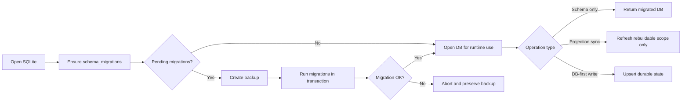

# Plan - DB Schema Migrations

Date: 2026-03-14
Status: proposed
Scope: add a real SQLite schema migration mechanism and eliminate destructive DB reset behavior during update, reinstall, reinitialization, and runtime mode transitions.

## Problem Statement

`aidn` already uses SQLite-backed runtime state in `dual` and `db-only`, but the current model is not a migration model in the Laravel sense.

Today:

- schema evolution is handled opportunistically through:
  - `CREATE TABLE IF NOT EXISTS`
  - `ALTER TABLE ... ADD COLUMN` on demand
- the main SQLite write path can still rebuild the database contents destructively
- install/reinstall/mode transitions can trigger a full DB projection refresh rather than a true incremental migration

The most important current behavior is in:

- `src/lib/index/index-store.mjs`
- `src/adapters/runtime/artifact-store.mjs`
- `tools/runtime/mode-migrate.mjs`
- `tools/runtime/sync-db-first.mjs`

Specifically:

- `writeSqliteIndex()` in `src/lib/index/index-store.mjs` recreates structure opportunistically, then performs broad `DELETE FROM ...` operations before reinserting the payload
- `createArtifactStore()` in `src/adapters/runtime/artifact-store.mjs` already behaves more like a durable store, with `upsert` semantics
- `mode-migrate` currently means "rebuild runtime state into SQLite", not "migrate schema safely"

This creates a structural risk:

- schema changes are not versioned explicitly
- durable DB-backed data can be lost if a rebuild path is triggered
- reinstall/reinit can still behave like reset + projection instead of migration + reconciliation

The user-facing symptom is exactly the one observed in real repositories such as `gowire`:

- after updates or reinitialization, the database can be overwritten instead of migrated and preserved

## Goals

Introduce a database migration model that:

- versions schema changes explicitly
- applies pending migrations transactionally
- never resets durable DB-backed state during normal update/reinstall/reinit flows
- distinguishes clearly between:
  - schema migration
  - projection sync
  - durable runtime state
- remains compatible with `files`, `dual`, and `db-only`
- supports already-installed repositories without forcing a destructive reset

## Non-Goals

- no immediate rewrite of the entire runtime model into a relational-first architecture
- no attempt in phase 1 to redesign every table and every query
- no hidden destructive fallback that silently recreates the SQLite file
- no requirement to migrate all historical JSON artifacts into DB-native storage in one pass

## Current Diagnosis

The problem is not only missing `schema_migrations`.

There are two distinct issues.

### A. Missing schema migration runner

Current SQLite initialization relies on:

- idempotent schema creation
- incremental column creation
- metadata entries such as `schema_version` in `index_meta`

This is useful, but insufficient because:

- it does not record ordered migration history
- it cannot express non-trivial migrations safely
- it does not provide backup / status / pending migration visibility

### B. Destructive state rebuild in the write path

Current index projection behavior deletes existing rows from:

- `artifacts`
- `cycles`
- `sessions`
- link tables
- repair tables
- migration tables

before reinserting the next payload.

That means:

- even perfect schema migrations would not prevent data loss
- DB-native state is mixed with rebuildable projection state
- "SQLite enabled" currently does not guarantee "SQLite durable"

## Architectural Principle

Do not solve this by adding a migrations table alone.

The remediation must separate:

1. schema lifecycle
2. rebuildable projection lifecycle
3. durable state lifecycle

If those three concerns remain coupled, the same class of failure will come back.

## Recommended Target Model

### 1. A Real Migration Registry

Add a dedicated registry table:

- `schema_migrations`

Suggested fields:

- `migration_id`
- `applied_at`
- `engine_version`
- `checksum`
- `notes`

Add a migration runner with deterministic ordering:

- `src/adapters/sqlite/migrations/0001_initial.mjs`
- `src/adapters/sqlite/migrations/0002_add_relation_status.mjs`
- etc.

Each migration should expose:

- `id`
- `description`
- `up(db)`
- optional `postCheck(db)`

### 2. One Central Schema Entry Point

Add one shared entry point, for example:

- `ensureWorkflowDbSchema({ db, role, targetRoot })`

This function should:

- create `schema_migrations` if missing
- discover pending migrations
- backup before risky upgrades
- apply migrations inside transactions
- emit a migration result object

All DB-opening code paths should call it:

- `src/lib/index/index-store.mjs`
- `src/adapters/runtime/artifact-store.mjs`
- `src/lib/sqlite/index-sqlite-lib.mjs`
- any future DB-backed store

### 3. Stop Destructive Resets On Durable State

Normal flows must stop treating the SQLite database as disposable.

This means:

- `install`
- `reinstall`
- `reinit`
- `mode-migrate`
- `sync-db-first`

must not recreate or wipe the durable DB by default.

Instead:

- schema changes go through migrations
- content refresh goes through merge/upsert/reconcile logic

### 4. Separate Rebuildable vs Durable Ownership

This is the most important design decision.

The current SQLite file mixes at least two classes of data:

- projection from `docs/audit/*`
- DB-native runtime state and decisions

That is unsafe.

There are two acceptable target directions.

#### Option A - One SQLite file, two ownership zones

Keep one DB file, but split tables into:

- rebuildable tables
- durable tables

Projection sync may rebuild only rebuildable tables.
Durable tables must be migrated and merged, never truncated by sync.

#### Option B - Two SQLite files

Recommended long-term direction:

- `workflow-index.sqlite`
  - rebuildable projection
- `workflow-state.sqlite`
  - durable runtime state

This better matches the existing semantics:

- index = derived
- state = durable

It also reduces the chance that an index rebuild destroys DB-first data.

### 5. Explicit Backup / Repair UX

Add CLI support equivalent to the safety developers expect from migration frameworks.

Suggested commands:

- `aidn runtime db-status`
- `aidn runtime db-migrate`
- `aidn runtime db-backup`
- `aidn runtime db-verify`

These should show:

- current schema version
- pending migrations
- last successful migration
- backup location if one was created

## Recommended Phasing

### Phase 1 - Stop The Damage

Goal:

- ensure updates and reinit no longer destroy DB state silently

Deliverables:

- central schema runner
- `schema_migrations`
- automatic backup before non-trivial migration
- no destructive reset during install/reinstall/reinit

### Phase 2 - Refactor Sync Semantics

Goal:

- separate "schema migrated" from "projection refreshed"

Deliverables:

- remove broad `DELETE FROM ...` sync behavior for durable tables
- introduce merge/upsert policy by table ownership
- make `mode-migrate` call migration first, then controlled sync

### Phase 3 - Clarify Durable Storage Boundaries

Goal:

- ensure DB-first state is not stored in the same unsafe lifecycle as rebuildable index data

Deliverables:

- either:
  - ownership-zoned single DB
- or:
  - two-file split (`workflow-index.sqlite`, `workflow-state.sqlite`)

### Phase 4 - Validate Real Upgrade Paths

Goal:

- prove that old repositories upgrade without losing runtime data

Deliverables:

- fixture coverage from old schema to new schema
- reinstall / reinit / update upgrade scenarios
- `gowire`-like migration scenarios

## BPMN-Style Flow

## Risks

### Risk 1 - False sense of safety

If `schema_migrations` is added but destructive sync remains, the product will look safer without actually being safer.

### Risk 2 - Ownership ambiguity

If the same tables are sometimes treated as projection and sometimes as durable state, data loss will remain possible.

### Risk 3 - Fixture-only confidence

The migration model must be validated on:

- empty installs
- already-installed fixtures
- inter-mode transitions
- `gowire`-like repositories

## Acceptance Criteria

This remediation is successful when:

- reinstall never wipes durable SQLite state by default
- reinitialization runs migrations instead of recreating DB state
- pending schema changes are visible and traceable
- migration failures are transactional and leave a recoverable backup
- `mode-migrate` becomes a safe state transition, not a reset operation
- real-world upgrade tests prove no-loss behavior

## Recommended First Slice

Implement the smallest useful safe slice first:

1. add `schema_migrations`
2. add central `ensureWorkflowDbSchema()`
3. wire it into every DB open path
4. stop full-table destructive reset for clearly durable tables
5. add backup + status reporting

This first slice already changes the product from:

- "SQLite projection that can be overwritten"

to:

- "SQLite runtime with explicit schema lifecycle and reduced loss risk"
