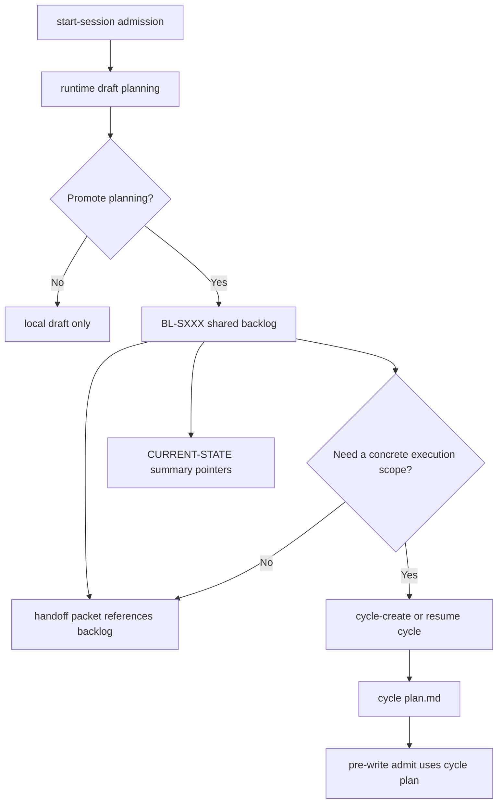

# Plan Session Shared Planning - 2026-03-13

## Objective

Document the session-scoped planning and backlog layer now implemented in `aidn`, so it remains traceable across:

- read-only admission and re-anchor flows
- multi-agent relays
- `files`, `dual`, and `db-only` state modes
- the transition from session coordination to cycle execution

The repository already had:

- `CURRENT-STATE.md` as a short operational digest
- `HANDOFF-PACKET.md` as a relay digest
- `cycles/*/plan.md` as a cycle execution plan
- `parking-lot.md` as entropy isolation
- DB-backed runtime persistence and projection support for support artifacts

The delivered extension adds a durable, shared planning layer between:

- session admission
- dispatch/handoff coordination
- cycle creation or cycle resumption

## Problem Summary

The current baseline works well for:

- re-anchor
- admission-first workflow gates
- cycle-scoped implementation readiness
- session and handoff summaries

But it leaves an operational gap in these situations:

1. a session is admitted in `THINKING` or `EXPLORING` and useful planning occurs before any cycle exists
2. a user wants the planning outcome to survive a later restart or handoff
3. several agents need to add planning addenda to the same session
4. the repository runs in `dual` or `db-only`, where runtime state is rich but local by default
5. the next executable step is not yet a cycle task, but it still needs shared traceability

Today:

- `CURRENT-STATE.md` can carry `first_plan_step`, but only as a summary pointer
- `cycles/*/plan.md` exists too late for pre-cycle planning
- `parking-lot.md` captures ideas, not an executable shared backlog
- `HANDOFF-PACKET.md` can recommend one next action, but not hold a collaboratively amended plan

This was acceptable for single-agent local work.
It was weak for explicit multi-agent operation.

## Implementation Status

Status:

- delivered

Primary runtime entry points:

- `aidn runtime session-plan`
- coordinator shared planning consumers
- handoff/shared planning projection and admission
- cycle-create / pre-write planning gates

Primary shared artifacts:

- `.aidn/runtime/context/session-plan-draft.json`
- `docs/audit/backlog/BL-SXXX-<slug>.md`
- `CURRENT-STATE.md` summary pointers
- `HANDOFF-PACKET.md` relay pointers

Tracking:

- implementation backlog is closed in `docs/BACKLOG_SESSION_SHARED_PLANNING_2026-03-13.md`

## Design Goal

The runtime must support these statements at the same time:

- planning may happen before a cycle is created
- read-only planning should still be traceable
- session-level planning may span multiple cycles
- dispatch scope must remain singular even when session planning is plural
- cycle execution plans should remain cycle-scoped and implementation-oriented
- DB-backed modes must persist the same planning state without inventing a second incompatible workflow model

## Scope

In scope:

- a new session-scoped planning/backlog artifact model
- promotion from runtime-local planning draft to shared audit artifact
- links from session planning to handoff/dispatch and cycle plans
- mode-aware persistence for `files`, `dual`, and `db-only`
- multi-agent addenda and arbitration traceability

Out of scope:

- autonomous scheduling
- concurrent unconstrained writes to the same branch
- replacing cycle accountability with session-only planning
- forcing a Git push before every local planning action

## Core Distinctions

The model should separate four concerns explicitly.

### A. Session Topology

Already covered by session metadata:

- `attached_cycles`
- `integration_target_cycles`
- optional `primary_focus_cycle`

### B. Shared Session Planning

Delivered layer:

- planning intent
- candidate work items
- blocked questions
- arbitration needs
- dispatch-ready next actions

### C. Dispatch Scope

Must remain singular:

- `scope_type`
- `scope_id`
- `target_branch`

### D. Cycle Execution Plan

Must remain local to one cycle:

- implementation tasks
- dependencies
- checkpoints
- done criteria

## Recommended Artifact Model

### 1. Runtime Draft Artifact

Local, non-git-shared draft:

- `.aidn/runtime/context/session-plan-draft.json`

Purpose:

- capture planning that emerges immediately after `start-session`
- support read-only sessions and dry runs
- hold unpromoted draft state safely in all modes

Suggested content:

- `session_id`
- `mode`
- `planning_status`
- `candidate_backlog_items`
- `questions`
- `proposed_next_dispatch`
- `source_agent`
- `updated_at`

### 2. Shared Session Backlog Artifact

Git-shareable audit artifact:

- `docs/audit/backlog/BL-SXXX-<slug>.md`

Purpose:

- hold the durable, amendable planning layer for one session
- survive restart, handoff, multi-agent addenda, and branch sharing
- become the source for session-level planning continuity

Suggested content:

- session identity and branch context
- planning status
- linked cycles
- backlog items
- decisions pending arbitration
- dispatch-ready next step
- addenda log per agent/session

### 3. Existing Summary Artifacts

Keep these concise:

- `CURRENT-STATE.md`
- `RUNTIME-STATE.md`
- `HANDOFF-PACKET.md`

They should reference the active backlog, not duplicate it.

### 4. Existing Cycle Execution Artifact

Keep:

- `docs/audit/cycles/CXXX-.../plan.md`

This stays the execution plan after a cycle is selected or created.

## Recommended Field Contract

### `CURRENT-STATE.md`

Add summary pointers only:

- `active_backlog`
- `backlog_status`
- `backlog_next_step`

Do not turn `CURRENT-STATE.md` into the backlog itself.

### `HANDOFF-PACKET.md`

Add relay-facing references:

- `backlog_refs`
- `next_dispatch_step`
- `planning_arbitration_status`

### Session backlog artifact

Recommended minimum fields:

- `session_id`
- `session_branch`
- `planning_status`
- `linked_cycles`
- `dispatch_ready`
- `next_dispatch_scope`
- `next_dispatch_action`
- `backlog_items`
- `open_questions`
- `addenda`

## Mode Behavior

### `files`

Source of truth:

- files

Behavior:

- planning draft may exist locally
- promotion to `docs/audit/backlog/*.md` is optional but recommended before handoff or shared work

### `dual`

Source of truth:

- DB canonical state with required file projection

Behavior:

- runtime draft persists locally
- promoted backlog must be written through DB/runtime index and projected to `docs/audit/backlog/*.md`
- handoff should consume the projected artifact reference

### `db-only`

Source of truth:

- DB canonical state

Behavior:

- runtime draft persists locally
- promoted backlog must be stored canonically in DB
- projection to `docs/audit/backlog/*.md` should occur when human/shared relay readability is required
- handoff and reload must still expose a deterministic projected view

## Promotion Rules

Planning should move through explicit states:

1. `draft`
2. `promoted`
3. `dispatch_ready`
4. `consumed_by_cycle`
5. `closed`

Promotion should be required when:

- work is likely to continue in another agent
- a multi-agent relay is prepared
- a cycle will be created from the planning outcome
- the user asks to keep the planning result durable

Draft-only planning can remain local when:

- the session is short and single-agent
- no relay is expected
- no durable workflow decision has been made yet

## Recommended Workflow Integration

## Hook And Runtime Direction

The implementation stayed conservative.

### A. New Planning Entry Point

Delivered bounded command:

- `aidn runtime session-plan`

Current responsibilities:

- create/update runtime draft
- promote the draft to a shared backlog artifact
- merge addenda into an existing shared backlog
- persist through DB-first flows in `dual` and `db-only`
- never bypass existing admission rules

### B. Handoff Integration

Delivered behavior:

- an active session backlog can be referenced directly
- unresolved planning arbitration is visible before relay
- dispatch provenance can remain `shared_planning` across relay and resume

### C. Pre-Write Interaction

Keep `pre-write-admit` cycle-oriented for implementation.
Do not make shared session backlog a substitute for `cycles/*/plan.md`.

Use session backlog to answer:

- what should happen next
- which cycle should be created or resumed
- whether arbitration is still open

Use cycle plan to answer:

- what is the first implementation step
- what will be written now

### D. DB-First Persistence

For `dual` and `db-only`, promoted backlog artifacts are handled through:

- `artifact-store`
- `db-first-artifact`
- normal projection/index sync flow

This avoids inventing a separate persistence path.

## Gating Direction

Delivered workflow concern:

- `shared_planning_freshness`

Current rules:

- before `handoff-close`, warn if a referenced session backlog is stale relative to `CURRENT-STATE.md`
- before multi-agent dispatch execution, block if planning arbitration is unresolved
- before `cycle-create` from a promoted session backlog, require an explicit selected execution scope
- before `cycle-create`, require `backlog_selected_execution_scope=new_cycle` when promoted shared planning is active

Do not:

- block all local planning when no shared backlog exists
- require a Git push for every local draft

## Delivered Slices

### D1 - Define Session Planning Artifact Contract

Delivered outcome:

- one explicit contract for:
  - runtime draft
  - shared session backlog
  - summary references

### D2 - Add Shared Backlog Projection And Persistence

Delivered outcome:

- promoted session planning can be stored and reloaded in all state modes

### D3 - Align Handoff And Coordinator Digests

Delivered outcome:

- handoff and dispatch planning can reference shared planning state directly

### D4 - Align Session And Cycle Boundaries

Delivered outcome:

- session backlog feeds cycle selection
- cycle plan remains the implementation contract

### D5 - Add Verifier Coverage

Delivered outcome:

- fixtures cover:
  - read-only planning draft
  - promoted shared backlog
  - dual/db-only projection
  - handoff with backlog reference
  - cycle creation from promoted planning

## Delivered Sequence

### Phase 1 - Contract

Result:

- define the new artifact layer without changing cycle execution semantics

### Phase 2 - Runtime Draft

Result:

- persist read-only/session planning locally in runtime context

### Phase 3 - Shared Backlog Promotion

Result:

- support durable shared planning under `docs/audit/backlog/`

### Phase 4 - Handoff / Coordinator Alignment

Result:

- make relay and dispatch consume the new planning layer explicitly

### Phase 5 - Verification And Documentation

Result:

- lock behavior with fixtures and align docs/templates

## Non-Goals

Do not implement initially:

- automatic backlog-to-cycle decomposition without explicit user choice
- multi-agent concurrent writes to the same backlog without workflow arbitration
- replacing `parking-lot.md`
- replacing `cycles/*/plan.md`

## Outcome Criteria

This plan is successful when the repository now satisfies:

- planning done before cycle creation is no longer ephemeral by default
- read-only session planning can be promoted to a shared artifact
- multi-agent relays can reference session planning explicitly
- `dual` and `db-only` use the same planning model, not a parallel one
- cycle plans remain narrow execution contracts instead of becoming overloaded session documents
