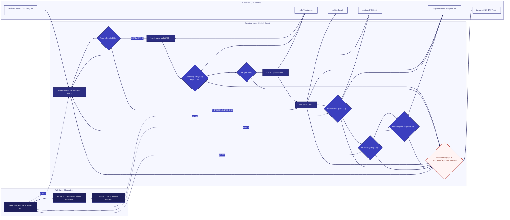

```mermaid
%%{init: {
  "theme": "base",
  "themeVariables": {
    "fontFamily": "Trebuchet MS, Verdana, sans-serif",
    "fontSize": "15px",
    "lineColor": "#1E1F5C",
    "primaryColor": "#2C2E83",
    "primaryTextColor": "#FFFFFF",
    "primaryBorderColor": "#1E1F5C",
    "secondaryColor": "#3B3FBF",
    "secondaryTextColor": "#FFFFFF",
    "secondaryBorderColor": "#1E1F5C",
    "tertiaryColor": "#F6F7FF",
    "tertiaryTextColor": "#1E1F5C",
    "tertiaryBorderColor": "#2C2E83"
  }
}}%%
%% 1) Global System Architecture (v0.2.0 workflow)
flowchart LR
  subgraph RULE["Rule Layer (Normative)"]
    SPEC["SPEC.md (SPEC-R01..SPEC-R11)"]
    WF["WORKFLOW.md (local adapter extensions)"]
    AG["AGENTS.md (execution contract)"]
    SPEC --> WF --> AG
  end

  subgraph RUN["Execution Layer (Skills + Gates)"]
    START["context-reload + start-session (R01)"]
    MODE{"Mode selected (R02)"}
    BCA["branch-cycle-audit (R03)"]
    CONT{"Continuity gate (R06)\nR1 | R2 | R3"}
    DOR{"DoR gate (R04)"}
    EXEC["Cycle implementation"]
    DRIFT["drift-check (R05)"]
    SCLOSE{"Session close gate (R07)"}
    PRG{"PR review gate (R08)"}
    SYNC{"Post-merge local sync (R09)"}
    INC{"Incident triage (R10)\nL1/L2 auto-fix | L3/L4 stop+auth"}
  end

  subgraph STATE["State Layer (Declarative)"]
    SESS["sessions/SXXX.md"]
    CYCLE["cycles/*/status.md"]
    SNAP["snapshots/context-snapshot.md"]
    BASE["baseline/current.md + history.md"]
    PARK["parking-lot.md"]
    INCF["incidents/INC-TMP-*.md"]
  end

  START --> MODE
  MODE -->|COMMITTING| BCA --> CONT --> DOR --> EXEC --> DRIFT --> SCLOSE
  MODE -->|THINKING / EXPLORING| DRIFT
  SCLOSE --> PRG --> SYNC --> START

  START <--> SESS
  BCA <--> CYCLE
  CONT --> CYCLE
  EXEC --> CYCLE
  DRIFT --> PARK
  DRIFT --> SNAP
  SCLOSE --> SESS
  SCLOSE --> SNAP
  SYNC --> SNAP
  BASE --> START

  CONT --> INC
  DOR --> INC
  DRIFT --> INC
  SCLOSE --> INC
  PRG --> INC
  SYNC --> INC
  INC --> INCF
  INC --> START

  SPEC -. governs .-> START
  SPEC -. governs .-> SCLOSE
  SPEC -. governs .-> PRG
  SPEC -. governs .-> SYNC

  classDef rule fill:#1E1F5C,stroke:#2C2E83,color:#FFFFFF,stroke-width:2px;
  classDef gate fill:#3B3FBF,stroke:#1E1F5C,color:#FFFFFF,stroke-width:2px;
  classDef action fill:#2C2E83,stroke:#1E1F5C,color:#FFFFFF,stroke-width:2px;
  classDef state fill:#F6F7FF,stroke:#2C2E83,color:#1E1F5C,stroke-width:1.5px;
  classDef incident fill:#FFF4F4,stroke:#B42318,color:#7A271A,stroke-width:2px;

  class SPEC,WF,AG rule;
  class MODE,CONT,DOR,SCLOSE,PRG,SYNC gate;
  class START,BCA,EXEC,DRIFT action;
  class SESS,CYCLE,SNAP,BASE,PARK,INCF state;
  class INC incident;

  linkStyle default stroke:#1E1F5C,stroke-width:2px;
```
