```mermaid
%%{init: {
  "theme": "base",
  "themeVariables": {
    "fontFamily": "Trebuchet MS, Verdana, sans-serif",
    "fontSize": "15px",
    "lineColor": "#1E1F5C",
    "primaryColor": "#2C2E83",
    "primaryTextColor": "#FFFFFF",
    "primaryBorderColor": "#1E1F5C",
    "secondaryColor": "#3B3FBF",
    "secondaryTextColor": "#FFFFFF",
    "secondaryBorderColor": "#1E1F5C",
    "tertiaryColor": "#F6F7FF",
    "tertiaryTextColor": "#1E1F5C",
    "tertiaryBorderColor": "#2C2E83"
  }
}}%%
%% 1) Global engine and project governance boundary
flowchart LR
  subgraph HOST["User installation"]
    POINTER["One active verified package generation"]
    ENGINE["CLI + engine + standard skills/agents + hook logic"]
    REGISTRY["Project registry: address book and update preflight scope"]
    POINTER --> ENGINE
    REGISTRY -. all roots compatible before switch .-> POINTER
  end
  CONNECT["Project hook connectors + physical-root activation"]
  ENGINE --> CONNECT
  subgraph RULE["Rule Layer (Normative)"]
    SPEC["SPEC.md (SPEC-R01..SPEC-R11)"]
    WF["WORKFLOW.md (generated adapter view)"]
    AG["AGENTS.md (execution contract)"]
    SPEC --> WF --> AG
  end

  subgraph RUN["Execution Layer (Skills + Gates)"]
    START["context-reload + start-session admission (R01) + stale open-cycle guard"]
    REANCHOR["CURRENT-STATE + WORKFLOW-KERNEL reload"]
    MODE{"Mode selected (R02)"}
    BCA["branch-cycle-audit admission (R03)"]
    CONT{"cycle-create / convert-to-spike continuity (R06)"}
    DOR{"DoR + ownership + validation gates (R04-R07)"}
    PWRITE{"Pre-write gate"}
    EXEC["Cycle implementation"]
    HYDRATE["hydrate-context + runtime digest refresh"]
    DRIFT["Explicit drift-check + semantic scope review (R05)"]
    PROOF["drift_check_completed: ok; current branch, COMMITTING, valid timestamp"]
    MUTATE["requirements-delta / promote-baseline admissions"]
    HAND["handoff-close + handoff-admit"]
    COORD["coordinator next-action + dispatch/orchestrate"]
    GEN["install + project config generation"]
    PERSIST["runtime persistence + shared coordination services"]
    SCLOSE{"close-session admission (R07) + stale merged-cycle guard"}
    PRG{"PR review gate (R08)"}
    SYNC{"Post-merge local sync (R09)"}
    INC{"Incident triage R10: L1 L2 auto-fix, L3 L4 stop+auth"}
  end

  subgraph STATE["State Layer (Declarative)"]
    SESS["sessions/SXXX.md"]
    CYCLE["cycles/*/status.md"]
    CURR["CURRENT-STATE.md"]
    RT["RUNTIME-STATE.md"]
    SNAP["snapshots/context-snapshot.md"]
    BASE["baseline/current.md + history.md"]
    PARK["parking-lot.md"]
    HANDOFF["HANDOFF-PACKET.md"]
    COORDS["COORDINATION-SUMMARY.md + COORDINATION-LOG.md"]
    ADAPT[".aidn/project/workflow.adapter.json"]
    CFG[".aidn/config.json"]
    INCF["incidents/INC-TMP-*.md"]
  end

  CONNECT --> START
  START --> REANCHOR --> MODE
  MODE -->|COMMITTING| BCA --> CONT --> DOR --> PWRITE --> EXEC --> HYDRATE --> DRIFT --> MUTATE --> HAND --> COORD --> SCLOSE
  MODE -->|THINKING / EXPLORING| DRIFT
  SCLOSE --> PRG --> SYNC --> START

  START <--> SESS
  BCA <--> CYCLE
  REANCHOR <--> CURR
  HYDRATE <--> RT
  CONT --> CYCLE
  EXEC --> CYCLE
  DRIFT --> PARK
  DRIFT --> CURR
  DRIFT --> SNAP
  DRIFT -. successful completion only .-> PROOF
  HAND <--> HANDOFF
  COORD <--> COORDS
  GEN <--> ADAPT
  PERSIST <--> CFG
  PERSIST <--> RT
  SCLOSE --> SESS
  SCLOSE --> CURR
  SCLOSE --> SNAP
  SYNC --> SNAP
  BASE --> START
  ADAPT --> GEN
  GEN -. renders .-> WF

  CONT --> INC
  DOR --> INC
  DRIFT --> INC
  SCLOSE --> INC
  PRG --> INC
  SYNC --> INC
  INC --> INCF
  INC --> START

  SPEC -. governs .-> START
  SPEC -. governs .-> SCLOSE
  SPEC -. governs .-> PRG
  SPEC -. governs .-> SYNC

  classDef rule fill:#1E1F5C,stroke:#2C2E83,color:#FFFFFF,stroke-width:2px;
  classDef gate fill:#3B3FBF,stroke:#1E1F5C,color:#FFFFFF,stroke-width:2px;
  classDef action fill:#2C2E83,stroke:#1E1F5C,color:#FFFFFF,stroke-width:2px;
  classDef state fill:#F6F7FF,stroke:#2C2E83,color:#1E1F5C,stroke-width:1.5px;
  classDef incident fill:#FFF4F4,stroke:#B42318,color:#7A271A,stroke-width:2px;

  class SPEC,WF,AG rule;
  class MODE,CONT,DOR,PWRITE,SCLOSE,PRG,SYNC gate;
  class START,REANCHOR,BCA,EXEC,HYDRATE,DRIFT,MUTATE,HAND,COORD,GEN,PERSIST action;
  class SESS,CYCLE,CURR,RT,SNAP,BASE,PARK,HANDOFF,COORDS,ADAPT,CFG,INCF state;
  class INC incident;

  linkStyle default stroke:#1E1F5C,stroke-width:2px;
```

Global updates change the common generation and user assets, not project data or
connectors. Worktrees require explicit root-bound preparation; linked roots share
repository revocation. Configuration, adapter inputs, extensions and canonical
workflow data remain project-owned. PostgreSQL is optional. See [global setup](../GLOBAL_SETUP.md).

Generic gate evaluation, preview, warning and stop do not produce successful
completion evidence or refresh drift age. This diagram is an operating model;
native hook execution and human review require separate evidence.
