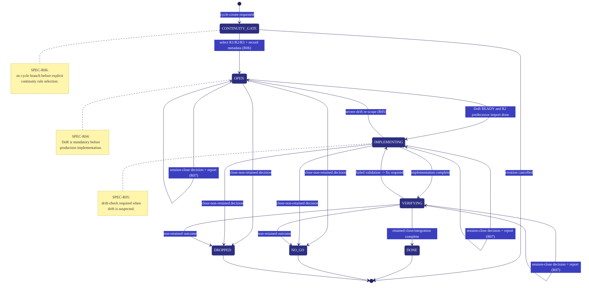

```mermaid
%%{init: {
  "theme": "base",
  "themeVariables": {
    "fontFamily": "Trebuchet MS, Verdana, sans-serif",
    "fontSize": "15px",
    "lineColor": "#1E1F5C",
    "primaryColor": "#2C2E83",
    "primaryTextColor": "#FFFFFF",
    "primaryBorderColor": "#1E1F5C",
    "secondaryColor": "#3B3FBF",
    "secondaryTextColor": "#FFFFFF",
    "secondaryBorderColor": "#1E1F5C",
    "tertiaryColor": "#F6F7FF",
    "tertiaryTextColor": "#1E1F5C",
    "tertiaryBorderColor": "#2C2E83"
  }
}}%%
%% 2) Cycle State Machine (v0.2.0)
stateDiagram-v2
  [*] --> CONTINUITY_GATE: cycle-create requested
  CONTINUITY_GATE --> OPEN: select R1/R2/R3 + record metadata (R06)
  CONTINUITY_GATE --> [*]: creation cancelled

  OPEN --> OPEN: DoR not ready / clarify scope + plan (R04)
  OPEN --> IMPLEMENTING: DoR READY and R2 predecessor import done
  OPEN --> NO_GO: close-non-retained decision
  OPEN --> DROPPED: close-non-retained decision

  IMPLEMENTING --> IMPLEMENTING: normal progress
  IMPLEMENTING --> OPEN: severe drift re-scope (R05)
  IMPLEMENTING --> VERIFYING: implementation complete
  IMPLEMENTING --> NO_GO: close-non-retained decision
  IMPLEMENTING --> DROPPED: close-non-retained decision

  VERIFYING --> IMPLEMENTING: failed validation -> fix required
  VERIFYING --> DONE: retained close/integration complete
  VERIFYING --> NO_GO: non-retained outcome
  VERIFYING --> DROPPED: non-retained outcome

  OPEN --> OPEN: session-close decision = report (R07)
  IMPLEMENTING --> IMPLEMENTING: session-close decision = report (R07)
  VERIFYING --> VERIFYING: session-close decision = report (R07)

  DONE --> [*]
  NO_GO --> [*]
  DROPPED --> [*]

  note right of CONTINUITY_GATE
    SPEC-R06:
    no cycle branch before explicit
    continuity rule selection.
  end note

  note right of OPEN
    SPEC-R04:
    DoR is mandatory before
    production implementation.
  end note

  note right of IMPLEMENTING
    SPEC-R05:
    drift-check required when
    drift is suspected.
  end note
```
