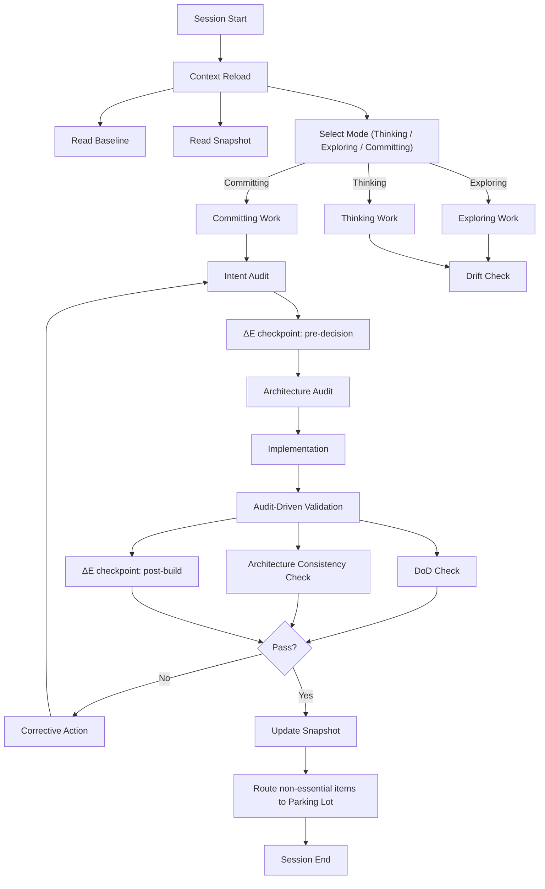

```mermaid
%% 3) Runtime Session Flow
flowchart TD
  ST["Session Start"] --> RL["Context Reload"]
  RL --> RLB["Read Baseline"]
  RL --> RLS["Read Snapshot"]
  RL --> MSEL["Select Mode (Thinking / Exploring / Committing)"]

  MSEL -->|Thinking| TW["Thinking Work"]
  MSEL -->|Exploring| EW["Exploring Work"]
  MSEL -->|Committing| CW["Committing Work"]

  CW --> IA["Intent Audit"]
  IA --> ECP1["ΔE checkpoint: pre-decision"]
  ECP1 --> AA["Architecture Audit"]
  AA --> IM["Implementation"]

  EW --> DR["Drift Check"]
  TW --> DR
  IM --> ADV["Audit-Driven Validation"]

  ADV --> DOD["DoD Check"]
  ADV --> ARCH["Architecture Consistency Check"]
  ADV --> ECP2["ΔE checkpoint: post-build"]

  DOD --> DEC{"Pass?"}
  ARCH --> DEC
  ECP2 --> DEC

  DEC -->|No| CA["Corrective Action"]
  CA --> IA

  DEC -->|Yes| SU["Update Snapshot"]
  SU --> PL["Route non-essential items to Parking Lot"]
  PL --> END["Session End"]
```
