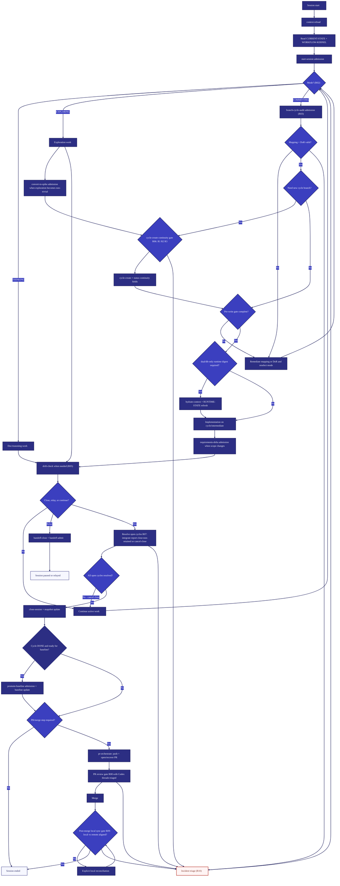

```mermaid
%%{init: {
  "theme": "base",
  "themeVariables": {
    "fontFamily": "Trebuchet MS, Verdana, sans-serif",
    "fontSize": "15px",
    "lineColor": "#1E1F5C",
    "primaryColor": "#2C2E83",
    "primaryTextColor": "#FFFFFF",
    "primaryBorderColor": "#1E1F5C",
    "secondaryColor": "#3B3FBF",
    "secondaryTextColor": "#FFFFFF",
    "secondaryBorderColor": "#1E1F5C",
    "tertiaryColor": "#F6F7FF",
    "tertiaryTextColor": "#1E1F5C",
    "tertiaryBorderColor": "#2C2E83"
  }
}}%%
%% 3) Runtime Session Flow (v0.4.0 workflow baseline)
flowchart TD
  ST["Session start"] --> CR["context-reload"]
  CR --> RA["Read CURRENT-STATE + WORKFLOW-KERNEL"]
  RA --> SS["start-session admission"]
  SS --> MODE{"Mode? (R02)"}

  MODE -->|THINKING| THINK["Doc/reasoning work"]
  MODE -->|EXPLORING| EXP["Exploration work"]
  MODE -->|COMMITTING| BCA["branch-cycle-audit admission (R03)"]

  BCA --> MAP{"Mapping + DoR valid?"}
  MAP -->|No| FIX["Remediate mapping or DoR and reselect mode"]
  FIX --> MODE
  MAP -->|Yes| NEED{"Need new cycle branch?"}

  NEED -->|Yes| CONT{"cycle-create continuity gate R06: R1 R2 R3"}
  CONT --> CNEW["cycle-create + status continuity fields"]
  CNEW --> PW{"Pre-write gate complete?"}
  NEED -->|No| PW
  PW -->|No| FIX
  PW -->|Yes| RT{"dual/db-only runtime digest required?"}
  RT -->|Yes| DIG["hydrate-context + RUNTIME-STATE refresh"]
  RT -->|No| IMPL["Implementation on cycle/intermediate"]
  DIG --> IMPL

  THINK --> DRIFT["drift-check when needed (R05)"]
  EXP --> SPIKE["convert-to-spike admission when exploration becomes non-trivial"]
  SPIKE --> CONT
  EXP --> DRIFT
  IMPL --> DELTA["requirements-delta admission when scope changes"]
  DELTA --> DRIFT
  DRIFT --> CLOSE{"Close, relay, or continue?"}

  CLOSE -->|No| LOOP["Continue active work"]
  LOOP --> MODE
  CLOSE -->|Relay| RELAY["handoff-close + handoff-admit"]
  RELAY --> END_RELAY["Session paused or relayed"]

  CLOSE -->|Yes| RESOLVE["Resolve open cycles R07: integrate report close-non-retained or cancel-close"]
  RESOLVE --> OK{"All open cycles resolved?"}
  OK -->|No - cancel close| LOOP
  OK -->|Yes| CS["close-session + snapshot update"]
  CS --> PB{"Cycle DONE and ready for baseline?"}
  PB -->|Yes| PROMO["promote-baseline admission + baseline update"]
  PB -->|No| PRQ{"PR/merge step required?"}
  PROMO --> PRQ

  PRQ -->|No| END_DONE["Session ended"]
  PRQ -->|Yes| PRO["pr-orchestrate: push + open/recover PR"]
  PRO --> PRG["PR review gate R08 with Codex threads triaged"]
  PRG --> MRG["Merge"]
  MRG --> SYNC{"Post-merge local sync gate R09: local vs remote aligned?"}
  SYNC -->|No| REC["Explicit local reconciliation"]
  REC --> SYNC
  SYNC -->|Yes| END_DONE

  MAP --> INC["Incident triage (R10)"]
  CONT --> INC
  RESOLVE --> INC
  PRG --> INC
  SYNC --> INC
  INC --> MODE

  classDef gate fill:#3B3FBF,stroke:#1E1F5C,color:#FFFFFF,stroke-width:2px;
  classDef action fill:#2C2E83,stroke:#1E1F5C,color:#FFFFFF,stroke-width:2px;
  classDef endnode fill:#F6F7FF,stroke:#2C2E83,color:#1E1F5C,stroke-width:1.5px;
  classDef incident fill:#FFF4F4,stroke:#B42318,color:#7A271A,stroke-width:2px;

  class MODE,MAP,NEED,CONT,PW,RT,CLOSE,OK,PRQ,SYNC gate;
  class ST,CR,RA,SS,THINK,EXP,BCA,FIX,CNEW,DIG,IMPL,DRIFT,SPIKE,DELTA,LOOP,RELAY,RESOLVE,CS,PROMO,PRO,PRG,MRG,REC action;
  class END_RELAY,END_DONE endnode;
  class INC incident;

  linkStyle default stroke:#1E1F5C,stroke-width:2px;
```
