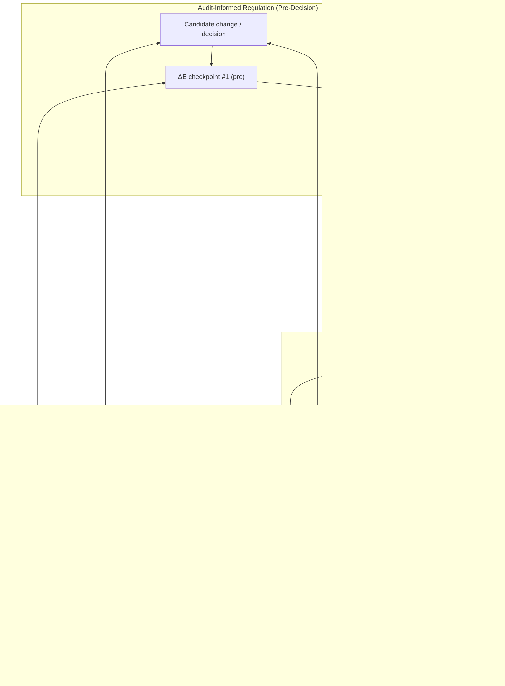

```mermaid
%% 4) Entropy Regulation Control Loop
flowchart TD
  subgraph AI["Audit-Informed Regulation (Pre-Decision)"]
    IN["Candidate change / decision"]
    Epre["ΔE checkpoint #1 (pre)"]
    G1{"ΔE within bounds?"}
  end

  subgraph BUILD["Execution Path"]
    COMMIT["Structural decision commit"]
    IMP["Implementation"]
  end

  subgraph AD["Audit-Driven Regulation (Post-Build)"]
    VAL["DoD + drift + architecture validation"]
    Epost["ΔE checkpoint #2 (post)"]
    G2{"ΔE and quality acceptable?"}
    FIX["Corrective action / re-scope / rollback"]
  end

  subgraph MEM["Memory Stabilization"]
    BASE["Baseline (anchor)"]
    SNAP["Snapshots (reload)"]
    PARK["Parking Lot (entropy isolation)"]
  end

  IN --> Epre --> G1
  G1 -->|Yes| COMMIT --> IMP --> VAL --> Epost --> G2
  G1 -->|No| FIX
  G2 -->|No| FIX --> IN
  G2 -->|Yes| SNAP

  BASE --> Epre
  VAL --> PARK
  PARK --> IN
  SNAP --> BASE
```
