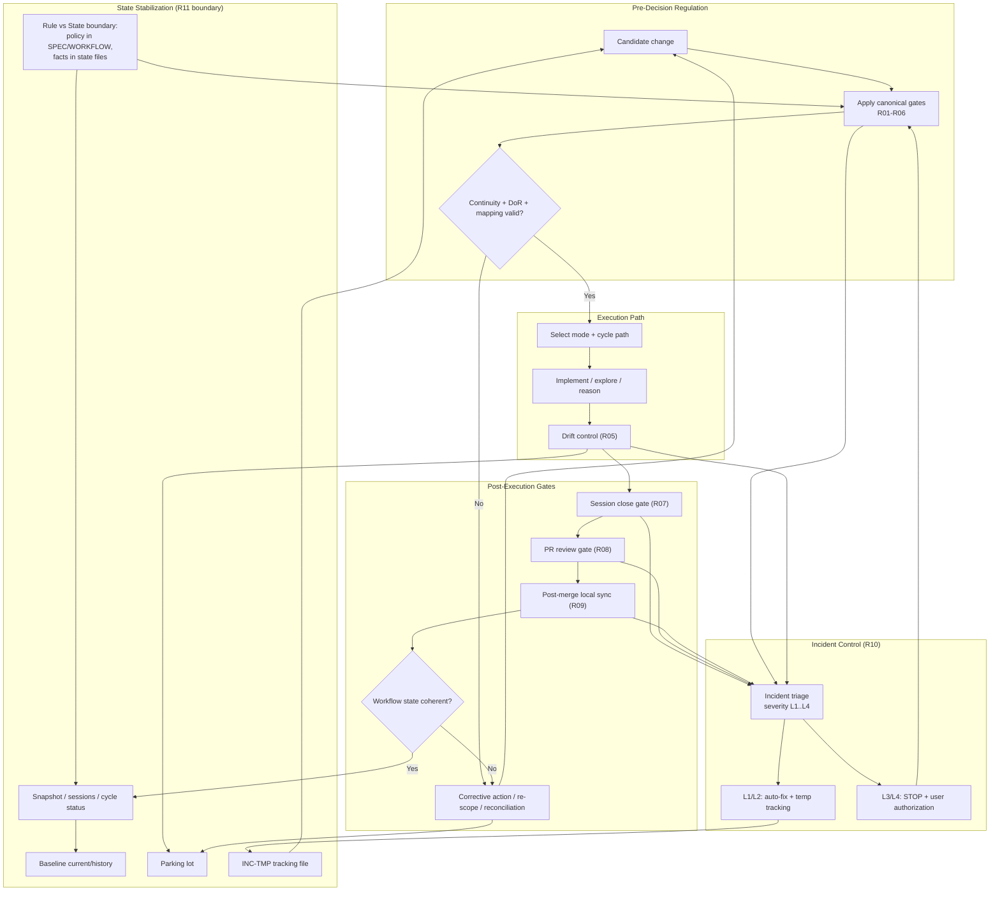

```mermaid
%% 4) Entropy Regulation Control Loop (v0.2.0)
flowchart TD
  subgraph PRE["Pre-Decision Regulation"]
    IN["Candidate change"]
    RULES["Apply canonical gates\nR01-R06"]
    G1{"Continuity + DoR + mapping valid?"}
  end

  subgraph RUN["Execution Path"]
    PLAN["Select mode + cycle path"]
    IMP["Implement / explore / reason"]
    DRIFT["Drift control (R05)"]
  end

  subgraph POST["Post-Execution Gates"]
    CLOSE["Session close gate (R07)"]
    PR["PR review gate (R08)"]
    SYNC["Post-merge local sync (R09)"]
    G2{"Workflow state coherent?"}
    FIX["Corrective action / re-scope / reconciliation"]
  end

  subgraph INC["Incident Control (R10)"]
    TRIAGE["Incident triage\nseverity L1..L4"]
    L12["L1/L2: auto-fix + temp tracking"]
    L34["L3/L4: STOP + user authorization"]
  end

  subgraph STATE["State Stabilization (R11 boundary)"]
    SNAP["Snapshot / sessions / cycle status"]
    BASE["Baseline current/history"]
    PARK["Parking lot"]
    TMP["INC-TMP tracking file"]
    BOUND["Rule vs State boundary:\npolicy in SPEC/WORKFLOW,\nfacts in state files"]
  end

  IN --> RULES --> G1
  G1 -->|Yes| PLAN --> IMP --> DRIFT --> CLOSE --> PR --> SYNC --> G2
  G1 -->|No| FIX
  G2 -->|No| FIX --> IN
  G2 -->|Yes| SNAP --> BASE

  DRIFT --> PARK
  FIX --> PARK
  RULES --> TRIAGE
  DRIFT --> TRIAGE
  CLOSE --> TRIAGE
  PR --> TRIAGE
  SYNC --> TRIAGE

  TRIAGE --> L12 --> TMP --> IN
  TRIAGE --> L34
  L34 --> RULES

  BOUND --> RULES
  BOUND --> SNAP
```
