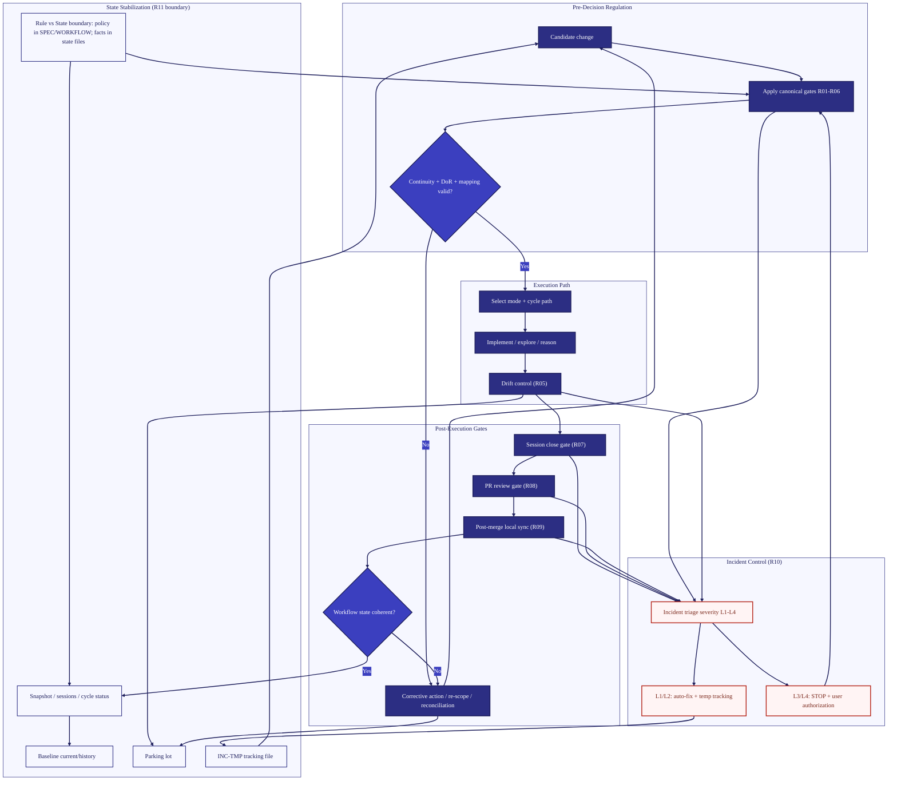

```mermaid
%%{init: {
  "theme": "base",
  "themeVariables": {
    "fontFamily": "Trebuchet MS, Verdana, sans-serif",
    "fontSize": "15px",
    "lineColor": "#1E1F5C",
    "primaryColor": "#2C2E83",
    "primaryTextColor": "#FFFFFF",
    "primaryBorderColor": "#1E1F5C",
    "secondaryColor": "#3B3FBF",
    "secondaryTextColor": "#FFFFFF",
    "secondaryBorderColor": "#1E1F5C",
    "tertiaryColor": "#F6F7FF",
    "tertiaryTextColor": "#1E1F5C",
    "tertiaryBorderColor": "#2C2E83"
  }
}}%%
%% 4) Entropy Regulation Control Loop (v0.2.0)
flowchart TD
  subgraph PRE["Pre-Decision Regulation"]
    IN["Candidate change"]
    RULES["Apply canonical gates R01-R06"]
    G1{"Continuity + DoR + mapping valid?"}
  end

  subgraph RUN["Execution Path"]
    PLAN["Select mode + cycle path"]
    IMP["Implement / explore / reason"]
    DRIFT["Drift control (R05)"]
  end

  subgraph POST["Post-Execution Gates"]
    CLOSE["Session close gate (R07)"]
    PR["PR review gate (R08)"]
    SYNC["Post-merge local sync (R09)"]
    G2{"Workflow state coherent?"}
    FIX["Corrective action / re-scope / reconciliation"]
  end

  subgraph INC["Incident Control (R10)"]
    TRIAGE["Incident triage severity L1-L4"]
    L12["L1/L2: auto-fix + temp tracking"]
    L34["L3/L4: STOP + user authorization"]
  end

  subgraph STATE["State Stabilization (R11 boundary)"]
    SNAP["Snapshot / sessions / cycle status"]
    BASE["Baseline current/history"]
    PARK["Parking lot"]
    TMP["INC-TMP tracking file"]
    BOUND["Rule vs State boundary: policy in SPEC/WORKFLOW; facts in state files"]
  end

  IN --> RULES --> G1
  G1 -->|Yes| PLAN --> IMP --> DRIFT --> CLOSE --> PR --> SYNC --> G2
  G1 -->|No| FIX
  G2 -->|No| FIX --> IN
  G2 -->|Yes| SNAP --> BASE

  DRIFT --> PARK
  FIX --> PARK
  RULES --> TRIAGE
  DRIFT --> TRIAGE
  CLOSE --> TRIAGE
  PR --> TRIAGE
  SYNC --> TRIAGE

  TRIAGE --> L12 --> TMP --> IN
  TRIAGE --> L34
  L34 --> RULES

  BOUND --> RULES
  BOUND --> SNAP

  classDef gate fill:#3B3FBF,stroke:#1E1F5C,color:#FFFFFF,stroke-width:2px;
  classDef action fill:#2C2E83,stroke:#1E1F5C,color:#FFFFFF,stroke-width:2px;
  classDef state fill:#F6F7FF,stroke:#2C2E83,color:#1E1F5C,stroke-width:1.5px;
  classDef incident fill:#FFF4F4,stroke:#B42318,color:#7A271A,stroke-width:2px;

  class G1,G2 gate;
  class IN,RULES,PLAN,IMP,DRIFT,CLOSE,PR,SYNC,FIX action;
  class SNAP,BASE,PARK,TMP,BOUND state;
  class TRIAGE,L12,L34 incident;

  linkStyle default stroke:#1E1F5C,stroke-width:2px;
```
