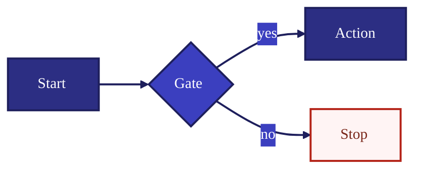
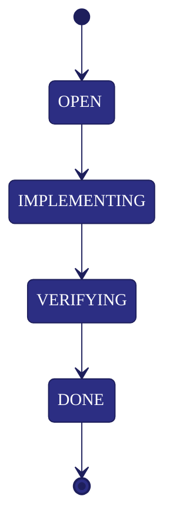

# Mermaid Preset - Indigo

This preset is designed for good readability on GitHub and local Mermaid renderers.

## Color Tokens

- Primary indigo: `#2C2E83`
- Dark indigo: `#1E1F5C`
- Bright indigo: `#3B3FBF`
- Text on indigo: `#FFFFFF`
- Soft background: `#F6F7FF`

Note: Mermaid does not support true gradient fills for standard nodes on all renderers.
Use dark/bright indigo classes side by side for a visual gradient effect.

## Flowchart Preset (Copy/Paste)

## State Diagram Preset (Copy/Paste)

## Recommended Class Mapping

For workflow diagrams:
- Rule/policy nodes -> `indigoDark`
- Gates/decisions -> `indigoBright`
- State artifacts/files -> `panel`
- Blocking/risk nodes -> `warn`

For "fake gradient" look:
- Alternate nearby blocks between `indigoDark` and `indigoBright`.
