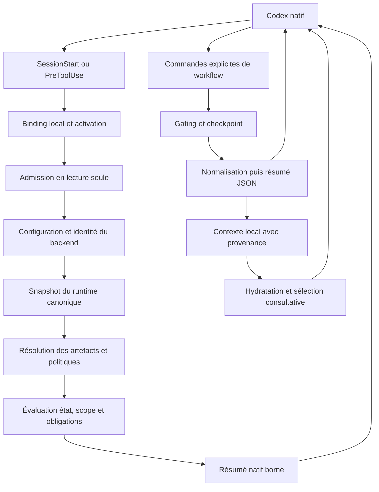

# Frictions AID’N : analyse d’architecture et programme de correction

Analyse non normative des deux smokes du 2 octobre 2026. Elle complète le [rapport initial](../2026-10-02-smoke-aidn-gfd/report.md) et ses [mesures figées](../2026-10-02-smoke-aidn-gfd/results.json). Les constats du premier benchmark sont conservés ; les produits ne sont pas réparés rétrospectivement. Ce document distingue mesure, reproduction isolée, risque issu du code et piste d’optimisation.

## Conclusion de l’analyse

Le délai supplémentaire de 16 min 14 s ne peut pas être expliqué par les seules 7,303 secondes cumulées des hooks. Le nombre de décisions, les étapes de métadonnées, les sorties volumineuses et les explications contradictoires constituent des pistes plus fortes. Le cache d’entrée modèle atteint déjà 96,78 % avec AID’N : augmenter ce taux ne corrigerait pas le volume de contexte ni les erreurs de workflow.

Trois causes d’exactitude sont reproduites : perte de motifs et de diagnostics lors de la normalisation, invalidation insuffisante du cache de configuration, et préférences de sources incohérentes pour certains appels génériques avec PostgreSQL canonique. Un parseur d’objectif lit aussi le séparateur du template comme un objectif. Ces constats justifient des corrections ciblées avant une nouvelle comparaison depuis zéro. Ils ne démontrent pas que tout le délai est causé par ces défauts.

## Méthode et périmètre

Les deux traces natives complètes sont analysées, avec les sorties des commandes terminées, notifications de hooks, revues automatiques et snapshots de tokens. L’inventaire des motifs inclut également les réponses AIDN affichées et 24 fichiers raw AIDN retenus localement. Ces derniers sont une preuve secondaire ; ils ne comptent pas comme des commandes supplémentaires. Les octets ne sont jamais convertis en tokens.

La version du package testé est 0.12.0, figée à 89a709b9ccc3a1effb91356c654cb9fc3b5e4650. L’analyse du dépôt part de dev ce5d09445f2ba4a37a876c5496064611d7280229, dont les modifications après le candidat testé concernent le rapport. Les reproductions sont effectuées dans des fixtures Git/activation isolées, sans modifier les deux anciens produits ni leur runtime. Une reproduction avec lecteur canonique injecté n’est pas une qualification PostgreSQL live ou native.

Le PDF et les preuves brutes restent locaux. Le dépôt contient le Markdown et les agrégats neutres nécessaires à la revue.

## Chemins de données et responsabilités

Le runtime PostgreSQL configuré est l’autorité du projet ; les projections Markdown et caches ne le deviennent pas par implication. Une orientation de session, une admission spécifique de patch et la validation des effets du workflow restent des responsabilités distinctes. Un résumé, un ancien PASS ou la présence d’un hook ne peut pas autoriser une nouvelle transition.

Deux caches différents doivent être distingués : le cache d’entrée du fournisseur, mesuré en tokens natifs, et les caches AIDN locaux de configuration, workspace, contexte ou index. Le cache de contexte AIDN ne réutilise volontairement pas certaines observations dual/db-only faute de révision canonique exhaustive. Le réactiver par un TTL contournerait cette limite de fraîcheur.

## Latence réellement observable

| Mesure | Avec AID’N | Sans AID’N | Interprétation |
| --- | ---: | ---: | --- |
| Temps de développement | 2 164,054 s | 1 190,542 s | Écart mural observé, N=1 par bras |
| Commandes natives | 120 | 49 | 71 commandes supplémentaires |
| Durées natives des commandes, cumulées | 67,511 s | 205,974 s | Ne pas les ajouter aux revues ou hooks |
| Hooks natifs | 131 | 0 | Durée cumulée A : 7,303 s |
| Revues automatiques | 63 | 25 | Coûts en tokens séparés indisponibles |
| Durées natives des revues, cumulées | 195,447 s | 82,971 s | Médianes proches de 3 s |
| Union temporelle outils + hooks + revues | 280,534 s | 269,817 s | Intervalles qui se recouvrent comptés une fois |
| Sorties agrégées des commandes | 782 229 octets | 170 104 octets | 4,60 fois le volume |
| Texte des demandes de commandes | 90 267 octets | 13 500 octets | Inclut scripts et préparation des arguments |
| Contexte livré par les hooks | 5 671 octets | 0 | Faible comparé aux lectures explicites |
| Snapshots natifs de tokens | 86 | 45 | Pas des identifiants de requêtes fournisseur |
| Entrée médiane par snapshot | 86 802,5 tokens | 38 802 tokens | Indicateur descriptif de contexte traité |

L’écart des unions visibles n’est que de 10,718 secondes. Le reste mêle génération, raisonnement, file d’attente, transport et travail non instrumenté ; ce n’est pas du temps modèle pur mesuré. Le baseline comprend notamment un test asynchrone raté de 164,844 secondes. Les durées cumulées, durées de vie d’items et unions murales répondent donc à des questions différentes.

Le premier delta de texte de la phase initiale arrive après environ 3,36 s avec AID’N et 3,28 s sans. Il s’agit d’un texte visible de commentary, pas du premier token du fournisseur ni du premier résultat métier utile. Les clocks historiques sont des horloges murales à réception ; la latence SQL, les connexions, hits internes et étapes runtime n’étaient pas instrumentés.

## Inventaire des raisons nulles et réponses incohérentes

L’[inventaire détaillé par famille et chemin JSON](reason-inventory.md) ne s’arrête pas au premier champ rencontré. Les absences sont comptées dans une même famille de réponses, sans supposer une obligation universelle d’avoir une raison. Les duplications payload/normalized/summary et les readbacks ne sont pas des décisions indépendantes.

| Cas | Constat | Qualification |
| --- | --- | --- |
| Revues natives commencées | rationale null : 63 avec AID’N, 25 sans | État initial légitime ; les 88 revues terminées ont un motif |
| Démarrage MCP natif | failureReason null : 4 par bras | États starting/ready, aucun échec observé |
| Hooks natifs terminés | statusMessage null sur les 131 hooks AID’N | Champ du protocole natif ; les raisons AIDN restent dans les entrées de contexte, y compris le refus |
| Résumé AIDN de drift-check | summary.reason_code null malgré L2_SIGNAL_TRIGGERED dans la réponse | Défaut de projection confirmé |
| Codes de niveau 1 | reason_codes vide malgré des motifs présents dans payload.levels.level1 | Défaut de normalisation confirmé |
| État des réparations | Diagnostic normalisé absent, résumé affirmant clean depuis 0/false par défaut | Incohérence de preuve ; absence d’observation ne prouve pas clean |
| Motifs de succès, skip ou fallback | Certains champs null alors qu’aucune erreur/exception n’est active | À conserver si le producteur ne donne aucun code ; ne pas inventer une explication |
| artifact.classification_reason | Null dans la lecture d’un artefact hérité | À distinguer d’une nouvelle classification manquée ; reproduction dédiée nécessaire avant correction |

Le premier lot conserve les codes existants dans le résumé, avec priorité au véritable HOOK_COMMAND_FAILED. La normalisation sélectionne les niveaux d’un seul gate parmi les enveloppes observées, récupère les raisons et preuves présentes, puis conserve les diagnostics inconnus à null. Elle ne mélange pas des niveaux de deux exécutions et ne transforme pas un compteur de compatibilité par défaut en observation de succès.

## Workflow : objectif, phase, scope et handoff

Le parseur extractObjective franchit la limite de la section SESSION OBJECTIVE et interprète la ligne horizontale du template comme une puce. Sur la session initiale réelle, il renvoie une longue suite de tirets. Une phrase simple sous le titre ne suffit pas à la corriger ; l’agent ajoute finalement une clé explicite session_objective. Ce défaut peut produire objective_delta et masquer uncertain_intent. Correction attendue : section bornée, exclusion des séparateurs/placeholders, phrase ou puce valide, priorité de la clé explicite préservée.

Le refus PHASE_EXCLUDES_IMPLEMENTATION/TASK_SCOPE_INVALID contient des causes valides : phase OPEN et task scope mal formé. Le template expose tasks=[] sans exemple suffisamment explicite de la clé task ; l’agent invente text puis répare. La solution doit guider les transitions et le format accepté, pas autoriser une écriture hors phase ou scope.

Le handoff est d’abord refusé sur la branche du cycle clos puis admis après fast-forward vers la branche de session. MAPPING_MISSING n’établit pas à lui seul un bug : la frontière entre clôture, intégration et reprise doit être explicitée et testée. La correction du chemin normal doit conserver les refus pour ownership, scope et preuves incomplets.

## Accès aux données et cohérence des sources

Une reproduction exécute le vrai core et l’activation, avec un lecteur canonique injecté. En dual PostgreSQL, projection locale THINKING et snapshot canonique EXPLORING : context-reload/start-session génériques annoncent le mode local et la source file, tandis que cycle-create et le patch spécifique lisent PostgreSQL. Avec snapshot indisponible, start-session et cycle-create génériques peuvent encore annoncer admitted_with_warnings depuis les fichiers. Le patch spécifique reste refusé : cette reproduction ne démontre pas une écriture native autorisée hors canonique.

Les six admissions génériques actives des traces annoncent effectivement le backend PostgreSQL et des sources de current/runtime state file. Elles corroborent le mélange de couches, sans prouver à elles seules une divergence de contenu. Les résolveurs locaux et partagés n’ont pas tous les mêmes règles de préférence/repli.

Correction attendue : dériver l’obligation canonique du backend configuré, distinguer préférence et obligation, ne pas déclarer une observation canonique depuis une projection en cas d’absence ou outage. Préserver les politiques SQLite dual existantes, la non-mutation des appels génériques, et l’évaluation complète du patch spécifique. Tester projections contradictoires, manque d’artefact, outage, ambiguïté de heads, scopes durable/legacy et conservation des fichiers/rows.

Le lecteur complet PostgreSQL demande jusqu’à 17 SELECT successifs de tables pour un scope avec payload et heads, charge tous les blobs et n’ouvre pas de transaction explicite de lecture autour de ce groupe. C’est un risque de juxtaposer des états committed différents, identifié dans le code et non observé pendant le smoke. La voie get/list ciblée existante utilise déjà REPEATABLE READ READ ONLY. Réutiliser une observation cohérente à l’intérieur d’un appel et des lectures ciblées est préférable à cacher un ancien verdict entre deux actions.

## Invalidation du cache AIDN

Le cache process-local de configuration compare mtime et taille. Deux reproductions isolées montrent une référence de connexion périmée : remplacement atomique avec nouvelle inode mais mêmes taille/mtime, et réécriture en place avec même inode/taille/mtime mais ctime différente. Les writers AIDN invalident déjà explicitement le cache ; les modifications externes restent concernées. Aucune occurrence de ce défaut n’est prouvée dans les smokes.

Correction attendue : signature physique plus robuste, conservation du cloning et de l’invalidation explicite, diagnostic des lectures instables. Vérifier création/suppression/recréation, remplacement atomique, écriture en place, contextes distincts et absence de routage vers une ancienne référence. Aucun TTL arbitraire ni fallback SQLite ne corrige cette exactitude.

## Verbosité et remèdes de latence

Six admissions actives affichent environ 19,7 Ko chacune ; les deux autres sorties d’admission sont des refus d’activation plus petits. La seule sérialisation compacte des huit réponses complètes passe de 121 313 à 96 826 octets, soit environ 20,2 % de moins, sans supprimer un champ. Les politiques statiques, workspace et diagnostics de backend occupent une part importante des réponses actives. Ce calcul d’octets ne promet pas un gain équivalent en tokens ou secondes.

Une hydratation n’apparaît qu’en fin de reprise, avec sortie capturée puis résumée. Elle n’est donc pas la principale source de volume directement observée. Les lectures de session dupliquent source Markdown et représentation structurée ; cela ne justifie pas d’effacer le stockage canonique ou de tronquer les procédures normatives.

Les remèdes prioritaires sont : sorties lossless compactes, résumés explicites avec expansion des données omises, diagnostic complet au premier refus, exemples de métadonnées acceptés, et partage de lectures fraîches dans un appel. Réduire les décisions répétées peut réduire les revues associées ; les contrôles natifs, sandbox, obligations et conditions de refus restent requis. Un daemon/pool n’est pas une solution automatique : il ajoute un transport et une qualification que les hooks historiques n’utilisent pas.

## Lots et validation

| Lot | Cible | Preuve attendue |
| --- | --- | --- |
| 1 | Motifs et diagnostics cohérents | Régressions warning/refus/panne/absence, compact/verbose, vraie activation et context-store |
| 2 | Objectif et indications de workflow | Template réel, limites de section, placeholders, format task, transitions et refus conservés |
| 3 | Cache de configuration et sources canoniques | Reproductions ciblées, modes/backends, outage, projections contradictoires, aucune mutation implicite |
| 4 | Volume et chemin de lecture | Contrat explicite ou sérialisation lossless, expansions complètes, snapshot cohérent, données identiques |
| 5 | Deux nouveaux smokes et rapport | Starters/runtimes neufs, modèle medium, package final figé, mêmes briefs/oracle/budgets |

Chaque lot est validé et livré par commits atomiques et PR. Le suivant commence après la fusion du précédent. La route governance et les gates exactes sont recalculées sur le diff commité. Les assertions ne sont pas affaiblies pour rendre une suite verte. Une fixture sans Git/activation doit être réparée pour exercer le workflow réel, en conservant sa preuve d’échec préalable.

Le premier lot restaure l’intention des diagnostics existants et n’introduit pas de nouveau contrat public ou décision d’architecture. Une modification future de la sémantique de source ou de réutilisation devra être alignée avec les ADR et contrats ; une simple sérialisation lossless ne requiert pas un nouvel ADR par implication.

## Instrumentation du prochain benchmark

Ajouter des sidecars corrélés aux événements bruts par ordinal et SHA-256, avec horloges murale et monotone à réception, marqueurs de phase et fixture hors chrono, et temps write/flush/ack des RPC. Calculer les unions depuis la clock monotone ; conserver les durées natives séparément. Une première réponse visible doit rester distincte du TTFT fournisseur et du premier résultat utile.

Les métriques SQL/cache/runtime devront venir d’une instrumentation effective avant toute attribution ; à défaut elles restent UNAVAILABLE. Le coût des modèles de revue automatique reste séparément indisponible tant qu’aucun compteur natif exhaustif ne l’expose. Conserver les règles de totaux cumulés par thread, cache/raisonnement comme sous-ensembles, et budgets 20/12/8 minutes par projet.

Après fusion des corrections, les deux projets repartent de zéro avec GPT-6.1-Sol medium et PostgreSQL pour AID’N. Le contrôle NUL complémentaire reste identifié hors grille figée. L’ancien résultat et le nouveau sont comparés sans donner aux développeurs le code de l’autre bras ou les réponses de l’oracle. La confiance native du nouveau projet et de ses hooks reste une qualification distincte ; aucun ancien trust store n’est copié.

Les rapports futurs restent complets en Markdown dans le dépôt, avec tableaux, graphiques, qualité, tokens, friction, conclusion et limites d’attribution. Les PDF restent locaux.
