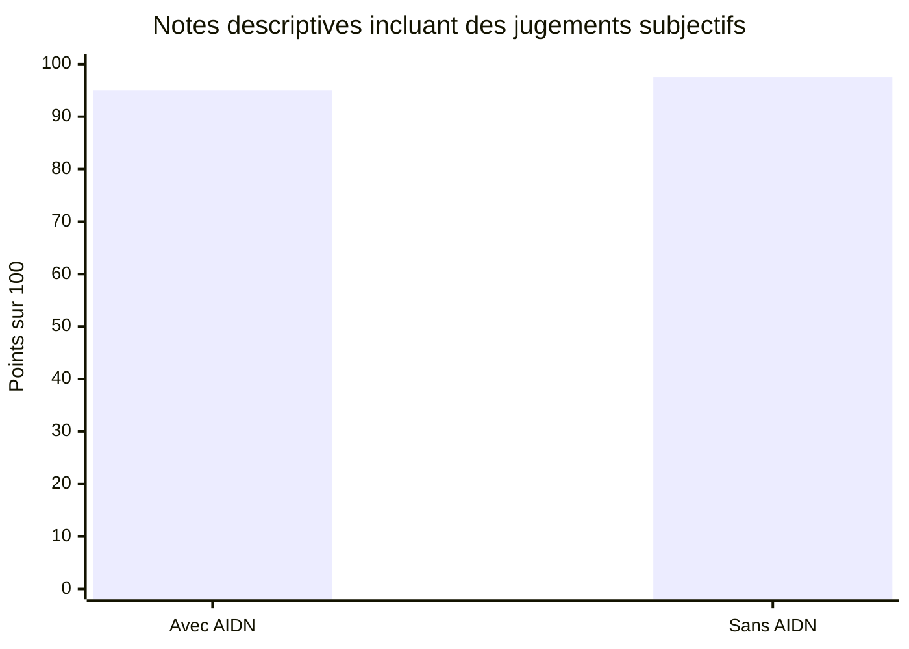
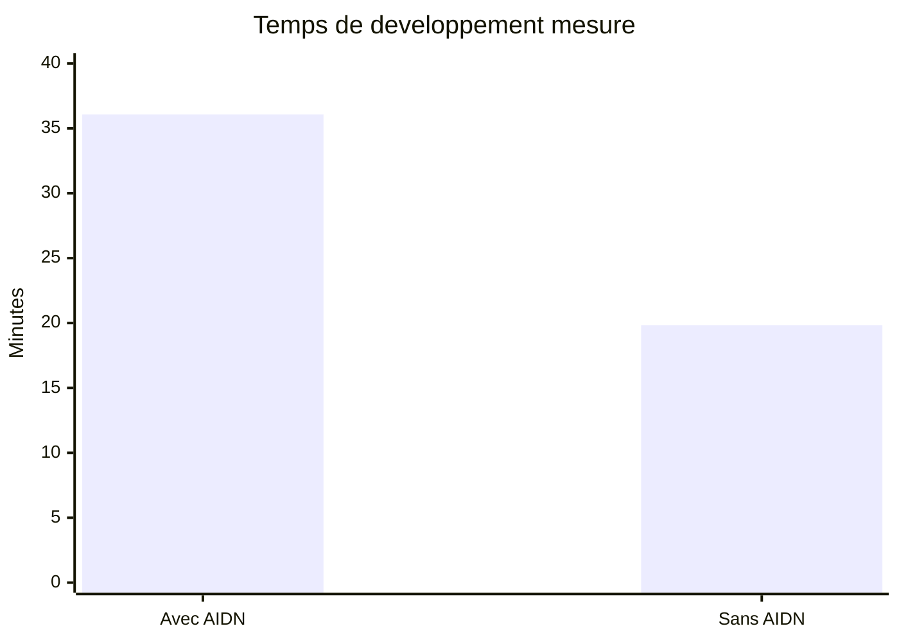
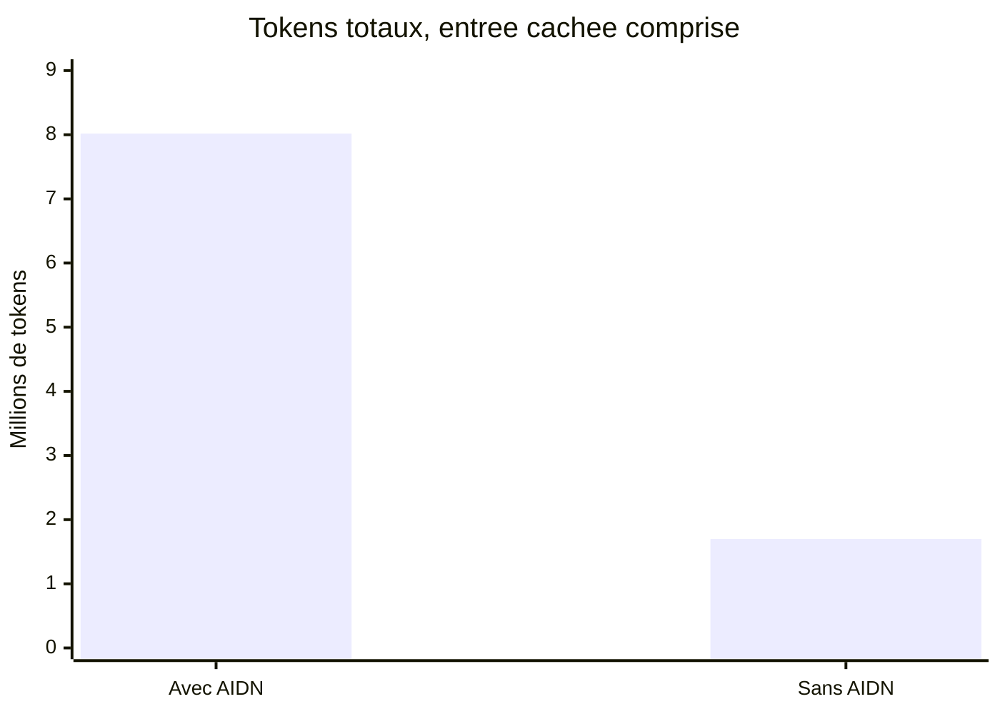
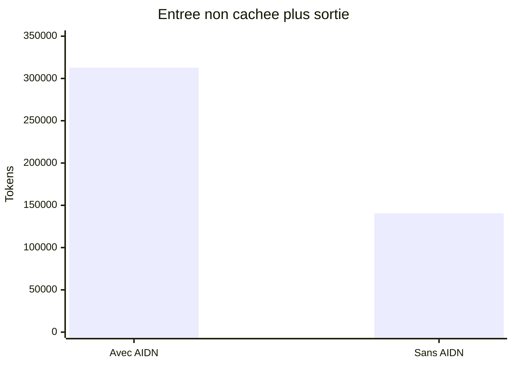

# AID’N et GFD — comparaison sur deux smokes

Rapport des essais du 2 octobre 2026. Document expérimental non normatif : il ne modifie aucune politique AIDN et ne qualifie aucune release. Le PDF et l’archive des projets restent locaux, hors dépôt. Les [résultats mesurés et empreintes des preuves](results.json) constituent la source des valeurs ci-dessous.

## Conclusion

Sur cette paire exploratoire, aucun gain de qualité du code avec AID’N n’est démontré. Les deux produits passent les 21 critères préselectionnés. Le contrôle complémentaire du titre contenant NUL échoue uniquement avec AID’N; le bras sans AID’N a découvert et corrigé ce défaut dans son budget. AID’N apporte une gouvernance et une traçabilité observables, au prix de 1.82 fois le temps et 4.72 fois les tokens natifs de développement. Cela ne préjuge pas de sa valeur sur un projet plus vaste ou une collaboration longue.

L’entrée non cachée plus la sortie représente 2,23 fois le volume du bras sans AID’N. Le facteur 4,72 sur les tokens totaux inclut les entrées servies depuis le cache ; aucun de ces facteurs n’est une facture. Les petites différences de notes qualitatives ne constituent pas une preuve statistique.

## Question, sujet et protocole

Sur le même sujet et avec GPT-6.1 medium, AID’N améliore-t-il le comportement et la qualité du code, et à quel coût de temps et de tokens ? Les deux bras conservés ne permettent pas d’isoler GFD du reste d’AID’N.

Le sujet est une nouvelle API HTTP JSON de réservation de salles : validation, dates explicites, conflits temporels, idempotence, requêtes concurrentes, persistance et migrations. Une évolution ajoute l’annulation sans perdre l’historique. La dernière phase reprend le dépôt dans une nouvelle conversation. Aucun code de solution n’est fourni.

| Condition | Avec AID’N, exécuté en premier | Sans AID’N, exécuté ensuite |
| --- | --- | --- |
| Modèle natif | gpt-6.1-sol, effort medium | Identique |
| Workflow | AID’N 0.12.0 du dernier dev observé, package figé | Sans assets ni runtime AID’N |
| Stockage AID’N | PostgreSQL 17.6 canonique, aucun fallback SQLite | Sans objet |
| Application | Node 22.13.0, JavaScript ESM, SQLite | Même sujet, starter et SQLite |
| Évaluation finale | Oracle externe commun et grille figée | Identique |
| Budget disponible | 40 min, terminaison dure à 45 min | Identique |

| Phase | Travail demandé | Plafond disponible |
| --- | --- | --- |
| 1 — réalisation | API initiale, tests, documentation et limites | 20 min |
| 2 — évolution | Annulation idempotente, historique et migration sans perte | 12 min |
| 3 — reprise | Nouvelle conversation, relecture, validation finale et handoff | 8 min |

Les phases 1 et 2 partagent un thread par bras ; la phase 3 utilise un nouveau thread. Les conversations restent indépendantes entre les bras. Les agents ne reçoivent ni le produit de l’autre bras, ni les résultats finaux de l’évaluateur. Aucun agent délégué n’est utilisé. Chaque phase s’arrête lorsque le travail est terminé ; le bras sans AID’N, terminé en moins de 30 minutes, n’a pas été artificiellement prolongé. Aucun produit n’a été réparé par l’expérimentateur après son budget.

## Identité et qualification des essais

| Élément | État vérifié |
| --- | --- |
| Dernier dev observé avant le bras A | 89a709b9ccc3a1effb91356c654cb9fc3b5e4650 |
| Arbre source figé | fc5800ba46c82cd4a19aff3c157a55d1985135c4 |
| Package installé | 0.12.0 ; 968 fichiers suivis comparés au commit : PASS |
| SHA-256 du tarball | 5cec528f1a7fe4afc5a10decd1be94750165c84f738fc23a2fab1692563d9236 |
| PostgreSQL AID’N | 17.6 ; schéma 3, 20 tables ; admission canonique : PASS |
| Instrumentation préalable | 6 tests de compteurs et contrôle négatif de l’évaluateur : PASS |
| Accès natif | Connexion native réussie; deux bras et leurs nouveaux threads terminés |
| Modèle | gpt-6.1-sol / medium confirmé par thread/start; aucun reroutage observé |
| Revue des hooks | Revue humaine explicite, contrôles TUI officiels, hooks/list : 2 enabled/trusted; fichiers inchangés |
| HEAD du produit avec AID’N | 56282443205167d807aecfea7060e2b9a3c1dee4 |
| HEAD du produit sans AID’N | aad8c2ca19d2ff0735a4d873b0f7c19ce12fc6c7 |

L’authentification native a été rétablie par le parcours officiel de connexion. Les contrôles de confiance du projet et des deux hooks ont été approuvés par l’humain puis appliqués dans le TUI natif ; aucun contournement ni injection de confiance. Le sandbox natif workspace-write a été conservé. Les échecs de préparation HTTP 403/401 restent dans les preuves et ne sont pas des notes de qualité du produit.

## Grille de qualité et résultats observés

L’oracle externe exerce 21 critères et ne se contente pas des tests écrits par l’agent. Une corruption, double réservation, perte de données ou autre défaut important reste visible séparément ; un bon score documentaire ne l’efface pas. Le bras sans AID’N n’est pas pénalisé pour ne pas utiliser ses outils ou son vocabulaire.

| Catégorie | Maximum figé | Avec AID’N | Sans AID’N |
| --- | --- | --- | --- |
| Comportement | 60 | 60 | 60 |
| Maintenabilité | 20 | 17 | 17,50 |
| Tests utiles | 10 | 9 | 10 |
| Exploitation | 10 | 9 | 10 |
| Total descriptif | 100 | 95 | 97,50 |
| Critères externes réussis | 21 | 21 / 21 | 21 / 21 |
| Tests propres finaux sur Node 22.13.0 | Sans score fondé uniquement sur le nombre | 8 réussis | 15 réussis |

Maintenabilité : quatre critères sur 5 — séparation HTTP/métier/persistance, erreurs explicites, lisibilité, duplication. Exploitation : quatre critères sur 2,5 — reproduction, migrations/rollback, configuration/arrêt, limites/handoff. Les 10 points de tests utiles concernent les cas positifs, erreurs, concurrence et persistance réellement exercés. Les huit tests AID’N regroupent plusieurs assertions significatives ; leur nombre ne suffit pas à conclure.

Revue sur exports X/Y sans assets AID’N, par le même observateur ayant piloté les essais : anonymisation documentaire, pas double aveugle indépendant. Les notes 95/100 et 97,5/100 incluent 40 points de jugement qualitatif; leur petit écart ne constitue pas une preuve statistique. Le défaut de titre est plus informatif que ces décimales. Aucun double booking, perte de réservation ou échec de migration n’a été observé par l’oracle commun.

### Maintenabilité, 17/20 et 17,5/20

Les deux produits séparent HTTP et persistance, utilisent des paramètres SQL, des transactions et des triggers. AID’N : app.js regroupe validation et routage; store.js contient migration et stockage, et fournit HttpError au HTTP. Sans : validation.mjs séparé, database.mjs plus long, boilerplate transactionnel répété. Lire les mappings et justifications détaillés dans quality-review.json. Le bras sans dispose d’un retry borné pour la création WAL et d’une conversion explicite des octets du titre; ce ne sont pas des points gagnés pour du vocabulaire de gouvernance.

### Tests utiles, 9/10 et 10/10

Huit tests AID’N et quinze sans passent dans la vérification indépendante finale Node 22.13.0. Les deux suites utilisent des bases réelles, injections d’échec, migrations, concurrence entre processus et redémarrage. Le bras sans ajoute arrêts forcés, contention de locks, annulation rollback et régression NUL. Les nombres ne sont pas le barème : c’est la couverture utile et réellement exécutée qui est jugée.

### Exploitation, 9/10 et 10/10

Les deux README documentent configuration, migration, sauvegarde après arrêt des writers, rollback par restauration et limitations. Sans : arrêt borné à cinq secondes et handoff sur Node 22. AID’N : arrêt gracieux sans borne forcée; la reprise a validé sur Node 24 en le déclarant honnêtement. Le contrôle final commun sur Node 22 réussit. Pas de downgrade ni certification de production dans aucun bras.

### Défaut reproductible hors grille : conservation du texte

Même requête dans les deux produits sur Node 22.13.0 : title = Before<caractère NUL>After. Avec AID’N, création et rejeu conservent le titre, mais GET et DELETE retournent Before. Sans AID’N, les quatre réponses conservent le titre intégral. Cause visible : store.js:65–81 lit directement le TEXT du driver Node 22; database.mjs:125–129 dans le bras sans lit les octets et les décode. Aucun produit n’a été réparé après budget. Le cas a été ajouté après découverte par le bras sans et appliqué aux deux : résultat complémentaire, pas modification rétroactive des 60 points figés.

## Temps mesuré et friction

| Phase | Avec AID’N | Sans AID’N | Écart observé |
| --- | --- | --- | --- |
| Réalisation | 17,67 min | 8,48 min | 9,19 min |
| Évolution | 11,27 min | 6,23 min | 5,05 min |
| Reprise | 7,13 min | 5,14 min | 1,99 min |
| Total | 36 min 04 s | 19 min 51 s | +16 min 14 s, soit +81,8 % |

AID’N : 36.07 min; sans AID’N : 19.84 min. Même plafond de 40 min, phases de 20/12/8 min et arrêt dur à 45 min. Le bras sans AID’N a terminé en moins de 30 min; aucune attente artificielle n’a été ajoutée. AID’N : 120 commandes natives, 131 hooks (7,30 s de durée cumulée), dont un refus effectif d’édition pour état/scope invalides. Sans AID’N : 49 commandes, aucun hook. Chaque bras a 9 commandes affichées comme failed; ce nombre mêle erreurs et refus et ne mesure pas seul des défauts. Les métadonnées, reanchors, branches, audits et clôtures expliquent une friction observée, sans attribuer tout le délai à GFD. Des contraintes du sandbox et le shell démarrant en Node 24 influencent également le coût.

| Mesure de friction | Avec AID’N | Sans AID’N |
| --- | --- | --- |
| Commandes natives | 120 | 49 |
| Commandes affichées failed | 9 | 9 |
| Hooks natifs | 131 | 0 |
| Durée cumulée des hooks | 7,303 s | 0 s |

Le bras AID’N comporte 71 commandes supplémentaires. Les 7,303 secondes cumulées des hooks ne suffisent pas à expliquer le délai supplémentaire de 973,512 secondes. La friction visible inclut les métadonnées, admissions, reanchors, clôtures et transitions de handoff. Ce constat ne mesure pas séparément le coût causal de chaque mécanisme, et le temps complet d’une commande ou d’un tour mêlant code et gouvernance ne peut pas être attribué intégralement à AID’N ou à GFD.

### Estimation économique du délai

Valoriser les 16 min 14 s de délai supplémentaire à 60 €/h donne environ 16,23 €, et à 100 €/h environ 27,04 €. Ce sont des scénarios de valorisation du délai, pas des coûts humains facturés ou mesurés. Un agent travaillant seul ne mobilise pas automatiquement une personne pendant tout ce temps.

## Tokens : méthode et résultats

Périmètre : compteurs natifs des conversations du développeur GPT-6.1-Sol medium. Les modèles de revue automatique ne sont pas isolés par cette instrumentation ; leurs compteurs séparés restent UNAVAILABLE. La préparation et la revue par l’expérimentateur sont également hors de ces totaux. Aucun coût global de première utilisation ne peut en être déduit.

| Mesure | Calcul ou règle |
| --- | --- |
| Total | Entrée + sortie ; aucun ajout séparé du cache ou du raisonnement |
| Entrée neuve | Entrée moins entrée servie depuis le cache |
| Raisonnement | Sous-ensemble de la sortie, jamais ajouté une seconde fois |
| Taux de cache | Entrée servie depuis le cache / entrée totale |
| Reprises | Dernier total cumulé par thread, puis somme des threads distincts |
| Valeurs absentes | UNAVAILABLE, jamais assimilées à zéro |

Les runs utilisent les notifications JSON-RPC natives thread/tokenUsage/updated.total. Le fichier local native-usage.jsonl normalise leurs snapshots pour le helper de calcul ; il ne s’agit pas d’un export brut des événements CLI turn.completed. Les phases 1 et 2 ne sont pas additionnées comme deux totaux indépendants : seul leur dernier total partagé est retenu, avec celui du nouveau thread de phase 3. L’identité du modèle et l’absence de reroutage sont conservées.

| Mesure | Avec AID’N | Sans AID’N |
| --- | --- | --- |
| Entrée totale | 7 961 138 | 1 663 954 |
| Entrée cachée | 7 704 832 | 1 556 352 |
| Entrée non cachée | 256 306 | 107 602 |
| Sortie totale | 56 457 | 32 920 |
| Dont raisonnement | 6 081 | 4 037 |
| Sortie hors raisonnement | 50 376 | 28 883 |
| Écriture cache, champ séparé | 0 | 0 |
| Total entrée + sortie | 8 017 595 | 1 696 874 |
| Entrée non cachée + sortie | 312 763 | 140 522 |
| Taux de cache de l’entrée | 96,78 % | 93,53 % |
| Tokens totaux / critère validé, dénominateur 21 | 381790,24 | 80803,52 |
| Tokens totaux / point descriptif, dénominateurs 95 et 97,5 | 84395,74 | 17403,84 |

Totals natifs AID’N / sans : 8,017,595 / 1,696,874. Cache entrée : 96.78 % / 93.53 %. Entrée neuve + sortie : 312,763 / 140,522, soit 2.23 fois. Ce dernier volume n’est pas une facture. Le cache et le raisonnement sont des sous-ensembles; jamais ajoutés une deuxième fois. Dernier total du thread partagé phases 1–2 plus total du nouveau thread phase 3. Les snapshots JSON-RPC natifs complets sont conservés; native-usage.jsonl est leur normalisation pour le calcul. Coûts des modèles de revue automatique non isolés; aucune estimation en euros. Ordre fixe A puis B et cache partiellement partagé limitent l’attribution.

### Surcoût observé en tokens

| Compteur | Supplément avec AID’N |
| --- | --- |
| Entrée non cachée | 148 704 |
| Entrée cachée | 6 148 480 |
| Sortie | 23 537 |
| Total entrée + sortie | 6 320 721 |
| Entrée non cachée + sortie | 172 241, soit +122,6 % |

Si des tarifs par million de tokens étaient connus et applicables à la consommation mesurée, le supplément théorique serait : 0,148704 × tarif entrée non cachée + 6,148480 × tarif entrée cachée + 0,023537 × tarif sortie. Aucun tarif GPT-6.1 n’est supposé ici ; cette formule ne représente pas une facture Codex ni un prix d’abonnement.

### Préparation et coût de première utilisation

Préparation et installation AID’N/PostgreSQL hors budgets. Leur durée complète et les tokens de l’expérimentateur n’ont pas été mesurés exhaustivement : coût total de première utilisation UNAVAILABLE. Un préflight natif réussi fournit 12 707 tokens partagés, affichés séparément et non attribués à un bras. Les tentatives échouées sans compteur final restent UNAVAILABLE.

## GFD : périmètre, contribution observée et limites

Le diagnostic distingue adoption déclarée, adoption effective et vérification d’exécution. Une déclaration ne prouve ni conformité ni exécution. La présence des mécanismes AID’N ne vaut pas certification GFD.

| Champ du diagnostic initial et final | Résultat |
| --- | --- |
| package_source.status | effective : adoption partielle du package source |
| client.status | absent : aucune adoption cliente implicite |
| source_inheritance | false |
| write_authorization | false |
| method_verification | pinned_reference_only |
| native_qualification | not_evaluated |
| conformance / execution | not_evaluated |
| Référence méthode | GFD 0.1-draft ; leuzeus/governance-first-development |
| Commit méthode | 0eec798a5270ba6de51f31708b3dbc5b6147d9fb |

Le diagnostic initial et final déclare l’adoption partielle effective du package source, mais l’adoption cliente GFD reste absente, sans héritage automatique. Conformité et certification GFD ne sont pas évaluées. Avec AID’N, session/cycles S001-C001-C002, DoR, matrice d’usage, périmètre gelé, blocage natif d’une édition et artefacts PostgreSQL sont réellement observés. Le handoff a d’abord été bloqué sur la branche du cycle clos, puis a passé après fast-forward vers la branche de session; la reprise a rafraîchi des ancres incohérentes. Cette traçabilité n’a pas évité le défaut NUL. Les hooks d’édition couvrent apply_patch/Edit/Write, pas une validation sémantique universelle de toutes les commandes shell. Avec deux bras, pas d’effet causal GFD isolé, pas de tokens précisément attribuables à GFD. Recommandation : simplifier l’initialisation, rendre explicites les transitions de clôture/handoff et réduire le contexte répété, en conservant les admissions utiles; ne pas généraliser à la gouvernance d’un gros projet.

## Corrections du harnais et limites de l’oracle

Le lanceur initial supposait src/server.mjs alors que le contrat public demande npm start. Corrigé pour les deux produits sans modifier les critères; version précédente et six tests du harnais conservés. La base A de phase 1 a été capturée pendant la phase 1, après implémentation; B à sa clôture. Les hashes du code et données d’origine sont conservés, et les deux migrations passent. Le binaire Node téléchargé par B est vérifié avec le checksum officiel et identique au binaire partagé. L’oracle ne couvre pas exhaustivement l’Unicode, tous les ISO 8601, les pannes d’alimentation ou la charge prolongée. Le cas NUL est post-hoc et marqué comme tel. N=1 par bras, ordre A puis B, même observateur, absence de troisième bras GFD : aucune causalité générale ni significativité statistique.

PASS signifie que le comportement attendu a été observé avec les entrées choisies. Il ne prouve pas tous les cas de dates ISO 8601, Unicode, charges, crashs ou conditions de déploiement. Les cas non exécutés restent distincts des échecs. L’AID’N de reprise a validé sur Node 24 en le déclarant ; les deux évaluations externes finales et les deux suites propres finales ont ensuite été exécutées sur Node 22.13.0.

## Résultats comportementaux, critère par critère

| Critère figé | Avec AID’N | Sans AID’N |
| --- | --- | --- |
| health | PASS | PASS |
| room_creation | PASS | PASS |
| reservation_creation | PASS | PASS |
| reservation_lookup | PASS | PASS |
| unknown_resources | PASS | PASS |
| input_validation | PASS | PASS |
| timestamp_validation | PASS | PASS |
| overlap_rejected | PASS | PASS |
| adjacent_allowed | PASS | PASS |
| rooms_independent | PASS | PASS |
| idempotency_replay | PASS | PASS |
| idempotency_conflict | PASS | PASS |
| concurrent_collisions | PASS | PASS |
| concurrent_idempotency | PASS | PASS |
| restart_persistence | PASS | PASS |
| cancellation_history | PASS | PASS |
| cancel_frees_slot | PASS | PASS |
| cancelled_creation_replay | PASS | PASS |
| http_errors | PASS | PASS |
| sql_input_safety | PASS | PASS |
| phase1_upgrade_preservation | PASS | PASS |

| Contrôle complémentaire hors grille figée | Avec AID’N | Sans AID’N |
| --- | --- | --- |
| Titre Before + NUL + After, création/rejeu/lecture/annulation | FAIL sur lecture et annulation | PASS sur les quatre réponses |

Le contrôle complémentaire a été déclenché par la découverte du bras sans AID’N, puis appliqué identiquement aux deux produits figés. Il n’a pas modifié rétroactivement les 21 critères ou leurs pondérations. Le défaut concerne la conservation du titre ; aucun double booking, perte de réservation ou échec de migration n’a été observé par l’oracle commun.

## Sources et preuves

Les [résultats JSON](results.json) contiennent les identités, scores, compteurs, limites et empreintes SHA-256. Les traces JSON-RPC complètes, snapshots, historiques Git des projets, hashes et readback de confiance des hooks, fixtures de phase 1, évaluations, sorties des tests, exports anonymisés et PDF sont conservés localement. Les fichiers d’authentification, de confiance native, les états runtime privés et dumps de base ne sont pas publiés dans ce dépôt.

Sources officielles Codex, commit figé 3b01b36fa5eb96ba82a776bd3c2fc57f8969181f, version 0.159.0-alpha.3 :

- [Schéma des événements exec](https://github.com/openai/codex/blob/3b01b36fa5eb96ba82a776bd3c2fc57f8969181f/codex-rs/exec/src/exec_events.rs)
- [Processeur des événements JSONL](https://github.com/openai/codex/blob/3b01b36fa5eb96ba82a776bd3c2fc57f8969181f/codex-rs/exec/src/event_processor_with_jsonl_output.rs)
- [Qualification native AIDN, préparation étape 4](../../CODEX_NATIVE_QUALIFICATION.md)
- [Adoption GFD AIDN](../../GFD_ADOPTION.md)

Les notifications app-server utilisées et leur schéma natif sont retenus localement ; la documentation exec explique la règle cumulative, sans assimiler les snapshots normalisés à un format natif CLI différent. La revue X/Y est une anonymisation documentaire : le reviewer avait déjà piloté l’expérience. N=1 par bras, ordre A puis B et cache partiellement partagé empêchent de conclure à une causalité générale ou à une significativité statistique.

Aucune mise à jour d’ADR n’est requise : ce rapport expose des observations et ne change aucune décision d’architecture acceptée.
