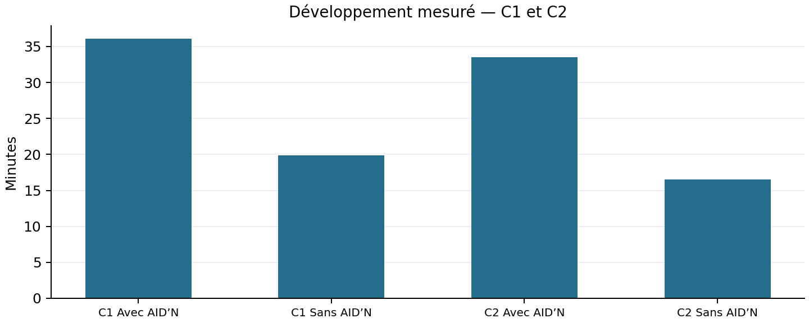
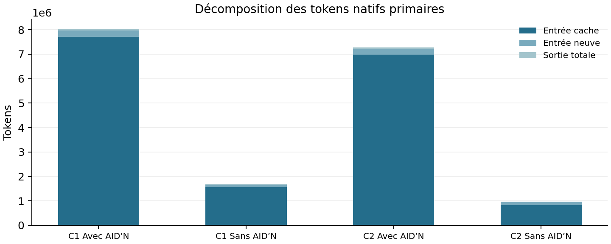
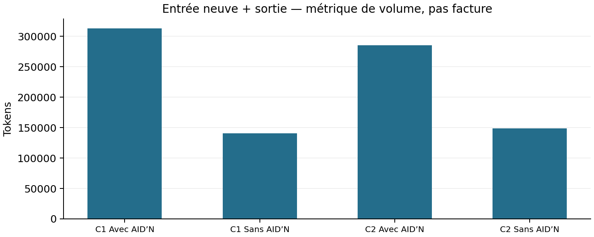
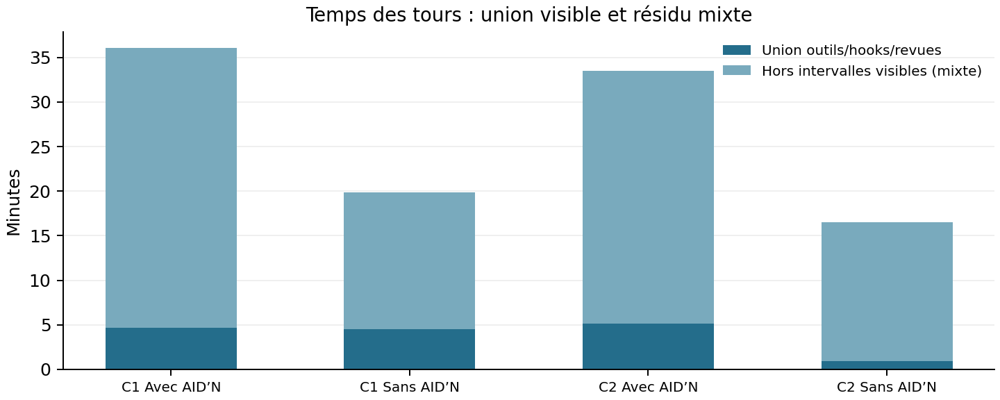

# AID’N et GFD — deux smokes, comparaison avant/après optimisation

Statut : **FINAL**. Rapport exploratoire non normatif ; ne qualifie aucune release. PDF et preuves brutes locaux, Markdown complet destiné à `docs/reports`. C1 désigne la campagne observée du 2 octobre 2026 ; C2 la paire corrigée. La paire originale invalidée est conservée dans une section distincte, hors comparaison principale. Les absences ne sont jamais des zéros.

## Conclusion

Les correctifs améliorent la fidélité des diagnostics et la cohérence des sources, démontrées par reproductions avant/après, mais cette paire ne prouve pas un gain global de qualité ou de temps avec AID’N. C2 : les deux applications passent les 21 critères figés (60/60) ; revue descriptive informée 96/100 chacune, avec avantages différents. Le contrôle complémentaire NUL échoue dans les deux applications : création/rejeu conservent le titre, lecture/annulation le tronquent. AID’N consomme 33 min 31 s contre 16 min 32 s sans AID’N, soit +16 min 59 s (2,03×). Entrée neuve+sortie : 284 877 contre 148 945 tokens (1,91×) ; total incluant entrée cache : 7 272 397 contre 972 369 (7,48×). Ni coût monétaire ni effet causal autonome de GFD ne sont établis. Le différentiel de temps augmente de 45,16 s par rapport à C1 ; la baisse du temps A seul ne suffit donc pas à conclure à une baisse de friction. Les prochains efforts doivent viser les reprises de workflow, les lectures complètes répétées et la projection de handoff, en conservant fraîcheur et refus en panne.

Conclusion historique C1, conservée comme telle : Sur cette paire exploratoire, aucun gain de qualité du code avec AID’N n’est démontré. Les deux produits passent les 21 critères préselectionnés. Le contrôle complémentaire du titre contenant NUL échoue uniquement avec AID’N; le bras sans AID’N a découvert et corrigé ce défaut dans son budget. AID’N apporte une gouvernance et une traçabilité observables, au prix de 1.82 fois le temps et 4.72 fois les tokens natifs de développement. Cela ne préjuge pas de sa valeur sur un projet plus vaste ou une collaboration longue.

## Question, sujet et protocole figé

Même API HTTP JSON de réservation de salles : validation, dates, collisions, concurrence, idempotence, persistance, annulation sans perte, migration et reprise dans une nouvelle conversation. Deux développements neufs, A avec AID’N puis B sans AID’N ; GPT-6.1-Sol medium exact, aucun fallback ni délégation. PostgreSQL sert uniquement le runtime AID’N ; les applications utilisent SQLite.

| Condition | Valeur |
| --- | --- |
| Modèle exact | gpt-6.1-sol / medium |
| Budget par projet | 20 / 12 / 8 min ; plafond 40 min, terminaison dure 45 min |
| Phases/conversations | 1–2 même thread ; 3 nouveau thread |
| Comportement externe | 21 critères, 60 points ; briefs, poids et oracle inchangés |
| Qualité complémentaire | Maintenabilité 20 ; tests utiles 10 ; exploitation 10 |
| Développeur B | Même brief/starter ; sans assets/hook/runtime AID’N |
| Échec | Premier essai conservé ; aucun meilleur retry, aucune réparation post-budget |
| Contrôle NUL | Complémentaire séparé : post-hoc C1, annoncé avant C2 |

Aucune attente artificielle si une phase finit tôt. Les anciens produits, réponses d’oracle et résultats ne sont pas remis aux développeurs. L’isolation de lecture des dossiers voisins n’est pas garantie par le seul sandbox workspace-write ; la revue des traces ne relève pas de consultation du produit opposé ni de l’oracle ; cette limite coopérative ne garantit pas une isolation forcée.

## Identité et qualification

Versions réellement figées pour C2 : Codex CLI `0.159.0-alpha.3`, source Codex `3b01b36fa5eb96ba82a776bd3c2fc57f8969181f` ; Node `22.13.0`, npm `10.9.2` ; PostgreSQL `17.6`, driver client `pg 8.23.1` installé explicitement dans le moteur. Source package issue du dernier `dev` vérifié avant A puis gelée jusqu’à B ; sourceBranch du client `main`, indépendante de cette provenance. Runtime PostgreSQL neuf, system identifier `7692273677615439893`, zéro schéma AIDN/relation utilisateur observé avant installation. Les images/volumes anciens sont conservés. La preuve indépendante complète de bind/prestart est indisponible ; identité neuve, propriété et qualification de base vide sont observées, sans prétendre un reset de l’ancien runtime.

Les développeurs utilisent le client natif : `gpt-6.1-sol`, effort medium réellement confirmé, provider fallback désactivé, agents désactivés, trois phases finies, aucune reroute. La revue du projet exact et des deux hooks SessionStart/PreToolUse a été autorisée humainement puis validée par les contrôles natifs ; readback deux hooks enabled/trusted, aucun pour B. Pas de prompt d’inférence dans la session de confiance. Les comptes d’analyse et la préparation sont hors budgets de développement.

| Élément | Campagne1 observée | Campagne2 |
| --- | --- | --- |
| Commit dev épinglé | 89a709b9ccc3a1effb91356c654cb9fc3b5e4650 | 6a79e0dd983bb8d16769017d2ac9cbb011de2b05 |
| Arbre source | fc5800ba46c82cd4a19aff3c157a55d1985135c4 | 2c50d412d4981edfa98d3268ba1758c2fd502ec6 |
| Tarball SHA256 | 5cec528f1a7fe4afc5a10decd1be94750165c84f738fc23a2fab1692563d9236 | 465f33d7f208e9fe050b0a7d92047f0d05e52210dc0fa523a3503040b7d40407 |
| Livraison avant A | Package historique figé | PASS |
| Node/npm | Node22 cible ; Node24 utilisé phase3A | Node22.13/npm10.9.2 commun, non-login qualifié |
| Fixture migration | A pendant phase1, B aprèsphase1 | Deux bras aprèsphase1, hors chrono |
| Revue humaine nouveau cwd | Contrôles natifs humains du précédent cwd | APPROVED |
| Readback des nouveaux hooks | Deux hooks enabled/trusted historiques | CONFIRMED |

| Bras C2 corrigé | Statut des tours natifs | Modèle/effort natifs | État de l’application | Fin définitive |
| --- | --- | --- | --- | --- |
| Avec AID’N | COMPLETED | CONFIRMED | EXTERNALLY_EVALUATED | 1 791 000 992,81 |
| Sans AID’N | COMPLETED | CONFIRMED | EXTERNALLY_EVALUATED | 1 791 002 034,03 |

COMPLETED qualifie la terminaison des tours natifs, jamais la livraison d’une application. L’évaluation externe, les erreurs de démarrage et la revue qualitative restent distinctes ; une suite vide ne prouve aucun comportement réussi.

| Trace native existante | Dernier état MCP observé |
| --- | --- |
| old_aidn | codex_apps:ready, codex_apps:ready |
| old_baseline | codex_apps:ready, codex_apps:ready |
| new_failed_catalog_preflight | UNAVAILABLE |
| new_failed_exact_preflight | codex_apps:failed |
| new_success_exact_preflight | codex_apps:ready |
| new_success_node_preflight | codex_apps:ready |

| Bras C2 réel | Notifications MCP observées |
| --- | --- |
| Avec AID’N | codex_apps:starting, codex_apps:ready, codex_apps:starting, codex_apps:ready |
| Sans AID’N | codex_apps:starting, codex_apps:ready, codex_apps:starting, codex_apps:ready |

Les anciens smokes et les préflights réussis reauthenticated READY/Node observent codex_apps starting→ready. Un préflight exact antérieur échoue avec HTTP451 no_biscuit_no_service, conservé comme friction temporelle distincte. Aucun changement durable de disponibilité entre ancien et nouveau qualifié n’est établi ; ready ne prouve ni identité du catalogue/outils, ni compte, ni futur état des threads. A/B partagent leur config native ; les événements réels des deux threads par bras ont été contrôlés, starting→ready observé. Quatre notifications par ancien bras correspondent à deux pairs starting/ready, pas à quatre outils.

## Qualité : oracle gelé et revue

Les poids relatifs des21 critères totalisent70 ; l’oracle calcule la note fonctionnelle par `60 × somme des poids PASS / 70`. Les poids et cette normalisation sont identiques dans C1 et C2. Tous les critères passent, soit70/70 puis60/60 ; aucun poids n’a été changé pour le rapport.

| Mesure | C1 Avec AID’N | C1 Sans AID’N | C2 Avec AID’N | C2 Sans AID’N |
| --- | --- | --- | --- | --- |
| Comportement /60 | 60 | 60 | 60 | 60 |
| Maintenabilité /20 | 17 | 17,50 | 17,50 | 17 |
| Tests utiles /10 | 9 | 10 | 9 | 9,50 |
| Exploitation /10 | 9 | 10 | 9,50 | 9,50 |
| Total descriptif /100 | 95 | 97,50 | 96,00 | 96,00 |
| Critères externes réussis /21 | 21 | 21 | 21 | 21 |

| Bras C2 | Évaluateur externe | Erreur de démarrage distincte |
| --- | --- | --- |
| Avec AID’N | PASS | Aucune observée |
| Sans AID’N | PASS | Aucune observée |

| Bras C2 | Motifs de non-évaluation qualitative |
| --- | --- |
| Avec AID’N | Aucun renseigné |
| Sans AID’N | Aucun renseigné |

| Critère externe gelé | Poids relatif /70 | C1 Avec AID’N | C1 Sans AID’N | C2 Avec AID’N | C2 Sans AID’N |
| --- | --- | --- | --- | --- | --- |
| health | 1 | PASS | PASS | PASS | PASS |
| room_creation | 2 | PASS | PASS | PASS | PASS |
| reservation_creation | 4 | PASS | PASS | PASS | PASS |
| reservation_lookup | 2 | PASS | PASS | PASS | PASS |
| unknown_resources | 2 | PASS | PASS | PASS | PASS |
| input_validation | 4 | PASS | PASS | PASS | PASS |
| timestamp_validation | 4 | PASS | PASS | PASS | PASS |
| overlap_rejected | 5 | PASS | PASS | PASS | PASS |
| adjacent_allowed | 3 | PASS | PASS | PASS | PASS |
| rooms_independent | 2 | PASS | PASS | PASS | PASS |
| idempotency_replay | 4 | PASS | PASS | PASS | PASS |
| idempotency_conflict | 3 | PASS | PASS | PASS | PASS |
| concurrent_collisions | 5 | PASS | PASS | PASS | PASS |
| concurrent_idempotency | 4 | PASS | PASS | PASS | PASS |
| restart_persistence | 4 | PASS | PASS | PASS | PASS |
| cancellation_history | 4 | PASS | PASS | PASS | PASS |
| cancel_frees_slot | 3 | PASS | PASS | PASS | PASS |
| cancelled_creation_replay | 4 | PASS | PASS | PASS | PASS |
| http_errors | 3 | PASS | PASS | PASS | PASS |
| sql_input_safety | 3 | PASS | PASS | PASS | PASS |
| phase1_upgrade_preservation | 4 | PASS | PASS | PASS | PASS |

Les 40 points qualitatifs sont des jugements documentés, pas des mesures objectives ni une preuve statistique. Quatre critères de maintenabilité sur5 et quatre d’exploitation sur2,5 restent figés. Nombre de tests/commits/documentation ne suffit pas à conclure ; B ne perd pas de points pour l’absence de vocabulaire AID’N/GFD. Une corruption, double réservation ou perte de données reste visible séparément.

Oracle externe commun après fermeture des deux développeurs : 21/21 PASS, 60/60 par bras. Suites natives reprises par l’expérimentateur sous le même Node22.13 : A 11/11, B 12/12 PASS ; produits, fichiers et Git identiques avant/après évaluation. Barème complémentaire figé : maintenabilité /20, tests utiles /10, exploitation /10. X=A : 17,5 / 9 / 9,5 ; Y=B : 17 / 9,5 / 9,5. Total descriptif 96/100 chaque bras. Auteur : root informé, lecture complète et confrontation à un avis statique indépendant sans scores ; anonymisation des exports ne rend pas cette revue double aveugle. Les écarts de demi-point expriment ce jugement, aucune précision statistique ni causalité. Le handoff AID’N final exclu des exports a été relu séparément avant de noter l’exploitation.

Auteur de revue C2 : Root Codex, observateur informé ; revue statique complète après BOTH_FINAL et évaluations externes ; avis indépendant statique sans scores confronté aux fichiers.. Exports anonymisés ≠ double aveugle indépendant ; un observateur qui connaît C1 et l’ordre A/B peut rester informé.

### Maintenabilité — barème 4×5

A : séparation 4,5, erreurs 4, lisibilité 4,5, répétitions 4,5. HTTP, validation et store sont séparés ; requêtes préparées réutilisées. La dépendance du store à HttpError et deux blocs transactionnels répétés restent. B : 4 / 4 / 4,5 / 4,5. Transaction centralisée et logger injectable, mais handler mêlant validation/métier/SQL. Dans les deux, un rollback échouant peut masquer l’erreur primaire ; risque statique non reproduit. Les copies SELECT* de B dépendent de l’ordre de colonnes, sans échec observé. Aucun choix de structure n’est transformé en gain de latence.

### Tests utiles — comportement et pannes /10

A 9 ; B 9,5. Les deux utilisent HTTP, bases temporaires et processus concurrents, avec vérification de réponses et états. A couvre particulièrement calendrier UTC, race annulation/replay et corruption FK à la migration. B conserve davantage d’assertions ciblées sur échec d’annulation, contraintes UPDATE, body UTF8/chunked et interruption de migration avec comparaison complète/retry. A déclare des probes inline phase3 utiles mais non conservés comme tests. Nombre de groupes ≠ couverture. Tous deux manquent NUL ; pas de preuve de charge prolongée, coupure électrique ou de tous les ordres concurrents.

### Exploitation et reprise — barème 4×2,5

Chaque bras : reproduction 2,5, migration/recovery 2,5, configuration/arrêt 2, limites/handoff 2,5 = 9,5. Commandes, Node22, variables, backup DB/WAL, arrêt des processus v1, restauration et refus du schéma futur sont documentés. Aucun serveur ne borne le drainage final ; aucun incident d’arrêt constaté. B fournit README et HANDOFF explicites. A fournit README plus packet et clôture S001 couvrant phase3, validations et limites ; leur exclusion de l’export initial ne constitue pas une absence de livraison. Le packet final demande un re-anchor avant nouveau scope, ce qui est une limite de reprise déclarée.

### Preuves qualitatives C2 — Avec AID’N

- X/src/app.mjs:28 ; src/validation.mjs:5 ; src/store.mjs:71,79 : HTTP, validation et opérations persistantes séparées, requêtes préparées réutilisées.
- X/src/store.mjs:5,85,95 : dépendance HttpError et blocs transactionnels répétés ; rollback non protégé susceptible de masquer erreur primaire, risque statique non reproduit.
- X/test/api.test.mjs:109,125,137,156,197,250,278 : concurrence multiprocessus, restart, panne injectée, calendrier UTC, annulation et rollback migration/FK ; 11 groupes réellement PASS sous Node22.13.
- Y dispose de preuves conservées plus ciblées sur rollback annulation, UPDATE anti-overlap, UTF8/chunked et snapshots v1 ; les probes inline déclarés par X ne sont pas des régressions conservées. Aucun des deux ne détecte le défaut NUL.
- X/README.md:14,27,39 : commandes, sauvegarde DB/WAL, arrêt v1, restauration et replay ; src/server.mjs:16 sans délai maximal de drainage, aucun incident d’arrêt observé.
- A/docs/audit/HANDOFF-PACKET.md:30,35,101,111 et S001.md : handoff final livré, validation phase3 et limites, malgré absence de HANDOFF dans export applicatif. Ne pas pénaliser cette exclusion de méthode. A4040 expose des champs de source PostgreSQL ; A4230 expose des succès upsert/matérialisation DB-first. Le libellé persisted PostgreSQL vient du caller et aucun readback DB final byte-identique n’a été effectué.

### Preuves qualitatives C2 — Sans AID’N

- Y/src/app.mjs:73,105 ; src/database.mjs:89 : handler mêlant routage/validation/métier/SQL, helper transaction centralisé et projection SQL partagée.
- Y/src/app.mjs:51,122 : gestion aborted et logger injectable ; src/database.mjs:95 rollback non protégé, risque statique non reproduit ; migration SELECT* dépendant de l’ordre de colonnes, aucun échec observé.
- Y/test/api.test.mjs:124,144,170,209,239,292,330,386 : contraintes SQL, body UTF8/chunked, échec annulation, migration interrompue/retry et snapshots complets, restart et course concurrente ; 12 groupes réellement PASS sous Node22.13.
- Y/README.md:108,128,142,167 et HANDOFF.md:9,31,55 : upgrade, backup/rollback, limites et validation phase3 conservés ; src/server.mjs:11 sans délai maximal de drainage, aucun incident d’arrêt observé.
- Les sous-scores donnent des totaux égaux : A17,5+9+9,5, B17+9,5+9,5. Ils reposent sur les critères décrits, sans ajustement pour viser une égalité. Nombres de groupes ne sont ni couverture de code ni unités équivalentes. Les deux manquent le contrôle NUL.

## Contrôle NUL complémentaire — hors des21 critères/60 points

| Campagne | Avec AID’N | Sans AID’N | Statut du contrôle |
| --- | --- | --- | --- |
| C1 | FAIL | PASS | Découvert après les développements |
| C2 | FAIL | FAIL | Annoncé avant cette paire ; logique identique |

La persistance exacte d’un titre contenant NUL est vérifiée en création, lecture, annulation et rejeu. Ce résultat complémentaire ne modifie ni les poids ni les notes du comportement figé ; il ne doit pas disparaître derrière un total documentaire.

## Temps mesuré et coût de friction

| Mesure | C1 Avec AID’N | C1 Sans AID’N | C2 Avec AID’N | C2 Sans AID’N |
| --- | --- | --- | --- | --- |
| Phase1 (s) | 1 060,21 | 508,67 | 890,74 | 445,66 |
| Phase2 (s) | 676,32 | 373,58 | 673,22 | 368,76 |
| Phase3 (s) | 427,53 | 308,29 | 447,03 | 177,90 |
| Développement consommé (s) | 2 164,05 | 1 190,54 | 2 010,99 | 992,31 |

Une phase échouée dans C2 conserve son temps consommé, statut d’échec et preuves partielles ; une init échouée consomme du temps de préparation natif, aucune phase fictive. Les fixtures, préparation, installation et évaluation restent séparées des phases. Une durée de commande/revue peut se recouvrir avec d’autres activités ; sa somme n’est pas le temps mural supplémentaire.

| Mesure | C1 Avec AID’N | C1 Sans AID’N | C2 Avec AID’N | C2 Sans AID’N |
| --- | --- | --- | --- | --- |
| Commandes natives closes | 120 | 49 | 111 | 45 |
| Commandes affichées failed | 9 | 9 | 12 | 6 |
| Hooks natifs clos | 131 | 0 | 121 | 0 |

C2 A−B : +1 018,671 s ; C1 +973,512 s. A baisse de 153,069 s (−7,07%) mais B baisse de 198,228 s (−16,65%) : écart +45,159 s. Entrée neuve+sortie A −8,92%, B +5,99%, ratio A/B 2,23→1,91 ; total A −9,29%, B −42,70%, ratio 4,72→7,48. Un taux de cache A 96,75% accompagne pourtant 7,22 millions de tokens d’entrée : viser contexte utile et taille absolue, pas seulement cache-hit. Par critère réellement validé : A 13 565,6 contre B 7 092,6 tokens neufs+sortie ; total 346 304,6 contre 46 303,3. Ces volumes ne sont pas une facture.

A 111 commandes natives, 12 failed, 121 hooks et 62 revues automatiques ; B 45, 6, 0 et 15. Toutes les revues closes sont approved. Union des intervalles visibles outils/hooks/revues A 307,787 s, B 53,862 s, écart 253,925 s ; aucune somme de durées chevauchantes ajoutée au chrono. Sommes natives diagnostiques A commandes68,175/hooks6,896/revues221,879 s ; B commandes3,838/revues47,477 s. Le résidu visible incomplet (A1703,059 ; B938,302 s) mêle génération, attente, transport et travail non instrumenté. Premières deltas texte par phase A4,408/2,473/4,671 s, B3,506/1,647/2,707 s : réception client, pas TTFT fournisseur.

Infra observée : A quatre ACTIVATION_GIT_RESOLUTION_FAILED, deux probes contenant chacun trois Git EPERM et deux reprises exactes après approbation ; B deux commandes npm test refusées sur bind socket et deux suivis approuvés différents. Ne pas appeler cela deux retries byte-identiques. A huit commandes distinctes contenant refus reconnus : quatre activation, deux wrappers cycle-create (freshness/réparation inconnue ou Git dirty), un contexte fermé encore actif (L2032), un handoff inconsistant (L3586). Aucun START_SESSION_BRANCH_NOT_AIDN dans C2. L’acteur écrit ensuite son état, change de route cycle-create vers start-session et répare DB-first ; la gouvernance n’est pas une confinement universel des écritures shell. Quatre groupes shell exit0 comportent des sous-commandes en échec (L3000,3078,4117,4205) ; les 12 failed natifs n’épuisent donc pas les erreurs internes. Le check strict control-share1,0>0,7 échoue, distinct des tests applicatifs réussis. Aucune correction de l’expérimentateur dans les produits.

Sorties de commandes UTF8 A651408/B115098 ; duplications exactes supplémentaires12522/257 octets ; contexte hooks A6892. Deltas et sorties agrégées se recouvrent et ne sont pas additionnés. Entrée par dernier snapshot médiane A81021/B30326, maximum139639/51164 ; ces notifications ne sont pas une liste exhaustive de requêtes fournisseur. Deux refus initiaux d’analyse post-BOTH_FINAL ont été conservés : contrôle /proc trop large puis hypothèse incorrecte de sommabilité des last snapshots. Les copies d’analyse ont été corrigées, compteurs natifs cumulatifs inchangés. Un défaut d’affichage du reporter schéma2 a été corrigé dans une copie après les deux évaluations : tarball vérifié plutôt que PENDING ; 21/21 guards PASS, helper/harness gelés inchangés.

La première paire d’optimisation est invalidée entièrement par une erreur de préparation de l’expérimentateur : sourceBranch client=dev alors que starter=main, confondu avec provenance package dev. A termine trois tours sans application, B livre une application ; cela n’est pas un gain de vitesse AID’N. Les deux bras ont été recommencés avant l’oracle et la revue de qualité, jamais en sélectionnant un meilleur résultat. Coût invalidé connu conservé : 1482,446 s, 2365198 tokens totaux, 263566 tokens neufs+sortie. C2 utilise sourceBranch client=main, nouvelle installation/runtime PostgreSQL (systemID7692273677615439893), aucune base ancienne réutilisée. Preuves anciennes immuables. La qualification connue partagée38509 tokens n’est comptée qu’une fois, hors budgets ; setup/confiance/observateur/auto-review et coût monétaire complets indisponibles.

Facteurs de confusion C1→C2 : Node22 commun à toutes phases contre Node24 en phase3A C1 ; fixture migration saisie symétriquement à la fin de phase1 contre ancien A mi-phase ; toolchain préinstallée commune plutôt qu’installation native variable. Clocks client wall en C1 contre monotones en C2 pour les intervalles ; les chronos runner restent mesurés séparément. N=1, ordre fixe A puis B, revue informée et variabilité modèle/fournisseur/cache. Les corrections ont des preuves fonctionnelles ciblées ; aucun gain global ou attribution par lot ne découle de ces changements de campagne.

## Comparaison des écarts observés entre campagnes

| Mesure | Ratio A/B C1 | Ratio A/B C2 | Variation A C2−C1 | Variation B C2−C1 |
| --- | --- | --- | --- | --- |
| Temps développement | 1,82 | 2,03 | -153,07 | -198,23 |
| Tokens totaux primaires | 4,72 | 7,48 | -745 198 | -724 505 |
| Entrée neuve+sortie | 2,23 | 1,91 | -27 886 | 8 423 |

Les variations C1→C2 ne sont pas une attribution causale aux seules corrections AID’N : nouveau contexte, variabilité du modèle/fournisseur/cache, Node commun et fixture symétrique interviennent. Le ratio A/B de chaque paire décrit ce sujet et ces essais ; N=1 par bras ne démontre aucune généralité.

## Paire originale invalidée — observations et coûts conservés

Statut de protocole : **INVALIDATED**. Preparation configured client sourceBranch dev while both starter repositories are on main. The first A developer observed START_SESSION_BRANCH_NOT_AIDN in all three phases, asked for arbitration, and produced no application. Package provenance dev does not require client branch dev. Preserve this pair and its costs outside the primary quality/performance comparison; separate fresh corrected pair selected before external oracle/quality review, without product repair or choosing a better result.

Cette paire entière est exclue des ratios, variations, conclusions de gain et graphiques principaux. C2 redémarre les deux bras pour corriger la préparation ; aucun essai n’est sélectionné comme meilleur retry. Les temps et tokens réellement observés de la paire invalidée restent affichés, sans réécrire ses métadonnées natives.

| Préparation invalidée | Preuve ou valeur |
| --- | --- |
| Workspace | INVALIDATED-PAIR |
| Branche cliente attendue | main (sourceBranch client conforme au starter et à C1) |
| Branche cliente observée | main dans les deux starters |
| Branche de configuration | dev dans la préparation invalidée |
| Références | INVALIDATED-PAIR/PROTOCOL.md, INVALIDATED-PAIR/preparation/install-aidn.mjs, INVALIDATED-PAIR/evidence/run-aidn/run-summary.json, INVALIDATED-PAIR/evidence/run-aidn/native-events.jsonl, INVALIDATED-PAIR/evidence/run-baseline/run-summary.json, ANALYSIS/corrected-pair-root-decision.json, ANALYSIS/latency/round2-after-both-final/observed-friction-audit.json, C2/evidence/invalid-pair-reference.json, ANALYSIS/experimental-source-branch-review.md |

| Paire invalidée | Avec AID’N | Sans AID’N |
| --- | --- | --- |
| Tours natifs | COMPLETED | COMPLETED |
| Modèle/effort confirmés | gpt-6.1-sol / medium | gpt-6.1-sol / medium |
| Reroutage modèle | False | False |
| État de l’application | STARTUP_FAILURE | EXTERNALLY_EVALUATED |
| Phase1 (s) | 78,99 | 569,70 |
| Phase1 statut natif | completed | completed |
| Phase2 (s) | 55,99 | 381,04 |
| Phase2 statut natif | completed | completed |
| Phase3 (s) | 107,24 | 289,48 |
| Phase3 statut natif | completed | completed |
| Développement consommé (s) | 242,23 | 1 240,22 |
| Entrée totale | 851 462 | 1 474 588 |
| Dont entrée cache | 739 712 | 1 361 920 |
| Entrée neuve | 111 750 | 112 668 |
| Sortie totale | 4 131 | 35 017 |
| Dont raisonnement | 435 | 5 522 |
| Cache-write natif | 0 | 0 |
| Total entrée+sortie | 855 593 | 1 509 605 |
| Tokens/exigence validée | UNAVAILABLE | 71 885,95 |
| Tokens/point qualité | UNAVAILABLE | UNAVAILABLE |
| Statut tokens | PASS | PASS |
| Oracle externe | FAIL | PASS |
| Erreur de démarrage | Application exited during startup; see server.log | Aucune observée |
| Comportement évaluable /60 | UNAVAILABLE | 60 |
| Critères réellement validés | UNAVAILABLE | 21 |
| Dénominateur des critères exercés | UNAVAILABLE | 21 |
| Maintenabilité /20 | UNAVAILABLE | UNAVAILABLE |
| Tests utiles /10 | UNAVAILABLE | UNAVAILABLE |
| Exploitation /10 | UNAVAILABLE | UNAVAILABLE |
| Qualité descriptive totale /100 | UNAVAILABLE | UNAVAILABLE |

Coût conservé des deux bras invalidés : 1 482,45 secondes de développement cumulées et 2 365 198 tokens natifs primaires. Les qualifications partagées figurent une seule fois dans la section préparation, sans les réaffecter à chacun des bras.

Un score brut zéro enregistré par l’oracle au démarrage échoué reste dans la preuve, sans devenir une note comportementale mesurée. Les dénominateurs inconnus sont null/UNAVAILABLE ; les coûts de cette paire ne deviennent pas des gains ou des valeurs C2.

Revue conservée — Avec AID’N. Motif de non-évaluation : {'maintainability': 'Aucune application livrée après trois refus de branche liés à la préparation ; revue applicative impossible.', 'tests': 'Aucune application livrée après trois refus de branche liés à la préparation ; revue applicative impossible.', 'operations': 'Aucune application livrée après trois refus de branche liés à la préparation ; revue applicative impossible.'}. Preuves : Décision de recommencer les deux bras avant oracle/revue : corrected-pair-root-decision.json ; invalid-pair-reference.json. Résultats externes et coûts natifs originaux conservés.

Revue conservée — Sans AID’N. Motif de non-évaluation : {'maintainability': 'Application externe évaluée et résultats conservés, mais revue qualitative comparative volontairement non conduite : la paire entière est invalidée par sa préparation. Ce motif ne décrit pas une incapacité à lire le produit B.', 'tests': 'Application externe évaluée et résultats conservés, mais revue qualitative comparative volontairement non conduite : la paire entière est invalidée par sa préparation. Ce motif ne décrit pas une incapacité à lire le produit B.', 'operations': 'Application externe évaluée et résultats conservés, mais revue qualitative comparative volontairement non conduite : la paire entière est invalidée par sa préparation. Ce motif ne décrit pas une incapacité à lire le produit B.'}. Preuves : Décision de recommencer les deux bras avant oracle/revue : corrected-pair-root-decision.json ; invalid-pair-reference.json. Résultats externes et coûts natifs originaux conservés.

## Tokens natifs : volume, cache et dénominateurs

| Mesure | C1 Avec AID’N | C1 Sans AID’N | C2 Avec AID’N | C2 Sans AID’N |
| --- | --- | --- | --- | --- |
| Entrée totale | 7 961 138 | 1 663 954 | 7 222 449 | 945 767 |
| Dont entrée cache | 7 704 832 | 1 556 352 | 6 987 520 | 823 424 |
| Entrée neuve | 256 306 | 107 602 | 234 929 | 122 343 |
| Sortie totale | 56 457 | 32 920 | 49 948 | 26 602 |
| Dont raisonnement | 6 081 | 4 037 | 6 089 | 3 551 |
| Cache-write natif séparé | 0 | 0 | 0 | 0 |
| Total entrée+sortie | 8 017 595 | 1 696 874 | 7 272 397 | 972 369 |
| Tokens/exigence validée | 381 790,24 | 80 803,52 | 346 304,62 | 46 303,29 |
| Tokens/point qualité descriptif | 84 395,74 | 17 403,84 | 75 754,14 | 10 128,84 |

| Mesure | C1 Avec AID’N | C1 Sans AID’N | C2 Avec AID’N | C2 Sans AID’N |
| --- | --- | --- | --- | --- |
| Cache entrée (%) | 96,78 | 93,53 | 96,75 | 87,06 |
| Entrée neuve+sortie | 312 763 | 140 522 | 284 877 | 148 945 |

Source native app-server : thread/tokenUsage/updated.tokenUsage.total. Le fichier native-usage.jsonl normalise ces compteurs ; ses records turn.completed ne sont pas des événements JSON-RPC bruts. Prendre seulement le dernier cumul de chaque thread, puis sommer les threads distincts ; le cumul des phases1/2 n’est pas compté deux fois. Cache ⊂ entrée et raisonnement ⊂ sortie, jamais ajoutés à nouveau. Cache-write absent reste null/UNAVAILABLE. Un run incomplet conserve ses snapshots partiels mais son total final reste indisponible.

Tokens par exigence utilisent le nombre réellement validé, sur21 ; tokens par point utilisent la note descriptive complète quand elle existe. Entrée neuve+sortie parle du volume hors entrée cache, pas d’une facture. Aucun octet, abonnement ou taux de cache n’est converti arbitrairement en tokens facturés ou euros.

## Latence : runtime visible, recouvrements et première réponse

| Mesure | C1 Avec AID’N | C1 Sans AID’N | C2 Avec AID’N | C2 Sans AID’N |
| --- | --- | --- | --- | --- |
| Union visible outils/hooks/revues (s) | 280,53 | 269,82 | 307,79 | 53,86 |
| Hors intervalles visibles, résidu mixte (s) | 1 883,38 | 920,57 | 1 703,06 | 938,30 |
| Commandes, somme native (s) | 67,51 | 205,97 | 68,17 | 3,84 |
| Hooks, somme native (s) | 7,30 | 0 | 6,90 | 0 |
| Auto-review, somme native (s) | 195,45 | 82,97 | 221,88 | 47,48 |

| Campagne/bras | Horloge/intervalles | Statut |
| --- | --- | --- |
| C1 Avec AID’N | observed_at client wall clock | AVAILABLE_WALL_CLOCK_ONLY |
| C1 Sans AID’N | observed_at client wall clock | AVAILABLE_WALL_CLOCK_ONLY |
| C2 Avec AID’N | paired completed native turn windows, client monotonic receipt clocks | AVAILABLE_OBSERVED |
| C2 Sans AID’N | paired completed native turn windows, client monotonic receipt clocks | AVAILABLE_OBSERVED |

| Mesure | C1 Avec AID’N | C1 Sans AID’N | C2 Avec AID’N | C2 Sans AID’N |
| --- | --- | --- | --- | --- |
| Première delta texte phase1 (s) | 3,36 | 3,28 | 4,41 | 3,51 |
| Première delta texte phase2 (s) | 2,65 | 2,00 | 2,47 | 1,65 |
| Première delta texte phase3 (s) | 2,82 | 3,40 | 4,67 | 2,71 |

C1 : horloge murale de réception ; C2 : clocks monotones vérifiées par SHA/ordinal. L’union comparative porte sur les fenêtres des tours natifs clos ; le chrono runner inclut aussi thread/start et soumission. Les intervalles ouverts/manquants rendent l’union exhaustive indisponible ; un sous-ensemble clos est une borne observée. Les sommes natives de commandes/hooks/revues sont diagnostiques et ne s’additionnent pas au temps mural.

La première delta texte reçue peut être du commentaire ; elle n’est ni TTFT fournisseur ni premier token de raisonnement. Le résidu mêle génération/raisonnement, file d’attente, transport, buffering et travail non instrumenté : ne pas le nommer temps pur du modèle. Les timestamps suivent le décodage client et le coût de journalisation symétrique reste inclus.

## Verbosité et cache : mesures distinctes

| Mesure | C1 Avec AID’N | C1 Sans AID’N | C2 Avec AID’N | C2 Sans AID’N |
| --- | --- | --- | --- | --- |
| Sorties agrégées de commandes (octets UTF8) | 782 229 | 170 104 | 651 408 | 115 098 |
| Deltas de sorties, représentation distincte (octets UTF8) | 290 875 | 32 039 | 240 947 | 17 307 |
| Contexte hooks (octets UTF8) | 5 671 | 0 | 6 892 | 0 |
| Entrée par snapshot, médiane (tokens) | 86 802,50 | 38 802,00 | 81 021,00 | 30 326,00 |
| Entrée par snapshot, maximum (tokens) | 170 243 | 59 135 | 139 639 | 51 164 |

Les sorties agrégées et deltas représentent souvent le même contenu ; ne pas les sommer en contexte consommé. Octets de commandes/hooks et tokens de snapshot sont des métriques différentes. Un cache-hit élevé n’établit pas que le contexte est compact, ni le fonctionnement du cache interne AID’N. Les répétitions textuelles exactes décrivent un volume, pas l’équivalence sémantique ni un gain de cache réalisable.

## Préparation, première utilisation et coûts indisponibles

| Préflight référencé | Groupe | Statut | Compté une fois | Total tokens natifs | Motif/duplication |
| --- | --- | --- | --- | --- | --- |
| INVALIDATED-PAIR/evidence/preflight-ready.json | shared | UNAVAILABLE | False | UNAVAILABLE | Requested model absent from the actual native catalog |
| INVALIDATED-PAIR/evidence/preflight-exact-ready.json | shared | UNAVAILABLE | False | UNAVAILABLE | Aucun renseigné |
| INVALIDATED-PAIR/evidence/preflight-reauthenticated-exact.json | shared | PASS | True | 12 775 | Aucun renseigné |
| INVALIDATED-PAIR/evidence/preflight-node.json | shared | PASS | True | 25 734 | Aucun renseigné |

Qualifications mesurées distinctes, comptées une fois : 38 509 tokens natifs, entrée 38 428, dont 12 544 cache, sortie 81. Références partagées : 38 509 ; qualifications propres au workspace C2 corrigé : UNAVAILABLE. Une référence partagée demeure à son emplacement d’origine et ne devient pas une qualification nouvelle. Ces coûts restent hors développement et ratios A/B. Fichiers manquants et tentatives sans compteurs sont UNAVAILABLE, jamais zéro ; le total connu est partiel. C1 avait séparément 12 707 tokens de préflight réussi. Modèles auxiliaires et expérimentateur ne sont pas couverts exhaustivement.

| Mesure | Disponibilité/limite |
| --- | --- |
| Coût complet première utilisation | UNAVAILABLE sans setup/install/confiance/attente humains exhaustivement mesurés |
| Coût auxiliaire auto-review | UNAVAILABLE : durées visibles, tokens auxiliaires non exhaustifs |
| TTFT fournisseur / attente / requêtes provider | UNAVAILABLE : pas de source corrélée exhaustive |
| SQL/pool/transaction et cache AID’N | UNAVAILABLE : runtime interne non instrumenté par ces sidecars |
| Facturation en monnaie | UNAVAILABLE : compteurs natifs et abonnement ne sont pas une facture |
| Échecs préflight sans usage | UNAVAILABLE : preuves distinctes conservées |
| Essai developer incomplet | Chrono réel conservé ; compteurs finaux UNAVAILABLE ; artefacts évalués si possible |

## Architecture, corrections et accès aux données

Quatre lots sont fusionnés sur dev avant A, chacun après 12/12 checks SUCCESS : PR130 (projection lossless des motifs de hook, inconnus conservés), PR131 (objectifs bornés par section, placeholders/code exclus, templates de reprise), PR132 (cache de configuration stable et cloné, PostgreSQL configuré obligatoire, snapshot intention/réparation partagé dans l’appel), PR133 (JSON compact équivalent et snapshot PostgreSQL REPEATABLE READ READ ONLY). Source 6a79e0d, version candidate locale 0.12.0, 970 entrées vérifiées entre Git, archives et moteur installé ; aucune publication npm prétendue. Le cache de configuration détecte remplacement atomique et réécriture à taille/mtime identiques : 45 contrôles. 74 admissions et 43 gating PASS ; scénario PG réel avant FAIL/après PASS avec panne refusée. PG cohérent : 22 contrôles live PASS, dont 13 FAIL sur base. JSON : 13 cas /65 contrôles, objets/codes inchangés, −3 509 à −3 834 octets (19,76–20,46%) ; aucune conversion en tokens ou secondes. Le lot4 ajoute BEGIN/COMMIT, soit deux instructions/allers-retours SQL, plutôt qu’une réduction de requêtes.

Analyse statique source figée : premier scope peuplé, snapshot avec heads = 17 SELECT (16 sans heads) + BEGIN/COMMIT ; connexion ouverte/fermée par lecture, payloads complets puis selection en mémoire. Gating ordinaire sans reload transmis peut effectuer 16+17 = 33 SELECT et quatre instructions transactionnelles ; autres admissions possibles hors ce périmètre. Workflow-step peut atteindre deux snapshots par étape si admission PG et hydratation sont tous deux exécutés. Ce sont des comptages de chemins, pas des mesures runtime de cette paire. Digest JSON transformé/trié/recalculé après lecture, capture de provenance avec cinq Git explicites quand elle réussit. Cache config : hit un stat frais + clone, miss stable lecture+deux stats, trois essais maximum, process-local. Cache modèle, config et diagnostics sont distincts. Pas de pool, cache de verdict, TTL ou lecture ciblée introduits. Autorité canonique, mêmes scopes/heads et refus en panne doivent rester invariants.

Un défaut de forme restant a été trouvé dans le handoff complet PG : document A4040 entier écrit, consistency.pass=true, mais 6 propriétés requises absentes du schéma runtime-project-handoff-packet.v1 (sqlite_file et consistency.ts/target_root/audit_root/missing_files/snapshot). Validation pure des JSON publics complets : 15 PASS /1 FAIL ; producteur, validateur et schéma recoupés avec source/package figés. La branche virtuelle PG produit une consistency plus courte. Ce défaut de contrat ne prouve ni perte d’un motif de refus, ni cache périmé, ni panne de l’application. Il reste un suivi explicite, sans modification rétroactive des smokes.

## Inventaire des raisons null

Inventaire exhaustif des deux JSONL C2 : 201 candidats JSON, A140/B61, tous classés ; 22 JSON terminaux AID’N complets : 16 publics, quatre compacts internes et deux raw readbacks. Séparément, trois projections/lectures d’observateur, huit enfants de deux parents tronqués et dix résumés natifs de hook. Les copies ne sont pas des décisions indépendantes. Les 16 documents publics complets sont validés contre leur schéma : 15 PASS, un FAIL décrit ci-dessus. Le reconnaisseur initial n’en relevait que21 ; la revue de tous les candidats ajoute le packet complet A4040. 22 occurrences de motifs null et une chaîne vide sont qualifiées par famille, sans les assimiler aux22 documents. Quatre reason_code primaires null dans des commandes réussies : deux start-session, cycle-create et branch-cycle-audit ; motifs L1 cache présents et warning L2_SIGNAL_TRIGGERED conservé dans son cas. Un primary null de succès n’est pas un refus sans justification. Le défaut antérieur C1 de projection perdant L1/L2 dans résumé a une reproduction et le correctif PR130 ; on ne transforme pas tous les null de succès en erreurs.

Notifications natives : rationale null au démarrage des revues, rationale non vide à leur clôture approuvée ; hookStatusMessage null autorisé sur hooks clos, contexte/motif examiné séparément ; notifications MCP starting/ready et turn error null cohérentes avec succès natif, jamais preuve de livraison produit. reason_codes vide est un tableau de couche, pas reason_code primaire ; champs reasoning de compteurs exclus. sorties partielles/replays imbriqués classés et dénominateurs distincts. Les familles/alias null, vide et absent, producteurs, contrats et lignes sont conservés dans l’annexe complète ; aucun arrêt au premier résultat.

Source de handoff : une admission L3586 observe current/runtime/packet=file et refuse la cohérence ; une commande générique voisine observe PostgreSQL ; des écritures/réparations interviennent avant le packet L4040 PG et pass. Les commandes ont des préférences de source distinctes et des instants différents ; ne pas conclure à un stale cache à partir de ces seules observations. Défaut de forme du packet PG 15/16 contrats PASS séparé du diagnostic de refus. Hint classification_reason d’une session explicitement normative peut légitimement rester absent/null. Sur SUPPORT_ARTIFACT SQLite, une reproduction isolée montre qu’une réécriture générique omet un hint antérieur ; sémantique remplacement/préservation et impact PG non établis, aucune promesse de merge ni correctif revendiqué.

La paire invalidée possède son inventaire intégral distinct : 85 candidats tous classés, 15 réponses AID’N +2 résumés, aucun champ de raison reconnu null ; trois refus START_SESSION_BRANCH_NOT_AIDN conservés dans alias/racine/normalized/blocking. A35 hooks (tuple thread/turn/id), dont33 neutres/2résumés ; identifiants bruts réutilisés ne réduisent pas35 à34. A10/B18 revues :28 rationale null au début, toutes28 non vides à la fin. Les champs error/database_sync.error null en refus structuré et synchronization_reason=disabled ont leur propre contrat. C1 reste référencé avec son inventaire complet ; pas d’effacement des null légitimes ni des pertes prouvées.

Dans trois artefacts DB-first complets, la persistance réussit tandis que canonical.contract_status reste non_conformant (7/5/4 findings) et metadata reste incomplete ou legacy_tolerated ; les constats sont non vides. Les axes réussite de processus/persistance, conformité de contenu, warning de gate et décision native doivent être lus séparément. Un checkpoint peut produire un résumé ok en présence de gate warn conservé dans son payload ; aucune perte du code L2 dans ce cas.

Distinction requise pour chaque occurrence : raison d’admission/refus, diagnostic/résolution, hint optionnel de classification ou champ de hook natif. Un null autorisé par un contrat ne prouve pas une perte de raison. Les conclusions doivent citer producteur, policy/schema et reproduction neutre ; ne pas s’arrêter au premier cas ni traiter hookStatusMessage=null comme erreur AID’N par défaut.

## GFD : contribution observée, attribution bornée à deux bras

Dans le package source figé, GFD est déclaré effectif et épinglé ; l’adapter du client expérimental ne déclare pas governanceAdoption. Aucune invocation explicite GFD/governance-diagnostics ni accès explicite au référentiel GFD n’est observé. L’adoption source ne devient donc pas une adoption cliente ou une qualification GFD complète. On observe AID’N : classification, admission, sessions, clôture/reprise, snapshots PostgreSQL, décisions de workflow et handoff, avec obligations/refus/réparations et coûts. Les121 hooks sont des occurrences, dont111 neutres, pas121 décisions de gouvernance.

A livre un handoff final avec validation phase3, limites SQLite/charge/powerloss et re-anchor requis avant nouveau scope. La session S001 est toutefois fermée puis encore active en phase2, et rouverte THINKING pour valider en phase3 ; ces reprises contribuent à la friction observée. Les motifs de cache normaux, avertissements de ré-ancrage et refus de cohérence doivent rester distincts. Le control-share strict échoué signale une dérive de distribution de workflow mesurée localement, sans invalider les60points applicatifs ni établir un KPI causal GFD.

Une meilleure séparation du code A est visible, tandis que B conserve davantage de tests ciblés. Ces différences peuvent venir du modèle, du trajet de travail et du sujet. Deux bras AID’N/sansAID’N ne séparent ni GFD des autres mécanismes ni chaque lot de correctifs. Tokens de code/gouvernance/GFD ne sont pas ventilés exhaustivement ; aucun pourcentage de qualité, minutes ou tokens économisés attribué à GFD.

Examiner séparément déclaration/adoption du package et adoption cliente, classification, responsabilités, décisions, exceptions, preuves/contradictions, consommation de contexte complet et coûts de consultation/reprise. Une déclaration n’est pas une exécution ; l’adoption cliente absente reste absente. Chaque mécanisme invoqué doit correspondre à une trace ou artefact réel. Les tours mêlent code et gouvernance ; aucun compteur natif ne donne leurs tokens GFD précis. Deux bras ne permettent aucun delta causal autonome de GFD ni sa certification.

## Limites, recommandations et suite

N=1 par bras, ordre fixe A puis B, sujets/critères partiels, cache/variabilité provider et observateur déjà informé limitent l’inférence. Le contrôle NUL ne rend pas l’oracle exhaustif. Les différences de préparation entre campagnes empêchent de créditer chaque variation uniquement à AID’N. Une absence de preuve reste explicitement indisponible ; les essais ratés ne sont pas sélectionnés à l’écart.

Priorité1 — cohérence de reprise et contrat handoff PG : faire converger les projections et l’admission sur une observation canonique fraîche, préserver explicitement les champs schema publics et les raisons ; distinguer étape terminée, session clôturée et contexte rechargé. Tester refus, pardon impossible sans preuve, panne, re-anchor et roundtrip PG/fichier. La variante virtuelle du packet ne doit pas déclarer un contrat qu’elle ne respecte pas. Traiter classification_reason comme hint séparé après décision documentée sur remplacement/préservation.

Priorité2 — coût de consultation dans un appel : mesurer connexion, SQL, payloads, digest, provenance Git, sérialisation et temps jusqu’à résultat ; timestamps/counters sans contenu sensible. Réutiliser le snapshot cohérent déjà chargé dans le même appel quand les autorités/scopes/heads coïncident ; ajouter lectures ciblées pour artifact-fetch metadata-only et hydratation par scope, avec contrat explicite et refus en panne. Évaluer pool seulement après instrumentation. Aucun TTL de verdict, ancien PASS, cache de permission ou fallback partiel SQL.

Priorité3 — guidage et observabilité : admission courte comprenant décision/motifs/actions/provenance et expansion explicite du détail ; conserver toutes obligations dans le payload autoritatif. Afficher la réparation attendue pour session fermée-active et preuve de fraîcheur inconnue ; ne pas laisser une déclaration actor-produced clean passer pour preuve indépendante. Faire remonter les sous-commandes échouées même quand le wrapper shell sort0. Les hooks natifs couvrent leurs matchers exacts, pas toutes les écritures possibles.

Priorité4 — expérimentation suivante : nouveau projet et runtime propres après tout correctif appliqué, même20/12/8min, même oracle/poids et contrôle NUL ; figer package/branche cliente/Node et controls natifs avantA. Conserver tous essais et échecs de préparation. Pour généraliser, répéter plusieurs sujets et alterner l’ordre avec budget pré-déclaré ; une attribution GFD autonome demanderait un autre protocole explicitement autorisé. Publier le Markdown complet, figures et agrégats neutres ; PDF et traces locaux. Le format est désormais documenté pour les futurs smoke benchmarks.

## Graphiques exportables

Les graphiques n’incluent que les valeurs réellement mesurées ; un bras nouveau absent n’est pas tracé à zéro. Les durées d’un essai partiel, si présentes, représentent son temps consommé. PNG et SVG accompagnent la version Markdown ; PDF local uniquement.

## Sources et empreintes des preuves

Les données affichées proviennent des fichiers ci-dessous ; aucune application ancienne n’est lue par ce générateur. results.json contient les agrégats neutres et limites ; publication-manifest.json les empreintes des fichiers destinés au dépôt. Les données détaillées et empreintes du PDF restent locales. Les preuves natives complètes restent locales.

| Fichier local de preuve | SHA256 | Octets |
| --- | --- | --- |
| C1/report/actual-results.json | 069d55b2b8d144023256ec32bf571299957365b24c0a1116e9a6f919215541b6 | 16600 |
| ANALYSIS/latency/native-latency-analysis.json | 6f0e710de0cc3fc0b82aadaf77edf3498ec3b7fa3b67f687764bb07d19462b86 | 92555 |
| C1/evidence/text-roundtrip-comparison.json | 0ed66644a6a013cca51c6ea1c890ac2100c1b6069d6a592614ad5a1b7d7abfd6 | 4940 |
| ANALYSIS/corrected-qualitative-review.final.json | 1df231d311b3489a055adede4ed2dbee530a6771d89712a73145303a8a6c58d2 | 4315 |
| C2/evidence/run-aidn/run-summary.json | e1c89d25ee71f702cd3494266086d49d1b3e4657d87e804d899f82849755cec3 | 1327 |
| C2/evidence/run-aidn/phase1-thread.json | 198c57a5fc7cb1c31c724b0fb0d285b99e497e2589add76df361bcada9c771c6 | 1991 |
| C2/evidence/run-aidn/phase3-thread.json | 2132ab451fd0896bd13d109cc1329c5dc3b7b5ffe47e220630978c46a7b5933b | 1991 |
| C2/evidence/evaluation-aidn/result.json | 4d508619949dd2543c98566245d045f955b75cbe35c6bb648c1df2f142c36925 | 3118 |
| C2/evidence/run-aidn/native-events.jsonl | 09348af9b4e8d149b3845ef4158948ad2b408d24d49b0f2094185f6522da4cbd | 4153055 |
| C2/evidence/run-aidn/native-event-clocks.jsonl | d5a8c95cd37653b9c9cf9000e5b22bc5046b2d1134882f4d49d643b60004d51f | 2268730 |
| C2/evidence/run-aidn/native-usage.jsonl | 050dad07bf8eb48561861c33422583ec9737b2e488c925c238a849ac2a46818e | 1044 |
| C2/evidence/run-aidn/phase-timing.jsonl | 2427712e8a47f636e87f048b73e8a67d47c21bfe6a507cf6ead3a0c2f40f8ddb | 1444 |
| C2/evidence/run-aidn/native-rpc-timing.jsonl | 5d0520bb2606f8f14d3ecd2ac39a25f363c4adf32afffb1d49bce749e14d2ef9 | 3560 |
| C2/evidence/run-aidn/measurement-availability.json | b93b00f8bae9c227f03375e93738e75975029b4c879e990dfdeac779cbbc28cd | 2321 |
| C2/evidence/run-baseline/run-summary.json | 9d10087420ab813200c1c09e138f04f682071122a316c8ddf62a8ed7be4b0693 | 1329 |
| C2/evidence/run-baseline/phase1-thread.json | 622a7ed2df5e6591e02fcd858e5bf4954bc0fb6cd01b066b45c5330fa409a84b | 1923 |
| C2/evidence/run-baseline/phase3-thread.json | cc56a98f0868cefa8067843e17abcbdc03ad9162d9d3eab153c7c0ac6c6d72ac | 1923 |
| C2/evidence/evaluation-baseline/result.json | 589a567ae050afc68db01ce83d0f74e6613cb7afcf5df1eac69fbf5278dfe61d | 3133 |
| C2/evidence/run-baseline/native-events.jsonl | 7e110f5fe501123eea750d75766b15fef61c82ba2f1084cb32ee63f30a14e0ce | 1535299 |
| C2/evidence/run-baseline/native-event-clocks.jsonl | 43ebffebf84c5d8170df180daae40a0d1b326b5103f7d3b335adbfd0d228ff49 | 796281 |
| C2/evidence/run-baseline/native-usage.jsonl | 1c17cb4e26478335db4ac7a96c6f16b3e0336656a04160b5b2ddb134be7f87a6 | 1036 |
| C2/evidence/run-baseline/phase-timing.jsonl | 4feb1bd963a3749090f88c6d0b1230c98a4db4ee7137dceeab2082f9184ce9d5 | 1444 |
| C2/evidence/run-baseline/native-rpc-timing.jsonl | a2feab1f1c9ebcb7131e2865e7fe8d2c94de093f2a32515ff1cbe0c2682be325 | 3560 |
| C2/evidence/run-baseline/measurement-availability.json | 0d025424c8ecbfaac6613ea33c1e448bd20a3bc2a31b44f70589a94cce875479 | 2321 |
| ANALYSIS/invalid-pair-reference.report-qualified.json | cef257bf2a894acecde4e943f6d733ab9cf4a3eac1adcce6d7c0ab0a41542b76 | 1595 |
| INVALIDATED-PAIR/PROTOCOL.md | 8d89f8cacaa5deb8a47fe340e7b3f937fb01abe340069d1a6e59affbbf19972a | 11637 |
| INVALIDATED-PAIR/preparation/install-aidn.mjs | b158a16bf9362a8611001717d96c2412b2622eb097295ab9f062759b95a4d25e | 2568 |
| INVALIDATED-PAIR/evidence/run-aidn/run-summary.json | 47199b24ddbbf491bfcf6c1ff34ed3c5a130c77cf7ce6046d3035e55dbcc410f | 1325 |
| INVALIDATED-PAIR/evidence/run-aidn/native-events.jsonl | ac84fd3879cc9e4506d0cccaa7d0662c43321bfd12a8234a1e0753b490580694 | 975552 |
| INVALIDATED-PAIR/evidence/run-baseline/run-summary.json | dafde2afe311c6413ea2bec79080d176b634523960510d95d48226e5e9eb59b7 | 1323 |
| ANALYSIS/corrected-pair-root-decision.json | 08a17bd952ea15be286ecc5774f5f9a572b9a848798a5f1cf5c7ad57e4736659 | 824 |
| ANALYSIS/latency/round2-after-both-final/observed-friction-audit.json | c512f6aefdf56cf9193d31d2b964f18829fb2b96310b699812feccbc4e334566 | 10546 |
| C2/evidence/invalid-pair-reference.json | 41d4cefb0f3c5dea20ffa81a32319d5a8df69b1a39a5068714c27d21d05be0d4 | 1119 |
| ANALYSIS/experimental-source-branch-review.md | 4b6f1f092720e7897b35943e987c5564bb7d7ee9d96e82cfde54ade041649c89 | 3925 |
| ANALYSIS/invalid-pair-qualitative-non-evaluation.final.json | c8d48093bd6740ef3372043b1a39c562182f082f02073047967841d65928cd0d | 2181 |
| INVALIDATED-PAIR/evidence/run-aidn/phase1-thread.json | b87358d91e5984c4a319312961cf7b4989393e36f20a91c238ee035fa185f109 | 1931 |
| INVALIDATED-PAIR/evidence/run-aidn/phase3-thread.json | c01cee989c1d84eab7a0b8456922cd68afc824cb305f56322da201d755f96790 | 1931 |
| INVALIDATED-PAIR/evidence/evaluation-aidn/result.json | 9254d1f2fc5fe0cd0f3d5e7430846f663db32ce2204fcc0e3b411acffe4e70cc | 400 |
| INVALIDATED-PAIR/evidence/run-aidn/native-event-clocks.jsonl | 4b698054d25181a8fec1c7616d05f4e83367a09ec7349c10bac80ef83fe0eec9 | 691045 |
| INVALIDATED-PAIR/evidence/run-aidn/native-usage.jsonl | 106905e104c1b1c24e9ee8c5602a6694db93340a8ef307924d24e09e8afbc22e | 1032 |
| INVALIDATED-PAIR/evidence/run-aidn/phase-timing.jsonl | 6f1770a34e2430b886eb6deb8766da8b41a3f566e601f1f452458e7d20a1b1cc | 1451 |
| INVALIDATED-PAIR/evidence/run-aidn/native-rpc-timing.jsonl | 557b448efc81d59ca441e80602f222b115367c0e28d90bb4df27bbb16ed49372 | 3560 |
| INVALIDATED-PAIR/evidence/run-aidn/measurement-availability.json | 2ee0a32fc0d57cd2b5d4621d25ffecf2b441f128b16d233d9372d0048c799cc9 | 2321 |
| INVALIDATED-PAIR/evidence/run-baseline/phase1-thread.json | 1fe79f58c71fa027f7d4ef3465dbc465c2e3c10369369dd097f23147b07510c2 | 1873 |
| INVALIDATED-PAIR/evidence/run-baseline/phase3-thread.json | eba8b6640995a1a3c62398c7c6651ccb215b85154f6d70c78433f7f6b5d86409 | 1873 |
| INVALIDATED-PAIR/evidence/evaluation-baseline/result.json | 0c8b224a184ebcfac94eb2e9cfca0780b30e51167f5ef5759c159091bac3c5da | 3118 |
| INVALIDATED-PAIR/evidence/run-baseline/native-events.jsonl | 5cd6c1c1543a7ef5e228aeb2160ec5f881d0b3e9d60389bfd9193d6c89e4751e | 1897201 |
| INVALIDATED-PAIR/evidence/run-baseline/native-event-clocks.jsonl | 310249d221f3f69f956c2931df86454614001d732c8b2577fcc55cd1d70a2373 | 937344 |
| INVALIDATED-PAIR/evidence/run-baseline/native-usage.jsonl | fdd1c6deccc037bed3bea1e8f2c44fae4c5e70bdfc3524179bb74331b29d3d69 | 1037 |
| INVALIDATED-PAIR/evidence/run-baseline/phase-timing.jsonl | 17fcd262ee8fbe538f405c12b575fe629164ab096f851aaa2a0dbd1cc2f4046c | 1444 |
| INVALIDATED-PAIR/evidence/run-baseline/native-rpc-timing.jsonl | 91d4420af18b9c0d9fe26b1e003b343581d389f00a3f0cd5ffa60c8073d16d17 | 3560 |
| INVALIDATED-PAIR/evidence/run-baseline/measurement-availability.json | a2f3927dbf14db37b0e0cdd81b82c02b8723ce014facd3b0479306862f65f725 | 2321 |
| INVALIDATED-PAIR/evidence/preflight-ready.json | a779bd29081db3434aa7e4fbce476733ad12fad763f2dd086cb6bfa3e81de00e | 372 |
| INVALIDATED-PAIR/evidence/preflight-exact-ready.json | 2e4216b62c9b6c88a3ce2d52cde40a811d1784aba1e3968d9b7f50d06eb9c096 | 561 |
| INVALIDATED-PAIR/evidence/preflight-reauthenticated-exact.json | 3acda452971d96b538da2be5e88adf7e45c7184d7ff40b6c1fae5cea382c620b | 1510 |
| INVALIDATED-PAIR/evidence/preflight-node.json | dc5c17c750173bbfaf23a6ce96f0186bc36a7be44b5347900cb452623a4ed704 | 932 |
| ANALYSIS/latency/mcp-startup-audit.json | 36bca95c05184dd5f299fd85b0b7c08b488b9bad6e0fe232aa8fb35ed821add0 | 7636 |
| C2/evidence/text-roundtrip-comparison.json | ae0c5f51647849ce27c8c05755ded083a692ffc18bf76e801d43dc1afbb262d8 | 4936 |
| C2/package/manifest.json | c5d6d3050adaf91b0ae3f34cb89a8f19a5d2be30dabcdeddc9f08dd944fc69c1 | 58908 |
| C2/evidence/package-delivery.json | 6e39b81ac9227962de59e5bcfbe15fdc85d386f5708b0c04c2f4d8e3345b4cf5 | 620 |
| C2/evidence/preparation-manifest.json | 22e12910b235348576d6330a4e4a6265fa59896b8cf79aa454f5d20c9e142b44 | 7354 |
| C2/package/dist/aidn-workflow-0.12.0.tgz | 465f33d7f208e9fe050b0a7d92047f0d05e52210dc0fa523a3503040b7d40407 | 1946394 |
| C2/evidence/human-native-review-approval.json | c5aadcbe1059490788713ccac68780a07711ff24fc467fb1aec9469ffb9e2512 | 1759 |
| C2/evidence/native-discovery-after-human-review/hooks-discovery.json | 76936238882bf9415647e1734183d539f310b20499ffb292a1a433b5c41d849f | 2542 |
| C2/PROTOCOL.md | 329cf2153633bf57a90f3cbcd1ca70b4a50eea4b54e23337364f37f7f6de319b | 11908 |
| C2/PHASE1.md | 22eec9a153e935e227cec74a61bdd218a2d1b8c78b3d606ada5543bec38be877 | 2536 |
| C2/PHASE2.md | 550994f2c22a577139ea89fd604c57b4409192f778c52bbfbc0462a00933916b | 859 |
| C2/PHASE3.md | 270f9c5a31dfb279d4f8f0da4ed2b2dcfd46b271dc1a41fc9086fd91e159538c | 766 |
| C2/evaluator.mjs | d362bfbf754254453a06cec3bdfab00473eccea52735d02282b6edf1e648d7dd | 11420 |
| C2/metrics.mjs | f69fbe0558bd4398b0e9f75ee1366fad166f30e458d7529a4c72e6263c3c2d33 | 1905 |
| ANALYSIS/corrected-review-independent.md | 557c9513d578a835b0d36656399e82a7773f3ee40be1c9305f9f4497b49db7c6 | 20626 |
| ANALYSIS/static-architecture-followup.md | 0239bf462d3545dfb068f3c4bd5c3f8bda461dbf7a6ad746e5af684a18f0fec3 | 13113 |
| ANALYSIS/DELIVERED_FIXES_PR130_133.md | aed0775d1c5e90a5e1f32e5f5c61dce165c74292c173e08c7e5e0e16759801b5 | 4154 |
| ANALYSIS/latency/corrected-after-both-final/metadata-analysis.json | cb7a8319b1fa37ea4e08df873b6cf61c513b47996a15843bb73dbcb485cedfb6 | 35219 |
| ANALYSIS/latency/corrected-after-both-final/observed-friction-audit-v2.json | dbeacf3018c9d0690587cf07ee2bb7a76079c719b005a92cb33a1d2ae17a6b86 | 63387 |
| ANALYSIS/latency/corrected-detailed-complete-v2/native-latency-analysis.json | 34afc05924a4296bd596ef03c640519ea917d083410ee323eca7b8602645e81e | 98927 |
| ANALYSIS/reporting-final-review/README.md | 7a686b24cd4ad9fcd774ab275fadbe2fdbaaa3fc87af2f9bd59d5388c8818f2e | 4353 |
| ANALYSIS/reporting-final-review/identity-replay.json | d6eb48550b44ff7fa9e11beb21ed53c31f531f7fc2f55f0f457ab6cd483b96de | 2828 |
| C2/evidence/both-final-root-qualification.json | dfeb6f91d1f3d29619b1ceb41fdb908c4d566f8297e6b89fcc24a555b1d313fd | 3213 |
| C2/evidence/products-before-external-evaluation.json | 9037e6ed2b0f94fb6576186f335fe34c385ad5f3ebb591cff0ec54e08ef45825 | 18116 |
| C2/evidence/products-after-external-evaluation.json | f06d598b9d0c2541097de834648dfdffb20ea6d2f89fd1f33d2671fff5762dbd | 18534 |
| C2/evidence/dedicated-postgres-qualification.json | 79ad68b1b72f9e704d9f70c59b9fbbea8c982010cc1204a5a68959b8f3b17f6f | 12871 |
| C2/evidence/source-delivery-readback-before-a.json | 6b13e82b1fb8741344b3f3ff2d99cb7277e08719fa5abf9b622d751c82e5862b | 5203 |
| C2/evidence/pair-launch-seal.json | b0b754ef5400f5f100347bc153631dcd645bf47205baa1999e87c86b6be6bc9b | 837 |
| ANALYSIS/workflow-reason/corrected-final/reason-inventory.md | bff094867e4f954b457c87abda22409016b8023c6700a68c4cf9f6e069e6eb6e | 52305 |
| ANALYSIS/workflow-reason/corrected-final/inventory-qualified.json | 481cd3d52fe177fc75e5002b5330627daa7de668f8f3e17c43968eb52014042c | 1911147 |
| ANALYSIS/workflow-reason/corrected-final/integrity-proof.json | 8dee27416994e8cead77b9c3286bd5a142c233a8541d5229794e9cd5a984dc9e | 17867 |
| ANALYSIS/corrected-gfd-workflow/aidn-gfd-workflow-note.md | 79ef94f98774e8b35f9af27f0fe3f4a98e74d032d71205b0808750242154d68d | 21791 |
| ANALYSIS/corrected-gfd-workflow/aggregate.json | 8f0bdf63f5e90ddeecedca16ee4f14d8aead27bd692a2efe8d9cc50e3befa1ab | 5624 |
| ANALYSIS/corrected-gfd-workflow/input-integrity.json | 59ecd3b8155f812e5ec2c35a52a3ea1a98f3853ba48d3fcd31baafb27fe501ec | 246 |
| ANALYSIS/latency/corrected-after-both-final/NEUTRAL_METADATA_NOTE.md | fe2b1a1b57adc2c849135018e5c744414ab7acf50df58a2f6f33eac6f6e74648 | 11943 |
| ANALYSIS/latency/corrected-after-both-final/final-note-publication-integrity.json | 2c8e0bf1ae62b0172b7e7eba5b2204625f25e684777b73fe63995ec2603798ae | 2308 |
| ANALYSIS/public-report-appendices/DELIVERED_FIXES_PR130_133.md | aed0775d1c5e90a5e1f32e5f5c61dce165c74292c173e08c7e5e0e16759801b5 | 4154 |
| ANALYSIS/public-report-appendices/aidn-gfd-workflow-note.md | e4b93fd1c1599c90addff016b58f2ecf4c5a94c253f5c1bfcd2162ce5cae279a | 24000 |
| ANALYSIS/public-report-appendices/baseline-review.md | f3f1fb573e883cc3001d032637fd27cae6d505c75e492050654ad30f21e91e55 | 14690 |
| ANALYSIS/public-report-appendices/latency-inventory.md | eb1beb5d11408cc66b0a6f77d28bae1a74979756492758d78a2f80b4706f04b4 | 12042 |
| ANALYSIS/public-report-appendices/reason-inventory.md | f7e1ed164a12e4f183e0afb86983d30901aea130a14a1415d9f0e424478f2deb | 55321 |
| ANALYSIS/public-report-appendices/static-architecture-followup.md | b3070041aa562e7135ab3e78d5db3920a2113e00766cc38fdd2df5e1c1b67f8a | 14419 |

## Annexes complètes

Les annexes suivantes sont reproduites intégralement dans ce rapport et le PDF local. Elles disposent aussi de fichiers Markdown séparés pour consultation ; leurs constats ne sont pas de nouveaux essais. Les statuts « revue root en attente » dans les notes indépendantes désignent leur livraison avant la synthèse ci-dessus, désormais FINAL.

## Annexe — Inventaire complet des raisons — C2

Cet inventaire décrit les deux traces finales de la campagne `aidn-smoke-optimization-corrected`, A = AIDN et B = baseline. Les citations A:L et B:L désignent les lignes des fichiers native-events.jsonl respectifs. Il distingue les motifs AIDN, le protocole natif Codex, les contrôles automatiques et les observations de fichiers. Il ne produit pas de score produit, de comparaison de qualité, de conclusion causale sur GFD, ni d’estimation de tokens ou de latence. Les trois tours natifs de chaque bras sont terminés sans erreur native ; cette terminaison ne constitue pas une preuve de livraison produit.

## Périmètre et unités

Les clients et runners étaient fermés avant lecture, la qualification finale racine est PASS et les inputs scellés sont inchangés. La source et le package installé sont liés au commit `6a79e0dd983bb8d16769017d2ac9cbb011de2b05`. Les deux modèles demandés sont GPT 6.1, effort medium. Cet audit ne lance aucun acteur de développement, aucune commande de projet, aucun appel AIDN ou DB, et ne modifie ni source, package, projet, inputs, harness ni contrôles.

Le scan parcourt toutes les clés imbriquées correspondant à reason/raison/explanation/rationale/justification/cause, sans tenir compte de la casse, ainsi que les companions error(s), failure(s), message(s), errorMessage, statusMessage, warnings, issues, details et repair_layer_advice. Les champs de tokens et d’effort `reasoning*` sont exclus. Les valeurs JSON nulles, chaînes vides, tableaux vides, objets vides et chemins absents sont distincts. `none`, `disabled`, `not_requested`, `false` et `0` ne sont pas des valeurs JSON nulles.

Les tableaux comptent des observations, pas des décisions indépendantes. Racine, normalized, summary, niveaux de contrôle et contexte de hook peuvent répéter un même diagnostic. Le dénominateur d’une absence est la famille de documents observée ; une absence ne prouve aucune obligation de remplir ce champ. Pour les sorties tronquées, il décrit seulement les sous-objets récupérés, jamais le parent incomplet.

| Observation | AIDN | Baseline |
| --- | ---: | ---: |
| Événements de trace JSONL | 4 406 | 1 566 |
| Commandes terminées / IDs distincts | 111 / 111 | 45 / 45 |
| Exit des groupes de commandes : 0 / 1 / 2 | 99 / 9 / 3 | 39 / 6 / 0 |
| Hooks natifs commencés / terminés | 121 / 121 | 0 / 0 |
| Tuples thread/tour/hook distincts / chaînes hook ID distinctes | 121 / 120 | 0 / 0 |
| SessionStart / PreToolUse avec JSON AIDN | 2 / 8 | 0 / 0 |
| Hooks terminés sans entrée | 111 | 0 |
| Revues automatiques commencées / terminées | 62 / 62 | 15 / 15 |
| Revues finales approuvées avec rationale non vide | 62 | 15 |
| JSON terminaux AIDN complets, y compris lectures de raw persistés | 22 | 0 |
| Projections/lectures d’observateur AIDN supplémentaires | 3 | 0 |
| Sous-objets AIDN récupérés dans deux sorties tronquées | 8 | 0 |
| JSON de contexte de hook | 10 | 0 |
| Candidats JSON initialement inconnus, tous classifiés | 140 | 61 |
| Erreurs de lecture JSONL / candidats non résolus | 0 / 0 | 0 / 0 |

## Motifs nuls et vides : qualification complète

Les réponses AIDN complètes et leurs projections observées contiennent **22 occurrences de motifs JSON nulls**, réparties entre huit usages de champs. Elles ne représentent pas 22 décisions. Une chaîne de motif vide supplémentaire apparaît dans un aperçu sans écriture. Aucun motif de refus identifié dans les sorties JSON complètes n’est perdu : les avertissements de dérive portent `L2_SIGNAL_TRIGGERED`, les refus d’activation et de handoff conservent leurs raisons. Cette conclusion couvre les branches exercées dans ces traces.

| Chemin / contexte | Occurrences | Qualification |
| --- | ---: | --- |
| reason_code racine, normalized et summary : start-session A:L366/A:L3570, cycle-create A:L491, branch-cycle-audit A:L3586 | 12 | Quatre succès result:ok, command_status:0, sans motif primaire de refus. Les reason_codes L1/cache restent présents séparément ; leur absence dans summary est une projection contractuelle. |
| artifact.classification_reason : A:L479, deux documents A:L3693 | 3 | Le classificateur initialise ce champ à null pour ces kinds connus. La persistance peut réussir avec des constats Markdown non conformes ; ceux-ci sont présents dans contract_findings et metadata_findings. |
| artifact.canonical.derived_runtime_context.repair_primary_reason : CURRENT-STATE A:L3693 | 1 | Le texte canonique possède repair_layer_status:clean mais ne possède pas de clé repair_primary_reason. Le parseur retourne null pour une donnée absente ; il ne fabrique pas de justification. |
| payload.levels.level3.reason : drift-check A:L865 ; payload.checkpoint.gate.levels.level3.reason : handoff-close A:L2900 | 2 | level3.required:false, pas de signal bloquant L3, pas de réparation bloquante et compte récent de fallback 0. Le motif primaire du warning L2 reste non nul. |
| payload.checkpoint.gate.skip_reason : A:L2900 | 1 | gate.skipped:false : contrôle exécuté, aucune raison de saut applicable. |
| payload.checkpoint.index_sync_check.skip_reason : A:L2900 | 1 | enabled:false, skipped:false ; état par défaut d’un contrôle optionnel non demandé. L’index distinct est bien skipped:true avec postgres_canonical_backend non vide. |
| db_sync.reason : cycle-create A:L491 | 1 | Wrapper de sync enabled:true, skipped:false, error:null. Le payload effectif est skipped:true et conserve reason:postgres_canonical_backend. L’enveloppe de lancement n’est pas le résultat du travail de synchronisation. |
| db_sync.payload.fallback_full_reason : A:L491 | 1 | fallback_full_used:false : aucune raison de fallback complet applicable. |
| canonical_write.reason chaîne vide : state-reanchor preview A:L2064 | 1 vide | attempted:false et written:false. Le plan est needs_review avec plan.reason non vide ; aucun write refusé dont la raison aurait été perdue. |

Les companions `error:null`, `normalized.error:null` et `db_sync.error:null` distinguent une absence d’exception de transport d’un résultat domaine. Le warning de drift-check, dont ok:false et result:warn, garde par exemple error:null dans sa lecture normalisée. Les tableaux vides de blocking_reasons et warnings sont comptés comme vides, pas comme nulls. Aucun objet vide de motif/companion n’est observé dans les réponses AIDN qualifiées.

Références productrices : [src/application/codex/normalize-hook-payload.mjs:187](https://github.com/leuzeus/aidn/blob/6a79e0dd983bb8d16769017d2ac9cbb011de2b05/src/application/codex/normalize-hook-payload.mjs#L187) (codes L1) et `:211` (code primaire) ; [src/core/workflow/workflow-output-factory.mjs:154](https://github.com/leuzeus/aidn/blob/6a79e0dd983bb8d16769017d2ac9cbb011de2b05/src/core/workflow/workflow-output-factory.mjs#L154) (summary), [src/application/codex/run-json-hook-use-case.mjs:233](https://github.com/leuzeus/aidn/blob/6a79e0dd983bb8d16769017d2ac9cbb011de2b05/src/application/codex/run-json-hook-use-case.mjs#L233) (sync compact), [src/core/gating/gating-signal-policy.mjs:126](https://github.com/leuzeus/aidn/blob/6a79e0dd983bb8d16769017d2ac9cbb011de2b05/src/core/gating/gating-signal-policy.mjs#L126) (L3), [src/application/runtime/checkpoint-use-case.mjs:265](https://github.com/leuzeus/aidn/blob/6a79e0dd983bb8d16769017d2ac9cbb011de2b05/src/application/runtime/checkpoint-use-case.mjs#L265) (gate skip), [src/adapters/runtime/artifact-projector-adapter.mjs:257](https://github.com/leuzeus/aidn/blob/6a79e0dd983bb8d16769017d2ac9cbb011de2b05/src/adapters/runtime/artifact-projector-adapter.mjs#L257) (classification), [src/lib/workflow/structured-artifact-parser-lib.mjs:393](https://github.com/leuzeus/aidn/blob/6a79e0dd983bb8d16769017d2ac9cbb011de2b05/src/lib/workflow/structured-artifact-parser-lib.mjs#L393) (raison de réparation), [tools/runtime/state-reanchor.mjs:174](https://github.com/leuzeus/aidn/blob/6a79e0dd983bb8d16769017d2ac9cbb011de2b05/tools/runtime/state-reanchor.mjs#L174) (raison d’écriture initialement vide).

## Diagnostics natifs : succès, démarrage et absences

| Champ natif | AIDN | Baseline | Qualification |
| --- | ---: | ---: | --- |
| Review started rationale:null | 62 | 15 | Décision finale pas encore reçue. |
| Review completed rationale non vide, approved | 62 | 15 | Aucun motif final nul, vide ou absent. |
| Hook started statusMessage:null / completed statusMessage:null | 121 / 121 | 0 / 0 | Champ natif optionnel ; les dix diagnostics AIDN sont dans entries, pas dans statusMessage. |
| Hook error absent, à chaque étape | 121 | 0 | Aucun champ error observé ; tous les hooks terminés sont completed. Une absence ne devient pas error:null. |
| MCP failureReason:null et error:null, chacun | 4 | 4 | Deux starting puis deux ready ; aucun failed observé. |
| Turn started error:null / completed error:null | 3 / 3 | 3 / 3 | Trois completed par bras, sans erreur de tour native. |
| response.result.turn.error:null / absent | 3 / 3 | 3 / 3 | Réponses RPC de lancement et autres réponses ; duplication des mêmes tours, pas six tours. |
| response.error absent | 6 | 6 | Aucun error de réponse RPC observé. |
| guardianWarning.message non vide | 62 | 15 | Répète exactement la rationale finale suivante avec son préfixe ; pas une décision supplémentaire. |
| warning.message non vide | 2 | 2 | Avertissements de protocole, distincts des refus AIDN. |

Exemples de revue start/guardian/completed : A:L152/153/154 et B:L164/165/166. Dix hooks contiennent un résumé JSON : neuf admitted et un admitted_with_warnings (SessionStart A:L3218). Tous conservent blocking_reasons:[] et omissions.blocking_reasons:0 ; ce zéro signifie aucun motif bloquant omis. Les résumés omettent 45 autres champs de contexte : ils ne prétendent pas contenir toutes les warnings. SessionStart affiche write_authorization:false et constitue une orientation, pas une permission universelle d’écrire.

## Familles terminales et axes de résultat

| Famille | Documents | Contexte observé |
| --- | ---: | --- |
| pre-write-admit/full | 6 | 2 activation blocked, 2 admitted, 2 admitted_with_warnings ; generic, tous groupes shell exit0. |
| bootstrap-diagnostics.v1 | 2 | ok:false, activation Git dégradée, groupes exit1. |
| runtime-workflow-action.v1 help | 2 | Aide ; result et action nuls sont des placeholders, pas des motifs. |
| run-json-hook/start-session/compact | 2 | create_session_allowed puis resume_current_session, result:ok, status interne0. |
| run-json-hook/cycle-create/compact | 1 | proceed_r2_session_base_with_import, result:ok, status interne0. |
| run-json-hook/branch-cycle-audit/compact | 1 | audit_session_branch, result:ok, status interne0 ; le groupe shell finit à1 à cause du handoff suivant. |
| db-first-artifact | 3 | Deux sessions et un current-state persistés ; diagnostics Markdown non conformes conservés. |
| skill-hook/drift-check | 1 | Lecture d’un raw persisté : ok:false, result:warn, L2_SIGNAL_TRIGGERED, objective_delta. |
| skill-hook/handoff-close | 1 | Lecture d’un raw persisté : ok:true, result:warn, L2_SIGNAL_TRIGGERED, time_since_last_drift_check. |
| state-reanchor/preview | 1 | ok:true, needs_review, aucune écriture ; plan.reason non vide. |
| handoff-admit/full | 1 | rejected, issues non vides, route.reason non vide ; sources file. |
| project-handoff-packet/full | 1 | written:true, consistency.pass:true, sources postgres ; défaut de schéma décrit ci-dessous. |
| Projections et lectures AIDN supplémentaires | 3 | Sous-ensemble pre-write A:L642, normalisé drift-check A:L865, rapport de seuil A:L4128. |

Le drift-check et le handoff-close utilisent deux axes d’agrégation différents pour warn. Le checkpoint ramène tout gate.result autre que stop à summary.result:ok ([workflow-output-factory.mjs:107](https://github.com/leuzeus/aidn/blob/6a79e0dd983bb8d16769017d2ac9cbb011de2b05/src/core/workflow/workflow-output-factory.mjs#L107)), puis calcule checkpoint.ok sur ce résumé ([checkpoint-use-case.mjs:294](https://github.com/leuzeus/aidn/blob/6a79e0dd983bb8d16769017d2ac9cbb011de2b05/src/application/runtime/checkpoint-use-case.mjs#L294)). Handoff-close propage checkpoint.ok tout en conservant gate.result:warn et son reason_code ([handoff-close-hook.mjs:173](https://github.com/leuzeus/aidn/blob/6a79e0dd983bb8d16769017d2ac9cbb011de2b05/tools/perf/handoff-close-hook.mjs#L173)). La normalisation garde un ok explicite. Cette différence de lecture est vérifiable ; le motif L2 n’est pas perdu.

Dans les trois artefacts persistés, canonical.contract_status est non_conformant avec respectivement 7, 5 et 4 contract_findings. Les metadata_findings sont 6, 5 et 3 ; les statuts metadata sont incomplete, incomplete et legacy_tolerated. Tous les messages de constat sont non vides. Le succès de persistance ne signifie donc pas conformité du contenu Markdown ; cette différence d’axes ne doit pas être lue comme une réparation clean prouvant toute la gouvernance.

## Contrats publics : 15 PASS, 1 FAIL

Les 16 réponses publiques complètes ont été validées, sans invocation produit, par `validateJsonSchema(value,schema)` exporté par [src/core/contracts/json-schema-validator.mjs](https://github.com/leuzeus/aidn/blob/6a79e0dd983bb8d16769017d2ac9cbb011de2b05/src/core/contracts/json-schema-validator.mjs), sous Node 22. Le registre marque run-json-hook interne ; ces hooks sont qualifiés par leurs producteurs, sans inventer de schéma public.

| Contrat | Documents | Verdict |
| --- | ---: | --- |
| runtime-pre-write-admit.v1 | 6 | PASS |
| bootstrap-diagnostics.v1 | 2 | PASS |
| runtime-workflow-action.v1, aide | 2 | PASS |
| runtime-db-first-artifact.v1 | 3 | PASS |
| runtime-state-reanchor.v1 | 1 | PASS |
| runtime-handoff-admit.v1 | 1 | PASS |
| runtime-project-handoff-packet.v1 | 1 | FAIL : six propriétés requises absentes |

Le document A:L4040, offset0, est un JSON complet imprimé sans tronquage : 13 clés racine, written:true, consistency.pass:true, source:postgres. Son propre schéma public exige les six chemins suivants, absents dans la réponse :

- `$.shared_state_backend.sqlite_file`
- `$.consistency.ts`
- `$.consistency.target_root`
- `$.consistency.audit_root`
- `$.consistency.missing_files`
- `$.consistency.snapshot`

La propriété sqlite_file est requise inconditionnellement même pour PostgreSQL ; son type autorise string ou null, mais pas son absence ([runtime-project-handoff-packet.v1.schema.json:68](https://github.com/leuzeus/aidn/blob/6a79e0dd983bb8d16769017d2ac9cbb011de2b05/src/core/contracts/cli-output/runtime-project-handoff-packet.v1.schema.json#L68)). Les cinq propriétés de consistency sont elles aussi requises sans branche de backend (`:284`). Le projecteur choisit pour PostgreSQL `buildVirtualCurrentStateConsistency` ([project-handoff-packet.mjs:479](https://github.com/leuzeus/aidn/blob/6a79e0dd983bb8d16769017d2ac9cbb011de2b05/tools/runtime/project-handoff-packet.mjs#L479)) ; ce helper retourne pass/source/current_state/checks ([db-first-runtime-view-lib.mjs:569](https://github.com/leuzeus/aidn/blob/6a79e0dd983bb8d16769017d2ac9cbb011de2b05/tools/runtime/db-first-runtime-view-lib.mjs#L569)). Le backend canonique ne décrit pas sqlite_file ([runtime-canonical-shared-state-backend.mjs:14](https://github.com/leuzeus/aidn/blob/6a79e0dd983bb8d16769017d2ac9cbb011de2b05/src/adapters/runtime/runtime-canonical-shared-state-backend.mjs#L14)). Il s’agit d’une incompatibilité entre forme productrice et contrat public, distincte d’un motif nul, d’une panne DB ou d’un cache stale. Aucune correction n’a été faite pendant l’audit.

Les 28 fichiers producteurs, helpers, validateur et schémas examinés ont des SHA-256 identiques dans la source et le package installé pin6a79. L’agrégat local conserve la liste complète et les hashes ; le défaut ne provient pas d’une différence de bytes entre ces deux copies.

## Sources canoniques et observations de cache

Les quatre pre-write complets dont l’activation est active rapportent current_state_source et runtime_state_source postgres ; les deux refus d’activation affichent not-read. Les sources session/cycle/plan manquantes dans ces consultations génériques sont conservées comme missing, pas changées en files. Le cycle-create A:L491 rend postgres_canonical_backend pour le sync et la décision de fast-path, avec sqlite_decision_source:not_used. Ces marqueurs prouvent les sources rapportées par ces réponses, pas le nombre de requêtes SQL exécutées.

Handoff-admit A:L3586 rapporte current-state, runtime-state et packet en file, puis rejette trois contrôles de cohérence : session_branch_consistent, committing_requires_cycle et committing_requires_first_plan_step. Le helper partagé préfère un fichier existant quand preferDb:false ([db-first-runtime-view-lib.mjs:244](https://github.com/leuzeus/aidn/blob/6a79e0dd983bb8d16769017d2ac9cbb011de2b05/tools/runtime/db-first-runtime-view-lib.mjs#L244)) et handoff-admit ne passe pas preferDb ([handoff-admit.mjs:124](https://github.com/leuzeus/aidn/blob/6a79e0dd983bb8d16769017d2ac9cbb011de2b05/tools/runtime/handoff-admit.mjs#L124)). Project-handoff-packet choisit au contraire preferDb pour postgres ([project-handoff-packet.mjs:423](https://github.com/leuzeus/aidn/blob/6a79e0dd983bb8d16769017d2ac9cbb011de2b05/tools/runtime/project-handoff-packet.mjs#L423)). La projection A:L4040 rapporte postgres et pass après plusieurs mises à jour canoniques et écritures intermédiaires, dont A:L3693. La différence de préférence est statique et observable ; ces deux moments ne prouvent ni divergence simultanée, ni cache stale.

Les codes L1/cache non primaires sont présents : MISSING_CACHE au premier start-session ; puis BRANCH_CHANGED, HEAD_CHANGED, ARTIFACTS_CHANGED, ACTIVE_CYCLES_CHANGED et DIGEST_MISS selon les hooks. Ils expliquent des reloads complets/fallbacks ; ils ne remplacent pas le motif primaire de gate et ne sont pas des mesures de hit SQL. Le seul cache_hit explicitement observable est false dans le sous-objet workspace.cache_diagnostic récupéré de A:L2048, cache kind workspace-resolution. Sa portée est ce résolveur, pas tous les caches AIDN ([workspace-resolution-service.mjs:463](https://github.com/leuzeus/aidn/blob/6a79e0dd983bb8d16769017d2ac9cbb011de2b05/src/application/runtime/workspace-resolution-service.mjs#L463) et `:573`). Les timings SQL/connexion/pool/cache AIDN sont déclarés indisponibles dans les métadonnées. Les tokens d’input caché du provider ne permettent aucune attribution à un cache AIDN.

## Pannes de sandbox et groupes shell

Deux pre-write génériques (A:L54/A:L3269) rendent ok:false, activation:degraded, AIDN_PROJECT_DEGRADED et ACTIVATION_GIT_RESOLUTION_FAILED, tout en conservant le comportement générique exit0. Les deux bootstrap diagnostics A:L70/A:L3280 rendent les erreurs avec exit1. Les trois observations Git A:L82 exposent error:spawnSync git EPERM malgré status0 et stdout renseigné. L’activation refuse aussi sur error, pas uniquement sur status ([project-activation-service.mjs:105](https://github.com/leuzeus/aidn/blob/6a79e0dd983bb8d16769017d2ac9cbb011de2b05/src/application/install/project-activation-service.mjs#L105)). Les retries de consultation hors sandbox sont approuvés nativement puis rendent activation active ; l’inventaire conserve ce changement de contexte sans le confondre avec une autorisation universelle ou une correction produit.

Le code de sortie d’un groupe shell ne résume pas toutes ses commandes internes. Les cas suivants conservent l’échec interne alors que le dernier sous-processus du groupe rend0 :

| Groupe | Diagnostic interne conservé | Exit externe |
| --- | --- | ---: |
| A:L3078 | L’helper enregistre CURRENT-STATE puis refuse l’étape suivante : active session is missing et active session file is missing. Le commit et une vérification finale continuent. | 0 |
| A:L4117 | constraint-loop strict retourne1, assertion Python échoue ; la lecture suivante A:L4128 expose CONSTRAINT_CONTROL_SHARE_MAX, 1.0 > 0.7, overall_status:fail et blocking:1. Les commandes Git suivantes continuent. | 0 |
| A:L4205 | Le reporting ordinaire retourne0, puis une assertion d’admission échoue avant les étapes suivantes ; Git status termine le groupe. | 0 |

A:L3586 contient un branch-cycle-audit réussi (command_status0) puis un handoff rejeté qui termine le groupe à1. A:L4026 garde le message Unknown argument: --next-agent-role, puis le parseur Python échoue sur la sortie d’usage non JSON ; le groupe termine à1. Les erreurs de syntaxe/API du caller, les assertions de ses helpers et les commandes natives terminées restent distinctes de failed natif ou de résultat des tests du produit.

## Revue exhaustive des candidats et sorties partielles

Les 201 candidats initialement inconnus ont tous été revus dans leur contexte de commande, et aucun candidat non résolu ne reste.

| Classe de candidat | AIDN | Baseline |
| --- | ---: | ---: |
| Exemples, sources, brief ou manifeste relus | 86 | 60 |
| Fragments JSON dans représentations textuelles Python/JS | 36 | 0 |
| Sous-objets récupérés de JSON parents volontairement tronqués | 8 | 0 |
| Diagnostics Git de l’observateur | 3 | 0 |
| Tableaux de refus extraits d’un Error de helper | 2 | 0 |
| Projections JSON d’observateur AIDN | 2 | 0 |
| Rapport de seuil AIDN relu | 1 | 0 |
| Configuration AIDN relue | 1 | 0 |
| Réponse project-handoff-packet complète reconnue après revue | 1 | 0 |
| Réponse de health produit observée, hors AIDN | 0 | 1 |

Le runtime-state A:L2048 est volontairement découpé aux 5 000 premiers caractères ; trois sous-objets complets sont récupérables. Le handoff A:L2891 est volontairement découpé aux 6 500 derniers caractères ; cinq sous-objets complets sont récupérables. Aucun de ces huit objets n’est requalifié comme réponse parent complète ni validé artificiellement contre son schéma public. Les deux tableaux de refus A:L629/A:L3078 proviennent d’un helper qui sérialise les blocking_reasons ; ils corroborent un diagnostic secondaire, sans inventer un JSON complet ni une décision supplémentaire.

Les apparitions None dans les dictionnaires Python imprimés utilisent souvent d.get(k) sur une clé absente. Elles ne prouvent pas que le producteur avait émis k:null. Les tableaux vides et objets récupérés dans les sources/exemples ne sont pas des réponses runtime. Les objets error dans les README/source de A:L3436, B:L584 et B:L1079 sont des exemples, pas des erreurs AIDN ou natives. La configuration A:L3478 indique sourceBranch:main et backend postgres ; elle ne contient aucun motif nul.

## Inventaire de tous les chemins observés

Chaque tableau est borné à sa famille. Observations = occurrences de champs ; Sans chemin = documents de cette famille où ce chemin n’est pas présent. Plusieurs entrées de tableau peuvent porter le même chemin [] dans un document. Les champs summary.reason_codes et summary.blocking_reasons sont suivis explicitement comme absents dans les quatre réponses compactes ; ils ne sont pas signalés comme nulls. Les champs natifs absents contrôlés indépendamment sont documentés dans le tableau natif plus haut.

### AIDN

#### Protocole natif/provider

**response** — 6 documents ; 0 répétitions exactes. Lignes 1, 3, 7, 1887, 3209, 3213.

| Chemin | Observations | Null | Chaîne vide | Tableau vide | Objet vide | Non vide | Sans chemin |
| --- | ---: | ---: | ---: | ---: | ---: | ---: | ---: |
| `$.result.turn.error` | 3 | 3 | 0 | 0 | 0 | 0 | 3 |

**warning** — 2 documents ; 0 répétitions exactes. Lignes 5, 3211.

| Chemin | Observations | Null | Chaîne vide | Tableau vide | Objet vide | Non vide | Sans chemin |
| --- | ---: | ---: | ---: | ---: | ---: | ---: | ---: |
| `$.params.message` | 2 | 0 | 0 | 0 | 0 | 2 | 0 |

**mcpServer/startupStatus/updated** — 4 documents ; 0 répétitions exactes. Lignes 6, 11, 3212, 3216.

| Chemin | Observations | Null | Chaîne vide | Tableau vide | Objet vide | Non vide | Sans chemin |
| --- | ---: | ---: | ---: | ---: | ---: | ---: | ---: |
| `$.params.failureReason` | 4 | 4 | 0 | 0 | 0 | 0 | 0 |
| `$.params.error` | 4 | 4 | 0 | 0 | 0 | 0 | 0 |

**turn/started** — 3 documents ; 0 répétitions exactes. Lignes 9, 1889, 3215.

| Chemin | Observations | Null | Chaîne vide | Tableau vide | Objet vide | Non vide | Sans chemin |
| --- | ---: | ---: | ---: | ---: | ---: | ---: | ---: |
| `$.params.turn.error` | 3 | 3 | 0 | 0 | 0 | 0 | 0 |

**hook/started** — 121 documents ; 0 répétitions exactes. Lignes 12, 51, 55, 59, 67, 71, 79, 149, 160, 164, 168, 253….

| Chemin | Observations | Null | Chaîne vide | Tableau vide | Objet vide | Non vide | Sans chemin |
| --- | ---: | ---: | ---: | ---: | ---: | ---: | ---: |
| `$.params.run.statusMessage` | 121 | 121 | 0 | 0 | 0 | 0 | 0 |

**hook/completed** — 121 documents ; 0 répétitions exactes. Lignes 13, 52, 56, 60, 68, 72, 80, 150, 161, 165, 169, 254….

| Chemin | Observations | Null | Chaîne vide | Tableau vide | Objet vide | Non vide | Sans chemin |
| --- | ---: | ---: | ---: | ---: | ---: | ---: | ---: |
| `$.params.run.statusMessage` | 121 | 121 | 0 | 0 | 0 | 0 | 0 |

**item/autoApprovalReview/started** — 62 documents ; 0 répétitions exactes. Lignes 152, 171, 362, 466, 474, 487, 625, 637, 715, 729, 751, 852….

| Chemin | Observations | Null | Chaîne vide | Tableau vide | Objet vide | Non vide | Sans chemin |
| --- | ---: | ---: | ---: | ---: | ---: | ---: | ---: |
| `$.params.review.rationale` | 62 | 62 | 0 | 0 | 0 | 0 | 0 |

**guardianWarning** — 62 documents ; 0 répétitions exactes. Lignes 153, 172, 363, 467, 475, 488, 626, 638, 716, 730, 752, 853….

| Chemin | Observations | Null | Chaîne vide | Tableau vide | Objet vide | Non vide | Sans chemin |
| --- | ---: | ---: | ---: | ---: | ---: | ---: | ---: |
| `$.params.message` | 62 | 0 | 0 | 0 | 0 | 62 | 0 |

**item/autoApprovalReview/completed** — 62 documents ; 0 répétitions exactes. Lignes 154, 173, 364, 468, 476, 489, 627, 639, 717, 731, 753, 854….

| Chemin | Observations | Null | Chaîne vide | Tableau vide | Objet vide | Non vide | Sans chemin |
| --- | ---: | ---: | ---: | ---: | ---: | ---: | ---: |
| `$.params.review.rationale` | 62 | 0 | 0 | 0 | 0 | 62 | 0 |

**turn/completed** — 3 documents ; 0 répétitions exactes. Lignes 1886, 3208, 4406.

| Chemin | Observations | Null | Chaîne vide | Tableau vide | Objet vide | Non vide | Sans chemin |
| --- | ---: | ---: | ---: | ---: | ---: | ---: | ---: |
| `$.params.turn.error` | 3 | 3 | 0 | 0 | 0 | 0 | 0 |

#### JSON terminal AIDN complet

**pre-write-admit/full** — 6 documents ; 1 répétitions exactes. Lignes 54, 157, 176, 3269, 3350, 3445.

| Chemin | Observations | Null | Chaîne vide | Tableau vide | Objet vide | Non vide | Sans chemin |
| --- | ---: | ---: | ---: | ---: | ---: | ---: | ---: |
| `$.activation.errors` | 6 | 0 | 0 | 4 | 0 | 2 | 0 |
| `$.source_of_truth.issues` | 6 | 0 | 0 | 6 | 0 | 0 | 0 |
| `$.blocking_reasons` | 6 | 0 | 0 | 4 | 0 | 2 | 0 |
| `$.warnings` | 6 | 0 | 0 | 2 | 0 | 4 | 0 |
| `$.shared_state_backend.runtime_backend.connection.driver.rationale` | 4 | 0 | 0 | 0 | 0 | 4 | 2 |
| `$.shared_state_backend.runtime_backend.connection.message` | 4 | 0 | 0 | 0 | 0 | 4 | 2 |
| `$.shared_runtime_validation.issues` | 4 | 0 | 0 | 4 | 0 | 0 | 2 |
| `$.shared_runtime_validation.warnings` | 4 | 0 | 0 | 4 | 0 | 0 | 2 |
| `$.shared_runtime_validation.checks.shared_runtime_contract_complete.details` | 4 | 0 | 0 | 0 | 0 | 4 | 2 |
| `$.shared_runtime_validation.checks.shared_runtime_root_is_trusted.details` | 4 | 0 | 0 | 0 | 0 | 4 | 2 |
| `$.shared_runtime_validation.checks.locator_project_identity_consistent.details` | 4 | 0 | 0 | 0 | 0 | 4 | 2 |
| `$.shared_runtime_validation.checks.locator_workspace_identity_consistent.details` | 4 | 0 | 0 | 0 | 0 | 4 | 2 |
| `$.shared_runtime_validation.checks.nested_project_locator_topology_clear.details` | 4 | 0 | 0 | 0 | 0 | 4 | 2 |
| `$.context.usage_matrix_rationale` | 4 | 0 | 0 | 0 | 0 | 4 | 2 |
| `$.context.source_of_truth_reason_codes` | 4 | 0 | 0 | 0 | 0 | 4 | 2 |
| `$.checks.current_state_exists.details` | 4 | 0 | 0 | 0 | 0 | 4 | 2 |
| `$.checks.current_state_consistency.details` | 4 | 0 | 0 | 0 | 0 | 4 | 2 |
| `$.checks.mode_known.details` | 4 | 0 | 0 | 0 | 0 | 4 | 2 |
| `$.checks.branch_kind_known.details` | 4 | 0 | 0 | 0 | 0 | 4 | 2 |
| `$.checks.active_session_known.details` | 4 | 0 | 0 | 0 | 0 | 4 | 2 |
| `$.checks.active_cycle_known.details` | 4 | 0 | 0 | 0 | 0 | 4 | 2 |
| `$.checks.session_file_exists.details` | 4 | 0 | 0 | 0 | 0 | 4 | 2 |
| `$.checks.cycle_status_exists.details` | 4 | 0 | 0 | 0 | 0 | 4 | 2 |
| `$.checks.first_plan_step_known.details` | 4 | 0 | 0 | 0 | 0 | 4 | 2 |
| `$.checks.dor_ready_or_override.details` | 4 | 0 | 0 | 0 | 0 | 4 | 2 |
| `$.checks.usage_matrix_close_or_promotion_ready.details` | 4 | 0 | 0 | 0 | 0 | 4 | 2 |
| `$.checks.runtime_state_exists.details` | 4 | 0 | 0 | 0 | 0 | 4 | 2 |
| `$.checks.source_of_truth_policy_resolved.details` | 4 | 0 | 0 | 0 | 0 | 4 | 2 |
| `$.checks.source_of_truth_policy_resolved.reason_code` | 4 | 0 | 0 | 0 | 0 | 4 | 2 |
| `$.checks.source_of_truth_state_mode_alignment.details` | 4 | 0 | 0 | 0 | 0 | 4 | 2 |
| `$.checks.source_of_truth_state_mode_alignment.reason_code` | 4 | 0 | 0 | 0 | 0 | 4 | 2 |
| `$.checks.source_of_truth_db_only_source_alignment.details` | 4 | 0 | 0 | 0 | 0 | 4 | 2 |
| `$.checks.source_of_truth_db_only_source_alignment.reason_code` | 4 | 0 | 0 | 0 | 0 | 4 | 2 |
| `$.checks.runtime_repair_status_known.details` | 4 | 0 | 0 | 0 | 0 | 4 | 2 |
| `$.checks.current_state_freshness_known.details` | 4 | 0 | 0 | 0 | 0 | 4 | 2 |
| `$.checks.shared_planning_scope_selected.details` | 4 | 0 | 0 | 0 | 0 | 4 | 2 |

**bootstrap-diagnostics.v1** — 2 documents ; 0 répétitions exactes. Lignes 70, 3280.

| Chemin | Observations | Null | Chaîne vide | Tableau vide | Objet vide | Non vide | Sans chemin |
| --- | ---: | ---: | ---: | ---: | ---: | ---: | ---: |
| `$.assets.errors` | 2 | 0 | 0 | 0 | 0 | 2 | 0 |
| `$.assets.warnings` | 2 | 0 | 0 | 2 | 0 | 0 | 0 |
| `$.activation.errors` | 2 | 0 | 0 | 0 | 0 | 2 | 0 |
| `$.capabilities.warnings` | 2 | 0 | 0 | 0 | 0 | 2 | 0 |
| `$.errors` | 2 | 0 | 0 | 0 | 0 | 2 | 0 |
| `$.warnings` | 2 | 0 | 0 | 0 | 0 | 2 | 0 |

**runtime-workflow-action.v1 [help]** — 2 documents ; 1 répétitions exactes. Lignes 272, 3470.

| Chemin | Observations | Null | Chaîne vide | Tableau vide | Objet vide | Non vide | Sans chemin |
| --- | ---: | ---: | ---: | ---: | ---: | ---: | ---: |
| `$.errors` | 2 | 0 | 0 | 2 | 0 | 0 | 0 |
| `$.warnings` | 2 | 0 | 0 | 2 | 0 | 0 | 0 |

**run-json-hook/start-session/compact** — 2 documents ; 0 répétitions exactes. Lignes 366, 3570.

| Chemin | Observations | Null | Chaîne vide | Tableau vide | Objet vide | Non vide | Sans chemin |
| --- | ---: | ---: | ---: | ---: | ---: | ---: | ---: |
| `$.summary.reason_codes` | 0 | 0 | 0 | 0 | 0 | 0 | 2 |
| `$.summary.blocking_reasons` | 0 | 0 | 0 | 0 | 0 | 0 | 2 |
| `$.reason_codes` | 2 | 0 | 0 | 0 | 0 | 2 | 0 |
| `$.reason_code` | 2 | 2 | 0 | 0 | 0 | 0 | 0 |
| `$.blocking_reasons` | 2 | 0 | 0 | 2 | 0 | 0 | 0 |
| `$.repair_layer_advice` | 2 | 0 | 0 | 0 | 0 | 2 | 0 |
| `$.repair_primary_reason` | 2 | 0 | 0 | 0 | 0 | 2 | 0 |
| `$.error` | 2 | 2 | 0 | 0 | 0 | 0 | 0 |
| `$.db_sync.reason` | 2 | 0 | 0 | 0 | 0 | 2 | 0 |
| `$.db_sync.error` | 2 | 2 | 0 | 0 | 0 | 0 | 0 |
| `$.normalized.reason_codes` | 2 | 0 | 0 | 0 | 0 | 2 | 0 |
| `$.normalized.reason_code` | 2 | 2 | 0 | 0 | 0 | 0 | 0 |
| `$.normalized.blocking_reasons` | 2 | 0 | 0 | 2 | 0 | 0 | 0 |
| `$.normalized.repair_layer_advice` | 2 | 0 | 0 | 0 | 0 | 2 | 0 |
| `$.normalized.repair_primary_reason` | 2 | 0 | 0 | 0 | 0 | 2 | 0 |
| `$.normalized.error` | 2 | 2 | 0 | 0 | 0 | 0 | 0 |
| `$.summary.reason_code` | 2 | 2 | 0 | 0 | 0 | 0 | 0 |
| `$.summary.repair_layer_advice` | 2 | 0 | 0 | 0 | 0 | 2 | 0 |
| `$.summary.repair_primary_reason` | 2 | 0 | 0 | 0 | 0 | 2 | 0 |
| `$.daemon.reason` | 2 | 0 | 0 | 0 | 0 | 2 | 0 |

**db-first-artifact** — 3 documents ; 0 répétitions exactes. Lignes 479, 3693, 3693.

| Chemin | Observations | Null | Chaîne vide | Tableau vide | Objet vide | Non vide | Sans chemin |
| --- | ---: | ---: | ---: | ---: | ---: | ---: | ---: |
| `$.artifact.classification_reason` | 3 | 3 | 0 | 0 | 0 | 0 | 0 |
| `$.artifact.canonical.contract_findings[].message` | 16 | 0 | 0 | 0 | 0 | 16 | 0 |
| `$.artifact.canonical.metadata_findings[].message` | 14 | 0 | 0 | 0 | 0 | 14 | 0 |
| `$.artifact.canonical.derived_runtime_context.repair_primary_reason` | 1 | 1 | 0 | 0 | 0 | 0 | 2 |

**run-json-hook/cycle-create/compact** — 1 documents ; 0 répétitions exactes. Lignes 491.

| Chemin | Observations | Null | Chaîne vide | Tableau vide | Objet vide | Non vide | Sans chemin |
| --- | ---: | ---: | ---: | ---: | ---: | ---: | ---: |
| `$.summary.reason_codes` | 0 | 0 | 0 | 0 | 0 | 0 | 1 |
| `$.summary.blocking_reasons` | 0 | 0 | 0 | 0 | 0 | 0 | 1 |
| `$.reason_codes` | 1 | 0 | 0 | 0 | 0 | 1 | 0 |
| `$.reason_code` | 1 | 1 | 0 | 0 | 0 | 0 | 0 |
| `$.blocking_reasons` | 1 | 0 | 0 | 1 | 0 | 0 | 0 |
| `$.repair_layer_advice` | 1 | 0 | 0 | 0 | 0 | 1 | 0 |
| `$.repair_primary_reason` | 1 | 0 | 0 | 0 | 0 | 1 | 0 |
| `$.error` | 1 | 1 | 0 | 0 | 0 | 0 | 0 |
| `$.db_sync.reason` | 1 | 1 | 0 | 0 | 0 | 0 | 0 |
| `$.db_sync.error` | 1 | 1 | 0 | 0 | 0 | 0 | 0 |
| `$.db_sync.payload.reason` | 1 | 0 | 0 | 0 | 0 | 1 | 0 |
| `$.db_sync.payload.fallback_full_reason` | 1 | 1 | 0 | 0 | 0 | 0 | 0 |
| `$.db_sync.payload.fast_path.reason` | 1 | 0 | 0 | 0 | 0 | 1 | 0 |
| `$.db_sync.payload.repair_layer_result.skip_reason` | 1 | 0 | 0 | 0 | 0 | 1 | 0 |
| `$.db_sync.payload.repair_layer_triage_result.skip_reason` | 1 | 0 | 0 | 0 | 0 | 1 | 0 |
| `$.normalized.reason_codes` | 1 | 0 | 0 | 0 | 0 | 1 | 0 |
| `$.normalized.reason_code` | 1 | 1 | 0 | 0 | 0 | 0 | 0 |
| `$.normalized.blocking_reasons` | 1 | 0 | 0 | 1 | 0 | 0 | 0 |
| `$.normalized.repair_layer_advice` | 1 | 0 | 0 | 0 | 0 | 1 | 0 |
| `$.normalized.repair_primary_reason` | 1 | 0 | 0 | 0 | 0 | 1 | 0 |
| `$.normalized.error` | 1 | 1 | 0 | 0 | 0 | 0 | 0 |
| `$.summary.reason_code` | 1 | 1 | 0 | 0 | 0 | 0 | 0 |
| `$.summary.repair_layer_advice` | 1 | 0 | 0 | 0 | 0 | 1 | 0 |
| `$.summary.repair_primary_reason` | 1 | 0 | 0 | 0 | 0 | 1 | 0 |
| `$.daemon.reason` | 1 | 0 | 0 | 0 | 0 | 1 | 0 |

**skill-hook/drift-check** — 1 documents ; 0 répétitions exactes. Lignes 865.

| Chemin | Observations | Null | Chaîne vide | Tableau vide | Objet vide | Non vide | Sans chemin |
| --- | ---: | ---: | ---: | ---: | ---: | ---: | ---: |
| `$.repair_layer_advice` | 1 | 0 | 0 | 0 | 0 | 1 | 0 |
| `$.repair_primary_reason` | 1 | 0 | 0 | 0 | 0 | 1 | 0 |
| `$.reason_code` | 1 | 0 | 0 | 0 | 0 | 1 | 0 |
| `$.payload.reason_code` | 1 | 0 | 0 | 0 | 0 | 1 | 0 |
| `$.payload.levels.level1.reason_codes` | 1 | 0 | 0 | 0 | 0 | 1 | 0 |
| `$.payload.levels.level3.reason` | 1 | 1 | 0 | 0 | 0 | 0 | 0 |
| `$.payload.summary.reason_code` | 1 | 0 | 0 | 0 | 0 | 1 | 0 |
| `$.payload.summary.repair_layer_advice` | 1 | 0 | 0 | 0 | 0 | 1 | 0 |
| `$.payload.summary.repair_primary_reason` | 1 | 0 | 0 | 0 | 0 | 1 | 0 |

**state-reanchor/preview** — 1 documents ; 0 répétitions exactes. Lignes 2064.

| Chemin | Observations | Null | Chaîne vide | Tableau vide | Objet vide | Non vide | Sans chemin |
| --- | ---: | ---: | ---: | ---: | ---: | ---: | ---: |
| `$.backend.connection.driver.rationale` | 1 | 0 | 0 | 0 | 0 | 1 | 0 |
| `$.backend.connection.message` | 1 | 0 | 0 | 0 | 0 | 1 | 0 |
| `$.plan.reason` | 1 | 0 | 0 | 0 | 0 | 1 | 0 |
| `$.canonical_write.reason` | 1 | 0 | 1 | 0 | 0 | 0 | 0 |

**skill-hook/handoff-close** — 1 documents ; 0 répétitions exactes. Lignes 2900.

| Chemin | Observations | Null | Chaîne vide | Tableau vide | Objet vide | Non vide | Sans chemin |
| --- | ---: | ---: | ---: | ---: | ---: | ---: | ---: |
| `$.repair_layer_advice` | 1 | 0 | 0 | 0 | 0 | 1 | 0 |
| `$.repair_primary_reason` | 1 | 0 | 0 | 0 | 0 | 1 | 0 |
| `$.reason_code` | 1 | 0 | 0 | 0 | 0 | 1 | 0 |
| `$.payload.reason_code` | 1 | 0 | 0 | 0 | 0 | 1 | 0 |
| `$.payload.checkpoint.reload.reason_codes` | 1 | 0 | 0 | 0 | 0 | 1 | 0 |
| `$.payload.checkpoint.gate.reason_code` | 1 | 0 | 0 | 0 | 0 | 1 | 0 |
| `$.payload.checkpoint.gate.levels.level1.reason_codes` | 1 | 0 | 0 | 0 | 0 | 1 | 0 |
| `$.payload.checkpoint.gate.levels.level3.reason` | 1 | 1 | 0 | 0 | 0 | 0 | 0 |
| `$.payload.checkpoint.gate.skip_reason` | 1 | 1 | 0 | 0 | 0 | 0 | 0 |
| `$.payload.checkpoint.index.skip_reason` | 1 | 0 | 0 | 0 | 0 | 1 | 0 |
| `$.payload.checkpoint.index_sync_check.skip_reason` | 1 | 1 | 0 | 0 | 0 | 0 | 0 |
| `$.payload.checkpoint.summary.reason_code` | 1 | 0 | 0 | 0 | 0 | 1 | 0 |
| `$.payload.checkpoint.summary.repair_layer_advice` | 1 | 0 | 0 | 0 | 0 | 1 | 0 |
| `$.payload.checkpoint.summary.repair_primary_reason` | 1 | 0 | 0 | 0 | 0 | 1 | 0 |
| `$.payload.summary.reason_code` | 1 | 0 | 0 | 0 | 0 | 1 | 0 |
| `$.payload.summary.repair_layer_advice` | 1 | 0 | 0 | 0 | 0 | 1 | 0 |
| `$.payload.summary.repair_primary_reason` | 1 | 0 | 0 | 0 | 0 | 1 | 0 |

**run-json-hook/branch-cycle-audit/compact** — 1 documents ; 0 répétitions exactes. Lignes 3586.

| Chemin | Observations | Null | Chaîne vide | Tableau vide | Objet vide | Non vide | Sans chemin |
| --- | ---: | ---: | ---: | ---: | ---: | ---: | ---: |
| `$.summary.reason_codes` | 0 | 0 | 0 | 0 | 0 | 0 | 1 |
| `$.summary.blocking_reasons` | 0 | 0 | 0 | 0 | 0 | 0 | 1 |
| `$.reason_codes` | 1 | 0 | 0 | 1 | 0 | 0 | 0 |
| `$.reason_code` | 1 | 1 | 0 | 0 | 0 | 0 | 0 |
| `$.blocking_reasons` | 1 | 0 | 0 | 1 | 0 | 0 | 0 |
| `$.repair_layer_advice` | 1 | 0 | 0 | 0 | 0 | 1 | 0 |
| `$.repair_primary_reason` | 1 | 0 | 0 | 0 | 0 | 1 | 0 |
| `$.error` | 1 | 1 | 0 | 0 | 0 | 0 | 0 |
| `$.db_sync.reason` | 1 | 0 | 0 | 0 | 0 | 1 | 0 |
| `$.db_sync.error` | 1 | 1 | 0 | 0 | 0 | 0 | 0 |
| `$.normalized.reason_codes` | 1 | 0 | 0 | 1 | 0 | 0 | 0 |
| `$.normalized.reason_code` | 1 | 1 | 0 | 0 | 0 | 0 | 0 |
| `$.normalized.blocking_reasons` | 1 | 0 | 0 | 1 | 0 | 0 | 0 |
| `$.normalized.repair_layer_advice` | 1 | 0 | 0 | 0 | 0 | 1 | 0 |
| `$.normalized.repair_primary_reason` | 1 | 0 | 0 | 0 | 0 | 1 | 0 |
| `$.normalized.error` | 1 | 1 | 0 | 0 | 0 | 0 | 0 |
| `$.summary.reason_code` | 1 | 1 | 0 | 0 | 0 | 0 | 0 |
| `$.summary.repair_layer_advice` | 1 | 0 | 0 | 0 | 0 | 1 | 0 |
| `$.summary.repair_primary_reason` | 1 | 0 | 0 | 0 | 0 | 1 | 0 |
| `$.daemon.reason` | 1 | 0 | 0 | 0 | 0 | 1 | 0 |

**handoff-admit/full** — 1 documents ; 0 répétitions exactes. Lignes 3586.

| Chemin | Observations | Null | Chaîne vide | Tableau vide | Objet vide | Non vide | Sans chemin |
| --- | ---: | ---: | ---: | ---: | ---: | ---: | ---: |
| `$.route.reason` | 1 | 0 | 0 | 0 | 0 | 1 | 0 |
| `$.status.issues` | 1 | 0 | 0 | 0 | 0 | 1 | 0 |
| `$.status.warnings` | 1 | 0 | 0 | 1 | 0 | 0 | 0 |
| `$.shared_planning_gate_reason` | 1 | 0 | 0 | 0 | 0 | 1 | 0 |
| `$.shared_state_backend.runtime_backend.connection.driver.rationale` | 1 | 0 | 0 | 0 | 0 | 1 | 0 |
| `$.shared_state_backend.runtime_backend.connection.message` | 1 | 0 | 0 | 0 | 0 | 1 | 0 |
| `$.shared_runtime_validation.issues` | 1 | 0 | 0 | 1 | 0 | 0 | 0 |
| `$.shared_runtime_validation.warnings` | 1 | 0 | 0 | 1 | 0 | 0 | 0 |
| `$.shared_runtime_validation.checks.shared_runtime_contract_complete.details` | 1 | 0 | 0 | 0 | 0 | 1 | 0 |
| `$.shared_runtime_validation.checks.shared_runtime_root_is_trusted.details` | 1 | 0 | 0 | 0 | 0 | 1 | 0 |
| `$.shared_runtime_validation.checks.locator_project_identity_consistent.details` | 1 | 0 | 0 | 0 | 0 | 1 | 0 |
| `$.shared_runtime_validation.checks.locator_workspace_identity_consistent.details` | 1 | 0 | 0 | 0 | 0 | 1 | 0 |
| `$.shared_runtime_validation.checks.nested_project_locator_topology_clear.details` | 1 | 0 | 0 | 0 | 0 | 1 | 0 |
| `$.packet.shared_planning_gate_reason` | 1 | 0 | 0 | 0 | 0 | 1 | 0 |
| `$.packet.transition_policy_reason` | 1 | 0 | 0 | 0 | 0 | 1 | 0 |
| `$.packet.repair_primary_reason` | 1 | 0 | 0 | 0 | 0 | 1 | 0 |
| `$.transition_policy.reason` | 1 | 0 | 0 | 0 | 0 | 1 | 0 |
| `$.consistency.checks.updated_at_parseable.details` | 1 | 0 | 0 | 0 | 0 | 1 | 0 |
| `$.consistency.checks.session_branch_consistent.details` | 1 | 0 | 0 | 0 | 0 | 1 | 0 |
| `$.consistency.checks.cycle_branch_consistent.details` | 1 | 0 | 0 | 0 | 0 | 1 | 0 |
| `$.consistency.checks.branch_kind_known_when_active.details` | 1 | 0 | 0 | 0 | 0 | 1 | 0 |
| `$.consistency.checks.committing_requires_cycle.details` | 1 | 0 | 0 | 0 | 0 | 1 | 0 |
| `$.consistency.checks.committing_requires_dor.details` | 1 | 0 | 0 | 0 | 0 | 1 | 0 |
| `$.consistency.checks.committing_requires_first_plan_step.details` | 1 | 0 | 0 | 0 | 0 | 1 | 0 |
| `$.consistency.checks.active_session_file_exists.details` | 1 | 0 | 0 | 0 | 0 | 1 | 0 |
| `$.consistency.checks.session_branch_matches_session_file.details` | 1 | 0 | 0 | 0 | 0 | 1 | 0 |
| `$.consistency.checks.branch_kind_matches_session_file.details` | 1 | 0 | 0 | 0 | 0 | 1 | 0 |
| `$.consistency.checks.mode_matches_session_file.details` | 1 | 0 | 0 | 0 | 0 | 1 | 0 |
| `$.consistency.checks.cycle_branch_matches_session_file.details` | 1 | 0 | 0 | 0 | 0 | 1 | 0 |
| `$.consistency.checks.active_cycle_matches_session_tracking.details` | 1 | 0 | 0 | 0 | 0 | 1 | 0 |
| `$.consistency.checks.active_cycle_status_exists.details` | 1 | 0 | 0 | 0 | 0 | 1 | 0 |
| `$.consistency.checks.cycle_branch_matches_status.details` | 1 | 0 | 0 | 0 | 0 | 1 | 0 |
| `$.consistency.checks.dor_state_matches_status.details` | 1 | 0 | 0 | 0 | 0 | 1 | 0 |
| `$.consistency.checks.session_owner_matches_status.details` | 1 | 0 | 0 | 0 | 0 | 1 | 0 |
| `$.consistency.checks.updated_at_not_older_than_status.details` | 1 | 0 | 0 | 0 | 0 | 1 | 0 |
| `$.consistency.checks.updated_at_not_older_than_dor_check.details` | 1 | 0 | 0 | 0 | 0 | 1 | 0 |
| `$.consistency.checks.snapshot_session_aligned.details` | 1 | 0 | 0 | 0 | 0 | 1 | 0 |
| `$.consistency.checks.snapshot_cycle_aligned.details` | 1 | 0 | 0 | 0 | 0 | 1 | 0 |
| `$.issues` | 1 | 0 | 0 | 0 | 0 | 1 | 0 |
| `$.warnings` | 1 | 0 | 0 | 1 | 0 | 0 | 0 |
| `$.packet_resolution.selection_reason` | 1 | 0 | 0 | 0 | 0 | 1 | 0 |

**project-handoff-packet/full** — 1 documents ; 0 répétitions exactes. Lignes 4040.

| Chemin | Observations | Null | Chaîne vide | Tableau vide | Objet vide | Non vide | Sans chemin |
| --- | ---: | ---: | ---: | ---: | ---: | ---: | ---: |
| `$.shared_state_backend.runtime_backend.connection.driver.rationale` | 1 | 0 | 0 | 0 | 0 | 1 | 0 |
| `$.shared_state_backend.runtime_backend.connection.message` | 1 | 0 | 0 | 0 | 0 | 1 | 0 |
| `$.shared_coordination_backend.reason` | 1 | 0 | 0 | 0 | 0 | 1 | 0 |
| `$.shared_coordination_sync.reason` | 1 | 0 | 0 | 0 | 0 | 1 | 0 |
| `$.shared_coordination_sync.backend.reason` | 1 | 0 | 0 | 0 | 0 | 1 | 0 |
| `$.shared_runtime_validation.issues` | 1 | 0 | 0 | 1 | 0 | 0 | 0 |
| `$.shared_runtime_validation.warnings` | 1 | 0 | 0 | 1 | 0 | 0 | 0 |
| `$.shared_runtime_validation.checks.shared_runtime_contract_complete.details` | 1 | 0 | 0 | 0 | 0 | 1 | 0 |
| `$.shared_runtime_validation.checks.shared_runtime_root_is_trusted.details` | 1 | 0 | 0 | 0 | 0 | 1 | 0 |
| `$.shared_runtime_validation.checks.locator_project_identity_consistent.details` | 1 | 0 | 0 | 0 | 0 | 1 | 0 |
| `$.shared_runtime_validation.checks.locator_workspace_identity_consistent.details` | 1 | 0 | 0 | 0 | 0 | 1 | 0 |
| `$.shared_runtime_validation.checks.nested_project_locator_topology_clear.details` | 1 | 0 | 0 | 0 | 0 | 1 | 0 |
| `$.packet.shared_planning_gate_reason` | 1 | 0 | 0 | 0 | 0 | 1 | 0 |
| `$.packet.repair_primary_reason` | 1 | 0 | 0 | 0 | 0 | 1 | 0 |
| `$.packet.transition_policy_reason` | 1 | 0 | 0 | 0 | 0 | 1 | 0 |
| `$.consistency.checks.updated_at_parseable.details` | 1 | 0 | 0 | 0 | 0 | 1 | 0 |
| `$.consistency.checks.active_cycle_status_exists.details` | 1 | 0 | 0 | 0 | 0 | 1 | 0 |
| `$.consistency.checks.updated_at_not_older_than_status.details` | 1 | 0 | 0 | 0 | 0 | 1 | 0 |
| `$.consistency.checks.updated_at_not_older_than_dor_check.details` | 1 | 0 | 0 | 0 | 0 | 1 | 0 |

#### Projections, lectures et diagnostics d’observateur

**git-spawn/diagnostic-observer** — 3 documents ; 0 répétitions exactes. Lignes 82, 82, 82.

| Chemin | Observations | Null | Chaîne vide | Tableau vide | Objet vide | Non vide | Sans chemin |
| --- | ---: | ---: | ---: | ---: | ---: | ---: | ---: |
| `$.error` | 3 | 0 | 0 | 0 | 0 | 3 | 0 |

**pre-write-admit/observer-denial-array** — 2 documents ; 0 répétitions exactes. Lignes 629, 3078.

| Chemin | Observations | Null | Chaîne vide | Tableau vide | Objet vide | Non vide | Sans chemin |
| --- | ---: | ---: | ---: | ---: | ---: | ---: | ---: |
| Aucun diagnostic reconnu observé | 0 | 0 | 0 | 0 | 0 | 0 | Sans attente universelle |

**pre-write-admit/observer-projection-subset** — 1 documents ; 0 répétitions exactes. Lignes 642.

| Chemin | Observations | Null | Chaîne vide | Tableau vide | Objet vide | Non vide | Sans chemin |
| --- | ---: | ---: | ---: | ---: | ---: | ---: | ---: |
| `$.context.usage_matrix_rationale` | 1 | 0 | 0 | 0 | 0 | 1 | 0 |
| `$.context.source_of_truth_reason_codes` | 1 | 0 | 0 | 0 | 0 | 1 | 0 |
| `$.blocking_reasons` | 1 | 0 | 0 | 1 | 0 | 0 | 0 |
| `$.source_of_truth.issues` | 1 | 0 | 0 | 1 | 0 | 0 | 0 |

**normalized-hook/drift-check/readback** — 1 documents ; 0 répétitions exactes. Lignes 865.

| Chemin | Observations | Null | Chaîne vide | Tableau vide | Objet vide | Non vide | Sans chemin |
| --- | ---: | ---: | ---: | ---: | ---: | ---: | ---: |
| `$.reason_codes` | 1 | 0 | 0 | 0 | 0 | 1 | 0 |
| `$.reason_code` | 1 | 0 | 0 | 0 | 0 | 1 | 0 |
| `$.blocking_reasons` | 1 | 0 | 0 | 1 | 0 | 0 | 0 |
| `$.repair_layer_advice` | 1 | 0 | 0 | 0 | 0 | 1 | 0 |
| `$.repair_primary_reason` | 1 | 0 | 0 | 0 | 0 | 1 | 0 |
| `$.error` | 1 | 1 | 0 | 0 | 0 | 0 | 0 |

**aidn-config/readback** — 1 documents ; 0 répétitions exactes. Lignes 3478.

| Chemin | Observations | Null | Chaîne vide | Tableau vide | Objet vide | Non vide | Sans chemin |
| --- | ---: | ---: | ---: | ---: | ---: | ---: | ---: |
| Aucun diagnostic reconnu observé | 0 | 0 | 0 | 0 | 0 | 0 | Sans attente universelle |

**perf-constraint-thresholds/readback** — 1 documents ; 0 répétitions exactes. Lignes 4128.

| Chemin | Observations | Null | Chaîne vide | Tableau vide | Objet vide | Non vide | Sans chemin |
| --- | ---: | ---: | ---: | ---: | ---: | ---: | ---: |
| `$.checks[].message` | 3 | 0 | 0 | 0 | 0 | 3 | 0 |

#### Sous-objets de sorties tronquées

**project-runtime-state/truncated-child** — 3 documents ; 0 répétitions exactes. Lignes 2048, 2048, 2048.

| Chemin | Observations | Null | Chaîne vide | Tableau vide | Objet vide | Non vide | Sans chemin |
| --- | ---: | ---: | ---: | ---: | ---: | ---: | ---: |
| `$.runtime_backend.connection.driver.rationale` | 1 | 0 | 0 | 0 | 0 | 1 | 2 |
| `$.runtime_backend.connection.message` | 1 | 0 | 0 | 0 | 0 | 1 | 2 |
| `$.issues` | 1 | 0 | 0 | 1 | 0 | 0 | 2 |
| `$.warnings` | 1 | 0 | 0 | 1 | 0 | 0 | 2 |
| `$.checks.shared_runtime_contract_complete.details` | 1 | 0 | 0 | 0 | 0 | 1 | 2 |
| `$.checks.shared_runtime_root_is_trusted.details` | 1 | 0 | 0 | 0 | 0 | 1 | 2 |
| `$.checks.locator_project_identity_consistent.details` | 1 | 0 | 0 | 0 | 0 | 1 | 2 |
| `$.checks.locator_workspace_identity_consistent.details` | 1 | 0 | 0 | 0 | 0 | 1 | 2 |
| `$.checks.nested_project_locator_topology_clear.details` | 1 | 0 | 0 | 0 | 0 | 1 | 2 |

**project-handoff-packet/truncated-child** — 5 documents ; 0 répétitions exactes. Lignes 2891, 2891, 2891, 2891, 2891.

| Chemin | Observations | Null | Chaîne vide | Tableau vide | Objet vide | Non vide | Sans chemin |
| --- | ---: | ---: | ---: | ---: | ---: | ---: | ---: |
| `$.reason` | 2 | 0 | 0 | 0 | 0 | 2 | 3 |
| `$.backend.reason` | 1 | 0 | 0 | 0 | 0 | 1 | 4 |
| `$.issues` | 1 | 0 | 0 | 1 | 0 | 0 | 4 |
| `$.warnings` | 1 | 0 | 0 | 1 | 0 | 0 | 4 |
| `$.checks.shared_runtime_contract_complete.details` | 1 | 0 | 0 | 0 | 0 | 1 | 4 |
| `$.checks.shared_runtime_root_is_trusted.details` | 1 | 0 | 0 | 0 | 0 | 1 | 4 |
| `$.checks.locator_project_identity_consistent.details` | 1 | 0 | 0 | 0 | 0 | 1 | 4 |
| `$.checks.locator_workspace_identity_consistent.details` | 1 | 0 | 0 | 0 | 0 | 1 | 4 |
| `$.checks.nested_project_locator_topology_clear.details` | 1 | 0 | 0 | 0 | 0 | 1 | 4 |
| `$.shared_planning_gate_reason` | 1 | 0 | 0 | 0 | 0 | 1 | 4 |
| `$.repair_primary_reason` | 1 | 0 | 0 | 0 | 0 | 1 | 4 |
| `$.transition_policy_reason` | 1 | 0 | 0 | 0 | 0 | 1 | 4 |
| `$.checks.updated_at_parseable.details` | 1 | 0 | 0 | 0 | 0 | 1 | 4 |
| `$.checks.active_cycle_status_exists.details` | 1 | 0 | 0 | 0 | 0 | 1 | 4 |
| `$.checks.updated_at_not_older_than_status.details` | 1 | 0 | 0 | 0 | 0 | 1 | 4 |
| `$.checks.updated_at_not_older_than_dor_check.details` | 1 | 0 | 0 | 0 | 0 | 1 | 4 |

#### JSON des entrées de hooks

**native-hook/admission-summary** — 10 documents ; 6 répétitions exactes. Lignes 13, 939, 1049, 1229, 1479, 2365, 2382, 2509, 2655, 3218.

| Chemin | Observations | Null | Chaîne vide | Tableau vide | Objet vide | Non vide | Sans chemin |
| --- | ---: | ---: | ---: | ---: | ---: | ---: | ---: |
| `$.blocking_reasons` | 10 | 0 | 0 | 10 | 0 | 0 | 0 |
| `$.omissions.blocking_reasons` | 10 | 0 | 0 | 0 | 0 | 10 | 0 |

### baseline

#### Protocole natif/provider

**response** — 6 documents ; 0 répétitions exactes. Lignes 1, 3, 7, 540, 1027, 1031.

| Chemin | Observations | Null | Chaîne vide | Tableau vide | Objet vide | Non vide | Sans chemin |
| --- | ---: | ---: | ---: | ---: | ---: | ---: | ---: |
| `$.result.turn.error` | 3 | 3 | 0 | 0 | 0 | 0 | 3 |

**warning** — 2 documents ; 0 répétitions exactes. Lignes 5, 1029.

| Chemin | Observations | Null | Chaîne vide | Tableau vide | Objet vide | Non vide | Sans chemin |
| --- | ---: | ---: | ---: | ---: | ---: | ---: | ---: |
| `$.params.message` | 2 | 0 | 0 | 0 | 0 | 2 | 0 |

**mcpServer/startupStatus/updated** — 4 documents ; 0 répétitions exactes. Lignes 6, 11, 1030, 1034.

| Chemin | Observations | Null | Chaîne vide | Tableau vide | Objet vide | Non vide | Sans chemin |
| --- | ---: | ---: | ---: | ---: | ---: | ---: | ---: |
| `$.params.failureReason` | 4 | 4 | 0 | 0 | 0 | 0 | 0 |
| `$.params.error` | 4 | 4 | 0 | 0 | 0 | 0 | 0 |

**turn/started** — 3 documents ; 0 répétitions exactes. Lignes 9, 542, 1033.

| Chemin | Observations | Null | Chaîne vide | Tableau vide | Objet vide | Non vide | Sans chemin |
| --- | ---: | ---: | ---: | ---: | ---: | ---: | ---: |
| `$.params.turn.error` | 3 | 3 | 0 | 0 | 0 | 0 | 0 |

**item/autoApprovalReview/started** — 15 documents ; 0 répétitions exactes. Lignes 164, 272, 285, 318, 399, 603, 710, 758, 777, 869, 1120, 1243….

| Chemin | Observations | Null | Chaîne vide | Tableau vide | Objet vide | Non vide | Sans chemin |
| --- | ---: | ---: | ---: | ---: | ---: | ---: | ---: |
| `$.params.review.rationale` | 15 | 15 | 0 | 0 | 0 | 0 | 0 |

**guardianWarning** — 15 documents ; 0 répétitions exactes. Lignes 165, 273, 286, 319, 400, 604, 711, 759, 778, 870, 1121, 1244….

| Chemin | Observations | Null | Chaîne vide | Tableau vide | Objet vide | Non vide | Sans chemin |
| --- | ---: | ---: | ---: | ---: | ---: | ---: | ---: |
| `$.params.message` | 15 | 0 | 0 | 0 | 0 | 15 | 0 |

**item/autoApprovalReview/completed** — 15 documents ; 0 répétitions exactes. Lignes 166, 274, 287, 320, 401, 605, 712, 760, 779, 871, 1122, 1245….

| Chemin | Observations | Null | Chaîne vide | Tableau vide | Objet vide | Non vide | Sans chemin |
| --- | ---: | ---: | ---: | ---: | ---: | ---: | ---: |
| `$.params.review.rationale` | 15 | 0 | 0 | 0 | 0 | 15 | 0 |

**turn/completed** — 3 documents ; 0 répétitions exactes. Lignes 539, 1026, 1566.

| Chemin | Observations | Null | Chaîne vide | Tableau vide | Objet vide | Non vide | Sans chemin |
| --- | ---: | ---: | ---: | ---: | ---: | ---: | ---: |
| `$.params.turn.error` | 3 | 3 | 0 | 0 | 0 | 0 | 0 |

#### Projections, lectures et diagnostics d’observateur

**product-health/observer-response** — 1 documents ; 0 répétitions exactes. Lignes 322.

| Chemin | Observations | Null | Chaîne vide | Tableau vide | Objet vide | Non vide | Sans chemin |
| --- | ---: | ---: | ---: | ---: | ---: | ---: | ---: |
| Aucun diagnostic reconnu observé | 0 | 0 | 0 | 0 | 0 | 0 | Sans attente universelle |

## Preuves secondaires, doublons et conservation

Les neuf fichiers JSON/JSONL secondaires de chaque bras ont été parsés séparément : mesure de disponibilité, clocks, RPC timing, usage, phase timing, snapshots phase1/phase3, upgrade et résumé de run. Seul measurement-availability contient des champs de motif reconnus : cinq reasons non vides par bras, liés aux métriques indisponibles. Aucun autre motif nul reconnu n’est observé dans ces métadonnées. Les snapshots phase1/phase3 sont exactement les response.result déjà capturés (A:L3/A:L3209, B:L3/B:L1027), avec turns:[] : ce ne sont pas des décisions supplémentaires.

Les clocks correspondent aux 4 406/1 566 événements par ordinal et méthode, sans mismatch ; ils ne contiennent pas les raisons. Le crosscheck natif trouve huit paires d’événements exactement identiques dans A et une dans B, uniquement des deltas de messages agent. Aucun doublon de review/hook/error n’est identifié. Les contextes JSON de hooks ont dix observations, quatre contenus distincts et six répétitions ; ces répétitions ne créent pas de nouvelles décisions indépendantes.

Les logs stderr sont composés de 55 600/18 246 lignes INFO, sans WARN/ERROR ni match de diagnostic reason/parse/argument/hook ; leurs 20/7 paires de lignes répétées ne deviennent pas des incidents. L’inventaire garde les empreintes des fichiers auxiliaires de seed et de la copie SQLite sans exécuter cette copie. La lecture des projets ou DB produit hors traces n’est pas nécessaire à ce constat diagnostique.

Les hashes suivants identifient les entrées principales ; toutes les empreintes d’évidence et les 28 bindings source/package sont conservés localement :

| Entrée | SHA-256 |
| --- | --- |
| Trace AIDN | `09348af9b4e8d149b3845ef4158948ad2b408d24d49b0f2094185f6522da4cbd` |
| Trace baseline | `7e110f5fe501123eea750d75766b15fef61c82ba2f1084cb32ee63f30a14e0ce` |
| Qualification BOTH_FINAL racine | `dfeb6f91d1f3d29619b1ceb41fdb908c4d566f8297e6b89fcc24a555b1d313fd` |

Les campagnes précédentes restent distinctes et immuables. Aucune trace future active n’a été lue. Les agrégats JSON locaux comprennent classifications, contextes, absences, hashes et limites ; les corps de réponses, commandes brutes, chemins absolus des projets, secrets et code du produit restent exclus de ce Markdown publiable. Le seul défaut de schéma constaté et les différences de sources/axes restent documentés sans correction ni requalification de livraison.

## Annexe — Inventaire complet — paire invalidée

Cette paire fermée est classée **INVALID_PREPARATION** pour une comparaison du fonctionnement ordinaire d’AIDN. Le client A est sur `main`, alors que sa configuration observée indique `workflow.sourceBranch: dev`. Les trois appels `start-session` refusent avec `START_SESSION_BRANCH_NOT_AIDN`. Cet inventaire décrit les diagnostics observés; il ne mesure pas l’effet normal d’AIDN, ni une amélioration de qualité, de tokens, de cache, de GFD ou de latence.

Les trois tours natifs de chaque bras sont `completed`, sans erreur native de tour. Ce statut décrit la fin de l’exécution native, pas la livraison d’une application. La raison de refus AIDN reste présente lorsque l’enveloppe native se termine normalement.

## Périmètre et unités de compte

Les deux traces JSONL complètes ont été lues après fermeture des clients et runners. Leurs empreintes sont conservées et inchangées. Les valeurs JSON `null`, les chaînes vides, les tableaux vides, les objets vides et les chemins absents sont comptés séparément. Une absence est calculée parmi les documents de la même famille; elle ne prouve aucune obligation de remplir ce champ. Les chaînes sentinelles comme `none`, `disabled` ou `not_requested`, les nombres `0` et les booléens `false` ne sont pas des valeurs JSON nulles. Les clés de tokens/effort `reasoning*` sont exclues.

Les tableaux comptent des observations. Les champs répétés dans racine/normalized/summary et les contenus identiques ne deviennent pas de nouvelles décisions. Un identifiant de hook peut être réutilisé dans une autre thread : les 35 exécutions A sont distinctes sur le tuple thread/tour/hook, même si les chaînes d’identifiant n’ont que 34 valeurs distinctes.

| Observation | AIDN | Baseline |
| --- | ---: | ---: |
| Commandes terminées / IDs de commande distincts | 32 / 32 | 49 / 49 |
| Hooks natifs commencés / terminés | 35 / 35 | 0 / 0 |
| SessionStart avec résumé JSON AIDN | 2 | 0 |
| PreToolUse terminé sans entrée | 33 | 0 |
| Revues automatiques commencées / terminées | 10 / 10 | 18 / 18 |
| Revues finales approuvées, avec rationale non vide | 10 | 18 |
| JSON terminaux de réponse AIDN | 15 | 0 |
| JSON AIDN dans les entrées de hooks | 2 | 0 |
| Lectures JSON de configuration AIDN, preuve secondaire | 2 | 0 |
| JSON de diagnostic Git, producteur expérimental distinct | 1 | 0 |
| Candidats JSON relus et classés | 15 | 70 |
| Erreurs de lecture des traces JSONL | 0 | 0 |

## Qualification des motifs et des producteurs

Les 15 réponses terminales AIDN et les deux résumés de hooks ne contiennent **aucun champ de motif reconnu avec une valeur JSON null**. Cette constatation est limitée aux sorties de cette paire : elle ne prouve pas que toutes les branches du produit ont été exercées. Les motifs effectifs des refus ne sont pas vides.

| Cas observé | Qualification |
| --- | --- |
| Trois refus start-session, lignes A 270, 485, 992 | `ok:false`, `result:stop`, exit 1; `reason_code` vaut `START_SESSION_BRANCH_NOT_AIDN` en racine, normalized et summary. Les blocking_reasons restent présents en racine et normalized. |
| `reason_codes:[]`, trois occurrences en racine et trois dans normalized | Tableau vide, pas null. La normalisation traite séparément les codes de niveaux et le code primaire d’admission. Le code primaire du refus est conservé. |
| `summary.reason_codes`, `summary.blocking_reasons` | Absents dans les trois résumés, pas null. Le producteur de summary expose un sous-ensemble; la réponse complète compacte conserve les blocking_reasons ailleurs. |
| `error:null`, `normalized.error:null`, `db_sync.error:null` | Trois occurrences de chaque chemin. Refus structuré sans exception de lancement; synchronisation désactivée avec `db_sync.reason:disabled`, daemon non demandé avec `daemon.reason:not_requested`. |
| `repair_layer_status:clean` pendant le refus | Le wrapper expose également count 0 et blocking false. Santé des réparations et permission de démarrer la session sont deux axes distincts; clean ne transforme pas le refus en admission. Les raw payloads et les lignes DB ne sont pas requalifiés par cet inventaire. |
| Sept pre-write admissions | Deux refus d’activation, cinq admissions génériques. Les cinq blocking_reasons vides sont des succès génériques, pas des autorisations universelles d’écriture. |
| Deux résumés SessionStart identiques | Admission générique d’orientation, blocking_reasons vide et `write_authorization:false`; aucun refus natif couvert observé dans ces deux résumés. |
| `rationale:null` au début des revues | Dix A et dix-huit B. Toutes les revues finales sont approuvées et leur rationale est non vide. Aucun motif final nul observé. |
| `statusMessage:null` dans hooks started/completed | 35 dans chaque phase native A. Champ du protocole natif; les deux contenus AIDN sont dans les entrées. Les 33 autres hooks n’ont aucune entrée JSON à qualifier comme décision AIDN. |
| MCP `failureReason:null` et `error:null` | Quatre de chaque chemin par bras, sur deux états starting puis deux ready; aucun état failed observé. |
| Erreurs natives de tour nulles | Trois started et trois completed par bras, avec trois réponses RPC de lancement contenant également error:null. Les trois autres réponses RPC n’ont pas ce chemin. |
| `result:null` dans workflow-action help | Placeholder d’une réponse d’aide, pas un motif d’échec perdu. |

Les douze réponses publiques observées passent le validateur JSON Schema : sept pre-write-admit, deux bootstrap-diagnostics, deux workflow-inspect help et un workflow-action help. Le registre marque run-json-hook comme commande interne; sa projection est qualifiée à partir de ses producteurs, sans inventer un schéma public absent. Huit fichiers producteurs/contrats ont des octets identiques entre source et package installé, source `6a79e0dd983bb8d16769017d2ac9cbb011de2b05`.

Références productrices : `src/application/runtime/start-session-admit-use-case.mjs:151` (refus de branche et code), `src/core/workflow/workflow-output-factory.mjs:154` (summary), `src/application/codex/normalize-hook-payload.mjs:187` (codes de niveaux et code primaire), `src/application/codex/run-json-hook-use-case.mjs:342` (sync disabled, error nullable), `src/core/cli/command-registry.mjs:208` (commande interne), `scaffold/codex_hooks/scripts/aidn-hook-runtime.mjs:253` (résumé natif, sans permission d’écriture). Les champs natifs de Codex ne relèvent pas des schémas publics JSON AIDN.

## Activation Git et changement de contexte de sandbox

Les lignes A 59 et 700 rendent une admission générique bloquée avec `AIDN_PROJECT_DEGRADED` et `ACTIVATION_GIT_RESOLUTION_FAILED`, tout en conservant l’exit générique 0. Les diagnostics bootstrap A 71 et 713 rendent la même erreur avec exit 1. Le diagnostic séparé A 83 observe `spawnSync git EPERM`; il expose aussi status 0. Le code de statut seul ne suffit donc pas à constater la réussite de ce sous-processus. Le producteur d’activation refuse lorsqu’il observe error, signal ou statut non nul (`project-activation-service.mjs:105`).

Les retries de consultation en dehors du sandbox natif sont approuvés par le contrôle automatique natif. Les réponses A 145/160, 469 et 779/794 retrouvent une activation active et une admission générique. L’approbation native du retry ne supprime pas la règle AIDN : les appels start-session ultérieurs refusent encore explicitement la topologie de branche. Les cinq admissions génériques sont des consultations observées dans un autre contexte d’exécution. Les wrappers run-json-hook ont leur propre enregistrement de diagnostic local; ils ne sont pas reclassés comme commandes read-only par cet inventaire. Aucune correction de produit ni requalification d’autorisation n’est déduite de ce diagnostic.

## Inventaire exhaustif des chemins observés

### AIDN

#### Protocole natif/provider

**response** — 6 documents; 0 répétitions exactes de contenu.

| Chemin | Observations | Null | Chaîne vide | Tableau vide | Objet vide | Non vide | Documents sans ce chemin |
| --- | ---: | ---: | ---: | ---: | ---: | ---: | ---: |
| `$.result.turn.error` | 3 | 3 | 0 | 0 | 0 | 0 | 3 |

**warning** — 2 documents; 0 répétitions exactes de contenu.

| Chemin | Observations | Null | Chaîne vide | Tableau vide | Objet vide | Non vide | Documents sans ce chemin |
| --- | ---: | ---: | ---: | ---: | ---: | ---: | ---: |
| `$.params.message` | 2 | 0 | 0 | 0 | 0 | 2 | 0 |

**mcpServer/startupStatus/updated** — 4 documents; 0 répétitions exactes de contenu.

| Chemin | Observations | Null | Chaîne vide | Tableau vide | Objet vide | Non vide | Documents sans ce chemin |
| --- | ---: | ---: | ---: | ---: | ---: | ---: | ---: |
| `$.params.failureReason` | 4 | 4 | 0 | 0 | 0 | 0 | 0 |
| `$.params.error` | 4 | 4 | 0 | 0 | 0 | 0 | 0 |

**turn/started** — 3 documents; 0 répétitions exactes de contenu.

| Chemin | Observations | Null | Chaîne vide | Tableau vide | Objet vide | Non vide | Documents sans ce chemin |
| --- | ---: | ---: | ---: | ---: | ---: | ---: | ---: |
| `$.params.turn.error` | 3 | 3 | 0 | 0 | 0 | 0 | 0 |

**hook/started** — 35 documents; 0 répétitions exactes de contenu.

| Chemin | Observations | Null | Chaîne vide | Tableau vide | Objet vide | Non vide | Documents sans ce chemin |
| --- | ---: | ---: | ---: | ---: | ---: | ---: | ---: |
| `$.params.run.statusMessage` | 35 | 35 | 0 | 0 | 0 | 0 | 0 |

**hook/completed** — 35 documents; 0 répétitions exactes de contenu.

| Chemin | Observations | Null | Chaîne vide | Tableau vide | Objet vide | Non vide | Documents sans ce chemin |
| --- | ---: | ---: | ---: | ---: | ---: | ---: | ---: |
| `$.params.run.statusMessage` | 35 | 35 | 0 | 0 | 0 | 0 | 0 |

**item/autoApprovalReview/started** — 10 documents; 0 répétitions exactes de contenu.

| Chemin | Observations | Null | Chaîne vide | Tableau vide | Objet vide | Non vide | Documents sans ce chemin |
| --- | ---: | ---: | ---: | ---: | ---: | ---: | ---: |
| `$.params.review.rationale` | 10 | 10 | 0 | 0 | 0 | 0 | 0 |

**guardianWarning** — 10 documents; 0 répétitions exactes de contenu.

| Chemin | Observations | Null | Chaîne vide | Tableau vide | Objet vide | Non vide | Documents sans ce chemin |
| --- | ---: | ---: | ---: | ---: | ---: | ---: | ---: |
| `$.params.message` | 10 | 0 | 0 | 0 | 0 | 10 | 0 |

**item/autoApprovalReview/completed** — 10 documents; 0 répétitions exactes de contenu.

| Chemin | Observations | Null | Chaîne vide | Tableau vide | Objet vide | Non vide | Documents sans ce chemin |
| --- | ---: | ---: | ---: | ---: | ---: | ---: | ---: |
| `$.params.review.rationale` | 10 | 0 | 0 | 0 | 0 | 10 | 0 |

**turn/completed** — 3 documents; 0 répétitions exactes de contenu.

| Chemin | Observations | Null | Chaîne vide | Tableau vide | Objet vide | Non vide | Documents sans ce chemin |
| --- | ---: | ---: | ---: | ---: | ---: | ---: | ---: |
| `$.params.turn.error` | 3 | 3 | 0 | 0 | 0 | 0 | 0 |

#### JSON terminal AIDN

**pre-write-admit/full** — 7 documents; 4 répétitions exactes de contenu.

| Chemin | Observations | Null | Chaîne vide | Tableau vide | Objet vide | Non vide | Documents sans ce chemin |
| --- | ---: | ---: | ---: | ---: | ---: | ---: | ---: |
| `$.activation.errors` | 7 | 0 | 0 | 5 | 0 | 2 | 0 |
| `$.blocking_reasons` | 7 | 0 | 0 | 5 | 0 | 2 | 0 |
| `$.warnings` | 7 | 0 | 0 | 5 | 0 | 2 | 0 |
| `$.shared_state_backend.runtime_backend.connection.driver.rationale` | 5 | 0 | 0 | 0 | 0 | 5 | 2 |
| `$.shared_state_backend.runtime_backend.connection.message` | 5 | 0 | 0 | 0 | 0 | 5 | 2 |
| `$.shared_runtime_validation.warnings` | 5 | 0 | 0 | 5 | 0 | 0 | 2 |
| `$.context.usage_matrix_rationale` | 5 | 0 | 0 | 0 | 0 | 5 | 2 |
| `$.context.source_of_truth_reason_codes` | 5 | 0 | 0 | 0 | 0 | 5 | 2 |
| `$.checks.source_of_truth_policy_resolved.reason_code` | 5 | 0 | 0 | 0 | 0 | 5 | 2 |
| `$.checks.source_of_truth_state_mode_alignment.reason_code` | 5 | 0 | 0 | 0 | 0 | 5 | 2 |
| `$.checks.source_of_truth_db_only_source_alignment.reason_code` | 5 | 0 | 0 | 0 | 0 | 5 | 2 |

**bootstrap-diagnostics.v1** — 2 documents; 0 répétitions exactes de contenu.

| Chemin | Observations | Null | Chaîne vide | Tableau vide | Objet vide | Non vide | Documents sans ce chemin |
| --- | ---: | ---: | ---: | ---: | ---: | ---: | ---: |
| `$.assets.errors` | 2 | 0 | 0 | 0 | 0 | 2 | 0 |
| `$.assets.warnings` | 2 | 0 | 0 | 2 | 0 | 0 | 0 |
| `$.activation.errors` | 2 | 0 | 0 | 0 | 0 | 2 | 0 |
| `$.capabilities.warnings` | 2 | 0 | 0 | 0 | 0 | 2 | 0 |
| `$.errors` | 2 | 0 | 0 | 0 | 0 | 2 | 0 |
| `$.warnings` | 2 | 0 | 0 | 0 | 0 | 2 | 0 |

**runtime-workflow-inspect.v1 [help]** — 2 documents; 1 répétitions exactes de contenu.

| Chemin | Observations | Null | Chaîne vide | Tableau vide | Objet vide | Non vide | Documents sans ce chemin |
| --- | ---: | ---: | ---: | ---: | ---: | ---: | ---: |
| `$.errors` | 2 | 0 | 0 | 2 | 0 | 0 | 0 |
| `$.warnings` | 2 | 0 | 0 | 2 | 0 | 0 | 0 |

**run-json-hook/start-session/compact** — 3 documents; 0 répétitions exactes de contenu.

| Chemin | Observations | Null | Chaîne vide | Tableau vide | Objet vide | Non vide | Documents sans ce chemin |
| --- | ---: | ---: | ---: | ---: | ---: | ---: | ---: |
| `$.reason_codes` | 3 | 0 | 0 | 3 | 0 | 0 | 0 |
| `$.reason_code` | 3 | 0 | 0 | 0 | 0 | 3 | 0 |
| `$.blocking_reasons` | 3 | 0 | 0 | 0 | 0 | 3 | 0 |
| `$.repair_layer_advice` | 3 | 0 | 0 | 0 | 0 | 3 | 0 |
| `$.repair_primary_reason` | 3 | 0 | 0 | 0 | 0 | 3 | 0 |
| `$.error` | 3 | 3 | 0 | 0 | 0 | 0 | 0 |
| `$.db_sync.reason` | 3 | 0 | 0 | 0 | 0 | 3 | 0 |
| `$.db_sync.error` | 3 | 3 | 0 | 0 | 0 | 0 | 0 |
| `$.normalized.reason_codes` | 3 | 0 | 0 | 3 | 0 | 0 | 0 |
| `$.normalized.reason_code` | 3 | 0 | 0 | 0 | 0 | 3 | 0 |
| `$.normalized.blocking_reasons` | 3 | 0 | 0 | 0 | 0 | 3 | 0 |
| `$.normalized.repair_layer_advice` | 3 | 0 | 0 | 0 | 0 | 3 | 0 |
| `$.normalized.repair_primary_reason` | 3 | 0 | 0 | 0 | 0 | 3 | 0 |
| `$.normalized.error` | 3 | 3 | 0 | 0 | 0 | 0 | 0 |
| `$.summary.reason_code` | 3 | 0 | 0 | 0 | 0 | 3 | 0 |
| `$.summary.repair_layer_advice` | 3 | 0 | 0 | 0 | 0 | 3 | 0 |
| `$.summary.repair_primary_reason` | 3 | 0 | 0 | 0 | 0 | 3 | 0 |
| `$.daemon.reason` | 3 | 0 | 0 | 0 | 0 | 3 | 0 |

**runtime-workflow-action.v1 [help]** — 1 documents; 0 répétitions exactes de contenu.

| Chemin | Observations | Null | Chaîne vide | Tableau vide | Objet vide | Non vide | Documents sans ce chemin |
| --- | ---: | ---: | ---: | ---: | ---: | ---: | ---: |
| `$.errors` | 1 | 0 | 0 | 1 | 0 | 0 | 0 |
| `$.warnings` | 1 | 0 | 0 | 1 | 0 | 0 | 0 |

#### JSON des entrées de hooks AIDN

**native-hook/admission-summary** — 2 documents; 1 répétitions exactes de contenu.

| Chemin | Observations | Null | Chaîne vide | Tableau vide | Objet vide | Non vide | Documents sans ce chemin |
| --- | ---: | ---: | ---: | ---: | ---: | ---: | ---: |
| `$.blocking_reasons` | 2 | 0 | 0 | 2 | 0 | 0 | 0 |
| `$.omissions.blocking_reasons` | 2 | 0 | 0 | 0 | 0 | 2 | 0 |

### baseline

#### Protocole natif/provider

**response** — 6 documents; 0 répétitions exactes de contenu.

| Chemin | Observations | Null | Chaîne vide | Tableau vide | Objet vide | Non vide | Documents sans ce chemin |
| --- | ---: | ---: | ---: | ---: | ---: | ---: | ---: |
| `$.result.turn.error` | 3 | 3 | 0 | 0 | 0 | 0 | 3 |

**warning** — 2 documents; 0 répétitions exactes de contenu.

| Chemin | Observations | Null | Chaîne vide | Tableau vide | Objet vide | Non vide | Documents sans ce chemin |
| --- | ---: | ---: | ---: | ---: | ---: | ---: | ---: |
| `$.params.message` | 2 | 0 | 0 | 0 | 0 | 2 | 0 |

**mcpServer/startupStatus/updated** — 4 documents; 0 répétitions exactes de contenu.

| Chemin | Observations | Null | Chaîne vide | Tableau vide | Objet vide | Non vide | Documents sans ce chemin |
| --- | ---: | ---: | ---: | ---: | ---: | ---: | ---: |
| `$.params.failureReason` | 4 | 4 | 0 | 0 | 0 | 0 | 0 |
| `$.params.error` | 4 | 4 | 0 | 0 | 0 | 0 | 0 |

**turn/started** — 3 documents; 0 répétitions exactes de contenu.

| Chemin | Observations | Null | Chaîne vide | Tableau vide | Objet vide | Non vide | Documents sans ce chemin |
| --- | ---: | ---: | ---: | ---: | ---: | ---: | ---: |
| `$.params.turn.error` | 3 | 3 | 0 | 0 | 0 | 0 | 0 |

**item/autoApprovalReview/started** — 18 documents; 0 répétitions exactes de contenu.

| Chemin | Observations | Null | Chaîne vide | Tableau vide | Objet vide | Non vide | Documents sans ce chemin |
| --- | ---: | ---: | ---: | ---: | ---: | ---: | ---: |
| `$.params.review.rationale` | 18 | 18 | 0 | 0 | 0 | 0 | 0 |

**guardianWarning** — 18 documents; 0 répétitions exactes de contenu.

| Chemin | Observations | Null | Chaîne vide | Tableau vide | Objet vide | Non vide | Documents sans ce chemin |
| --- | ---: | ---: | ---: | ---: | ---: | ---: | ---: |
| `$.params.message` | 18 | 0 | 0 | 0 | 0 | 18 | 0 |

**item/autoApprovalReview/completed** — 18 documents; 0 répétitions exactes de contenu.

| Chemin | Observations | Null | Chaîne vide | Tableau vide | Objet vide | Non vide | Documents sans ce chemin |
| --- | ---: | ---: | ---: | ---: | ---: | ---: | ---: |
| `$.params.review.rationale` | 18 | 0 | 0 | 0 | 0 | 18 | 0 |

**turn/completed** — 3 documents; 0 répétitions exactes de contenu.

| Chemin | Observations | Null | Chaîne vide | Tableau vide | Objet vide | Non vide | Documents sans ce chemin |
| --- | ---: | ---: | ---: | ---: | ---: | ---: | ---: |
| `$.params.turn.error` | 3 | 3 | 0 | 0 | 0 | 0 | 0 |

#### JSON terminal AIDN

#### JSON des entrées de hooks AIDN

## Candidats JSON, lectures et métadonnées secondaires

Les 85 candidats initialement non reconnus ont tous été revus. A comprend un diagnostic Git et deux configurations AIDN, gardés séparément des réponses d’admission; onze fragments proviennent de lectures de brief/manifeste ou d’exemples; un fragment appartient à la commande de démarrage du produit. B comprend 69 fragments de produit/brief/manifeste/source et une copie de métadonnées de contrôle dans des arguments de processus. Les deux objets `{error:...}` repérés dans B sont des exemples/source relus, pas des erreurs AIDN ni des réponses finales natives. Aucun candidat non résolu ne reste.

Les deux configurations AIDN n’ont aucun chemin de motif reconnu. Le diagnostic Git possède un error non vide, aucun motif nul. Ces trois observations ne sont pas ajoutées au nombre de décisions AIDN. Les chaînes textuelles contenant null/None/undefined restent une preuve de texte, jamais une preuve suffisante de présence d’un champ JSON nul.

Les fichiers JSON et JSONL de métadonnées de chaque bras ont aussi été examinés séparément. `measurement-availability.json` contient cinq motifs non vides par bras pour les métriques indisponibles; les entrées disponibles n’ont pas besoin de ce motif. `phase1-upgrade-record.json` contient un motif non vide dans A. Aucun autre chemin de diagnostic reconnu n’est observé dans ces métadonnées. Les clocks sont des index des mêmes événements, pas des événements supplémentaires.

Les logs natifs stderr ne contiennent aucun fragment JSON complet reconnu par le parseur strict; leur texte n’est pas converti en nouveaux champs nuls. Le log auxiliaire de seed A contient un fragment non reconnu sans diagnostic. L’agrégat local conserve la couverture et les empreintes de chaque fichier examiné.

## Limites et conservation

Les absences des tableaux utilisent le document comme dénominateur; les occurrences au sein d’un tableau peuvent être supérieures au nombre de documents. Les JSON identiques produits à plusieurs moments restent des observations distinctes, sans estimer des décisions indépendantes. La lecture de fragments et la classification ont été qualifiées par leurs contextes; les textes et sources du produit ne deviennent pas des réponses AIDN.

Cette paire exerce des refus de préparation, une panne de sandbox et des aides CLI. Elle ne requalifie pas toutes les branches de workflow, l’état réel des réparations en DB ou une livraison produit. Les raw payloads référencés hors du dossier d’évidence ne sont pas lus. Aucune trace future active n’est lue, aucun projet, source, package, input, harness ou contrôle n’est modifié par cet audit. Le Markdown ne contient ni commandes brutes, ni corps de réponses, ni secrets, ni chemins absolus des projets. Les agrégats machine et empreintes restent locaux.

> Copie publique distincte ; originaux et traces brutes conservés dans les preuves privées de campagne. Les citations A:L/B:L désignent les lignes physiques des journaux natifs de la campagne corrigée terminée.

# Paire corrigée : usage AID’N, GFD et workflow observé

Cette note décrit les deux exécutions terminées, sans note de qualité, sans nouvelle exécution du modèle et sans modification des projets, du runtime, du harness ou de la base. Les références `A:L…` et `B:L…` désignent les lignes physiques des fichiers `evidence/run-aidn/native-events.jsonl` et `evidence/run-baseline/native-events.jsonl` de la campagne corrigée. Les références de code portent sur le paquet effectivement installé, issu de `6a79e0dd983bb8d16769017d2ac9cbb011de2b05`.

La paire est terminée avec les trois phases et le nettoyage enregistrés comme réussis. A consomme 890,737 / 673,219 / 447,029 secondes pour des plafonds respectifs de 1 200 / 720 / 480 secondes ; B consomme 445,656 / 368,760 / 177,898 secondes. Ces durées sont celles des résumés du harness et ne mesurent pas à elles seules un coût causal de GFD ou la qualité du produit. Les réparations décrites ci-dessous figurent dans ces phases ; aucun correctif de produit hors budget n’a été effectué par cette analyse.

## Méthode et limites de l’observation

Les événements `item/completed` sont dédupliqués par thread et identifiant d’item. Les deltas, événements de démarrage et copies des items dans `turn/completed` ne sont pas recomptés. Les hooks terminés sont comptés une fois par identifiant de run dans leur thread/turn. Une commande shell peut exécuter plusieurs contrôles ; une sortie peut répéter le même diagnostic brut, normalisé et résumé. Aucun de ces doublons n’est assimilé à une décision supplémentaire.

| Observation native | AID’N | Sans AID’N |
| --- | ---: | ---: |
| Groupes `commandExecution` terminés | 111 | 45 |
| Items `fileChange` terminés | 8 | 10 |
| Messages d’agent terminés | 39 | 13 |
| Hooks natifs terminés | 121 | 0 |
| Revues automatiques d’approbation terminées | 62, toutes approuvées | 15, toutes approuvées |

Ces nombres décrivent des occurrences et non des décisions indépendantes, des invocations AID’N individuelles ou des scores. Les approbations natives portent sur l’exécution des outils ; elles ne constituent pas une revue de qualité du code. Le détail calculable est dans l’agrégat privé de campagne, et la revue de B dans [baseline-review.md](baseline-review.md).

Les preuves sont les sorties effectivement conservées et les fichiers finaux. Aucun accès frais à PostgreSQL n’a été fait. Une commande redirigée vers un fichier temporaire dont le résultat n’est pas enregistré ne permet pas de conclure qu’un contrôle a réussi. Les empreintes des entrées sont conservées avant/après dans les manifestes privés avant/après ; les empreintes des deux notes et des versions publiques sont indiquées dans `publication-manifest.json`.

## Adoption et contribution de GFD

| Périmètre | Qualification | Preuve et portée |
| --- | --- | --- |
| Source du paquet livré | `effective_declared`, scope `package-source` | [package/governance/gfd-adoption.v1.json](https://github.com/leuzeus/aidn/blob/6a79e0dd983bb8d16769017d2ac9cbb011de2b05/package/governance/gfd-adoption.v1.json) : déclaration accepted, datée effective au 2026-10-02, mapping explicite GFD 0.1-draft. Cela constate la déclaration ; l’authenticité de l’acceptation humaine n’est pas requalifiée ici. |
| Client avec AID’N | `absent` | `.aidn/project/workflow.adapter.json` ne contient pas `governanceAdoption`. Les contrats séparent adoption du paquet et adoption du client. |
| Client sans AID’N | `absent` | Aucun adapter AID’N ni hook natif AID’N observé ; aucune adoption client GFD. |
| Documentation GFD embarquée accessible à A | `reference_only_available` | [docs/GFD_ADOPTION.md](https://github.com/leuzeus/aidn/blob/6a79e0dd983bb8d16769017d2ac9cbb011de2b05/docs/GFD_ADOPTION.md) est présent dans le paquet. Aucune lecture de ce fichier, invocation `governance-diagnostics` ou consultation explicite de la déclaration GFD n’est visible dans les commandes/messages terminés. Disponibilité ne signifie pas usage effectif. |

[GFD_ADOPTION.md:114–153](https://github.com/leuzeus/aidn/blob/6a79e0dd983bb8d16769017d2ac9cbb011de2b05/docs/GFD_ADOPTION.md#L114) distingue état proposé/accepté/effectif, portée source/client, politique projet explicite et permission d’exécution. L’installation ne crée pas une adoption client par héritage ; la déclaration d’adoption ne donne pas de droit d’activation, de trust natif ou de mutation de workflow. Le carrier du paquet documente également des omissions : absence de certification générale du produit, de migration rétrospective universelle des preuves, de budget universel de 8 KiB/tokens et de preuve native pour chaque client installé.

Les deux bras ne permettent pas d’isoler l’effet de GFD : AID’N et son workflow diffèrent en même temps de B, et A n’a pas d’adoption client effective démontrée. Intentions, risques, traces et limites sont observables dans le workflow AID’N ; ils ne prouvent pas à eux seuls une consommation de GFD. Aucune amélioration de code, réduction de friction ou économie de tokens n’est attribuée à GFD dans cette note.

## Mécanismes AID’N effectivement consultés

A lit [AGENTS.md](https://github.com/leuzeus/aidn/blob/6a79e0dd983bb8d16769017d2ac9cbb011de2b05/scaffold/root/AGENTS.md), les skills context-reload/start-session puis cycle-create/branch-cycle-audit, les règles `SPEC.md`/`WORKFLOW.md`, current state, kernel, résumé, snapshots et baseline (A:L58–264). Le développeur inspecte aussi de l’aide CLI et le code installé lorsqu’un chemin attendu ne fonctionne pas (A:L256–400). Ce sont des consultations de l’outillage AID’N, sans consultation du projet opposé ni de l’oracle observée.

A crée S001 et deux cycles C001/C002, avec brief, plan, scope natif des fichiers/opérations, DoR, usage matrix, décisions, hypothèses et traceabilité. Le plan est utilisé par les huit admissions natives de patch ; les cycles passent par implémentation, vérification et clôture, puis sont intégrés localement à la session. Les actions de fermeture et handoff sont exécutées et leurs résultats conservés. Cette présence documentaire est une preuve de workflow exécuté ; les mentions `VERIFIED` et « aucun défaut connu » restent les déclarations de l’acteur, distinctes de la revue indépendante du rapport.

Les dix contextes compacts natifs comprennent deux SessionStart et huit admissions de patch (A:L13,939,1049,1229,1479,2365,2382,2509,2655,3218). Ils conservent les neuf champs critiques de contexte et indiquent `write_authorization:false`, `context_fields:[]`, `other_context_fields:45`, aucun blocking reason omis et aucune valeur tronquée. La commande d’expansion proposée est la pré-écriture de context-reload en JSON ; A consulte réellement des sorties complètes ainsi que les règles. Les 45 autres champs omis sont déclarés, pas assimilés à une perte de champ critique. Cela ne démontre ni un budget GFD ni une permission universelle d’écriture.

Les 121 hooks terminent avec `statusMessage:null`. Ce champ est une métadonnée du protocole natif, distincte de `reason_code`, `repair_primary_reason` et `repair_layer_advice`. Les warnings de drift/handoff présentent bien `L2_SIGNAL_TRIGGERED` dans les sorties (A:L865,2900), et le refus de continuité expose `START_SESSION_CANONICAL_RUNTIME_INVALID` (A:L2032). Les succès sans code à produire peuvent conserver `reason_code:null` ; ces cas ne doivent pas être regroupés sous une même anomalie.

## Digest « clean » écrit par l’acteur et changement du helper

Le hook strict cycle-create A:L491 autorise `proceed_r2_session_base_with_import` et rapporte un repair layer clean. Mais le contrôle de pré-écriture cycle-create du helper A:L629 refuse la première création : fraîcheur canonique inconnue en mode DB, repair layer canonique inconnu et arbre Git sale contenant notamment les assets installés. Ce premier appel échoue avant la première écriture de status dans ce helper. Le hook et la pré-écriture consomment/produisent des états différents ; un verdict clean du hook ne démontre pas que le digest canonique attendu par la pré-écriture a été persisté et vérifié.

A:L721 écrit explicitement `RUNTIME-STATE.md` via DB-first, avec `repair_layer_status: clean`, une advice clean et `current_state_freshness: ok`, en invoquant comme evidence les hooks stricts précédents et les écritures current/session. C’est un contenu rédigé par l’acteur et enregistré par l’API de persistance ; ce n’est pas une mesure de fraîcheur nouvellement calculée par un projecteur dans cette commande. Il faut garder cette distinction même si des hooks précédents ont réellement rapporté zéro finding et un repair layer clean. Après le commit des assets, le helper échoue encore sur le registre de skills non suivi ; la seconde erreur A:L721 ne mentionne plus les deux inconnues runtime.

A:L743 suit le registre de skills, lance de nouveau cycle-create avec sortie redirigée non visible, puis remplace la skill par défaut cycle-create du helper par start-session. Les dix artefacts de cycle/session/snapshot sont ensuite écrits avec succès. La réussite de cette commande ne prouve pas le résultat du cycle-create redirigé, ni le respect de ses préconditions avant chaque écriture ultérieure du helper.

Le passage est expliqué par trois frontières concrètes du paquet livré :

1. [pre-write-admit-use-case.mjs:20–57,608–631](https://github.com/leuzeus/aidn/blob/6a79e0dd983bb8d16769017d2ac9cbb011de2b05/src/application/runtime/pre-write-admit-use-case.mjs#L20) : start-session n’exige pas le runtime clear/la fraîcheur requis par cycle-create. [tools/runtime/pre-write-admit.mjs:912–928](https://github.com/leuzeus/aidn/blob/6a79e0dd983bb8d16769017d2ac9cbb011de2b05/tools/runtime/pre-write-admit.mjs#L912) ne calcule les gates Git et d’intégration cycle-create que pour cette skill. Le helper teste donc après remplacement une politique différente.
2. [command-registry.mjs:271](https://github.com/leuzeus/aidn/blob/6a79e0dd983bb8d16769017d2ac9cbb011de2b05/src/core/cli/command-registry.mjs#L271) route cette commande vers [tools/runtime/db-first-artifact.mjs](https://github.com/leuzeus/aidn/blob/6a79e0dd983bb8d16769017d2ac9cbb011de2b05/tools/runtime/db-first-artifact.mjs). Celui-ci appelle `runDbFirstArtifactUseCase` ; [db-first-artifact-use-case.mjs:12–80](https://github.com/leuzeus/aidn/blob/6a79e0dd983bb8d16769017d2ac9cbb011de2b05/src/application/runtime/db-first-artifact-use-case.mjs#L12) charge le contenu, vérifie notamment l’identité de chemin/session/cycle, puis persiste et matérialise. Il ne réexécute pas l’admission cycle-create. [project-artifact-store-service.mjs:12–68](https://github.com/leuzeus/aidn/blob/6a79e0dd983bb8d16769017d2ac9cbb011de2b05/src/application/runtime/project-artifact-store-service.mjs#L12) route le backend PostgreSQL et impose ses frontières de lecture seule/matérialisation ; les contrôles de stockage restent distincts d’un droit de transition du workflow.
3. Le hook local [.codex/hooks/aidn-pre-tool-use.mjs:17–26](https://github.com/leuzeus/aidn/blob/6a79e0dd983bb8d16769017d2ac9cbb011de2b05/scaffold/codex_hooks/scripts/aidn-pre-tool-use.mjs#L17) contrôle les outils apply_patch/Edit/Write et retourne un objet vide pour les autres outils. La couverture déclarée dans [native-write-admission-service.mjs:120–136](https://github.com/leuzeus/aidn/blob/6a79e0dd983bb8d16769017d2ac9cbb011de2b05/src/application/runtime/native-write-admission-service.mjs#L120) exclut shell/write_stdin/MCP/unexecuted-hook. Ces écritures DB-first passent par des commandes shell, donc ne reçoivent pas l’admission native spécifique de patch. Les approbations d’exécution Codex observées ne remplacent pas cette admission AID’N.

Le contrat narratif reste plus strict : le skill cycle-create exige sa pré-écriture avant le premier durable write et impose de s’arrêter sur blocked ([aidn-cycle-create/SKILL.md:12–30](https://github.com/leuzeus/aidn/blob/6a79e0dd983bb8d16769017d2ac9cbb011de2b05/scaffold/codex/aidn-cycle-create/SKILL.md#L12)) ; start-session demande de ne muter que la session active et CURRENT-STATE ([aidn-start-session/SKILL.md:19–30](https://github.com/leuzeus/aidn/blob/6a79e0dd983bb8d16769017d2ac9cbb011de2b05/scaffold/codex/aidn-start-session/SKILL.md#L19)). [AGENTS.md:105–147](https://github.com/leuzeus/aidn/blob/6a79e0dd983bb8d16769017d2ac9cbb011de2b05/scaffold/root/AGENTS.md#L105) exige revalidation canonique et arrêt sur contexte requis manquant/contradictoire, y compris pour les scripts mutatifs. Utiliser l’admission générique start-session pour écrire des artefacts de cycle ne démontre donc pas une permission conforme à ce contrat. Le succès observable est celui de la persistance avec une gate différente. Cette observation borne une incohérence de couverture dans cette exécution ; elle n’est ni une démonstration de contournement sécurisé universel, ni un gain GFD, ni un verdict de sécurité exhaustif.

## Refus, réparations et divergences de contexte

| Épisode | Preuve enregistrée | Réponse de l’acteur et limite |
| --- | --- | --- |
| Activation initiale et restart phase 3 | A:L54,70,82 ; L3269–3350 : résolution Git signalée EPERM/degraded ; Git direct fonctionne, spawnSync rapporte également EPERM. | Diagnostic puis exécution approuvée dans le contexte natif, admission active observée. Les paramètres trust/hooks ne sont pas désactivés. C’est une restriction de l’environnement observée, distincte d’une panne SQL. |
| Pré-écriture cycle-create | A:L629,721,743, décrits ci-dessus. | Digest rédigé, assets Git suivis, helper changé de skill ; la persistance finit par réussir, avec la limite d’autorisation explicitée. |
| Assertion suite phase 1 | A:L1083 : 5/6 tests, assertion sur lignes SQLite à prototype null. A:L1153,1264. | Assertion corrigée et cas limite temporel renforcé ; suite suivante 7/7. La première validation n’est pas comptée comme réussite. |
| Continuation phase 2 | Admission générique orientative A:L1946, puis hook dédié stop A:L2032 : session S001 déclarée active mais close dans le runtime canonique. | Re-anchor/diagnostic puis écritures DB-first A:L2141,2238 ; hook ultérieur autorise resume. Le refus n’est pas effacé du bilan par la sortie shell 0. |
| Fixture de migration phase 2 | A:L2420 : 10/11 tests ; corruption voulue arrêtée par les FK avant la migration. | A:L2500 construit l’état invalide en désactivant les FK uniquement pour le fixture ; suite A:L2548 : 11/11. |
| Contexte de handoff phase 3 | A:L3570 start-session permet resume ; A:L3586 branch-cycle-audit permet audit/resume mais le handoff-admit suivant refuse une cohérence COMMITTING sans cycle/plan. | Ces consommateurs n’ont pas la même précondition : branchaudit n’est pas preuve de handoff valide. A:L3693 reconstitue THINKING/session active, puis ferme et régénère le handoff. |
| Argument CLI de handoff | A:L4026 : l’option non supportée de rôle de prochain agent, puis JSONDecodeError du caller. | A:L4040 utilise les arguments supportés et conserve le paquet complet ; groupe précédent exit1. |
| Seuil strict de télémétrie | A:L4117,4128,4194 : contrôle strict de contrainte échoue sur control share 1.0 > 0.7. | La chaîne ordinaire passe A:L4205 ; le seuil n’est ni changé ni déclaré réussi. La limite figure dans le packet final. Cette télémétrie ne remplace pas la suite applicative ou la validation du workflow. |

À A:L3586, le handoff-admit rapporte explicitement des sources fichiers pour current/runtime/packet. Les sorties de pré-écriture canonique et le project-handoff-packet ultérieur rapportent PostgreSQL. La différence de source réellement affichée doit être conservée ; on ne peut pas appeler tous les consommateurs « canonique PostgreSQL » parce que la configuration générale l’est. Les incohérences de clôture/réouverture montrent aussi que plusieurs artefacts restent cohérents seulement après une séquence de mises à jour, plutôt que par une transition unique atomique démontrée dans les traces.

## Tous les groupes 0 avec échec interne observé

L’inventaire porte sur les 111 groupes A et 45 groupes B terminés, et sépare erreur de processus/check, décision JSON warn/stop et erreur applicative injectée attendue. Aucun groupe B avec échec interne et sortie externe 0 n’est identifié. Quatre groupes A le sont ; un inventaire détaillé existe dans les preuves privées de campagne ; cette version publique ne reproduit pas les commandes ou sorties brutes.

| Trace A | Échec interne visible | Pourquoi le groupe reste 0 | Effet à retenir |
| --- | --- | --- | --- |
| L3000, phase 2 | le contrôle Git de whitespace : nouvelle ligne vide EOF dans HANDOFF-PACKET. | Commit/stat/log suivants réussissent. | Le commit b4752cb existe malgré ce contrôle whitespace échoué. |
| L3078, phase 2 | Helper Node : close-session refuse le second save après effacement de active_session dans le premier save. | Commit f084e70 puis assertion d’exclusion des données runtime réussissent. | CURRENT-STATE a été écrit ; l’écriture HANDOFF envisagée n’a pas été exécutée dans ce helper. Réparation ultérieure avec handoff-close A:L3105. |
| L4117, phase 3 | contrôle strict de contrainte exit1 ; assertion Python ; le contrôle Git de whitespace signale deux EOF. | Le résumé Git des changements final réussit. | Le loop de persistance situé après l’assertion n’est pas atteint. Le contrôle strict reste échoué. |
| L4205, phase 3 | Assertion d’admission close-session pour écrire la session déjà sans active_session ; deux EOF au diff-check. | Le statut Git final réussit. | La chaîne ordinaire a passé, mais les écritures de limite prévues dans ce script ne sont pas atteintes. Le runtime/packet sont finalement mis à jour A:L4230. |

Les diagnostics JSON blocked/stop avec processus réussi (A:L54,2032,3269,4217) et warnings (A:L865,2900) ne sont pas amalgamés à ces erreurs de sous-commandes. Les répétitions brut/normalisé du drift ne sont qu’une invocation. À A:L3818, ERR_SQLITE_ERROR est injecté pour vérifier un rollback/HTTP500 et le probe termine PASS ; ce n’est pas un échec de suite masqué. Des résultats silencieux redirigés non conservés restent inconnus, pas réputés réussis.

## Handoff AID’N réellement livré : exploitation, phase 3 et limites

La preuve finale ne se limite pas à README et aux exports anonymisés de code. Les assets AID’N exclus volontairement des exports X/Y existent dans le projet final et dans les traces ; ils ne doivent pas être traités comme un handoff absent.

| Support livré | Contenu utile effectivement observé |
| --- | --- |
| `README.md:3–14,27–43` | Node 22.13.0/SQLite experimental, commandes start/test/migrate, PORT et DATABASE_FILE, persistance/répertoire runtime, migration atomique v1→v2, arrêt des anciens processus, backup DB/WAL, incompatibilité de downgrade sans backup ; annulation et replay historique ; verrouillage local/WAL/busy timeout ; erreurs et diagnostic d’exploitation ; validations réelles phase 1/2 et limites. |
| `docs/audit/HANDOFF-PACKET.md:30–35,60–77,94–101` | `refresh_required`, prochain re-anchor puis attente d’un nouveau scope/cycle, THINKING/session sans session/cycle actifs ; signaux repair clean/freshness ok. La note de phase 3 énumère 11 tests Node22.13 et probes rollback annulation, replay immuable, overlap UPDATE, DELETE malformé, intégrité/FK, migration CLI deux fois avec données, smoke de démarrage et health, refus de futur schéma préservant les données. |
| `HANDOFF-PACKET.md:101,111` | Probes inline non conservés comme tests, absence de charge soutenue/power-loss, SQLite expérimental, arrêt v1 et backup DB/WAL, local only ; échec strict control share 1.0 > 0.7 conservé séparément de la chaîne ordinaire réussie. |
| `A:S001` (session générée du client, hors source package) et `CURRENT-STATE.md` finaux | Session fermée, C001/C002 terminés, continuation et rapport de vérification phase 3, CURRENT en THINKING avec active_session/active_cycle none. Ce sont des états/rapports livrés, pas une attribution de qualité indépendante. |

Les résultats phase 3 sont enregistrés à A:L3740 (11/11 tests), L3818 (probes inline réellement exécutés), puis dans le packet généré à L4040. Le JSON complet L4040 rapporte `current_state_source:postgres`, `runtime_state_source:postgres`, une consistency pass de source postgres et contient la note de handoff finale. Il est plus probant pour la source canonique que une simple qualification PostgreSQL imprimée par le caller à L4000 : ce dernier imprime `r['ok']` et `r['materialized']`, pas `r['backend']`.

La commande finale A:L4230 vérifie l’admission handoff-close, upsert/matérialise RUNTIME-STATE et HANDOFF-PACKET, consigne les succès de processus (la qualification PostgreSQL est le libellé du caller, non une extraction indépendante du champ backend), puis reçoit handoff `admitted:true` avec warning de re-anchor normal. Elle normalise les EOF et livre le commit local a6544be des cinq fichiers audit ; la réponse finale A:L4402 expose validations et limites. Le backend configuré et la route DB-first ne prévoient pas de fallback SQLite, et la provenance postgres de current/runtime est réellement observée à L4040. Cette analyse n’a toutefois pas relu la base ni vérifié indépendamment l’égalité byte à byte de chaque dernier payload canonique et sa projection fichier.

`refresh_required` du packet et admission du handoff avec warning sont compatibles avec la consigne livrée : recharger les faits avant une future écriture. Ils ne valent pas permission immédiate de reprendre l’implémentation sans nouveau contexte. README ne contient pas de section phase 3, mais le packet et le rapport S001 portent bien cette validation et ses limites ; évaluer seulement README ou X/Y omettrait une livraison existante.

## Comparaison factuelle avec B et bornes d’interprétation

B conserve un README opérationnel et un HANDOFF, consulte les briefs/source/tests et exécute ses suites et smokes sans mécanisme AID’N observé. Sa phase 3 ajoute deux tests durables et termine à 12 tests ; A termine à 11 tests durables et ajoute des probes inline non conservés. Le nombre de tests ne suffit pas à établir leur pertinence ou la qualité comparée. Les restrictions EPERM et les relances approuvées existent également dans B ; la note [baseline-review.md](baseline-review.md) distingue ces incidents des corrections de code et conserve les limites de validation.

A montre une couverture explicite des scopes natifs de patch, des décisions de continuité et un handoff structuré consultable. Il montre aussi des coûts de consultation et de synchronisation d’état, des permissions génériques utilisées à la place du contrôle de cycle prévu, des transitions multi-écritures qui laissent temporairement des contradictions et des succès shell qui masquent des vérifications internes échouées. B montre un parcours plus court, sans ces mécanismes et sans ces quatre groupes masqués observés. Ces constats alimentent l’analyse de friction ; ils ne démontrent pas à eux seuls un effet causal sur la qualité ni un effet GFD. L’oracle, la revue de code indépendante, les tokens et la conclusion comparative sont hors du périmètre de cette note.

> Copie publique distincte ; originaux et traces brutes conservés dans les preuves privées de campagne. Les citations B:L désignent les lignes physiques du journal natif du bras B de la campagne corrigée terminée.

# Revue neutre du workflow — baseline corrigée

Cette revue porte sur le bras `baseline` de la paire corrigée, ses 1 566 lignes natives et les artefacts finaux de `projects/without-aidn`. Elle décrit les consultations, choix, vérifications, échecs et transmissions observables. Elle ne réexécute ni l'application ni ses tests, ne donne aucun score, ne tranche pas l'oracle métier et n'attribue aucun effet causal à GFD. Les requêtes métier remises au développeur sont présentes dans les événements B:L13, B:L544 et B:L1036; les briefs persistés restent PHASE1.md et PHASE2.md.

Les références `B:Lx` désignent une ligne physique de `evidence/run-baseline/native-events.jsonl`, et les autres références un artefact final. Les sorties de tests ci-dessous sont des résultats enregistrés dans cette exécution, pas des validations réalisées par cette revue.

## Mécanismes effectivement consultés

| Mécanisme | Observation native | Correspondance dans les artefacts finaux |
| --- | --- | --- |
| Brief et starter de phase 1 | Inventaire du dépôt, état Git et versions Node/npm à B:L48; lecture de package, README et ignore à B:L52; lecture explicite de PHASE1 et recherche de fichiers dans .agents/.codex à B:L58. La recherche ne retourne pas de tels fichiers. | PHASE1.md:L3–41; package.json:L5–12; README.md:L8–27. Les commandes constatent Node 22.13.0 et npm 10.9.2. |
| Plan exprimé dans la conversation | B:L46 annonce inspection, implémentation atomique, tests d'erreur/concurrence, documentation et commits; B:L122 annonce les vérifications de rollback et redémarrage. Ce sont des intentions suivies de commandes et de changements, sans document de plan séparé visible dans ces événements. | README.md:L96–130 documente le choix SQLite, les transactions, migrations et procédures; HANDOFF.md:L49–64 reprend ces décisions. |
| Diagnostic du runtime SQLite et réparation locale | B:L128 exécute une migration v1 et constate le champ isTransaction absent; B:L135 remplace le contrôle `db.isTransaction` par un indicateur local de transaction. Le même changement élargit les fractions temporelles de 1–3 chiffres à un nombre quelconque de chiffres et cesse de transformer la clé au moyen du helper de trim. | src/database.mjs:L8–12,L79–85 conserve l'indicateur et le rollback; src/app.mjs:L18,L97–98 conserve ces choix; README.md:L59–62,L80–87 décrit normalisation et précision. |
| Vérification appliquée aux exigences | Les suites passent successivement à B:L187 (5 groupes), B:L307 (6), B:L638 (9), B:L747 (10), B:L1152 (10), B:L1286 (12). Les ajouts sont observés aux changements B:L135,L282,L592,L600,L707,L1240. | Les douze groupes actuels sont dans test/api.test.mjs:L56,L80,L102,L124,L144,L170,L182,L209,L239,L292,L330,L386; README.md:L149–165 décrit leur champ. Le nombre de groupes n'est pas un score de couverture. |
| Jalons et état du dépôt | Commits locaux observés à B:L275 (`7e81a87`), L402 (`2715096`), L761 (`b072a99`), L872 (`d0cc212`), L1298 (`7822cba`), L1422 (`655e717`). Les inspections B:L404,L874,L1424 ne présentent pas de modification restante; B:L397,L874 ne présentent aucun fichier suivi sous .data. | HANDOFF.md:L27–29,L86 et README.md:L26–27 rendent ces choix de livraison et d'ignore explicites; .gitignore:L1–14 contient les exclusions. |
| Reprise par les propres traces du dépôt | Un nouveau thread sans parent/fork est créé à B:L1027, avec `gpt-6.1-sol`, effort `medium`. Après l'inventaire B:L1073,L1075, B:L1079 lit README, HANDOFF, les deux briefs et package, énumère source/tests et lit les six derniers commits; B:L1083 lit tout le code source et le test existant. B:L1116 inspecte les répertoires .agents/.codex et les hooks Git. | HANDOFF.md:L3–7 affirme la récupération; README.md:L5–6 relie briefs et handoff. Le constat de consultation est précis; il ne prouve pas une consommation mentale exhaustive de chaque exigence. |

La recherche de l’exécutable AID’N ne produit aucun chemin à B:L1079; .agents et .codex sont vides dans la sortie B:L1116, qui ne présente que des hooks Git d'exemple. Cela correspond au constat consigné dans HANDOFF.md:L4 et à la branche du prompt B:L1036 demandant d'utiliser les propres documents et workflow du projet si AID'N est absent. La portée de cette observation reste ce dépôt, cette commande et ces sorties; l'analyse du package/client est séparée.

## Expansions, choix et limites de périmètre

- Le changement métier demandé arrive explicitement à B:L544, puis le brief est relu à B:L590. Les changements B:L592,L600 implémentent et testent annulation, préservation des réponses originales et migration; B:L707 ajoute l'exercice des processus concurrents et du redémarrage. Cela correspond à PHASE2.md:L3–14, à HANDOFF.md:L39–53 et aux tests test/api.test.mjs:L182–264,L330–384. Il ne s'agit pas d'un changement de besoin inféré par l'agent.
- La validation ajoute des scénarios concrets au brief général: contraintes SQLite et rollback injecté à B:L135,L282, fixture figée et rollback de migration à B:L600, puis octets UTF-8 et course annulation/remplacement/rejeu à B:L1240. Les artefacts correspondants sont test/api.test.mjs:L124–179,L239–264,L386–428 et test/fixtures/schema-v1.sql:L1–22. Ce sont des expansions de vérification associées à PHASE1.md:L27–36,L39 et PHASE2.md:L9–14; leur exécution rapportée est B:L307,L747,L1286.
- UUID, clés globales, propriétés JSON supplémentaires ignorées, en-tête `Allow`, port zéro, base mémoire, signaux d'arrêt, refus des schémas futurs et timeout de cinq secondes sont documentés comme conventions d'implémentation dans README.md:L22–27,L36,L57,L78–94,L104–126. Leur introduction/conservation est visible aux changements B:L64,L135,L282,L592,L763,L1414. Les briefs PHASE1.md:L3–41 et PHASE2.md:L3–14 ne spécifient pas tous ces détails; leur éventuelle portée contractuelle relève de l'oracle, pas de cette note.
- README.md:L3,L11 et HANDOFF.md:L57 prescrivent Node 22.13.0, alors que package.json:L7 permet `>=22.13.0`. Les versions réellement observées sont 22.13.0 à B:L48,L590,L1097. Ce décalage de précision de la déclaration est distinct du constat de version utilisée.
- Les limites non mesurées sont maintenues dans HANDOFF.md:L31–35,L82–86 et README.md:L167–170: grandes migrations, charge soutenue, toutes les ordonnances concurrentes, contention longue et précision milliseconde. Les résultats B:L1286 et le scénario fini test/api.test.mjs:L386–428 ne démontrent pas ces propriétés à toute échelle. L'authentification et les services distants restent hors périmètre conformément à PHASE1.md:L40–41 et au handoff. Aucune conclusion d'exhaustivité ni de défaut contractuel absent n'est déduite de ces seules traces.

## Blocages, réparations et budget

| Phase | Tentatives et réponse observées | Budget et artefact |
| --- | --- | --- |
| 1 | B:L150 échoue au niveau du runner; B:L157 expose des listeners refusés par `EPERM` et un processus serveur sorti sans détail. L'approbation automatique B:L166 autorise la suite npm; B:L187 passe 5 groupes. Le diagnostic et la réparation SQLite B:L128,L135 ont eu lieu avant ces résultats. B:L307 passe ensuite 6 groupes; B:L322 confirme le smoke de démarrage npm/health; B:L314 rapporte migration v1. | Le tour B:L539 se termine en 445 554 ms; run-summary.json:L10–11 rapporte 445,656 s pour 1 200 s autorisées. PHASE1.md:L6–7 fixe 20 min; README.md:L146–147 conserve le diagnostic EPERM. |
| 2 | Les tests passent à B:L638,L747; les migrations v2 passent à B:L771,L775; B:L781 confirme le smoke health/create/cancel/rejeu/GET cancelled. Il n'y a pas de nouvel échec de commande enregistré dans cette phase. | B:L1026 termine le tour en 368 754 ms; run-summary.json:L18–19 rapporte 368,760 s pour 720 s. PHASE2.md:L3 fixe 12 min; HANDOFF.md:L68–80 garde les résultats de cette phase. |
| 3 | B:L1097 échoue dans le runner; B:L1114 expose 1 groupe passé et 9 échoués, avec EPERM sur HTTP et sorties de serveurs sans détail. B:L1122 autorise le test, puis B:L1152 passe les 10 groupes inchangés. Après ajout de deux groupes à B:L1240, B:L1245 autorise le test et B:L1286 passe les 12. B:L1306 échoue sur une assertion de stdout enfant vide; le même script, après approbation B:L1315, passe à B:L1318 sans changement de code source intermédiaire. | B:L1566 termine le tour en 177 865 ms; run-summary.json:L26–27 rapporte 177,898 s pour 480 s. Le prompt B:L1036 fixe 8 min; HANDOFF.md:L23–26 préserve les tentatives ratées et la reprise approuvée. |

Les quinze événements de revue automatique terminée sont tous `approved`: B:L166,L274,L287,L320,L401,L605,L712,L760,L779,L871,L1122,L1245,L1297,L1315,L1421. Aucun refus de cette revue n'apparaît dans ces événements; les refus observés concernent les capacités d'exécution initiales décrites ci-dessus. HANDOFF.md:L23–26 distingue ces tentatives ratées des validations qui ont ensuite passé. La sortie vide à B:L1306 est directement observable; son attribution précise au sandbox est une explication du handoff, étayée par la reprise identique approuvée, pas une cause isolée mesurée.

Les clocks de phase sont cohérentes avec ces clôtures: phase-timing.jsonl:L1–2,L5–8. L'intervalle de fixture phase-timing.jsonl:L3–4 est entre les phases 1 et 2; il n'est pas une réparation du développeur enregistrée dans le tour de phase 1. Cette note n'examine pas la fixture ou l'oracle.

## Handoff final: affirmations et traces

| Affirmation du handoff/README | Confrontation aux événements |
| --- | --- |
| Récupération du contexte (HANDOFF.md:L3–7) | Lectures explicites B:L1079,L1083 et historique Git; inspections B:L1073,L1075,L1116. La nouvelle conversation est attestée à B:L1027,L1036. |
| Dix groupes initiaux inchangés puis douze après deux ajouts (HANDOFF.md:L11–19; README.md:L149,L161–165) | B:L1152 passe les dix avant B:L1240. Le diff de B:L1240 ne fait qu'insérer les deux scénarios; B:L1286 passe les douze. Les douze déclarations actuelles et leurs assertions sont dans test/api.test.mjs, notamment L170–179 et L386–428. Les dix de HANDOFF.md:L68–80 sont explicitement placés dans la section «Recovered phase-two implementation» et se rapportent aux résultats B:L747; ce n'est pas un second total final concurrent. |
| Une réservation de remplacement reste confirmée, l'original reste annulé, le rejeu reste le snapshot original (HANDOFF.md:L16–19) | Le groupe correspondant passe à B:L1286. test/api.test.mjs:L407–408 autorise zéro ou un gagnant initial; L410–422 impose exactement un succès/rejeu après retries et contrôle les lignes finales. L'affirmation concerne donc l'état final, pas nécessairement le nombre de succès de la toute première salve. |
| CLI migration deux fois, intégrité/FK et port invalide (HANDOFF.md:L20–22; README.md:L162–165) | Le script B:L1318 boucle deux fois sur la migration npm, vérifie le texte de version 2, l'intégrité/FK et le refus de PORT=65536, puis rapporte succès. B:L1306 est une tentative antérieure échouée, non un résultat positif. src/server.mjs:L4–6 et src/database.mjs:L10–14 correspondent aux vérifications. |
| Smoke public start et dix groupes de phase 2 (HANDOFF.md:L68–80; README.md:L150) | B:L747 rapporte 10/10; B:L771,L775 rapportent les deux migrations et B:L781 rapporte health/create/cancel/rejeu/GET cancelled. Le dernier tour ne relance pas ce smoke précis de démarrage npm; il conserve correctement un résultat antérieur, tandis que les tests actuels lancent directement src/server.mjs (test/api.test.mjs:L267–289). |
| Comportement applicatif inchangé, deux commits de phase 3, diff propre (HANDOFF.md:L27–29; final B:L1561) | Les changements de phase 3 sont B:L1240 (test seulement) et B:L1414 (HANDOFF/README seulement). B:L1298,L1422 enregistrent `7822cba` et `655e717`; B:L1417,L1424 rapportent les contrôles du diff et un état Git sans modifications restantes. «Inchangé» est ainsi corroboré au niveau des fichiers applicatifs de cette phase; le résultat de test reste borné aux scénarios exécutés. |
| Pas d'installation de dépendance, changement de hooks/modèle, délégation ou publication pendant la reprise (HANDOFF.md:L5–7) | Dans la séquence complète B:L1027–1566, les commandes terminées sont inventaires/lectures, tests, CLI, diff/status et commits; les deux changements de fichiers sont B:L1240,L1414. L'inspection des hooks est B:L1116, sans mutation enregistrée. Le modèle/effort est B:L1027. Cette observation est bornée au journal fourni; elle ne certifie pas des activités extérieures au corpus. package.json:L1–14 ne déclare aucune dépendance. |
| «No requested-contract defect surfaced» et limites conservées (HANDOFF.md:L27,L31–35,L82–86; README.md:L167–170) | Les résultats B:L1152,L1286,L1318 soutiennent l'absence de défaut révélé par ces vérifications, et B:L1414 ajoute explicitement les limites. Ils ne suffisent pas à conclure qu'aucun défaut métier existe. Le score et les contre-exemples de l'oracle sont volontairement laissés à la revue indépendante. |

## Intégrité des entrées et périmètre de la revue

Le corpus est resté identique entre les empreintes relevées avant rédaction et après rédaction: 19 fichiers, 0 différence SHA-256. Les empreintes complètes avant/après sont dans les manifestes privés de campagne ; les empreintes de cette note originale et de sa copie publique sont indiquées dans `publication-manifest.json`. Elles comprennent le journal natif, résumé/clocks, protocole, briefs et tous les fichiers du projet final hors .git, y compris le fichier de runtime déjà présent; aucun fichier produit du projet n'a été écrit par cette revue.

| Entrée principale | SHA-256 identique avant/après |
| --- | --- |
| evidence/run-baseline/native-events.jsonl | `7e110f5fe501123eea750d75766b15fef61c82ba2f1084cb32ee63f30a14e0ce` |
| projects/without-aidn/HANDOFF.md | `83daa8f627d76539f8f7bd67482383f22acb2dffa91c1a2c115a85394c91de6e` |
| projects/without-aidn/README.md | `f6866e1acf2f428fa908f64e56d716ad98e9a87eb428c041a5a971d3a75d7893` |
| projects/without-aidn/test/api.test.mjs | `272e75b9f64cb2a73807eb6c46aa33a2d851d1c8540f6d33760baa4faa30b028` |

## Annexe — Inventaire de latence et frictions natives

**Métadonnées natives vérifiées.** Les scores, la validité de la comparaison et
les conclusions sont traités dans le rapport principal. Les deux premières tentatives corrigées
sont terminées, cleanup PASS, modèle exact `gpt-6.1-sol`, effort medium, deux
threads par bras et zéro reroute. Les gardes réelles `/proc` avant/après trouvent
zéro runner/transport/app-server candidat vivant. Les 18 inputs restent identiques
par SHA256 ; clocks, ordinals et digests concordent. Cette analyse ne donne aucun
score, gain causal ou conclusion AID’N/GFD. Cet inventaire repose uniquement sur les traces et les preuves metadata : aucun
fichier produit n’a été ouvert par cette analyse et aucun fichier source,
package, campagne ou harness n’a été modifié.

## Temps et tokens

| Mesure corrigée | A avec AID’N | B baseline |
| --- | ---: | ---: |
| Chrono phases (s) | 2 010,985186 | 992,314165 |
| Phases 1 / 2 / 3 (s) | 890,737 / 673,219 / 447,029 | 445,656 / 368,760 / 177,898 |
| Entrée totale | 7 222 449 | 945 767 |
| Dont cache entrée | 6 987 520 | 823 424 |
| Entrée neuve | 234 929 | 122 343 |
| Sortie totale | 49 948 | 26 602 |
| Dont raisonnement | 6 089 | 3 551 |
| Total entrée+sortie | 7 272 397 | 972 369 |
| Proxy entrée neuve+sortie | 284 877 | 148 945 |
| Cache / entrée | 96,747239 % | 87,064150 % |
| Cache-write explicitement émis | 0 | 0 |

Le dernier cumul est pris une fois par thread distinct ; les phases 1/2 du même
thread ne sont pas doublées. Cache ⊂ entrée et raisonnement ⊂ sortie. Les
dénominateurs exigences/qualité restent null. Total des deux bras : 8 244 766
tokens, dont 433 822 entrée neuve+sortie, hors préparation/confiance/préflights
et tokens auxiliaires non exposés. Il ne s’agit pas d’une facture monétaire.

A/B descriptif : chrono 2,026561 ; total tokens 7,479051 ; neuf+sortie 1,912632.
Ces ratios ne démontrent ni une cause ni une qualité relative. Aucun padding
après fin. Fixture phase 1 : PASS, 0,251011 / 0,263015 s, hors chrono productif.

A reçoit 88 snapshots d’usage ; B 33. B reçoit au **raw line 753** un cumul
inchangé dont `tokenUsage.last` répète le snapshot précédent. Sommer les receipts
last surcompterait B de 46 256 tokens totaux : 44 779 entrée, 41 216 cache,
1 477 sortie et 242 raisonnement. Son total primaire reste **972 369**. Les
distributions de snapshots conservent ce receipt ; leurs counts ne sont pas
des counts de requêtes fournisseur.

## Intervalles et premières réponses

| Mesure (s) | A | B |
| --- | ---: | ---: |
| Fenêtres natives de turn terminé | 2 010,845789 | 992,163250 |
| Union visible tools/hooks/reviews | 307,786502 | 53,861686 |
| Résidu hors union visible | 1 703,059287 | 938,301565 |
| Union commandes | 299,957381 | 52,985482 |
| Union reviews automatiques | 221,920618 | 47,485241 |
| Union hooks | 7,088411 | 0 |
| Union fileChange | 0,741824 | 0,876204 |
| Somme native durée commandes | 68,175 | 3,838 |
| Somme native durée hooks | 6,896 | 0 |
| Somme native durée reviews | 221,879 | 47,477 |

Les catégories se chevauchent : 221,921730 s A et 47,485241 s B seraient comptées
deux fois si elles étaient additionnées. Presque toute l’intersection est
review+commande. Les durées natives sont séparées du temps mural. Le détail
ancré à la première wall clock et l’agrégat monotone direct diffèrent de seulement
0,45 à 2,45 microsecondes par arrondi ; l’union globale ci-dessus vient de l’agrégat.

Écart d’union visible A−B : 253,924816 s. Écart d’union des reviews : 174,435376 s,
des commandes : 246,971899 s. Ils se chevauchent et ne sont pas des coûts
supplémentaires indépendants. Les shell batches mêlent lectures, gouvernance,
environnement et produit ; ils n’isolent pas SQL, cache ou sous-appels.
Le résidu mêle calcul, attente fournisseur, transport et travail non instrumenté.
Il n’est pas un « temps modèle » ; aucune soustraction ne mesure le TTFT fournisseur.

| Phase | Ack submit A/B (ms) | Premier texte visible depuis submit A/B (s) |
| --- | ---: | ---: |
| 1 | 11,789 / 10,529 | 4,419511 / 3,517344 |
| 2 | 8,034 / 4,348 | 2,484703 / 1,662761 |
| 3 | 12,893 / 12,417 | 4,683733 / 2,720060 |

Flush client : 49–141 µs. Ack signifie soumission, pas réponse modèle. Première
sortie de commande depuis submit : A 34,571 / 15,478 / 13,240 s ; B
125,623 / 141,589 / 16,957 s. Ce dernier délai inclut l’attente avant appel,
pas seulement la commande ; les premières sorties visibles ne sont pas le TTFT.

## Counts et volumes

| Observation | A | B |
| --- | ---: | ---: |
| Commandes completed distinctes | 111 | 45 |
| Dont status failed | 12 | 6 |
| Reviews distinctes, toutes approved | 62 | 15 |
| Hooks completed | 121 | 0 |
| Hooks sessionStart / preToolUse | 2 / 119 | 0 / 0 |
| Output agrégé, octets UTF8 | 651 408 | 115 098 |
| Output streaming séparé, octets UTF8 | 240 947 | 17 307 |
| Duplicates exacts agrégés, octets supplémentaires | 12 522 | 257 |
| Contexte hooks, octets / entrées | 6 892 / 10 | 0 / 0 |
| last.inputTokens médiane / max | 81 021 / 139 639 | 30 326 / 51 164 |

Les représentations streaming/agrégées ne sont pas sommées comme contexte
unique ; les octets ne sont pas convertis en tokens. Catégories heuristiques des
batches A : 70 Aidn CLI, 17 gouvernance/contexte, 18 autres/mixtes, 6 vérifications
produit ; B : 30 autres/mixtes, 15 vérifications. Aucun batch n’est un timer SQL.

Les `guardianWarning` sont les avis approved des mêmes 62/15 reviews, pas des
erreurs supplémentaires. Deux warnings symétriques/bras concernent la feature
`respect_system_proxy`. Aucune erreur native, compaction ou reroute observée.
MCP codex_apps fait starting→ready pour les deux threads/bras (4 notifications).
Ready ne prouve ni catalogue identique ni identité de compte.

## Frictions observées, par item distinct

**Infrastructure A :** quatre commandes portent ACTIVATION_GIT_RESOLUTION_FAILED,
admissions lines 54/3269 et diagnostics 70/3280. Deux probes completed lines
82/3288 rapportent chacun trois Git EPERM : deux commandes, six sous-probes,
pas six incidents indépendants. Un shell completed/exit 0 peut rapporter
payload ok:false ou spawnSync EPERM ; ces statuts sont séparés.
Deux reprises read-only du même appel après reviews approuvées réussissent
admission ok:true lines 157/3350. Reviews ciblées 4,480 / 4,150 s ; spans réception
initiale→succès 24,819731 / 21,789095 s, mêlés à diagnostics et décisions modèle.

**Infrastructure B :** deux exécutions directes de la suite API failed lines
157/1114 montrent bind HTTP EPERM. Des vérifications via l’entrée publique reviewed/approved suivent et
completed/exit 0 lines 187/1152, sans fileChange entre échec socket et suivi.
Les commandes littérales diffèrent : deux reprises de famille de vérification,
sans preuve d’appel identique. Reviews 3,192 / 4,335 s ; spans 7,434028 /
8,844360 s. Deux mentions EPERM dans des lectures sont exclues du count d’erreurs.
Les vérifications génériques failed des mêmes séquences ne prouvent pas deux causes
supplémentaires. Aucun Git EPERM AID’N n’est observé dans B.

**Refus gouvernés A :** huit commandes distinctes portent un refus, dont les
quatre activations infra ci-dessus. Les quatre autres sont :

- Lines 629/721 : wrapper d’agent relayant blocking reasons de création de cycle,
  freshness/repair status inconnus en DB-backed et/ou Git non propre avec assets
  workflow non suivis. Refus d’admission observé, pas erreur de syntaxe du wrapper.
- Line 2032 : result stop, START_SESSION_CANONICAL_RUNTIME_INVALID ; session
  déclarée active mais fermée dans les lignes canoniques. Le shell finit exit 0
  en affichant le refus : ce n’est pas un succès d’admission.
- Line 3586 : batch avec branch-cycle audit ok:true, aide CLI puis handoff
  admitted:false/rejected, route reanchor avec stop_required:false. Son échec
  shell ne transforme pas l’audit réussi en échec ; route de reprise et défaut
  produit restent des observations distinctes.

Aucun START_SESSION_BRANCH_NOT_AIDN de la paire invalide antérieure n’est observé
dans les commandes corrigées. Trois start-session réussis ont reason_codes
MISSING_CACHE ou changements branche/HEAD/artefacts + DIGEST_MISS : ce sont des
raisons de recomputation avec result ok, pas des refus ni preuve de cache cassé.
Les reason_code:null de ces sorties sans blocage sont des valeurs de succès.

| Classe des commandes status failed | A | B |
| --- | ---: | ---: |
| Diagnostic activation Git | 2 | 0 |
| Probe de chemin absent | 3 | 0 |
| Admission cycle relayée par wrapper | 2 | 0 |
| Recherche sans match | 1 | 0 |
| Vérification produit native nonzero, sans attribution qualité | 2 | 2 |
| Handoff rejected dans batch mixte | 1 | 0 |
| Argument CLI inconnu + parsing wrapper | 1 | 0 |
| Probe d’absence attendue d’assets baseline | 0 | 1 |
| Bind socket EPERM | 0 | 2 |
| Assertion de contrôle CLI par l’agent | 0 | 1 |
| **Total d’appels failed distincts** | **12** | **6** |

Option CLI non supportée utilisée par le développeur : `--next-agent-role`, line 4026, puis JSONDecodeError du wrapper.
Probes de paths et recherche sans match ne démontrent pas un défaut produit.
Root évalue séparément avec l’oracle gelé et sa revue. Les counts utilisent ids
completed/review/hook uniques ; JSON normalized/summary, streaming et messages
d’agent ne sont pas des erreurs supplémentaires.

## C1 → corrigé : comparaison descriptive

| Mesure | A différence / ratio corrigé:C1 | B différence / ratio corrigé:C1 |
| --- | ---: | ---: |
| Chrono (s) | −153,069091 / 0,929267 | −198,227658 / 0,833498 |
| Tokens entrée+sortie | −745 198 / 0,907055 | −724 505 / 0,573035 |
| Entrée neuve+sortie | −27 886 / 0,910840 | +8 423 / 1,059941 |
| Union visible (s) | +27,252146 / 1,097144 | −215,954885 / 0,199623 |

Ancien timing : receipt wall clock ; corrigé : sidecars monotones. Node/shell de
phase 3 A et capture de fixture corrigés, instrumentation additive, ordre A puis
B, N=1 par bras, infrastructure/réponses fournisseur temporelles. Ces deltas
n’isolent pas l’effet des seuls lots AID’N, du cache ou de GFD. Aucun gain causal.

Paire invalide de préparation **distincte** : A 242,227080 s / 855 593 tokens ;
B 1 240,219146 s / 1 509 605 tokens. Ses 2 365 198 tokens restent un coût retenu ;
aucun ratio principal ne repose sur cette paire.

## Limites et preuves

TTFT fournisseur, queue/transport séparés, SQL/pool/transactions/cache AID’N,
tokens reviewers, coûts exhaustifs de préparation/expérimentateur et facturation
sont UNAVAILABLE. GFD n’a aucun bras isolé. Les dénominateurs qualité restent null.

Les preuves intégrales sont conservées séparément : agrégat JSON de tokens,
clocks, unions et RPC ; audit JSON des items distincts ; inventaires CSV de
commandes, hooks, reviews et timeline ; comparaison JSON C1/corrigé/invalide ;
empreintes d’intégrité et qualification finale. L’inventaire des frictions
regroupe 25 items avec tags multiples, sans inflation, et identifie les mentions
textuelles exclues. Une vérification indépendante en lecture seule confirme les
calculs. Ces preuves ne constituent ni un score ni une attribution causale.

Deux refus d’analyse sont retenus séparément des produits : garde /proc initiale
trop large sur processus hôtes sans rapport avec le smoke ; assertion héritée de
somme de snapshots. Corrections uniquement des copies d’analyse hors campagne,
après fermeture. Les deux refus initiaux et la correction de méthode restent dans les preuves
d’analyse, distincts des résultats des produits. Aucun nouveau smoke,
réparation produit, trust ou modèle n’a été exécuté.

La préparation, les tokens auxiliaires et les timings fournisseur non exposés
restent indisponibles ; ils ne sont jamais remplacés par zéro.

## Annexe — Accès aux données et suites architecturales

Revue statique du commit livré `6a79e0dd983bb8d16769017d2ac9cbb011de2b05` (PR 130–133), pendant la campagne corrigée. La livraison corrige des défauts de fidélité des décisions, de lecture canonique et de fraîcheur de configuration. Elle ne démontre pas encore une baisse de latence ou du coût modèle, ni un bénéfice causal GFD.

Cette note utilise uniquement le source figé et les rapports antérieurs indiqués ci-dessous. Aucun produit, trace, métrique ou résultat de la campagne corrigée n’a été consulté. Aucun test, scénario, helper ou projet n’a été exécuté ou modifié pour cette revue ; aucun conseil n’a été transmis au développeur du smoke.

| Domaine | Ce qui est livré | Limite restante et proposition à valider |
| --- | --- | --- |
| Latence | PR 133 rend chaque snapshot PostgreSQL cohérent dans une transaction `REPEATABLE READ READ ONLY`. | La cohérence n’en réduit pas le volume : la transaction ajoute `BEGIN` et `COMMIT`, et la connexion est ouverte puis fermée par lecture. Mesurer séparément connexion, requêtes, réhydratation, digest et sérialisation avant de choisir un pool ou un lecteur ciblé. |
| Accès aux données | PR 132 utilise le canonique configuré pour l’admission générique et les intentions de gating, avec identités et propriétaires exacts. Intention et réparations partagent une lecture fraîche dans une collection de gating. | Les consommateurs chargent encore un payload complet avant leur sélection. Étudier un lecteur ciblé réutilisant les règles existantes de scope, heads, unicité, contenu obligatoire et refus de panne ; ne pas remplacer ces règles par une sélection au dernier mtime. |
| Cache | Le cache de configuration est local au processus, vérifie la signature physique à chaque appel et renvoie une copie. Les observations Codex restent diagnostiques. | Un cache de configuration ne supprime ni les snapshots DB ni le travail de provenance. Un cache inter-actions de verdict ou snapshot demanderait un contrat de révision canonique couvrant tous les writers et les révocations. Aucune proposition de TTL ou de réutilisation d’un ancien PASS n’est justifiée ici. |
| Verbosité | PR 133 compacte le JSON de `pre-write-admit` en conservant les valeurs et le contrat. | Cela retire l’indentation d’un producteur ; les champs, répétitions et preuves détaillées restent. Une vue synthétique ou une expansion ciblée demanderait un contrat explicite d’omissions, de références et de lecture de la preuve complète. Les autres producteurs JSON restent à examiner séparément. |
| Raisons | PR 130 préserve les raisons déjà produites et les états de réparation observés ; PR 132 conserve un diagnostic inconnu quand la source canonique est indisponible. | L’absence de raison sur succès ou pendant une commande en cours peut être correcte. Auditer chaque producteur, stade et wrapper plutôt que remplir les `null`. Les indications optionnelles `classification_reason` appartiennent à un autre contrat ; leur préservation lors d’une réécriture générique reste une question bornée à examiner. |
| Workflow | PR 131 borne la lecture des objectifs et précise le scope de tâche et la préparation d’une édition. PR 132 conserve les exceptions de completion strictement ciblées. | Le guidage n’accorde pas l’autorisation d’éditer : phase, tâche, chemins et preuves canoniques restent nécessaires. Le passage de la branche d’un cycle clos à la branche session, et la cohérence des ancres de relay/hydratation, méritent une vérification distincte des projecteurs et diagnostics. Ne pas élargir l’admission des cycles terminaux pour masquer une friction. |

## Coûts structurels vérifiables

Les comptes suivants décrivent des chemins du source, sans durée, taux de cache observé, volume réel de lignes ni estimation de gain.

- **Snapshot PostgreSQL complet, premier scope peuplé :** `index_meta`, 15 tables de payload et, si demandé, `runtime_heads` : **17 SELECT avec heads**, **16 sans heads**. Une réussite ajoute **2 instructions transactionnelles**. Les tables sont interrogées successivement et filtrées par scope, sans sélection de path ou pagination. Le scope durable peut être suivi du scope legacy ; les chiffres précédents ne décrivent pas ce fallback. Sources : [postgres-runtime-artifact-store.mjs](https://github.com/leuzeus/aidn/blob/6a79e0dd983bb8d16769017d2ac9cbb011de2b05/src/adapters/runtime/postgres-runtime-artifact-store.mjs#L217), lignes 370–383 et 411–452.
- **Gating ordinaire PostgreSQL sans résultat de reload fourni :** reload puis collection de gating demandent **2 snapshots indépendants**. Si les deux lectures réussissent au premier scope peuplé, cela représente **16 + 17 = 33 SELECT**, plus **4 instructions transactionnelles**, avant les autres opérations du chemin ; un chemin de completion peut ajouter une admission. Le checkpoint transmet déjà son résultat de reload au gate, ce qui évite de refaire ce reload dans le gate. Il demande une lecture séparée pour les observations seulement si le gate est exécuté : `skipGateEvaluate` et `noSignalGateSkip` peuvent l’éviter. Sources : [gating-evaluate-use-case.mjs](https://github.com/leuzeus/aidn/blob/6a79e0dd983bb8d16769017d2ac9cbb011de2b05/src/application/runtime/gating-evaluate-use-case.mjs#L194), [reload-check-use-case.mjs](https://github.com/leuzeus/aidn/blob/6a79e0dd983bb8d16769017d2ac9cbb011de2b05/src/application/runtime/reload-check-use-case.mjs#L423), [checkpoint-use-case.mjs](https://github.com/leuzeus/aidn/blob/6a79e0dd983bb8d16769017d2ac9cbb011de2b05/src/application/runtime/checkpoint-use-case.mjs#L88), lignes 105–131. Le cache de reload est consulté après sa lecture de snapshot, aux lignes 754–757.
- **Composition `workflow-step` :** pour **N itérations réellement exécutées jusqu’aux deux appels**, sous les conditions admission DB active et hydratation avec artefacts PostgreSQL, la boucle demande **2N snapshots runtime**, admission puis hydratation, avant `coordinator-next-action`. Aucun snapshot n’est transmis entre ces appels. Une exception interrompt la boucle et peut empêcher le second appel ; le planning partagé peut demander d’autres accès. Le compte ne décrit donc ni toutes les invocations possibles de la commande ni les conditions effectivement rencontrées par un agent. Sources : [workflow-step.mjs](https://github.com/leuzeus/aidn/blob/6a79e0dd983bb8d16769017d2ac9cbb011de2b05/tools/codex/workflow-step.mjs#L254), lignes 254–294, [pre-write-admit.mjs](https://github.com/leuzeus/aidn/blob/6a79e0dd983bb8d16769017d2ac9cbb011de2b05/tools/runtime/pre-write-admit.mjs#L706), [hydrate-context-use-case.mjs](https://github.com/leuzeus/aidn/blob/6a79e0dd983bb8d16769017d2ac9cbb011de2b05/src/application/codex/hydrate-context-use-case.mjs#L789).
- **Lecture d’un seul artefact :** `runtime artifact-fetch` charge actuellement le snapshot complet sans heads, puis cherche dans le tableau en mémoire. Même `--metadata-only` agit après cette lecture. Un lecteur ciblé pourrait éviter cette matérialisation, sous réserve de préserver le scope et la sémantique des sélecteurs. Sources : [artifact-fetch.mjs](https://github.com/leuzeus/aidn/blob/6a79e0dd983bb8d16769017d2ac9cbb011de2b05/tools/runtime/artifact-fetch.mjs#L146), [runtime-snapshot-service.mjs](https://github.com/leuzeus/aidn/blob/6a79e0dd983bb8d16769017d2ac9cbb011de2b05/src/application/runtime/runtime-snapshot-service.mjs#L127).
- **Travail sur payload :** les lectures complètes incluent les projections de contenu des artefacts et des blobs ; la réhydratation privilégie les blobs. Après la transaction, le digest recalcule une représentation ordonnée, avec **2 allers-retours JSON** (`stringify` puis `parse`, sur le payload puis sa projection), auxquels s’ajoutent des copies récursives, les sérialisations des comparaisons de tri et une sérialisation/hash finale. Cela suggère un poste à instrumenter, sans établir son poids. Sources : [postgres-runtime-artifact-store.mjs](https://github.com/leuzeus/aidn/blob/6a79e0dd983bb8d16769017d2ac9cbb011de2b05/src/adapters/runtime/postgres-runtime-artifact-store.mjs#L312), [runtime-relational-snapshot-rehydration-service.mjs](https://github.com/leuzeus/aidn/blob/6a79e0dd983bb8d16769017d2ac9cbb011de2b05/src/application/runtime/runtime-relational-snapshot-rehydration-service.mjs#L75), [artifact-projector-adapter.mjs](https://github.com/leuzeus/aidn/blob/6a79e0dd983bb8d16769017d2ac9cbb011de2b05/src/adapters/runtime/artifact-projector-adapter.mjs#L600), lignes 621, 628–630 et 641–668.
- **Configuration :** un hit conserve **1 stat frais** et une copie JSON ; un miss stable sur fichier existant effectue **1 lecture et 2 stats**, avec au plus **3 tentatives** si le fichier change. Ce cache ne survit pas au démarrage d’un nouveau processus CLI. Source : [aidn-config-lib.mjs](https://github.com/leuzeus/aidn/blob/6a79e0dd983bb8d16769017d2ac9cbb011de2b05/src/lib/config/aidn-config-lib.mjs#L158).
- **Provenance diagnostique :** une capture réussie comporte **5 appels Git explicites**, outre ceux de la résolution workspace, et parcourt les règles du package `package.json`, `src`, `tools`, `bin`. Un hook demande une capture avant et après ; la lecture d’un contexte existant en demande une nouvelle pour vérifier la fraîcheur. Un store absent peut éviter cette dernière capture et un échec peut interrompre une capture avant ces opérations. Ces contrôles peuvent eux-mêmes coûter, sans preuve de leur part dans la latence. Sources : [context-provenance.mjs](https://github.com/leuzeus/aidn/blob/6a79e0dd983bb8d16769017d2ac9cbb011de2b05/src/adapters/codex/context-provenance.mjs#L45), [run-json-hook-use-case.mjs](https://github.com/leuzeus/aidn/blob/6a79e0dd983bb8d16769017d2ac9cbb011de2b05/src/application/codex/run-json-hook-use-case.mjs#L288), [context-store.mjs](https://github.com/leuzeus/aidn/blob/6a79e0dd983bb8d16769017d2ac9cbb011de2b05/src/adapters/codex/context-store.mjs#L195).

## Bornes à préserver et validations futures

La collection de gating conserve une lecture fraîche unique pour intention et réparations, y compris une collection vide effectivement observée. Le prochain appel relit le canonique. Une panne ne devient pas un état de réparation `clean`, et une erreur de programmation ne devient pas une décision réussie. Toute réduction de lectures devrait commencer par un partage borné au sein d’une invocation, avec dépendances explicites ; des actions successives peuvent observer des écritures différentes.

Les trois caches doivent rester distingués : cache de préfixe du fournisseur modèle, cache local de configuration, historique diagnostique AIDN. La réutilisation des observations est refusée en mode non-files faute de révision canonique exploitable (`canonical_runtime_revision_unavailable`) et n’accorde jamais de permission : [context-observation.mjs](https://github.com/leuzeus/aidn/blob/6a79e0dd983bb8d16769017d2ac9cbb011de2b05/src/application/codex/context-observation.mjs#L21).

L’hydratation limite les artefacts et marque les contenus tronqués, omis ou réduits aux métadonnées. Elle peut cependant couper un contenu par nombre d’octets ; un extrait ne prouve pas que toute l’unité normative nécessaire a été lue. Le sélecteur scoped est demandé explicitement et dépend de l’adoption configurée. Ni sa disponibilité dans le package, ni une réponse courte, ne prouvent son usage ou son effet dans un smoke. Sources : [hydrate-context-use-case.mjs](https://github.com/leuzeus/aidn/blob/6a79e0dd983bb8d16769017d2ac9cbb011de2b05/src/application/codex/hydrate-context-use-case.mjs#L416), lignes 551–563 et 787–804.

Une prochaine étude pourrait corréler commande → admission → snapshot → requêtes, relever les octets réellement lus et rendus, et séparer connexion, attente DB, CPU, sérialisation et temps natif. Une réduction d’octets ne se convertit pas directement en tokens ou secondes ; les durées qui se chevauchent ne s’additionnent pas en gain mural. L’effet d’un lecteur ciblé, d’un partage intra-invocation, d’un pool ou d’une vue synthétique reste à valider avec les mêmes obligations et des preuves de fraîcheur, panne et ambiguïté. Une seule paire de smokes ne suffit pas à isoler un effet causal GFD.

Les contraintes d’édition demeurent observables dans [native-write-admission-service.mjs](https://github.com/leuzeus/aidn/blob/6a79e0dd983bb8d16769017d2ac9cbb011de2b05/src/application/runtime/native-write-admission-service.mjs#L165) : cycle `IMPLEMENTING`, tâche canonique et scope exacts ; la préparation générique n’en dispense pas. La completion sur branche terminale reste réservée à son contexte dédié dans [reload-check-use-case.mjs](https://github.com/leuzeus/aidn/blob/6a79e0dd983bb8d16769017d2ac9cbb011de2b05/src/application/runtime/reload-check-use-case.mjs#L178). Pour les indications optionnelles de classification, le writer générique n’en transmet pas à l’upsert : [db-first-artifact-use-case.mjs](https://github.com/leuzeus/aidn/blob/6a79e0dd983bb8d16769017d2ac9cbb011de2b05/src/application/runtime/db-first-artifact-use-case.mjs#L46). Le rapport antérieur reproduit la perte d’une indication support existante lors d’une réécriture SQLite, mais ne prouve ni une perte de raison d’admission ni un effet utilisateur PostgreSQL ; toute correction demanderait de décider la sémantique de remplacement/préservation.

Rapports antérieurs utilisés : [livraison PR 130–133](DELIVERED_FIXES_PR130_133.md), snapshot PR 133 (référence locale `ARCH-SNAPSHOT-133`), analyse des caches (référence locale `ARCH-CONTEXT-CACHE`), raisons et workflow (référence locale `ARCH-WORKFLOW-REASONS`), classification (référence locale `ARCH-CLASSIFICATION`), instruments proposés (référence locale `ARCH-LATENCY-INSTRUMENTS`). Les observations historiques déjà corrigées par PR 131–133 ne sont pas présentées comme des défauts actuels ; aucun total historique de smoke n’est réutilisé pour chiffrer cette note.

Les références `ARCH-*` désignent des analyses locales conservées comme preuves ; elles ne publient ni produits, ni traces brutes.

## Annexe — Correctifs livrés et preuves ciblées

Source figé : `6a79e0dd983bb8d16769017d2ac9cbb011de2b05` (PR 130–133). Synthèse des analyses et preuves existantes, sans résultat des nouveaux smokes.

| Livraison | Problème → correction | Preuve contrôlée | Coût ou limite restant |
| --- | --- | --- | --- |
| [PR 130](https://github.com/leuzeus/aidn/pull/130) — diagnostics | Motifs perdus dans les résumés ; `0/false` par défaut interprétés comme « clean ». Les raisons observées sont conservées et l’absence de preuve reste inconnue. | Régressions warning/refus/panne et enveloppes incomplètes : `L2_SIGNAL_TRIGGERED` conservé ; aucun faux diagnostic propre. | Un `null` demeure légitime sans motif fourni par le producteur. Les obligations et décisions d’admission restent applicables. |
| [PR 131](https://github.com/leuzeus/aidn/pull/131) — workflow | Séparateurs/placeholders/exemples lus comme objectifs. Sections bornées et priorité à la dernière clé valide ; templates explicitant `task`, phases et reprise. | Cas de paragraphes, clés, code/commentaires et vraie divergence ; les deux régressions concrètes reproduites sont corrigées. | Les exemples guident la préparation sans accorder de scope. Le nombre de commandes ou réparations économisées reste à mesurer. |
| [PR 132](https://github.com/leuzeus/aidn/pull/132) — sources/gating | Projections utilisées malgré PostgreSQL canonique. Autorité configurée obligatoire ; intention et réparations partagent le snapshot chargé dans l’appel. | 74 admissions et 43 cas de gating PASS ; 39 cas de gating échouent sur la référence. Le scénario PostgreSQL réel échoue avant puis passe, avec refus en panne. | Snapshot frais à chaque appel, sans TTL ni cache de verdict. Les autres lecteurs du workflow subsistent ; aucun gain global d’accès SQL établi. |
| PR 132 — cache | Taille/mtime pouvaient conserver une ancienne connexion. Signature physique `dev/ino/mtimeNs/ctimeNs/size`, lecture stable bornée et résultats clonés. | Remplacement atomique et réécriture en place à taille/mtime identiques : données périmées avant, fraîches après. 45 contrôles PASS. | Hit : un `stat` frais ; miss stable : un `stat` après lecture en plus. Trois tentatives maximum. Défaut reproduit hors anciens smokes. |
| [PR 133](https://github.com/leuzeus/aidn/pull/133) — cohérence SQL | SELECT successifs mélangeant head A/contenu B. Une transaction `REPEATABLE READ READ ONLY` couvre scopes/tables ; toute erreur annule la réponse partielle. | Commit concurrent réel : mélange A/B avant, snapshot A complet après, puis B au prochain appel. 22 contrôles live PASS, dont 13 échouant avant ; erreurs et nettoyage vérifiés. | **+2 allers-retours SQL** (`BEGIN`/`COMMIT`). Chargement complet : **17 SELECT** pour un scope avec payload/heads. Aucun pool, lecteur ciblé ou cache inter-appels introduit. |
| PR 133 — JSON | Indentation volumineuse de `pre-write-admit --json`. Sérialisation compacte conservant tous les champs. | Mêmes clients avant/après : 13 cas, 65 contrôles PASS ; huit objets identiques, erreurs/codes et checkout/index préservés. Économie mesurée : 3 509–3 834 octets par réponse (19,76–20,46 %). | **Octets ≠ tokens ≠ secondes**. Les contenus et obligations demeurent ; la complexité des données n’est pas réduite. |

Le cache runtime AIDN et le cache d’entrée du modèle sont distincts. Ces preuves établissent fraîcheur, cohérence et équivalence ; l’effet sur qualité, tokens, coût et durée appartient aux nouveaux smokes.

Les ajustements de fixtures liés au marqueur Git hôte et aux chemins Windows sous Linux passent avant/après : aucun gain produit compté. Lecteurs injectés, PostgreSQL réel et qualification native restent des preuves séparées.

Source : [analyse d’architecture figée](https://github.com/leuzeus/aidn/blob/6a79e0dd983bb8d16769017d2ac9cbb011de2b05/docs/reports/2026-10-02-friction-architecture/report.md) et revues locales existantes. Aucun nouveau test, accès aux traces ou changement de source/harness pour cette rédaction.
